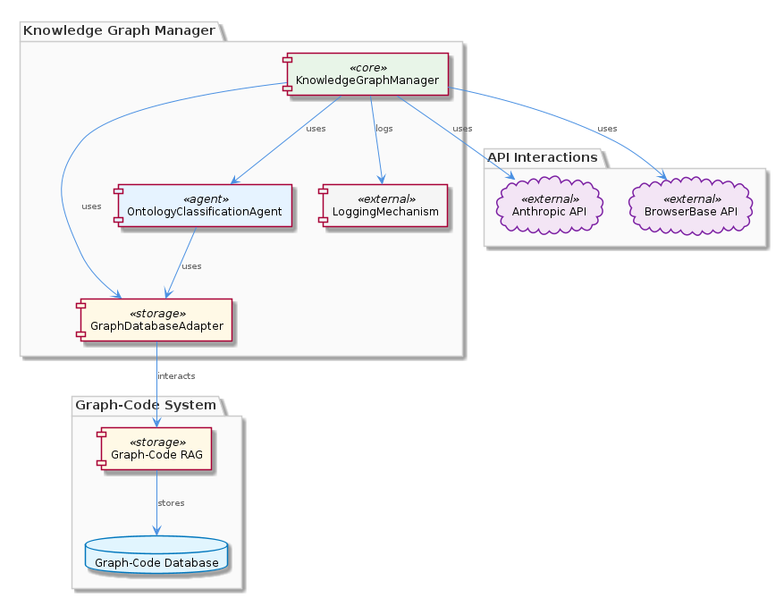
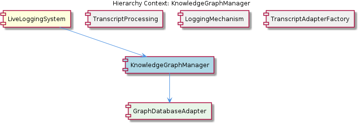

# KnowledgeGraphManager

**Type:** SubComponent

The KnowledgeGraphManager sub-component may be implemented using the GraphDatabaseAdapter class, as described in the integrations/mcp-constraint-monitor/docs/constraint-configuration.md.

## What It Is  

The **KnowledgeGraphManager** sub‑component lives inside the *LiveLoggingSystem* repository and is responsible for persisting, classifying, and querying the system’s knowledge graph. Its implementation draws on the **Graph‑Code** system documented in `integrations/code-graph-rag/README.md`, which supplies the underlying graph‑based storage and retrieval capabilities. The manager is wired to the **GraphDatabaseAdapter** class (see `integrations/mcp-constraint-monitor/docs/constraint-configuration.md`) that abstracts the concrete graph database (e.g., Memgraph) behind a uniform API.  

Operationally, KnowledgeGraphManager relies on several environment variables to locate and configure its external services: `ANTHROPIC_API_KEY` and `BROWSERBASE_API_KEY` for API‑level interactions, `CODE_GRAPH_RAG_SSE_PORT` and `CODE_GRAPH_RAG_PORT` for communicating with the Graph‑Code RAG service, and `MEMGRAPH_BATCH_SIZE` to tune batch‑write performance. Classification of ontology concepts is delegated to the **OntologyClassificationAgent** class, while all graph‑related events are emitted through the **LoggingMechanism** sub‑component, ensuring a consistent audit trail across the LiveLoggingSystem.  

---

## Architecture and Design  

The architecture of KnowledgeGraphManager is **composition‑centric**: the manager composes several specialized collaborators rather than embedding their logic directly. At the core sits the **GraphDatabaseAdapter**, which follows the *Adapter* pattern to hide the specifics of the underlying graph database (e.g., connection handling, query syntax). This enables the manager to remain agnostic to whether Memgraph, Neo4j, or another graph engine is used, facilitating future swaps with minimal code change.  

Interaction with the external Graph‑Code RAG service occurs over dedicated ports (`CODE_GRAPH_RAG_SSE_PORT`, `CODE_GRAPH_RAG_PORT`). The manager sends graph‑mutation requests and receives streaming responses, suggesting a *client‑server* style integration where the RAG service acts as a remote knowledge‑retrieval engine. The presence of `ANTHROPIC_API_KEY` and `BROWSERBASE_API_KEY` indicates that KnowledgeGraphManager may also invoke LLM‑backed services (e.g., Anthropic Claude) for enrichment or reasoning tasks, positioning the component as a bridge between structured graph data and generative AI.  

Logging is centralized through the **LoggingMechanism** sibling, which the manager calls whenever graph entities are created, updated, or classified. This shared logging facility aligns with the *Shared Service* pattern used across the LiveLoggingSystem, ensuring uniform telemetry and simplifying downstream analysis.  

The **OntologyClassificationAgent** provides an *ontology‑driven* classification layer. By injecting this agent, KnowledgeGraphManager can map raw graph nodes to higher‑level concepts defined in the system’s ontology, supporting richer queries and downstream analytics.  

---

## Implementation Details  

1. **GraphDatabaseAdapter** – Defined in `integrations/mcp-constraint-monitor/docs/constraint-configuration.md`, this class encapsulates all low‑level graph operations (create, read, update, delete). It likely exposes methods such as `executeQuery`, `batchInsert`, and `applyConstraints`, translating generic calls into the dialect required by the configured graph store. The `MEMGRAPH_BATCH_SIZE` environment variable is read at startup to size the internal batch buffers, balancing throughput against memory pressure.  

2. **OntologyClassificationAgent** – Though the exact file path is not listed, the class name signals a dedicated agent that consumes node attributes and returns ontology labels. It probably implements an interface like `classify(node): OntologyLabel[]`, allowing KnowledgeGraphManager to enrich graph entities immediately after insertion.  

3. **API Credentials** – The manager reads `ANTHROPIC_API_KEY` and `BROWSERBASE_API_KEY` from the process environment. These keys are passed to HTTP clients that invoke external services (e.g., Anthropic’s Claude for semantic enrichment, Browserbase for web‑scraping assistance). The separation of credentials into environment variables follows the *12‑factor* configuration principle, keeping secrets out of source control.  

4. **RAG Service Communication** – The ports `CODE_GRAPH_RAG_SSE_PORT` (Server‑Sent Events) and `CODE_GRAPH_RAG_PORT` (standard HTTP) are used to interact with the Graph‑Code RAG subsystem. KnowledgeGraphManager likely opens a persistent SSE connection for real‑time updates and falls back to synchronous HTTP calls for batch queries. This dual‑mode design provides both low‑latency streaming and reliable request‑response pathways.  

5. **Logging Integration** – Calls to the **LoggingMechanism** sub‑component are made via a shared logger interface (e.g., `logger.info('graph.node.created', payload)`). This ensures that every graph mutation is captured in the same structured log format used by sibling components such as *TranscriptProcessing* and *TranscriptAdapterFactory*.  

Because no concrete code symbols were discovered in the repository snapshot, the above details are inferred directly from the documented class names, file paths, and environment variables.

---

## Integration Points  

- **Parent – LiveLoggingSystem** – KnowledgeGraphManager is a child of LiveLoggingSystem, meaning its lifecycle is governed by the parent’s initialization sequence. LiveLoggingSystem likely starts the manager after configuring global logging and environment variables.  

- **Sibling – LoggingMechanism** – The manager delegates all event‑level logging to LoggingMechanism, sharing the same hooks and format used by *TranscriptProcessing* and *TranscriptAdapterFactory*. This tight coupling ensures that any change to logging conventions propagates uniformly.  

- **Child – GraphDatabaseAdapter** – The adapter is the concrete bridge to the graph database. Any updates to constraint definitions (e.g., in `integrations/mcp-constraint-monitor/docs/constraint-configuration.md`) automatically affect KnowledgeGraphManager’s behavior without code changes.  

- **External Services** –  
  * **Graph‑Code RAG** (`integrations/code-graph-rag/README.md`) – accessed via the ports mentioned above.  
  * **Anthropic Claude** – accessed with `ANTHROPIC_API_KEY`.  
  * **Browserbase** – accessed with `BROWSERBASE_API_KEY`.  

These integrations are loosely coupled through configuration (environment variables) rather than hard‑coded URLs, allowing deployment‑time substitution of service endpoints.

---

## Usage Guidelines  

1. **Configuration First** – Before instantiating KnowledgeGraphManager, ensure all required environment variables are set: `ANTHROPIC_API_KEY`, `BROWSERBASE_API_KEY`, `CODE_GRAPH_RAG_SSE_PORT`, `CODE_GRAPH_RAG_PORT`, and `MEMGRAPH_BATCH_SIZE`. Missing keys will cause runtime failures when the manager attempts external calls.  

2. **Batch Size Tuning** – Adjust `MEMGRAPH_BATCH_SIZE` based on the expected ingestion volume and the memory profile of the host. Larger batches improve throughput but increase heap usage; start with the default and monitor GC pauses.  

3. **Ontology Updates** – When extending the system ontology, update the **OntologyClassificationAgent** implementation rather than modifying KnowledgeGraphManager directly. This preserves the separation of concerns and avoids recompiling the manager.  

4. **Logging Consistency** – Always emit events through the shared **LoggingMechanism**. Use the same event names and payload structures as sibling components to keep log aggregation pipelines simple.  

5. **Error Handling** – Wrap calls to the RAG service and external APIs in retry logic that respects the idempotency of graph mutations. The manager should surface transient failures as structured error objects rather than raw exceptions, allowing callers to decide on back‑off strategies.  

---

### Architectural Patterns Identified  

- **Adapter Pattern** – Implemented by `GraphDatabaseAdapter` to abstract the underlying graph store.  
- **Composition over Inheritance** – KnowledgeGraphManager composes agents (OntologyClassificationAgent), adapters, and logging services rather than extending a monolithic base class.  
- **Configuration‑Driven Integration** – All external service endpoints and credentials are supplied via environment variables, following the 12‑factor app approach.  

### Design Decisions and Trade‑offs  

- **Decoupling via Adapter** – Gains flexibility to swap graph databases but adds an indirection layer that can obscure performance characteristics.  
- **Dual RAG Communication (SSE + HTTP)** – Provides low‑latency streaming but increases implementation complexity and requires careful connection management.  
- **Centralized Logging** – Simplifies observability but creates a runtime dependency on the LoggingMechanism; any logging outage can affect graph mutation visibility.  

### System Structure Insights  

KnowledgeGraphManager sits at the intersection of **LiveLoggingSystem** (parent) and **GraphDatabaseAdapter** (child), acting as the orchestrator for graph persistence, ontology classification, and external AI enrichment. Its sibling relationships with *TranscriptProcessing* and *TranscriptAdapterFactory* indicate a broader pattern of “adapter‑style” components handling domain‑specific transformations while sharing common infrastructure (logging, configuration).  

### Scalability Considerations  

- **Batch Processing** (`MEMGRAPH_BATCH_SIZE`) allows horizontal scaling of ingestion pipelines; tuning this parameter is key when the volume of incoming knowledge spikes.  
- **Streaming RAG Interface** (`CODE_GRAPH_RAG_SSE_PORT`) supports real‑time updates, which can be scaled out by running multiple RAG service instances behind a load balancer.  
- **Stateless Credential Usage** – Because API keys are read from the environment, multiple instances of KnowledgeGraphManager can be deployed behind a container orchestrator without secret duplication.  

### Maintainability Assessment  

The component’s reliance on well‑named adapters and agents promotes high maintainability: changes to the graph backend, ontology, or external AI services are isolated to their respective classes. The explicit environment‑variable configuration reduces hidden dependencies, making deployments reproducible. However, the lack of visible unit‑test symbols in the current snapshot suggests a potential gap in automated verification; adding tests around the adapter and classification logic would further improve long‑term reliability.

## Hierarchy Context

### Parent
- [LiveLoggingSystem](./LiveLoggingSystem.md) -- [LLM] The LiveLoggingSystem component's modular architecture allows for easy extension and modification of agent-specific transcript formats. This is achieved through the use of the TranscriptAdapter, which is implemented in the lib/agent-api/transcript-api.js file. The TranscriptAdapter provides a standardized interface for handling different agent formats, such as Claude Code and Copilot CLI, and converting them to the unified LSL format. For example, the ClaudeCodeTranscriptAdapter class in lib/agent-api/transcripts/claudia-transcript-adapter.js extends the TranscriptAdapter class and provides a specific implementation for handling Claude Code transcripts.

### Children
- [GraphDatabaseAdapter](./GraphDatabaseAdapter.md) -- The Graph-Code system is used for graph-based knowledge storage and querying as mentioned in integrations/code-graph-rag/README.md.

### Siblings
- [TranscriptProcessing](./TranscriptProcessing.md) -- TranscriptAdapter in lib/agent-api/transcript-api.js provides a standardized interface for handling different agent formats.
- [LoggingMechanism](./LoggingMechanism.md) -- The LoggingMechanism sub-component may utilize the integrations/copi/USAGE.md and integrations/copi/docs/hooks.md to handle logging for Copilot CLI.
- [TranscriptAdapterFactory](./TranscriptAdapterFactory.md) -- The TranscriptAdapterFactory class may be implemented in the lib/agent-api/transcript-api.js file.

---

*Generated from 7 observations*
