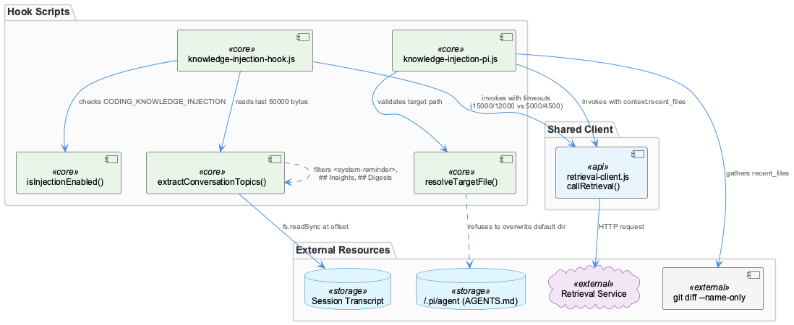
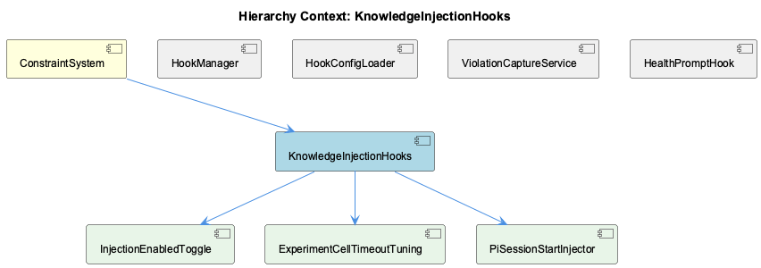

# KnowledgeInjectionHooks

**Type:** SubComponent

The hook explicitly filters out prior injected content by checking for '<system-reminder>', '## Insights', '## Digests' substrings in extractText(), preventing feedback loops where previous injections get re-embedded into the next query.

# KnowledgeInjectionHooks — Technical Insight Document

## What It Is

KnowledgeInjectionHooks is implemented primarily across two scripts, `knowledge-injection-hook.js` and `knowledge-injection-pi.js`, both operating as agent-facing hooks within the broader ConstraintSystem. Rather than enforcing rule-based validation like its sibling components, this subcomponent injects contextual knowledge (topics, retrieved insights, digests) into agent sessions at session-start or pre-prompt time. It shares infrastructure with siblings HookManager, HookConfigLoader, ViolationCaptureService, and HealthPromptHook, but its specific concern is enriching agent context rather than capturing violations or dispatching handler configuration.

The subcomponent decomposes into three children that reflect its core responsibilities: InjectionEnabledToggle (feature-flag control), ExperimentCellTimeoutTuning (latency budget adjustment for batch experiments), and PiSessionStartInjector (safe target-file resolution for the Pi agent).

## Architecture and Design

The design follows a shared-client pattern: both hook scripts depend on a common `callRetrieval()` function from `retrieval-client.js`, centralizing HTTP request logic for the retrieval service rather than duplicating it per agent entry point. This mirrors the centralization philosophy seen in the parent ConstraintSystem, where UnifiedHookManager centralizes event dispatch and HookConfigLoader centralizes config parsing — KnowledgeInjectionHooks applies the same principle to knowledge retrieval.

A notable architectural safeguard is the feedback-loop prevention built into `extractText()`, which filters out `<system-reminder>`, `## Insights`, and `## Digests` substrings so that previously injected content is not re-embedded into subsequent retrieval queries. This is a self-referential design concern unique to injection-style hooks, distinct from the validation/capture concerns of ViolationCaptureService.

Environment-driven behavior switching is a recurring pattern: `isInjectionEnabled()` (InjectionEnabledToggle) gates the entire mechanism via `CODING_KNOWLEDGE_INJECTION`, while ExperimentCellTimeoutTuning detects batch-experiment contexts via a regex test (`/--/`) against `CODING_EXPERIMENT_TASK_ID` to widen timeout budgets. This suggests a conscious design trade-off: interactive sessions favor low latency (5000/4500ms), while experiment cells favor completeness/reliability (15000/12000ms) since responsiveness constraints differ.

## Implementation Details

`extractConversationTopics()` performs a bounded read of the session transcript, reading only the last `TRANSCRIPT_TAIL_BYTES` (50000) bytes via `fs.readSync` at a computed offset — an explicit optimization avoiding full-file reads for topic extraction on potentially large transcripts.

`isInjectionEnabled()` treats only `'0'`, `'false'`, or `'off'` (case-insensitive) as disabling values, defaulting to enabled when the environment variable is unset — a permissive default that favors injection unless explicitly turned off.

In `knowledge-injection-pi.js`, `resolveTargetFile()` includes a protective check: it refuses to write when `PI_CODING_AGENT_DIR` is unset or resolves to the user's default `~/.pi/agent` directory, preventing accidental overwrites of the user's global AGENTS.md. This same script also gathers recent file activity via `execSync('git diff --name-only HEAD~3...')`, feeding this list into `context.recent_files` for `callRetrieval()`, tying retrieval relevance to recent git history rather than purely conversational content.

## Integration Points

As a child of ConstraintSystem, KnowledgeInjectionHooks operates alongside HookManager's event dispatch and HookConfigLoader's merged user/project configuration, though observations don't specify explicit registration through UnifiedHookManager's Map-based handler system. Its primary internal dependency is `retrieval-client.js`'s `callRetrieval()`, shared by both `knowledge-injection-hook.js` and `knowledge-injection-pi.js`. It also depends on environment variables (`CODING_KNOWLEDGE_INJECTION`, `CODING_EXPERIMENT_TASK_ID`, `PI_CODING_AGENT_DIR`) and git state (via `execSync`) as external integration surfaces, plus the filesystem (session transcript files) as an input source.

## Usage Guidelines

Developers should treat `CODING_KNOWLEDGE_INJECTION` as an explicit opt-out mechanism only — omitting it or setting unrecognized values keeps injection enabled by default. When running batch experiments, ensure `CODING_EXPERIMENT_TASK_ID` follows the `--` composite-id convention if relaxed timeouts (ExperimentCellTimeoutTuning) are desired; otherwise interactive timeout budgets apply. For Pi-agent integrations, avoid relying on writes succeeding when `PI_CODING_AGENT_DIR` is unset — PiSessionStartInjector will intentionally no-op to protect the global `~/.pi/agent` AGENTS.md. Finally, any modification to `extractText()`'s filtering logic should preserve the `<system-reminder>`/`## Insights`/`## Digests` exclusions to avoid reintroducing feedback loops into retrieval context.

## Hierarchy Context

### Parent
- [ConstraintSystem](./ConstraintSystem.md) -- The ConstraintSystem provides rule-based validation and enforcement of code actions and file operations during Claude Code sessions, spanning hook configuration loading, hook dispatch orchestration, and violation capture/persistence. It is built around a unified hook architecture that merges user-level (~/.coding-tools/hooks.json) and project-level (.coding/hooks.json) configurations, with project config taking precedence, and dispatches events (pre-tool, post-tool, pre-prompt, post-prompt, startup, shutdown, error) to registered handlers of type script, command, or module.

Core orchestration lives in UnifiedHookManager (lib/agent-api/hooks/hook-manager.js), which maintains a Map of event names to sorted handler arrays (by priority), supports duplicate-ID overwrite semantics, and exposes registerHandler/unregisterHandler APIs bridging agent-native hook systems to a common HookEvent enum. Configuration parsing and structural validation is handled separately by HookConfigLoader (lib/agent-api/hooks/hook-config.js), which loads, merges, and validates settings/hooks blocks, logging warnings (not throwing) on malformed entries.

Violation detection results are captured and persisted via ViolationCaptureService (scripts/violation-capture-service.js), which writes JSONL violation records to .mcp-sync/session-violations.jsonl and maintains an aggregated violation-history.json with session tracking and computed statistics (severity breakdowns, most common constraint, average violations per session) for dashboard consumption. Sensitive parameter values are redacted before being written to logs, and history is capped at 1000 entries to bound file growth.

### Children
- [InjectionEnabledToggle](./InjectionEnabledToggle.md) -- isInjectionEnabled() reads process.env.CODING_KNOWLEDGE_INJECTION and returns true when raw == null, defaulting to enabled
- [ExperimentCellTimeoutTuning](./ExperimentCellTimeoutTuning.md) -- IS_EXPERIMENT_CELL is derived from /--/.test(process.env.CODING_EXPERIMENT_TASK_ID || ''), i.e. a composite task id containing '--'
- [PiSessionStartInjector](./PiSessionStartInjector.md) -- resolveTargetFile() refuses to write when PI_CODING_AGENT_DIR is unset or resolves to the user's default ~/.pi/agent directory, to avoid clobbering global config

### Siblings
- [HookManager](./HookManager.md) -- UnifiedHookManager.initialize(projectPath) loads user config first via loadConfig(userConfigPath, 'user') then project config via loadConfig(projectConfigPath, 'project'), giving project-level entries precedence through later overwrite.
- [HookConfigLoader](./HookConfigLoader.md) -- loadConfig() in hook-manager.js applies config.settings.enableLogging, stopOnError, and timeout only when explicitly defined in the file (`!== undefined` checks), preserving constructor defaults otherwise.
- [ViolationCaptureService](./ViolationCaptureService.md) -- Per architecture description, ViolationCaptureService writes JSONL violation records to .mcp-sync/session-violations.jsonl, separating an append-only raw log from a computed aggregate file.
- [HealthPromptHook](./HealthPromptHook.md) -- checkHealthStatus() uses existsSync(VERIFIER_SCRIPT) as a heuristic to detect 'outside the coding repo' and returns servicesAvailable:false rather than attempting a network call in that case (Q3 carve-out).

---

*Generated from 7 observations*
