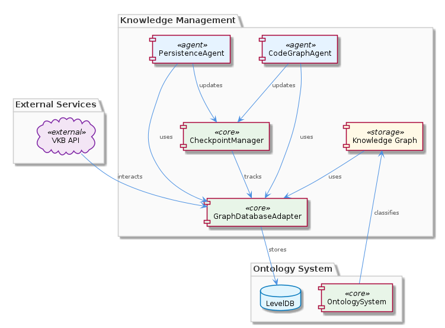

# KnowledgeManagement

**Type:** Component

[LLM] The KnowledgeManagement component employs a constructor-based pattern for agent initialization, as seen in the CodeGraphAgent and PersistenceAgent classes. The CodeGraphAgent, located in integrations/mcp-server-semantic-analysis/src/agents/code-graph-agent.ts, initializes the agent with a specific set of parameters, including the graph database adapter and the checkpoint manager. Similarly, the PersistenceAgent, located in integrations/mcp-server-semantic-analysis/src/agents/persistence-agent.ts, initializes the agent with a set of parameters, including the graph database adapter and the ontology system. This pattern allows for clear and concise agent initialization, making it easier for developers to understand and maintain the code.

## What It Is  

The **KnowledgeManagement** component lives under the *integrations/mcp‑server‑semantic‑analysis* tree and is the core engine that persists, classifies, and analyses the project’s knowledge graph. Its primary entry points are:  

* `integrations/mcp-server-semantic-analysis/src/storage/graph-database-adapter.ts` – the **GraphDatabaseAdapter** that abstracts access to a Graphology + LevelDB store and also drives an automatic JSON‑export sync.  
* `integrations/mcp-server-semantic-analysis/src/agents/code-graph-agent.ts` and `…/agents/persistence-agent.ts` – two concrete agents that are instantiated via constructor injection and orchestrate graph updates and persistence.  
* `integrations/mcp-server-semantic-analysis/src/utils/checkpoint-manager.js` – a lightweight **CheckpointManager** that records analysis progress in a JSON file.  

Supporting scripts such as `scripts/migrate-graph-db-entity-types.js` keep the live LevelDB/Graphology database in sync when entity‑type definitions evolve. Together these pieces give KnowledgeManagement the ability to ingest code‑level artifacts (via the **CodeGraphRAG** child), classify them with the **OntologySystem**, and surface insights through the **UKBTraceReport** utility.  



---

## Architecture and Design  

KnowledgeManagement adopts a **lock‑free, dual‑mode** architecture. When the VKB server is running, the **VkbApiClient** (loaded dynamically with `require` inside `graph-database-adapter.ts`) mediates all reads and writes, guaranteeing that external services see a consistent view. If the server is stopped, the adapter falls back to direct LevelDB access, eliminating any lock contention and keeping the component functional in isolated or offline scenarios. This design is explicitly called out in Observation 2 and is the cornerstone of the lock‑free claim.  

The component also embraces a **constructor‑based dependency injection** pattern. Both `CodeGraphAgent` and `PersistenceAgent` receive a pre‑configured `GraphDatabaseAdapter`, a `CheckpointManager`, and, where appropriate, the `OntologySystem`. By wiring dependencies at construction time (Observations 3), the code remains explicit, testable, and easy to extend—new agents can be added without touching the core adapter.  

A **checkpoint system** (Observation 4) provides deterministic progress tracking. `CheckpointManager` serialises its state to a JSON file, enabling fast start‑up recovery and simplifying debugging of long‑running analysis pipelines.  

Finally, the component is **script‑driven for schema evolution**. The `migrateGraphDatabase` script (Observation 1) runs as a one‑off migration step, updating entity‑type definitions directly in the LevelDB store. This explicit migration path reinforces data integrity while keeping the runtime code free of version‑checking logic.  


---

## Implementation Details  

### GraphDatabaseAdapter (`graph-database-adapter.ts`)  
The adapter exports a class that wraps Graphology’s in‑memory graph API and LevelDB persistence. It exposes methods such as `addNode`, `addEdge`, and `query`. When instantiated, it attempts to `require('vkb-api-client')`; if the module resolves, all operations are proxied through `VkbApiClient`, otherwise the adapter talks directly to LevelDB. This dynamic import sidesteps TypeScript compilation errors while preserving a clean runtime switch.  

### Agents (`code-graph-agent.ts`, `persistence-agent.ts`)  
Both agents follow a **constructor‑based pattern**:  

```ts
class CodeGraphAgent {
  constructor(
    private readonly graphAdapter: GraphDatabaseAdapter,
    private readonly checkpointMgr: CheckpointManager,
    // …other deps
  ) {}
  // analysis logic …
}
```  

`CodeGraphAgent` parses source files, builds a code‑level sub‑graph, and persists it via the adapter. `PersistenceAgent` focuses on flushing in‑memory changes, handling versioned snapshots, and invoking the `OntologySystem` for classification.  

### CheckpointManager (`checkpoint-manager.js`)  
The manager reads a JSON file on start‑up (`load()`) and writes back after each successful analysis batch (`save()`). Its API (`getCheckpoint`, `setCheckpoint`) is deliberately simple, allowing any agent to checkpoint its work without needing to understand the underlying storage format.  

### UKBTraceReport (`ukb-trace-report.ts`)  
This utility generates a trace of data‑flow and concept‑extraction events. It queries the graph through `GraphDatabaseAdapter` (e.g., `graphAdapter.query(...)`) and enriches the result set with external metadata fetched via `VkbApiClient`. The report is emitted as a structured JSON document that downstream insight pipelines consume.  

### OntologySystem (`ontology/index.js`)  
The system loads a set of predefined ontologies (e.g., “Component”, “Entity”, “Relation”) and provides a `classify(node)` method. Classification is performed by combining graph‑property inspection with optional VKB API look‑ups, ensuring that newly added nodes are immediately placed into the correct type hierarchy.  

### Migration Script (`scripts/migrate-graph-db-entity-types.js`)  
Executed manually or as part of CI, the script reads the current LevelDB store, transforms entity‑type fields to the new schema, and writes the updated entities back. It logs each migration step, making rollback possible if needed.  

Collectively, these pieces form a tightly coupled yet modular stack: agents drive analysis, the adapter guarantees storage consistency, the checkpoint manager provides resilience, and the ontology system enforces semantic correctness.

---

## Integration Points  

KnowledgeManagement sits at the intersection of several sibling and child modules within the broader **Coding** parent component.  

* **VKB API** – accessed through the dynamically imported `VkbApiClient`; shared with siblings like **Trajectory** (which also logs events via VKB) and **LiveLoggingSystem** (which may forward logs to VKB).  
* **Graphology + LevelDB** – the low‑level persistence layer used by both **ConstraintSystem** and **SemanticAnalysis** siblings; the same `graph-database-adapter.ts` file is the canonical gateway.  
* **OntologyClassificationModule** – consumes the `OntologySystem` to tag entities; this module is also leveraged by **SemanticAnalysis** agents that need type awareness.  
* **InsightGenerationModule** – pulls data from `UKBTraceReport` (UtilitiesModule) to surface actionable insights; the report format is consumable by the **OnlineLearning** child, which feeds the results back into the RAG pipeline.  
* **AgentFrameworkModule** – provides the base classes (`AgentBase`, `AgentRegistry`) that `CodeGraphAgent` and `PersistenceAgent` extend, ensuring a uniform lifecycle across all agents in the system.  
* **BrowserAccess** – offers a UI layer that reads the JSON export produced by the adapter, allowing developers to visualise the knowledge graph directly in a browser.  

All these integrations are wired through explicit constructor parameters, avoiding hidden globals and making dependency graphs clear in the codebase.

---

## Usage Guidelines  

1. **Prefer the VKB API path** – when the VKB server is up, let `GraphDatabaseAdapter` use the API; this guarantees that external consumers see a consistent state. If you need to run offline (e.g., CI jobs), start the adapter with the `DISABLE_VKB` flag to force direct LevelDB access.  
2. **Instantiate agents via constructors** – always supply a fully‑initialised `GraphDatabaseAdapter`, a `CheckpointManager` instance, and the `OntologySystem` (if classification is required). This pattern keeps the agents testable and isolates side‑effects.  
3. **Checkpoint frequently** – after each major batch of code parsing, call `checkpointMgr.setCheckpoint(batchId)` and persist the checkpoint. This minimizes re‑work after crashes and aligns with the lock‑free design.  
4. **Run migrations before schema changes** – any alteration to entity‑type definitions must be accompanied by a run of `scripts/migrate-graph-db-entity-types.js`. Commit the migration script alongside the code change to ensure reproducibility.  
5. **Keep ontologies up‑to‑date** – add new ontology definitions in `integrations/mcp-server-semantic-analysis/src/ontology/` and reload the `OntologySystem` (typically at process start) to avoid classification mismatches.  
6. **Leverage UKBTraceReport for debugging** – generate a trace after a suspicious analysis run; the report’s JSON can be fed into the **InsightGenerationModule** or visualised via **BrowserAccess** to pinpoint where data‑flow diverged.  

Following these conventions will maintain the lock‑free guarantees, keep the knowledge graph coherent, and simplify future extensions.

---

### Summary of Requested Items  

1. **Architectural patterns identified** – lock‑free dual‑mode access (API vs. direct DB), constructor‑based dependency injection, checkpoint‑driven resilience, script‑driven migration, dynamic module loading.  
2. **Design decisions and trade‑offs** –  
   * *Lock‑free* design eliminates contention but requires careful fallback handling.  
   * *Dynamic import* of `VkbApiClient` avoids compile‑time coupling at the cost of a runtime `require` check.  
   * *Constructor injection* improves testability but forces callers to assemble more objects.  
   * *JSON checkpoint storage* is simple and portable, yet may become a bottleneck for extremely high‑frequency updates (requires periodic rotation).  
3. **System structure insights** – KnowledgeManagement is a central hub under the **Coding** parent, sharing the GraphDatabaseAdapter with siblings (**ConstraintSystem**, **SemanticAnalysis**) and exposing child modules (GraphDatabaseModule, OntologyClassificationModule, InsightGenerationModule, etc.) that each specialise on persistence, classification, or reporting.  
4. **Scalability considerations** – The lock‑free approach scales horizontally when multiple processes read via the VKB API; however, direct LevelDB writes are single‑process bound, so production deployments should keep the VKB server alive. Checkpoint JSON files should be sharded or rotated for very large graphs. Migration scripts must be idempotent to support rolling upgrades.  
5. **Maintainability assessment** – The clear constructor contracts, isolated adapter, and explicit migration script give the codebase high maintainability. The reliance on dynamic `require` is a minor source of complexity but is well‑documented. Adding new agents or ontologies is straightforward, provided developers follow the established patterns and update the checkpoint/ migration processes accordingly.


## Hierarchy Context

### Parent
- [Coding](./Coding.md) -- Root node of the coding project knowledge hierarchy, encompassing all development infrastructure knowledge. The project consists of 8 major components: LiveLoggingSystem: [LLM] The LiveLoggingSystem component utilizes a modular architecture, with separate components for logging, transcript processing, and configuration ; LLMAbstraction: [LLM] The LLMAbstraction component uses a provider-agnostic approach, allowing for easy switching between different LLM providers. This is achieved th; DockerizedServices: [LLM] The DockerizedServices component utilizes dependency injection to manage complex workflows and handle multiple requests efficiently. This is evi; Trajectory: [LLM] The Trajectory component utilizes the SpecstoryAdapter class, defined in lib/integrations/specstory-adapter.js, for logging conversations and ev; KnowledgeManagement: [LLM] The KnowledgeManagement component utilizes a GraphDatabaseAdapter for persistence, which is implemented in the file integrations/mcp-server-sema; CodingPatterns: [LLM] The CodingPatterns component utilizes a graph-based approach for code analysis, as seen in the integrations/code-graph-rag/README.md file, which; ConstraintSystem: [LLM] The ConstraintSystem component utilizes a GraphDatabaseAdapter for persistence, which is implemented in the storage/graph-database-adapter.ts fi; SemanticAnalysis: [LLM] The SemanticAnalysis component employs a multi-agent architecture, utilizing agents such as the OntologyClassificationAgent, SemanticAnalysisAge.

### Children
- [ManualLearning](./ManualLearning.md) -- ManualLearning relies on the migrateGraphDatabase script in scripts/migrate-graph-db-entity-types.js to update entity types in the live LevelDB/Graphology database.
- [OnlineLearning](./OnlineLearning.md) -- OnlineLearning uses the Code Graph RAG system in integrations/code-graph-rag to extract knowledge from codebases.
- [GraphDatabaseModule](./GraphDatabaseModule.md) -- GraphDatabaseModule uses the GraphDatabaseAdapter to interact with the Graphology + LevelDB knowledge graph.
- [OntologyClassificationModule](./OntologyClassificationModule.md) -- OntologyClassificationModule uses the OntologySystem to classify entities based on their types and properties.
- [InsightGenerationModule](./InsightGenerationModule.md) -- InsightGenerationModule uses the UKB trace report from the UtilitiesModule to generate insights.
- [AgentFrameworkModule](./AgentFrameworkModule.md) -- AgentFrameworkModule uses the agent development guide in integrations/copi/docs/hooks.md to provide a framework for agent development.
- [UtilitiesModule](./UtilitiesModule.md) -- UtilitiesModule uses the checkpoint system to track progress and ensure data consistency.
- [BrowserAccess](./BrowserAccess.md) -- BrowserAccess uses the browser access guide in integrations/browser-access/README.md to provide browser access to the MCP server.
- [CodeGraphRAG](./CodeGraphRAG.md) -- CodeGraphRAG uses the code-graph-rag guide in integrations/code-graph-rag/README.md to provide a graph-based RAG system.

### Siblings
- [LiveLoggingSystem](./LiveLoggingSystem.md) -- [LLM] The LiveLoggingSystem component utilizes a modular architecture, with separate components for logging, transcript processing, and configuration validation. This is evident in the directory structure, where the 'integrations' folder contains subfolders for 'browser-access', 'code-graph-rag', and 'copi', each representing a distinct aspect of the system. For instance, the 'copi' subfolder contains files such as 'INSTALL.md' and 'USAGE.md', which provide installation and usage guidelines for the Copi component. The 'lib/agent-api' folder contains the TranscriptAdapter abstract base class, which is responsible for reading and converting transcripts from different agent formats. The 'scripts' folder contains the LSLConfigValidator, which is used for validating and optimizing LSL configuration. The logging module, located in 'integrations/mcp-server-semantic-analysis/src/logging.ts', provides a unified logging interface and is used throughout the system.
- [LLMAbstraction](./LLMAbstraction.md) -- [LLM] The LLMAbstraction component uses a provider-agnostic approach, allowing for easy switching between different LLM providers. This is achieved through the ProviderRegistry class (lib/llm/provider-registry.js), which manages the different LLM providers and their configurations. For instance, the AnthropicProvider class (lib/llm/providers/anthropic-provider.ts) is used to interact with the Anthropic API, while the DMRProvider class (lib/llm/providers/dmr-provider.ts) is used for local LLM inference. The use of a provider registry enables the component to be highly flexible and scalable, as new providers can be easily added or removed without affecting the overall architecture.
- [DockerizedServices](./DockerizedServices.md) -- [LLM] The DockerizedServices component utilizes dependency injection to manage complex workflows and handle multiple requests efficiently. This is evident in the lib/llm/llm-service.ts file, where the LLMService class is used for high-level LLM operations, including mode routing, caching, and provider fallback. The use of dependency injection allows for loose coupling between components, making it easier to test and maintain the codebase. Furthermore, the ServiceStarter class in lib/service-starter.js provides robust service startup with retry, timeout, and graceful degradation, ensuring that the component can recover from failures and provide a responsive user experience.
- [Trajectory](./Trajectory.md) -- [LLM] The Trajectory component utilizes the SpecstoryAdapter class, defined in lib/integrations/specstory-adapter.js, for logging conversations and events via Specstory. This class follows a specific pattern of constructor() + initialize() + logConversation() for its initialization and logging functionality. The logConversation() method employs a work-stealing concurrency pattern via a shared atomic index counter, allowing for efficient and concurrent logging of conversations and events.
- [CodingPatterns](./CodingPatterns.md) -- [LLM] The CodingPatterns component utilizes a graph-based approach for code analysis, as seen in the integrations/code-graph-rag/README.md file, which describes the Graph-Code RAG system. This system is used for graph-based code analysis and implies the use of graph structures and algorithms within the CodingPatterns component. The entity validation is performed by the EntityValidator class in integrations/mcp-server-semantic-analysis/src/agents/ontology-classification-agent.ts, suggesting a structured approach to validating entities within the coding patterns. Furthermore, the batch processing pipeline is defined in integrations/mcp-server-semantic-analysis/src/agents/ontology-classification-agent.ts, indicating that the CodingPatterns component may leverage batch processing for efficient handling of coding pattern analysis.
- [ConstraintSystem](./ConstraintSystem.md) -- [LLM] The ConstraintSystem component utilizes a GraphDatabaseAdapter for persistence, which is implemented in the storage/graph-database-adapter.ts file. This adapter enables the system to store and retrieve graph structures using Graphology and LevelDB, with automatic JSON export sync. The use of Graphology allows for efficient graph operations, while LevelDB provides a robust and scalable storage solution. The GraphDatabaseAdapter class in storage/graph-database-adapter.ts is responsible for managing the graph database, including creating and deleting graphs, as well as handling graph queries. The automatic JSON export sync feature ensures that the graph data is consistently updated and available for other components to access.
- [SemanticAnalysis](./SemanticAnalysis.md) -- [LLM] The SemanticAnalysis component employs a multi-agent architecture, utilizing agents such as the OntologyClassificationAgent, SemanticAnalysisAgent, and CodeGraphAgent, to perform tasks such as code analysis, ontology classification, and insight generation. The OntologyClassificationAgent, for instance, is implemented in the file integrations/mcp-server-semantic-analysis/src/agents/ontology-classification-agent.ts and is responsible for classifying observations against the ontology system. This agent-based approach allows for a modular and scalable design, enabling the component to handle large-scale codebases and provide meaningful insights.


---

*Generated from 6 observations*
