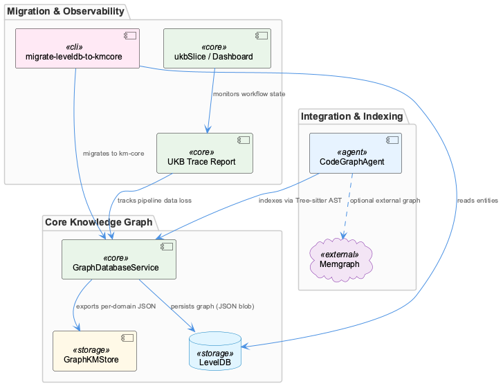

# KnowledgeManagement

**Type:** Component

The KnowledgeManagement component provides the core knowledge graph infrastructure for the Coding project, encompassing persistent storage, entity lifecycle management, and graph query capabilities. It is built on a Graphology in-memory graph with LevelDB as the persistence backend, exposing entities with typed attributes (System, Project, Pattern) and relationships. The system supports both local graph operations and integration with external graph databases like Memgraph via the CodeGraphAgent, which uses Tree-sitter AST parsing to index repositories into a queryable knowledge graph.

# KnowledgeManagement — Technical Insight Document

## What It Is

KnowledgeManagement is the core knowledge graph infrastructure component of the Coding project, implemented primarily across `src/knowledge-management/GraphDatabaseService.js`, `integrations/mcp-server-semantic-analysis/scripts/migrate-leveldb-to-kmcore.mjs`, and supporting integration code under `integrations/mcp-server-semantic-analysis/`. It provides persistent storage, entity lifecycle management, and graph query capabilities that underpin the entire project's ability to accumulate, classify, and retrieve structured knowledge about systems, projects, and patterns.

Within the Coding parent hierarchy, KnowledgeManagement is a peer to SemanticAnalysis, LiveLoggingSystem, LLMAbstraction, and ConstraintSystem — each producing or consuming knowledge artifacts, but KnowledgeManagement alone is responsible for the canonical store. Its four child components define the shape of that responsibility: EntityTypeRegistry enforces the ontology, KMCoreMigration handles schema evolution, ManualLearning captures human-authored provenance, and OnlineLearning feeds automated pipeline results into the graph.

## Architecture and Design

The architectural foundation is a two-layer graph store: **Graphology** as the in-memory graph runtime, backed by **LevelDB** for persistence. This is documented explicitly in `docs/architecture/memory-systems.md` (referenced by OnlineLearning) and operationalized in `GraphDatabaseService.js`. The persistence strategy is deliberately simple — the entire graph is serialized as a single JSON blob under one LevelDB key (`'graph'`), containing nodes, edges, and metadata together. This is confirmed by `scripts/migrate-graph-db-entity-types.js` calling `dbService._persistGraphToLevel()` after batch mutations.

This single-key persistence design is a deliberate trade-off: it maximizes read/write simplicity and avoids the complexity of per-entity key management at the cost of atomic whole-graph serialization on every write. For a knowledge graph that is read far more than it is written, and where the total entity count is bounded by a three-type ontology, this is a defensible choice. The risk — that a large graph produces write amplification — is mitigated by the domain-scoped export mechanism in GraphKMStore, which writes per-domain JSON files to an `exports/` subdirectory, allowing consumers to read partial snapshots without deserializing the full graph.

The ontology itself is strictly bounded. EntityTypeRegistry enforces exactly three canonical types — **System**, **Project**, and **Pattern** — and all incoming entity types are mapped through a consolidation table before graph insertion. Legacy types such as `TransferablePattern`, `WorkflowPattern`, `TechnicalIssue`, and `AnalysisInsight` are all collapsed to `Pattern`. This consolidation is enforced at migration time via `scripts/migrate-graph-db-entity-types.js` and at ingestion time by EntityTypeRegistry, making the type surface predictable and queryable without schema sprawl.

## Implementation Details

**GraphDatabaseService** (`src/knowledge-management/GraphDatabaseService.js`) is the primary persistence boundary. Its `_persistGraphToLevel()` method serializes the Graphology in-memory graph to a single LevelDB entry. Entity mutations — including bulk type remappings — are performed in-memory on the Graphology graph and then flushed via this method, as the migration script demonstrates.

**KMCoreMigration** (`integrations/mcp-server-semantic-analysis/scripts/migrate-leveldb-to-kmcore.mjs`) introduces UUIDv7 identifiers during migration, replacing whatever legacy ID scheme raw LevelDB records used. UUIDv7 provides time-ordered, stable IDs that enable chronological entity sorting without a separate timestamp field. The migration script implements an **error budget mechanism**: up to 5% malformed entities are tolerated and logged; exceeding 10% causes a non-zero exit, aborting the migration. This is validated in the test suite via `seedLevelDbWithMalformed()`, which deliberately injects bad records to verify the budget thresholds. This design prevents silent data corruption while acknowledging that real-world LevelDB stores will contain some malformed records.

The **CodeGraphAgent** (`integrations/mcp-server-semantic-analysis/src/agents/code-graph-agent.ts`) extends the knowledge graph into code structure territory. It resolves the `code-graph-rag` directory through a priority chain of environment variables (`CODING_REPO`, `CODING_TOOLS_PATH`, `CODING_ROOT`) with a sibling-directory fallback, then verifies Memgraph reachability via a raw TCP socket before any indexing. This pre-flight check ensures the agent fails fast rather than partially indexing into an unreachable graph database. Tree-sitter AST parsing is used to produce the code structure entities fed into Memgraph — a separate graph database from the LevelDB-backed primary store.

The **UKB pipeline** adds observability through `DataLossTracking` structs defined in `ukb-trace-report.ts`, each capturing `inputCount`, `outputCount`, `lossCount`, and `lossReasons` per pipeline stage. This provides explicit accounting for entities lost between git/vibe ingestion, semantic analysis, and ontology classification — stages that span KnowledgeManagement, SemanticAnalysis, and LiveLoggingSystem. The `ukbSlice.ts` in `integrations/system-health-dashboard` tracks `WorkflowExecutionState` with per-step LLM mode fields (`llmIntendedMode`, `llmActualMode`, `llmModeFallback`), surfacing whether knowledge was produced by mock, local, or public LLM providers — a critical audit trail given the multi-mode LLMAbstraction layer.

## Integration Points

KnowledgeManagement connects outward to several sibling systems. **SemanticAnalysis** is the primary producer of new graph entities, feeding entity classifications through the KMCoreMigration pipeline. **LiveLoggingSystem** provides the raw session transcripts from which OnlineLearning extracts knowledge artifacts. **LLMAbstraction** mode tracking is reflected in `ukbSlice.ts`, meaning the provenance of any LLM-derived knowledge entity includes which inference tier produced it.

The **Memgraph** integration via CodeGraphAgent represents a second, parallel graph store for code-structure <USER_ID_REDACTED> — distinct from the LevelDB-backed primary store. DockerizedServices packages Memgraph as part of its Docker Compose deployment, making it a containerized dependency. The TCP socket pre-flight in CodeGraphAgent means knowledge indexing gracefully degrades if the DockerizedServices layer is unavailable.

GraphKMStore's per-domain export files (`exports/` subdirectory) serve as the interface consumed by `readMigratedEntities()` in the migration test suite, suggesting they also act as a stable handoff format for downstream consumers that don't want to parse the full LevelDB blob.

## Usage Guidelines

**Entity type discipline is mandatory.** All new entities must pass through EntityTypeRegistry before graph insertion. Introducing a fourth canonical type requires updating both the consolidation mapping table in the migration scripts and the EntityTypeRegistry enforcement logic — doing one without the other will create divergence between new and migrated entities.

**Migration scripts must be run against a consistent snapshot.** Because `_persistGraphToLevel()` writes the full graph atomically, running a migration against a live-writing graph risks overwriting concurrent updates. The error budget in `migrate-leveldb-to-kmcore.mjs` (5% tolerance, 10% abort threshold) should be treated as a signal to inspect data <USER_ID_REDACTED> before migration, not as a routine allowance for dirty data.

**The Memgraph code-graph path requires environment variable configuration.** Developers invoking CodeGraphAgent must ensure at least one of `CODING_REPO`, `CODING_TOOLS_PATH`, or `CODING_ROOT` resolves correctly, or the sibling-directory fallback must be valid. Memgraph must be reachable on its configured TCP port; the agent performs this check before any indexing and will not proceed if the socket is unreachable.

**LLM mode provenance should be preserved through the pipeline.** The `llmIntendedMode` vs `llmActualMode` fields in `ukbSlice.ts` exist precisely to catch silent fallbacks from public to local or mock providers. Knowledge entities derived from mock LLM responses should be treated as low-confidence and may warrant re-derivation once a production-tier provider is available. The UKB `DataLossTracking` structs provide the instrumentation to identify where in the pipeline such entities were generated or filtered.

**Per-domain exports are the preferred read interface for partial graph consumption.** Rather than deserializing the full LevelDB graph blob for domain-scoped <USER_ID_REDACTED>, consumers should read from the `exports/` subdirectory written by GraphKMStore. This is the pattern established by the migration test suite and reduces coupling to the internal LevelDB serialization format.

## Hierarchy Context

### Parent
- [Coding](./Coding.md) -- Root node of the coding project knowledge hierarchy, encompassing all development infrastructure knowledge. The project consists of 7 major components: LiveLoggingSystem: The LiveLoggingSystem (LSL) is a session logging infrastructure that captures, classifies, and persists AI agent conversations—primarily from Claude C; LLMAbstraction: LLMAbstraction is a multi-layered abstraction over LLM providers that enables provider-agnostic model calls across Anthropic, OpenAI, Groq, and local ; DockerizedServices: DockerizedServices provides the containerization layer for the coding infrastructure, packaging services like the semantic analysis MCP, constraint mo; KnowledgeManagement: The KnowledgeManagement component provides the core knowledge graph infrastructure for the Coding project, encompassing persistent storage, entity lif; CodingPatterns: CodingPatterns serves as the architectural catch-all component for the Coding project, capturing cross-cutting programming conventions, design pattern; ConstraintSystem: The ConstraintSystem is a multi-layered constraint monitoring and enforcement framework that validates code actions, file operations, and tool interac; SemanticAnalysis: The SemanticAnalysis component is a multi-agent MCP server (`integrations/mcp-server-semantic-analysis`) that orchestrates a pipeline of specialized a.

### Children
- [ManualLearning](./ManualLearning.md) -- ManualLearning entities are distinguished by provenance metadata that marks their origin as human-authored, contrasting with the automated pipeline provenance stamps applied by KMCoreMigration
- [OnlineLearning](./OnlineLearning.md) -- docs/architecture/memory-systems.md describes the Graph-Based Knowledge Storage Architecture that OnlineLearning populates, with Graphology as the in-memory layer backed by LevelDB
- [KMCoreMigration](./KMCoreMigration.md) -- The migration script migrate-leveldb-to-kmcore.mjs reads raw LevelDB B-shape records and rewrites them with UUIDv7 identifiers, providing stable, time-ordered IDs for all canonical entities
- [EntityTypeRegistry](./EntityTypeRegistry.md) -- EntityTypeRegistry enforces a three-type ontology (System/Project/Pattern) as the canonical classification surface, with all incoming entity types mapped through this consolidation layer before graph insertion

### Siblings
- [LiveLoggingSystem](./LiveLoggingSystem.md) -- The LiveLoggingSystem (LSL) is a session logging infrastructure that captures, classifies, and persists AI agent conversations—primarily from Claude Code—into a unified format. It handles session windowing (time-window identifiers like '0800-0900'), multi-user support via SHA-256 user hashing, file routing with rotation thresholds, and transcript capture from agent-native formats. The system bridges raw agent transcripts to a normalized LSL format used downstream by semantic analysis and knowledge management pipelines.
- [LLMAbstraction](./LLMAbstraction.md) -- LLMAbstraction is a multi-layered abstraction over LLM providers that enables provider-agnostic model calls across Anthropic, OpenAI, Groq, and local inference backends. It provides three distinct execution modes (mock, local, public) with per-agent overrides stored in a workflow-progress.json file, allowing dynamic routing without code changes. The architecture consists of a mock service for testing, a DMR (Docker Model Runner) provider for local inference, and a direct-fetch wrapper (llm-with-process.ts) that bypasses the SDK to inject telemetry process tags into the rapid-llm-proxy endpoint.
- [DockerizedServices](./DockerizedServices.md) -- DockerizedServices provides the containerization layer for the coding infrastructure, packaging services like the semantic analysis MCP, constraint monitor, code-graph-rag, Memgraph, and Redis into a unified Docker Compose deployment. The architecture centers on docker/docker-compose.yml and docker/Dockerfile.coding-services with supervisord.conf managing multiple processes within a container. Service health is verified through two probe mechanisms: HTTP health endpoints and TCP port checks, used by the health coordinator to track service liveness with strict contracts (never returning 'healthy', only 'running'/'stopped'/'unknown').
- [CodingPatterns](./CodingPatterns.md) -- CodingPatterns serves as the architectural catch-all component for the Coding project, capturing cross-cutting programming conventions, design patterns, and best practices that permeate the entire codebase. The project follows consistent patterns visible across its configuration, tooling, and documentation: agent abstractions use a constructor+initialize+execute lifecycle, shell scripts in bin/ follow a proxy/delegation pattern to underlying services, and configuration is externalized into config/ YAML/JSON files rather than hardcoded values. The system emphasizes agent-agnostic design, enabling multiple AI backends (Claude, Copilot, Mastra, OpenCode) to operate under a unified interface.
- [ConstraintSystem](./ConstraintSystem.md) -- The ConstraintSystem is a multi-layered constraint monitoring and enforcement framework that validates code actions, file operations, and tool interactions against configured rules during Claude Code sessions. It operates through a hook-based interception architecture where pre-tool and post-tool hook events capture agent actions, evaluate them against constraint rules, and record violations for persistence and dashboard display. The system bridges live session activity with persistent storage via the ViolationCaptureService, which writes violations to JSONL logs and maintains a JSON history file in the .mcp-sync directory for dashboard consumption.
- [SemanticAnalysis](./SemanticAnalysis.md) -- The SemanticAnalysis component is a multi-agent MCP server (`integrations/mcp-server-semantic-analysis`) that orchestrates a pipeline of specialized agents to extract, classify, validate, and persist structured knowledge from git history and LSL (Live Session Log) sessions. It combines AST-based code graph construction, LLM-powered semantic insight generation, ontology classification, and content validation into a coordinated batch-analysis workflow. The pipeline produces structured knowledge entities enriched with ontology metadata before persisting them to a graph-based knowledge store.

---

*Generated from 8 observations*
