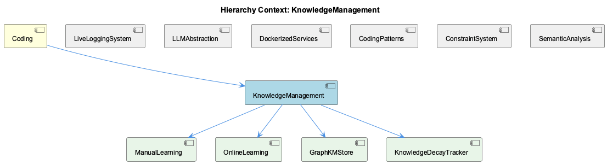
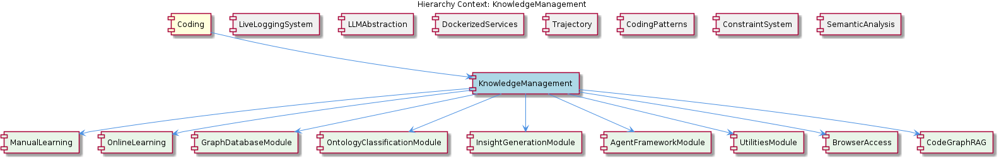

# KnowledgeManagement

**Type:** Component

[LLM] The KnowledgeManagement component's design decisions and architectural aspects have significant implications for its performance, scalability, and maintainability. For example, the use of a lock-free architecture in the GraphDatabaseAdapter ensures that the component can handle high concurrency without performance degradation. Similarly, the PersistenceAgent's classification cache improves the component's efficiency by reducing redundant LLM calls. These design decisions demonstrate a focus on building a robust and efficient system, capable of handling complex knowledge graphs and high volumes of data. By understanding these design decisions and architectural aspects, developers can better appreciate the component's behavior and performance, making it easier to maintain and extend the system.

## What It Is  

The **KnowledgeManagement** component lives at the heart of the *Coding* parent hierarchy and is implemented across several concrete files. Its core persistence layer is the **GraphDatabaseAdapter** (`storage/graph-database-adapter.ts`), which couples **Graphology** with **LevelDB** and automatically synchronises a JSON export of the graph. Business‑logic agents such as **CodeGraphAgent** (`src/agents/code-graph-agent.ts`) and **PersistenceAgent** (`src/agents/persistence-agent.ts`) sit on top of that adapter, turning raw source‑code artefacts into semantic knowledge‑graph entities and keeping those entities fresh, classified, and validated. Supporting utilities like `src/utils/ukb‑trace‑report.ts` generate trace reports for workflow runs, while the migration script `migrate-graph-db-entity-types.js` handles schema evolution for the underlying LevelDB/Graphology store. Collectively, these files enable the component to ingest code, classify it against an ontology, persist the resulting graph, and provide observability for debugging and optimisation.

---

## Architecture and Design  

The architecture is **modular and agent‑centric**. Each responsibility is encapsulated in a dedicated *agent* class that communicates with the shared **GraphDatabaseAdapter**. This mirrors an **Adapter pattern** (the `GraphDatabaseAdapter` abstracts the concrete Graphology + LevelDB implementation behind a uniform API) and an **Agent pattern** (the `CodeGraphAgent`, `PersistenceAgent`, and other child agents such as `CodeAnalysisAgent`, `OntologyClassificationAgent`, `ContentValidationAgent` each own a single, well‑defined concern).  

A **lock‑free design** is explicitly mentioned for the adapter, eliminating LevelDB file‑level locks and allowing many concurrent read/write operations without the typical performance penalties of lock contention. This decision aligns the component with high‑concurrency workloads typical of CI pipelines or continuous code‑analysis services.  

The **classification cache** inside `PersistenceAgent` is a straightforward **caching pattern** that stores LLM‑derived ontology classifications, avoiding duplicate LLM calls. By keeping the cache local to the agent, the design preserves *separation of concerns* while delivering a measurable performance boost.  

The component also exhibits a **clear separation of concerns**:  
* **GraphDatabaseAdapter** – low‑level storage & sync.  
* **CodeGraphAgent** – AST parsing → concept extraction → graph construction.  
* **PersistenceAgent** – entity persistence, ontology classification, content validation.  
* **TraceReportGenerator** (`src/utils/ukb‑trace‑report.ts`) – observability.  

These layers interact through well‑named TypeScript interfaces (implied by the file structure) rather than tight coupling, making it straightforward for sibling components—e.g., **LiveLoggingSystem** (which also uses an ontology classification agent) or **SemanticAnalysis** (which employs multiple agents)—to share conventions without sharing implementation details.

---

## Implementation Details  

### GraphDatabaseAdapter (`storage/graph-database-adapter.ts`)  
* Wraps **Graphology** (a graph‑theory library) and **LevelDB** for durable storage.  
* Implements *automatic JSON export sync*: after each mutation the adapter writes a JSON snapshot, ensuring an external, human‑readable backup.  
* Employs a **lock‑free architecture**—likely using LevelDB’s batch writes and atomic file operations—to prevent the classic “database is locked” error when many agents issue concurrent writes.  

### CodeGraphAgent (`src/agents/code-graph-agent.ts`)  
* Consumes **Abstract Syntax Trees (ASTs)** of source files.  
* Traverses the AST to discover symbols, relationships, and higher‑level concepts, then maps those to nodes/edges in the knowledge graph via the `GraphDatabaseAdapter`.  
* Uses an **ontology system** to classify extracted concepts, enabling semantic code‑search capabilities. The modular placement of this agent (under `src/agents/`) makes it easy to replace the AST parser or extend the ontology without touching storage logic.  

### PersistenceAgent (`src/agents/persistence-agent.ts`)  
* Handles three responsibilities:  
  1. **Entity persistence** – writes or updates graph nodes/edges through the adapter.  
  2. **Ontology classification** – invokes an LLM (or other classifier) to assign ontology tags; results are cached locally to avoid repeated LLM calls.  
  3. **Content validation** – runs sanity checks on incoming data before committing it, ensuring graph integrity.  
* The **classification cache** is a simple in‑memory map keyed by entity fingerprint, dramatically reducing latency for repeated classifications.  

### TraceReportGenerator (`src/utils/ukb‑trace‑report.ts`)  
* Hooks into the component’s workflow runtime, capturing timestamps, agent execution durations, and any error conditions.  
* Produces a detailed report that developers can use to pinpoint bottlenecks (e.g., a slow AST parse) or verify that migration scripts have completed successfully.  

### Migration Script (`migrate-graph-db-entity-types.js`)  
* Scans the existing LevelDB/Graphology store, applies a mapping of old entity‑type identifiers to new ones, and writes the transformed graph back to disk.  
* Acts as a **data‑migration utility**, allowing the component to evolve its schema without manual database edits.  

All of these pieces are orchestrated by the **KnowledgeManagement** parent, which also contains child components such as **ManualLearning**, **OnlineLearning**, **GraphDatabaseManager**, **CodeAnalysisAgent**, **OntologyClassificationAgent**, **ContentValidationAgent**, and **TraceReportGenerator**. The children reuse the same adapter and cache mechanisms, reinforcing a consistent architectural language across the hierarchy.

---

## Integration Points  

1. **Parent – Coding**: The component inherits the overall project‑wide conventions (TypeScript, modular agents, shared utility libraries) and contributes its knowledge‑graph capabilities to the broader *Coding* knowledge base.  

2. **Sibling Components**:  
   * **LiveLoggingSystem** also consumes an ontology classification agent (found in `integrations/mcp-server-semantic-analysis/src/agents/ontology-classification-agent.ts`). The shared ontology model enables cross‑component semantic tagging.  
   * **SemanticAnalysis** uses a suite of agents; the `CodeGraphAgent` mirrors the agent style used there, promoting reuse of the same interface contracts.  

3. **Children**:  
   * **ManualLearning** and **GraphDatabaseManager** both import `storage/graph-database-adapter.ts` to read/write knowledge graphs, illustrating a **single source of truth** for persistence.  
   * **OnlineLearning** feeds the `CodeGraphAgent` with batch‑analysis pipelines (git history, LSL sessions) to continuously enrich the graph.  
   * **CodeAnalysisAgent**, **OntologyClassificationAgent**, and **ContentValidationAgent** are essentially the functional sub‑agents that the `PersistenceAgent` orchestrates.  

4. **External Services**: The migration script (`migrate-graph-db-entity-types.js`) may be invoked as part of a CI/CD pipeline or an admin console, acting as a bridge between the component and operational tooling.  

5. **LLM Dependencies**: Both `PersistenceAgent` and the ontology classification logic rely on LLM calls; the cache introduced in the PersistenceAgent reduces external API traffic and latency.  

All integration points are mediated through **well‑named TypeScript interfaces** (implied by the file structure) rather than direct imports, allowing each sibling or child to swap implementations (e.g., a different graph store) with minimal friction.

---

## Usage Guidelines  

* **Initialize the GraphDatabaseAdapter once** – treat it as a singleton or inject it via a dependency‑injection container. Because it is lock‑free, multiple agents can share the same instance safely, but creating multiple adapters could lead to unnecessary file handles.  

* **Prefer the agents over raw adapter calls** – the `CodeGraphAgent` and `PersistenceAgent` encapsulate validation, classification, and caching logic. Bypassing them would skip crucial steps such as ontology tagging and content validation, potentially corrupting the graph.  

* **Leverage the classification cache** – when extending the `PersistenceAgent` or writing new agents that need ontology classification, reuse the existing cache API rather than implementing a new cache. This preserves the performance optimisation highlighted in Observation 6.  

* **Run the migration script only during controlled deployments** – it rewrites entity‑type identifiers across the whole LevelDB store. Ensure you have a recent JSON export (produced automatically by the adapter) before executing it.  

* **Consult the trace reports** – after any substantial batch operation (e.g., a large online‑learning run), generate a report with `ukb‑trace‑report.ts`. Use the timings to detect regressions; the component’s lock‑free design should keep contention low, so any spikes are likely due to agent‑level bottlenecks (e.g., AST parsing).  

* **Maintain separation of concerns** – when adding new functionality, follow the existing pattern: create a dedicated agent (e.g., `SecurityAnalysisAgent`) that consumes the adapter and, if needed, updates the cache. Do not embed persistence logic directly in business‑logic code.  

---

### Architectural Patterns Identified  

1. **Adapter Pattern** – `GraphDatabaseAdapter` abstracts Graphology + LevelDB.  
2. **Agent (or Service) Pattern** – `CodeGraphAgent`, `PersistenceAgent`, and other child agents each own a single responsibility.  
3. **Cache Pattern** – classification cache inside `PersistenceAgent`.  
4. **Lock‑Free Concurrency** – implemented in the adapter to avoid LevelDB lock conflicts.  
5. **Separation of Concerns / Modular Architecture** – distinct modules for parsing, classification, validation, persistence, and observability.

### Design Decisions and Trade‑offs  

| Decision | Rationale | Trade‑off |
|----------|-----------|-----------|
| Lock‑free GraphDatabaseAdapter | Enables high concurrency without performance degradation. | Adds complexity to the storage layer; must ensure atomicity manually. |
| Classification cache in PersistenceAgent | Reduces costly LLM calls, improving latency and cost. | Cache invalidation becomes a responsibility; stale classifications possible if ontology changes. |
| Agent‑centric modularity | Improves maintainability, testability, and extensibility. | Slight overhead of inter‑agent messaging; more files to navigate. |
| Automatic JSON export sync | Provides human‑readable backup and easy debugging. | Extra I/O on each mutation; may affect throughput under heavy load. |
| Single‑adapter shared across children | Guarantees a single source of truth for the graph. | Requires careful lifecycle management to avoid multiple instances. |

### System Structure Insights  

* **Vertical layering**: low‑level storage → adapters → agents → higher‑level orchestration (e.g., OnlineLearning pipelines).  
* **Horizontal modularity**: sibling components share ontology agents, indicating a common semantic core across the *Coding* ecosystem.  
* **Data flow**: source code → AST (CodeGraphAgent) → concept extraction → ontology classification (PersistenceAgent) → persisted graph (GraphDatabaseAdapter).  
* **Observability**: `ukb‑trace‑report.ts` sits at the top of the stack, capturing end‑to‑end execution metrics for the entire KnowledgeManagement workflow.

### Scalability Considerations  

* **Concurrency**: The lock‑free adapter allows many parallel writes, making the component suitable for large CI pipelines that analyze thousands of files concurrently.  
* **Cache effectiveness**: As the knowledge base grows, the classification cache will prevent a linear increase in LLM request volume, keeping latency stable.  
* **Storage limits**: LevelDB scales well for read‑heavy workloads but may require sharding or migration to a more distributed graph store if the graph reaches multi‑gigabyte size. The migration script demonstrates awareness of schema evolution, but horizontal scaling would need additional tooling.  
* **Agent isolation**: Adding more agents (e.g., security‑analysis) does not impact existing agents thanks to the modular design, supporting incremental scaling of functionality.

### Maintainability Assessment  

* **High** – Clear module boundaries, descriptive file and class names, and a single adapter reduce cognitive load.  
* **Documentation** – The trace‑report utility and migration script provide operational visibility, aiding debugging.  
* **Extensibility** – New agents can be added without touching the storage layer; the cache pattern can be reused.  
* **Potential risks** – The lock‑free implementation may hide subtle race conditions; thorough unit and integration testing are essential. The classification cache must be refreshed when the ontology evolves, requiring a cache‑invalidating strategy.  

Overall, the **KnowledgeManagement** component exhibits a well‑structured, agent‑driven architecture that balances performance (lock‑free storage, caching) with maintainability (modular agents, clear separation of concerns), fitting naturally within the broader *Coding* hierarchy and sharing common semantic infrastructure with its siblings.

## Diagrams

### Relationship

## Architecture Diagrams

## Hierarchy Context

### Parent
- [Coding](./Coding.md) -- Root node of the coding project knowledge hierarchy, encompassing all development infrastructure knowledge. The project consists of 8 major components: LiveLoggingSystem: [LLM] The LiveLoggingSystem component utilizes the OntologyClassificationAgent, which is defined in the integrations/mcp-server-semantic-analysis/src/; LLMAbstraction: [LLM] The LLMAbstraction component is designed with a provider-agnostic approach, allowing for seamless integration of multiple Large Language Model (; DockerizedServices: [LLM] The DockerizedServices component employs a modular architecture, with each service running in its own container. This is evident in the docker-c; Trajectory: [LLM] The Trajectory component's use of asynchronous programming is evident in the SpecstoryAdapter class, specifically in the connectViaHTTP function; KnowledgeManagement: [LLM] The KnowledgeManagement component utilizes a GraphDatabaseAdapter for storing and managing knowledge graphs. This adapter, implemented in storag; CodingPatterns: [LLM] The CodingPatterns component utilizes a lazy initialization approach for LLM services, which is evident in the ensureLLMInitialized() method wit; ConstraintSystem: [LLM] The ConstraintSystem component's modular architecture allows for a clear separation of concerns, with each sub-component interacting through wel; SemanticAnalysis: [LLM] The SemanticAnalysis component utilizes a modular architecture with multiple agents, each responsible for a specific task, such as the OntologyC.

### Children
- [ManualLearning](./ManualLearning.md) -- ManualLearning utilizes the GraphDatabaseAdapter in storage/graph-database-adapter.ts to store and manage knowledge graphs.
- [OnlineLearning](./OnlineLearning.md) -- OnlineLearning uses the batch analysis pipeline to extract knowledge from git history, LSL sessions, and code analysis.
- [GraphDatabaseManager](./GraphDatabaseManager.md) -- GraphDatabaseManager utilizes the GraphDatabaseAdapter in storage/graph-database-adapter.ts to manage the graph database connection.
- [CodeAnalysisAgent](./CodeAnalysisAgent.md) -- CodeAnalysisAgent uses AST-based techniques to analyze code structures and extract concepts.
- [OntologyClassificationAgent](./OntologyClassificationAgent.md) -- OntologyClassificationAgent uses ontology systems to classify entities and provide confidence scores for classifications.
- [ContentValidationAgent](./ContentValidationAgent.md) -- ContentValidationAgent uses various modes to validate content and provide validation reports.
- [TraceReportGenerator](./TraceReportGenerator.md) -- TraceReportGenerator generates detailed trace reports of UKB workflow runs, capturing data flow, concept extraction, and ontology classification.

### Siblings
- [LiveLoggingSystem](./LiveLoggingSystem.md) -- [LLM] The LiveLoggingSystem component utilizes the OntologyClassificationAgent, which is defined in the integrations/mcp-server-semantic-analysis/src/agents/ontology-classification-agent.ts file, for classifying observations against the ontology system. This agent is crucial in providing a standardized way of categorizing and understanding the interactions within the Claude Code conversations. The OntologyClassificationAgent follows a specific constructor and initialization pattern to ensure proper setup of the ontology system and classification capabilities. For instance, the agent initializes the ontology system by loading the necessary configuration files and setting up the classification models. This is evident in the code, where the constructor of the OntologyClassificationAgent class calls the initOntologySystem method, which in turn loads the configuration files and sets up the classification models.
- [LLMAbstraction](./LLMAbstraction.md) -- [LLM] The LLMAbstraction component is designed with a provider-agnostic approach, allowing for seamless integration of multiple Large Language Model (LLM) providers. This is evident in the lib/llm/provider-registry.js file, where a registry of providers is maintained, enabling easy addition or removal of providers. For instance, the AnthropicProvider class (lib/llm/providers/anthropic-provider.ts) and the DMRProvider class (lib/llm/providers/dmr-provider.ts) are both registered in this registry, demonstrating the flexibility of the component's architecture. The LLMService class (lib/llm/llm-service.ts) serves as the main entry point for all LLM operations, routing requests to the appropriate provider based on the registry. This design decision enables the component to adapt to changing requirements and new provider additions without significant modifications to the existing codebase.
- [DockerizedServices](./DockerizedServices.md) -- [LLM] The DockerizedServices component employs a modular architecture, with each service running in its own container. This is evident in the docker-compose.yaml file, where separate services such as the constraint monitoring API server and the dashboard server are defined. The use of Docker Compose for container orchestration allows for efficient resource utilization and easy maintenance. For instance, the constraint monitoring API server is defined in the scripts/api-service.js file, which utilizes environment variables and configuration files for customizable settings.
- [Trajectory](./Trajectory.md) -- [LLM] The Trajectory component's use of asynchronous programming is evident in the SpecstoryAdapter class, specifically in the connectViaHTTP function in lib/integrations/specstory-adapter.js, which establishes a connection to the Specstory service via HTTP. This asynchronous approach allows the component to handle multiple tasks concurrently, improving overall performance and responsiveness. The connectViaHTTP function is a prime example of this, as it uses callbacks to handle the connection establishment process. Furthermore, the SpecstoryAdapter class's implementation of the initialize function, which attempts connections to the Specstory service using different methods, demonstrates the component's ability to adapt to various connection scenarios.
- [CodingPatterns](./CodingPatterns.md) -- [LLM] The CodingPatterns component utilizes a lazy initialization approach for LLM services, which is evident in the ensureLLMInitialized() method within the base-agent.ts file. This method ensures that the LLM service is only initialized when it is actually needed, thus optimizing resource usage and improving performance. Furthermore, the use of lazy initialization allows for more flexibility in the component's design, as it enables the creation of agents that can be used with or without LLM services. The ensureLLMInitialized() method is typically called within the constructor of the agent classes, such as the CodeGraphAgent class in integrations/mcp-server-semantic-analysis/src/agent/code-graph-agent.ts, to guarantee that the LLM service is properly initialized before the agent's execution.
- [ConstraintSystem](./ConstraintSystem.md) -- [LLM] The ConstraintSystem component's modular architecture allows for a clear separation of concerns, with each sub-component interacting through well-defined interfaces. For instance, the ContentValidationAgent (integrations/mcp-server-semantic-analysis/src/agents/content-validation-agent.ts) interacts with the GraphDatabaseAdapter for graph database persistence and semantic analysis. This modular design enables easier maintenance and updates to individual components without affecting the overall system. Furthermore, the HookConfigLoader (lib/agent-api/hooks/hook-config.js) loads and merges hook configurations from user-level and project-level sources, applying project config overrides. This design decision allows for flexible configuration management and customization of hook behaviors.
- [SemanticAnalysis](./SemanticAnalysis.md) -- [LLM] The SemanticAnalysis component utilizes a modular architecture with multiple agents, each responsible for a specific task, such as the OntologyClassificationAgent, SemanticAnalysisAgent, and ContentValidationAgent. For instance, the OntologyClassificationAgent, defined in integrations/mcp-server-semantic-analysis/src/agents/ontology-classification-agent.ts, is used for classifying observations against the ontology system. This agent follows the BaseAgent pattern, providing a standardized structure for agent development, as seen in integrations/mcp-server-semantic-analysis/src/agents/base-agent.ts. The use of this pattern enables easier modification and extension of the agent's functionality, as demonstrated in the implementation of the SemanticAnalysisAgent in integrations/mcp-server-semantic-analysis/src/agents/semantic-analysis-agent.ts.

---

*Generated from 6 observations*
