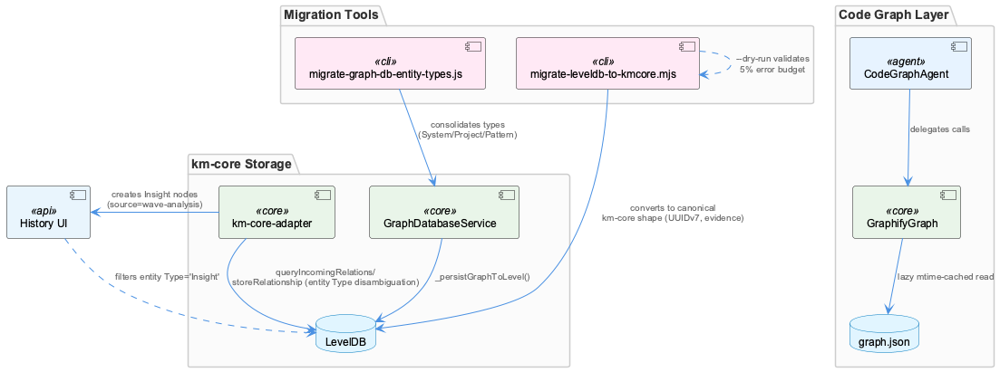
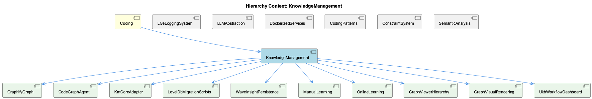

# KnowledgeManagement

**Type:** Component

[LLM] Given the presence of both a live VKB server process and offline migration scripts, the KnowledgeManagement component follows a dual-mode operational pattern: an always-on service handling real-time query/persistence traffic, and a set of standalone maintenance scripts run out-of-band for schema evolution and lifecycle cleanup. Developers should be aware that these migration scripts likely require the VKB server to be stopped or placed in a maintenance mode during execution, since concurrent writes during a schema migration could produce inconsistent entity records — this operational constraint should be verified against docs/architecture/memory-systems.md before running migrations in production.

# KnowledgeManagement — Technical Insight Document

## What It Is

KnowledgeManagement is the graph-based knowledge storage component within the Coding infrastructure, organized around a central VKB (Virtual Knowledge Base) server. This server is the single access point for entity CRUD operations, query resolution, and relationship traversal across a knowledge graph shared by agents, CLI tools, and other components. Concretely, this abstraction is realized in the child component VkbServer, whose `lib/vkb-server/api-routes.js` (via `ApiRoutes.registerRoutes()`) exposes the HTTP surface — endpoints like `/api/entities`, `/api/relations`, `/api/stats`, `/api/export`, `/api/query`, and `/api/ontology/classes` — through which all consumers interact with the underlying graph store, without needing knowledge of the storage engine itself.

## Architecture and Design

The defining architectural pattern here is storage-engine abstraction: consumers never talk to the storage engine directly, they talk to VKB's API surface. This decoupling is what enabled the project to migrate from LevelDB to KMCore as a backend without requiring changes to downstream integration code — a claim validated by a dedicated migration test suite (`migrate-leveldb-to-kmcore.test.ts`). Rather than a big-bang cutover, the team's approach is test-first migration validation: explicit transformation tests confirm entity records survive the schema/engine change intact before any production migration runs.

The component also follows a dual-mode operational pattern: an always-on VKB server process handles real-time query/persistence traffic, while standalone, out-of-band scripts (e.g., `scripts/migrate-graph-db-entity-types.js`) handle schema evolution and lifecycle maintenance. This separation of concerns mirrors the "online vs. offline" split seen in this component's own children — OnlineLearning drives automated incremental extraction, while ManualLearning provides a manual-authoring path — suggesting an architecture-wide convention of pairing live services with batch/manual counterparts.

## Implementation Details

Schema evolution is handled via versioned migration scripts rather than in-place manual edits: `scripts/migrate-graph-db-entity-types.js` mutates entity type definitions as the graph evolves, implying the underlying graph database supports in-place schema alteration or bulk record rewriting. Any new entity type, rename, or restructuring should be captured by a corresponding migration script here to preserve an auditable trail, mirroring the transformation-test discipline established by `migrate-leveldb-to-kmcore.test.ts`.

A first-class subsystem concern is knowledge decay tracking — entities and relationships are aged out or deprioritized over time, implying timestamp or confidence-decay metadata fields on entity records and decay-aware ranking/filtering logic within VKB server query paths. Developers debugging why entities "disappear" from query results despite existing in storage should look here first.

Entity identity is also namespaced for cross-project federation: because the graph store is designed to support knowledge sharing across multiple codebases or agent sessions (per `docs/architecture/cross-project-knowledge.md`), entity records likely carry project-scoped identifiers/tags to prevent collisions when knowledge from different projects merges into the shared store. Any new entity-writing code path must respect this namespacing convention.

## Integration Points

As a child of Coding, KnowledgeManagement sits alongside sibling components such as LiveLoggingSystem, LLMAbstraction, DockerizedServices, CodingPatterns, ConstraintSystem, and SemanticAnalysis, providing the persistent graph substrate that these systems may write into or query from. Internally, its three children implement distinct access modes onto the same VKB surface: VkbServer (the live HTTP API), ManualLearning (`lib/ukb-database/cli.js`, exposing `add-entity`, `update-entity`, `add-relation`, `import`, `export` commands via `UKBDatabaseWriter` for manual authoring), and OnlineLearning (`lib/ukb-unified/core/WorkflowOrchestrator.js`'s `executeIncrementalWorkflow()`, which drives automated gap-based extraction via `mcp__semantic_analysis__execute_workflow`). Together these represent manual, automated, and live-query integration paths into the same underlying knowledge graph.

## Usage Guidelines

Developers extending the schema should treat `migrate-leveldb-to-kmcore.test.ts` as the canonical example for validating entity transformation correctness, and should add new migration scripts under the pattern of `scripts/migrate-graph-db-entity-types.js` rather than patching the database manually. Given the dual-mode design, migration scripts likely require the VKB server to be stopped or placed into maintenance mode before execution — concurrent writes during a schema migration could corrupt records — and this constraint should be verified against `docs/architecture/memory-systems.md` prior to running any production migration. Finally, any code writing new entities must respect project-scoped namespacing to avoid cross-project data leakage, and anyone debugging missing query results should first check whether knowledge decay has deprioritized or aged out the entity in question.

## Hierarchy Context

### Parent
- [Coding](./Coding.md) -- Root node of the coding project knowledge hierarchy, encompassing all development infrastructure knowledge. The project consists of 7 major components: LiveLoggingSystem: [LLM] The LiveLoggingSystem centers around logging.ts, which owns the core responsibilities of session windowing, file routing, and transcript capture; LLMAbstraction: [LLM] The mode-resolution logic in getLLMMode() (llm-mock-service.ts) establishes a clear precedence chain that new developers must understand before ; DockerizedServices: [LLM] The DockerizedServices component centers on docker/README.md as the canonical deployment reference, describing how semantic analysis MCP, constr; KnowledgeManagement: [LLM] The KnowledgeManagement component centers around a VKB (Virtual Knowledge Base) server that exposes graph-based storage operations to the rest o; CodingPatterns: [LLM] The agent wrapper scripts under config/agents/ (claude.sh, copilot.sh, opencode.sh, pi.sh) implement a consistent adapter pattern where each scr; ConstraintSystem: The ConstraintSystem provides rule-based validation and enforcement of code actions and file operations during Claude Code sessions, spanning hook con; SemanticAnalysis: [LLM] The batch-analysis pipeline is organized as a multi-agent workflow where distinct responsibilities are separated into dedicated agent classes ra.

### Children
- [ManualLearning](./ManualLearning.md) -- lib/ukb-database/cli.js exposes add-entity, update-entity, add-relation, import, and export commands that read JSON from stdin and pass it through UKBDatabaseWriter, a manual-authoring entry point distinct from the batch pipeline
- [OnlineLearning](./OnlineLearning.md) -- lib/ukb-unified/core/WorkflowOrchestrator.js executeIncrementalWorkflow() builds workflow_name: 'incremental-analysis' parameters from a gap scope (sinceCommit, commits, sessions) and calls mcp__semantic_analysis__execute_workflow to run automated extraction
- [VkbServer](./VkbServer.md) -- lib/vkb-server/api-routes.js's ApiRoutes.registerRoutes() wires dozens of endpoints (/api/entities, /api/relations, /api/stats, /api/export, /api/query, /api/ontology/classes) as the single HTTP surface for all consumers

### Siblings
- [LiveLoggingSystem](./LiveLoggingSystem.md) -- [LLM] The LiveLoggingSystem centers around logging.ts, which owns the core responsibilities of session windowing, file routing, and transcript capture. This module acts as the single ingestion point for live Claude Code conversation data, meaning any change to session lifecycle semantics (e.g., how a 'session window' is defined or when it rolls over to a new file) has cascading effects on downstream consumers like the classification agent and config validation tooling. New developers should treat logging.ts as the authoritative source of truth for how raw conversation events are structured before they are persisted to disk.
- [LLMAbstraction](./LLMAbstraction.md) -- [LLM] The mode-resolution logic in getLLMMode() (llm-mock-service.ts) establishes a clear precedence chain that new developers must understand before debugging unexpected LLM behavior: per-agent overrides in workflow-progress.json take precedence over a global mode setting, which in turn overrides a legacy mockLLM boolean flag, with 'public' as the ultimate fallback. This four-tier resolution means that a developer trying to force mock mode for testing might set the global mode but be silently overridden by a stale per-agent override left in workflow-progress.json from a previous run. The dual-checking of both llmState (new) and mockLLM (legacy) shapes in isMockLLMEnabled() and getLLMState() is a deliberate backward-compatibility shim, indicating the config schema evolved over time but old state files or tooling that only write the legacy flag must continue to work without breaking the mock system.
- [DockerizedServices](./DockerizedServices.md) -- [LLM] The DockerizedServices component centers on docker/README.md as the canonical deployment reference, describing how semantic analysis MCP, constraint monitor, graphify, and their supporting databases (likely Postgres/Neo4j/Redis instances based on the memory-systems architecture) are packaged as isolated containers. This separation allows each service to be versioned, scaled, and restarted independently of the host Coding CLI tooling, which is critical since the host-side agent orchestration (per docs/architecture/adding-new-agent.md) expects these services to be reachable over well-known ports/URLs rather than in-process calls.
- [CodingPatterns](./CodingPatterns.md) -- [LLM] The agent wrapper scripts under config/agents/ (claude.sh, copilot.sh, opencode.sh, pi.sh) implement a consistent adapter pattern where each script normalizes a distinct third-party CLI's invocation surface into a common interface expected by the rest of the Coding infrastructure. Rather than having callers branch on which agent is being invoked, each wrapper reads its own set of environment variables (e.g., CODING_OPENCODE_MODEL for opencode.sh) and translates them into the flags or config files that the underlying binary expects. This pattern lets orchestration code (likely in bin/coding or docs/architecture/agent-abstraction-api.md-described layers) treat all agents uniformly, at the cost of needing to keep each wrapper script in sync whenever a new common capability (like model selection or proxy routing) is added — a new developer adding agent support should look at an existing wrapper like claude.sh as the canonical template, per docs/architecture/adding-new-agent.md.
- [ConstraintSystem](./ConstraintSystem.md) -- The ConstraintSystem provides rule-based validation and enforcement of code actions and file operations during Claude Code sessions, spanning hook configuration loading, hook dispatch orchestration, and violation capture/persistence. It is built around a unified hook architecture that merges user-level (~/.coding-tools/hooks.json) and project-level (.coding/hooks.json) configurations, with project config taking precedence, and dispatches events (pre-tool, post-tool, pre-prompt, post-prompt, startup, shutdown, error) to registered handlers of type script, command, or module.

Core orchestration lives in UnifiedHookManager (lib/agent-api/hooks/hook-manager.js), which maintains a Map of event names to sorted handler arrays (by priority), supports duplicate-ID overwrite semantics, and exposes registerHandler/unregisterHandler APIs bridging agent-native hook systems to a common HookEvent enum. Configuration parsing and structural validation is handled separately by HookConfigLoader (lib/agent-api/hooks/hook-config.js), which loads, merges, and validates settings/hooks blocks, logging warnings (not throwing) on malformed entries.

Violation detection results are captured and persisted via ViolationCaptureService (scripts/violation-capture-service.js), which writes JSONL violation records to .mcp-sync/session-violations.jsonl and maintains an aggregated violation-history.json with session tracking and computed statistics (severity breakdowns, most common constraint, average violations per session) for dashboard consumption. Sensitive parameter values are redacted before being written to logs, and history is capped at 1000 entries to bound file growth.
- [SemanticAnalysis](./SemanticAnalysis.md) -- [LLM] The batch-analysis pipeline is organized as a multi-agent workflow where distinct responsibilities are separated into dedicated agent classes rather than a single monolithic analyzer. semantic-analysis-agent.ts is responsible for extracting structured knowledge entities from raw inputs (git history diffs/commits and LSL session logs), while ontology-classification-agent.ts takes those extracted entities and classifies them into a hierarchy (determining parent-child relationships and where a given entity fits within the broader ontology). This separation of extraction from classification allows each agent to have a narrower, more testable prompt/response contract with the underlying LLM, and lets the pipeline swap or tune one stage without affecting the other's logic.

---

*Generated from 6 observations*
