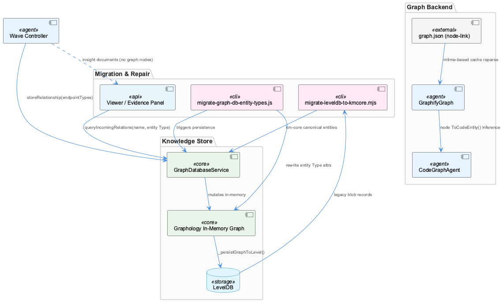
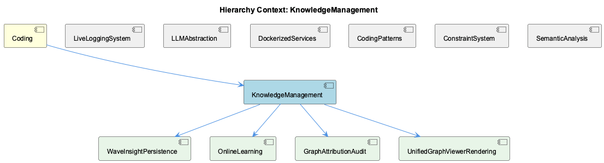

# KnowledgeManagement

**Type:** Component

# KnowledgeManagement — Architectural Insight Document

## What It Is

KnowledgeManagement is the component of the Coding project responsible for capturing, storing, migrating, and surfacing code-derived and analytical knowledge as a graph. Its implementation spans `integrations/semantic-analysis/src/agents/graphify-graph.ts` (GraphifyGraph), `integrations/semantic-analysis/src/agents/code-graph-agent.ts` (CodeGraphAgent), a GraphDatabaseService backed by LevelDB, and a family of migration scripts (`scripts/migrate-graph-db-entity-types.js`, `migrate-leveldb-to-kmcore.mjs`). Its children — ManualLearning, OnlineLearning, GraphDatabaseService, GraphifyGraphReader, CodeGraphAgent, KmCoreMigrationTooling, EntityTypeConsolidation, DuplicateNameAnchoring, GraphAttributionAudit, GraphVisibilityFiltering, and SigmaGraphRenderer — represent the distinct concerns of this domain: writing insights, reading/rendering graphs, resolving entity identity, and migrating schema over time. As a child of Coding, it sits alongside SemanticAnalysis and other infrastructure components but owns the durable knowledge-graph representation that those pipelines feed into.

## Architecture and Design

The dominant pattern here is the Facade/Adapter used to decouple backend migrations from consumer code: CodeGraphAgent retains its full historical public interface — `CodeEntity`, `CodeRelationship`, `checkMemgraphConnection` — from when it queried a live Memgraph/Cypher backend, but now delegates internally to GraphifyGraph's static `graph.json` reads. This is a deliberate trade-off: callers' old guard clauses (`if (!connectionCheck.connected)`) keep working, at the cost of a permanently misleading "connection" concept in the API surface.

A second structural theme is derived-rather-than-declared schema: GraphifyGraph treats a NetworkX node-link `graph.json` export as sole source of truth, with no explicit `type`/`name` fields — `kindOf()` and `nameOf()` parse these out of a `label` string at read time. This makes the entire entity taxonomy hostage to upstream label-formatting conventions, with no schema validation layer to catch drift.

Persistence follows a manual dirty-flag model rather than transparent auto-save: GraphDatabaseService requires every in-memory Graphology mutation to be paired with `dbService.isDirty = true`, with actual LevelDB writes deferred until `_persistGraphToLevel()` is invoked — batching for performance at the risk of silent data loss if a mutation path forgets to mark dirty.

## Implementation Details

Entity identity resolution has historically been a weak point. The anchor pass originally used `findEntityByName`, a name-only lookup, which caused a newly created Detail-type node to silently inherit 24 incoming edges from an unrelated, same-named SubComponent node created weeks earlier (documented in the Wave Insight Persistence record, and reflected in the DuplicateNameAnchoring child). The fix threads `entityType` through `queryIncomingRelations` and `storeRelationship` so lookups disambiguate by (name, type) pairs, with a fixed fallback `projectAnchorName = 'Coding'` ensuring unresolvable nodes attach to a known anchor rather than becoming orphans.

Schema evolution is handled through explicit, sometimes lossy migration scripts. `scripts/migrate-graph-db-entity-types.js` consolidates six historically distinct types — TransferablePattern, WorkflowPattern, TechnicalPattern, TechnicalIssue, SystemImplementation, AnalysisInsight — into a single canonical `Pattern` type via a hardcoded `ENTITY_TYPE_MAPPING`, and is permissive-by-default: unmapped types also collapse to `Pattern` rather than being flagged, a risk if the mapping drifts from the live schema (this is the substance of EntityTypeConsolidation). `migrate-leveldb-to-kmcore.mjs`, validated by `migrate-leveldb-to-kmcore.test.ts`, encodes an explicit error-budget policy — up to 5% malformed entities tolerated with exit 0, 10% triggers a halt — and supports `--dry-run` to preview migration counts before committing (KmCoreMigrationTooling).

A separate, significant gap surfaced in the Wave Insight Persistence record: Wave 4 wrote 73 insight documents to storage but created zero corresponding graph nodes of `entityType 'Insight'`. Because the viewer's History sidebar filters strictly on `entityType == 'Insight'` to render a Batch badge, this broke traceability between completed analysis runs and their visible conclusions, even though the underlying data existed on disk — illustrating how ManualLearning and OnlineLearning can produce documents that never get anchored as graph entities (GraphAttributionAudit).

## Integration Points

KnowledgeManagement's read side is consumed by viewer-facing packages: components like `ukb-workflow-modal.tsx`, `D3GraphCanvas.tsx`, `SigmaCanvas.tsx` (aligning with SigmaGraphRenderer) and `attribution.test.ts` live in `system-health-dashboard` and `unified-viewer`, which read graph data over HTTP from `obs-api` rather than calling into the semantic-analysis agent layer directly — GraphifyGraphReader as a distinct read-path component was not found to be directly wired to GraphifyGraph in the supplied files, suggesting the viewer layer and the agent layer are integrated indirectly via the API, not by direct import. GraphVisibilityFiltering governs what the History sidebar and similar UI surfaces choose to display (e.g., the strict `entityType == 'Insight'` filter). CodeGraphAgent's compatibility shim is the key integration seam with any legacy caller still written against the old Memgraph-era contract.

## Usage Guidelines

Any new code path that mutates the GraphDatabaseService's in-memory graph must be audited to confirm it sets `isDirty = true` and eventually triggers `_persistGraphToLevel()` — omitting this causes silent data loss on process exit. Entity lookups should always resolve by (name, type) pairs, not name alone, per the DuplicateNameAnchoring fix; code still calling raw `findEntityByName`-style lookups risks cross-contaminating edges between unrelated same-named entities. When extending `ENTITY_TYPE_MAPPING` in `migrate-graph-db-entity-types.js`, new entity types must be added explicitly — the permissive fallback to `Pattern` will otherwise silently reclassify anything unmapped. Migration scripts should be run with `--dry-run` first to assess blast radius, and their 5%/10% malformed-data thresholds should be treated as real operational gates, not arbitrary constants. Finally, any pipeline that produces insight documents (ManualLearning, OnlineLearning) must be checked to confirm it also writes corresponding `Insight`-typed graph nodes, since GraphVisibilityFiltering's UI surfaces (like the History sidebar's Batch badge) depend on that entityType being present, not merely on the document existing on disk.

## Work Record

What working sessions recorded about this entity — decisions taken, problems hit, and why things are the way they are:

- Wave Insight Persistence work record establishes that Wave 4 was writing 73 insight documents but zero corresponding Insight graph nodes, meaning the viewer's History sidebar (which filters strictly to entityType 'Insight') could never surface a Batch badge for that run's conclusions.
- The same Wave Insight Persistence record documents that the anchor pass originally resolved entities by name only via `findEntityByName`, causing a new Detail-type node to silently inherit the 24 incoming edges of an unrelated same-named SubComponent from weeks earlier — the fix requires passing entityType through queryIncomingRelations and storeRelationship so lookups disambiguate by type, falling back to a fixed `projectAnchorName = 'Coding'` instead of leaving orphans.
- The Wave Insight Persistence work record establishes that an entire wave of analysis (Wave 4) produced 73 insight documents in storage but created zero corresponding graph nodes of entityType 'Insight'. Because the viewer's History sidebar filters strictly on entityType == 'Insight' to decide whether to render a Batch badge, this silently broke traceability between a completed analysis run and its visible conclusions in the UI, despite the underlying insight data existing on disk the whole time.

## Hierarchy Context

### Parent
- [Coding](./Coding.md) -- Root node of the coding project knowledge hierarchy, encompassing all development infrastructure knowledge. The project consists of 7 major components: LiveLoggingSystem: [SESSION] Opencode Daemon — Session Tracking and Temp File Lifecycle establishes that health-coordinator.js computes PID staleness from heartbeat file; LLMAbstraction: [SESSION] 'LLM Routing Tier Priority' establishes that LLM requests must follow fallback tier order — max-subscription models first, then work/GH Copi; DockerizedServices: [SESSION] Coding-Services Docker Container — Health Verification Workflow establishes that rebuild is performed via docker-compose and all supervised ; KnowledgeManagement: [SESSION] Wave Insight Persistence work record establishes that Wave 4 was writing 73 insight documents but zero corresponding Insight graph nodes, me; CodingPatterns: [SESSION] Documentation Style Guide for Diagrams and Markdown establishes that .puml source files must live in docs/puml/, and clarifies which generat; ConstraintSystem: [SESSION] Statusline Click-Report Feature record establishes that clicking the 'constraints' field in the tmux statusline opens or focuses the constra; SemanticAnalysis: [SESSION] Pipeline CodingLowerOntologySource Emission Bug documents an unresolved defect where the pipeline emits a CodingLowerOntologySource referenc.

### Children
- [ManualLearning](./ManualLearning.md) -- [SESSION] Wave Insight Persistence work record establishes that Wave 4 wrote 73 insight documents but zero corresponding Insight graph nodes, showing manually/human-curated conclusions can exist as documents without ever being anchored into the graph as entities.
- [OnlineLearning](./OnlineLearning.md) -- [SESSION] Wave Insight Persistence work record establishes that the History sidebar filters strictly to entityType 'Insight', so a Batch badge for a run's conclusions can only appear if the online pipeline actually writes Insight-typed graph nodes, not just insight documents.
- [GraphDatabaseService](./GraphDatabaseService.md) -- [SESSION] Wave Insight Persistence work record establishes that the persistence layer can silently accept writes to one representation (insight documents) while never receiving corresponding writes to another (Insight graph nodes), leaving the two out of sync with no error raised.
- [GraphifyGraphReader](./GraphifyGraphReader.md) -- [LLM] None of the supplied Code Files implement or reference a component named GraphifyGraphReader, nor do they import from or call into `integrations/semantic-analysis/src/agents/graphify-graph.ts`. The five files retrieved — `ukb-workflow-modal.tsx`, `assert-graph-density.ts`, `D3GraphCanvas.tsx`, `SigmaCanvas.tsx`, and `attribution.test.ts` — belong to `system-health-dashboard` and `unified-viewer`, two consumer-facing viewer packages that read graph data over HTTP from `obs-api` (port 12436), not the `semantic-analysis` agent layer where a 'GraphifyGraphReader' would plausibly live alongside `GraphifyGraph` and `CodeGraphAgent`.
- [CodeGraphAgent](./CodeGraphAgent.md) -- [LLM] The parent entity's own description characterizes CodeGraphAgent (integrations/semantic-analysis/src/agents/code-graph-agent.ts) as a compatibility shim: it preserves its full historical public interface — CodeEntity, CodeRelationship types, and the checkMemgraphConnection method — from an era when it queried a live Memgraph/Cypher backend, while internally delegating entirely to GraphifyGraph's static file-based reads. This is a Facade/Adapter pattern applied to a backend migration: callers written against the old contract, including guard clauses like `if (!connectionCheck.connected)`, continue to work unmodified even though the underlying 'connection' concept is now meaningless — a deliberate decoupling of consumer code changes from the storage-layer migration, at the cost of a permanently misleading method name in the API surface.
- [KmCoreMigrationTooling](./KmCoreMigrationTooling.md) -- [LLM] Every code file supplied for this analysis — integrations/system-health-dashboard/src/components/ukb-workflow-modal.tsx, integrations/unified-viewer/scripts/assert-graph-density.ts, integrations/unified-viewer/src/graph/D3GraphCanvas.tsx, integrations/unified-viewer/src/graph/SigmaCanvas.tsx, and integrations/unified-viewer/src/graph/attribution.test.ts — belongs to the dashboard/unified-viewer rendering layer (workflow progress UI, force-directed graph canvases, a node-count budget check, and an attribution-category test). None of them touch km-core's own migration surface: there is no reference in any of these files to LevelDB persistence, entity-type consolidation tables, or a Memgraph-to-file-store transition path.
- [EntityTypeConsolidation](./EntityTypeConsolidation.md) -- [LLM] None of the supplied files (ukb-workflow-modal.tsx, assert-graph-density.ts, D3GraphCanvas.tsx, SigmaCanvas.tsx, attribution.test.ts) implement entity-type consolidation logic. They concern workflow history pagination, graph density budgeting, and D3/Sigma rendering of already-typed entities — none touch a mapping table or type-folding migration.
- [DuplicateNameAnchoring](./DuplicateNameAnchoring.md) -- [SESSION] The Wave Insight Persistence work record documents that the anchor pass originally resolved entities by name only via `findEntityByName`, and because of that a newly created Detail-type node silently inherited 24 incoming edges belonging to an unrelated same-named SubComponent created weeks earlier. The record states the fix required threading entityType through both `queryIncomingRelations` and `storeRelationship` so entity lookups disambiguate by (name, type) pairs rather than name alone, with a fixed fallback `projectAnchorName = 'Coding'` introduced so nodes with no other resolvable parent attach to a known anchor instead of becoming orphans.
- [GraphAttributionAudit](./GraphAttributionAudit.md) -- [LLM+CGR] `categoriseUnattributed` (imported by `integrations/unified-viewer/scripts/assert-graph-density.ts` and exercised in `integrations/unified-viewer/src/graph/attribution.test.ts`) splits unrooted graph nodes into four mutually exclusive categories — `recordedParent`, `wrongClass`, `danglingRef`, `unclaimed` — instead of one generic 'unattributed' bucket. The test `'a recorded name that resolves to TWO rooted entities is NOT a suggestion'` shows why: when a `parentEntityName` string matches two same-named rooted entities (the comment notes 40 of 98 live roll-up parents share their child's name), the function refuses to guess and falls back to `unclaimed` rather than emitting a `suggestedParentId` that would be a coin flip presented as an answer.
- [GraphVisibilityFiltering](./GraphVisibilityFiltering.md) -- [LLM] The actual implementation of the visibility predicate — `@/graph/visibility-predicate.ts` (exporting `isEntityVisible` and the `VisibilityFilters` type) and `@/graph/useGraphVisibility.ts` (the hook wrapping it) — is not present in the supplied files. What is present are two CONSUMERS: `integrations/unified-viewer/scripts/assert-graph-density.ts`, which imports `isEntityVisible`/`VisibilityFilters` directly to replay the canvas's filtering offline, and `integrations/unified-viewer/src/graph/D3GraphCanvas.tsx`, which calls a `useGraphVisibility()` hook. Both treat the predicate as an opaque contract rather than defining it, so any statement about the internal branching logic of the filter would be inference, not observation.
- [SigmaGraphRenderer](./SigmaGraphRenderer.md) -- [LLM] SigmaCanvas.tsx implements the actual WebGL graph renderer via <SigmaContainer> and a nested GraphSetup component that builds a graphology Graph from useGraphData() output, runs graphology-layout-force as a polish pass over graph-builder's hierarchical seed positions, and wires click/hover events through makeEventHandlers(). This is the component most plausibly referred to as 'SigmaGraphRenderer' in the parent context, though no file in the supplied set literally bears that name.

### Siblings
- [LiveLoggingSystem](./LiveLoggingSystem.md) -- [SESSION] Opencode Daemon — Session Tracking and Temp File Lifecycle establishes that health-coordinator.js computes PID staleness from heartbeat file age to surface accurate Healthy/Degraded status without false alarms for coding sub-agents
- [LLMAbstraction](./LLMAbstraction.md) -- [SESSION] 'LLM Routing Tier Priority' establishes that LLM requests must follow fallback tier order — max-subscription models first, then work/GH Copilot models, then Groq Llama-70B only as last resort — rather than demoting to lower tiers as primary
- [DockerizedServices](./DockerizedServices.md) -- [SESSION] Coding-Services Docker Container — Health Verification Workflow establishes that rebuild is performed via docker-compose and all supervised processes/health endpoints must be confirmed live before relying on downstream pipelines like wave-analysis
- [CodingPatterns](./CodingPatterns.md) -- [SESSION] Documentation Style Guide for Diagrams and Markdown establishes that .puml source files must live in docs/puml/, and clarifies which generated diagram artifacts belong in version control versus being build outputs, enforcing consistent authoring and correct rendering across the docs pipeline.
- [ConstraintSystem](./ConstraintSystem.md) -- [SESSION] Statusline Click-Report Feature record establishes that clicking the 'constraints' field in the tmux statusline opens or focuses the constraint-monitor dashboard tab, tying HookManagementSystem's violation data to a click-driven UX surface
- [SemanticAnalysis](./SemanticAnalysis.md) -- [SESSION] Pipeline CodingLowerOntologySource Emission Bug documents an unresolved defect where the pipeline emits a CodingLowerOntologySource reference in output despite documentation stating this source type should never be produced

---

*Generated from 9 observations*
