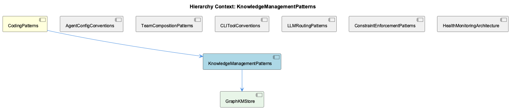

# KnowledgeManagementPatterns

**Type:** SubComponent

The dual-interface pattern (CLI + visual) is enforced by having separate bin/ tools for CLI access while a visual interface is described in docs/README.md as the 'Coding Documentation Hub', keeping both surfaces synchronized over the same declarative config

## What It Is

KnowledgeManagementPatterns is a sub-component of CodingPatterns that defines how the Coding project stores, organizes, retrieves, and shares structured knowledge across its systems. Its primary architectural documentation lives in two key files: `docs/architecture/memory-systems.md`, which describes the graph-based storage architecture, and `docs/architecture/cross-project-knowledge.md`, which defines how that knowledge extends across project boundaries. The component's single named child implementation is GraphKMStore, the concrete graph-backed store that realizes these patterns.

Unlike sibling components such as AgentConfigConventions or TeamCompositionPatterns — which are primarily concerned with declarative configuration files in `config/` directories — KnowledgeManagementPatterns operates at a higher abstraction layer, governing how the system reasons over accumulated knowledge rather than merely configuring runtime behavior.

---

## Architecture and Design

The central architectural decision in KnowledgeManagementPatterns is the choice of a **graph structure** as the storage substrate, as documented in `docs/architecture/memory-systems.md`. A graph model is a deliberate trade-off: it sacrifices the simplicity of flat key-value or relational storage in exchange for the ability to represent rich, typed relationships between knowledge entries. This is particularly important given the cross-project scope documented in `docs/architecture/cross-project-knowledge.md` — when knowledge must traverse project boundaries, a graph traversal model is more natural than join-based relational <USER_ID_REDACTED>.

The second major architectural layer is **ontology integration**, introduced as the defining feature of Release 2.0 (documented in `docs/RELEASE-2.0.md`, titled "Ontology Integration System"). This makes GraphKMStore ontology-aware, meaning knowledge entries are not stored as raw data blobs but are classified and typed according to a shared ontological schema. This decision enforces semantic consistency across the graph — two entries about the same conceptual domain will share ontological classification regardless of which project generated them. The trade-off is increased write complexity (entries must be classified at insertion time) in exchange for dramatically more precise <USER_ID_REDACTED>.

The **dual-interface pattern** is a third design constraint that KnowledgeManagementPatterns inherits from the broader CodingPatterns architecture. Following the same convention established for CLI entrypoints described under CLIToolConventions, knowledge access is exposed through both `bin/` CLI tools and a visual surface described in `docs/README.md` as the "Coding Documentation Hub." Both surfaces operate over the same declarative configuration, ensuring that what a developer <USER_ID_REDACTED> via CLI is identical to what is rendered visually. This is a consistency enforcement decision: the knowledge graph has no "primary" interface, and neither surface is permitted to expose capabilities the other cannot.

The **namespace isolation** pattern described in `docs/architecture/cross-project-knowledge.md` is the architectural answer to the cross-project scope problem. Knowledge entries carry cross-project metadata, allowing the graph to be logically partitioned by project namespace while still supporting traversal <USER_ID_REDACTED> that cross those boundaries. This mirrors the pattern seen in LLMRoutingPatterns, where tiered proxy URLs (`LLM_PROXY_URL`, `RAPID_LLM_PROXY_URL`, `LLM_CLI_PROXY_URL`) provide context-sensitive routing — here, namespace metadata provides context-sensitive scoping.

---

## Implementation Details

The concrete implementation of KnowledgeManagementPatterns is GraphKMStore, documented explicitly in `docs/architecture/memory-systems.md` under "Graph-Based Knowledge Storage Architecture." GraphKMStore is the named component responsible for all graph operations: node creation, edge traversal, ontological classification, and cross-project metadata attachment.

The ontology integration introduced in Release 2.0 means GraphKMStore operates in two conceptual phases at write time. First, an incoming knowledge entry must be classified against the ontological schema — this is the ontology-aware layer. Second, the classified entry is inserted as a node in the graph, with edges drawn to related nodes based on ontological type and cross-project metadata. At read time, <USER_ID_REDACTED> can be scoped to a project namespace or deliberately set to traverse namespace boundaries, depending on whether the caller requires isolated or federated results.

The cross-project metadata schema is described in `docs/architecture/cross-project-knowledge.md` as enabling "<USER_ID_REDACTED> that traverse project boundaries through the graph structure." This implies that edges in the graph can be typed as either intra-project or cross-project, and query execution respects this edge typing to enforce or relax namespace isolation on a per-query basis.

No code symbols were identified in the analysis, meaning the authoritative source of truth for implementation mechanics is the architecture documentation in `docs/architecture/` rather than inspectable source files. This is itself an architectural signal: KnowledgeManagementPatterns is primarily a **documented design pattern** at this layer, with GraphKMStore as the named instantiation.

---

## Integration Points

KnowledgeManagementPatterns sits inside CodingPatterns, which serves as the architectural catch-all for the Coding project. This means the knowledge management system is expected to be consistent with the broader layered architecture: `bin/` for CLI entrypoints, `config/` for declarative configuration, `docs/` for architecture documentation, and `docker/` for deployment. Knowledge access via CLI follows the same `bin/` convention that CLIToolConventions establishes as the primary interaction layer.

The agent configuration system (AgentConfigConventions, TeamCompositionPatterns) is a likely consumer of the knowledge graph. Agents defined under `config/agents/` and teams under `config/teams/` may query GraphKMStore to retrieve relevant patterns or constraints at runtime, though this integration is not explicitly documented in the available observations.

ConstraintEnforcementPatterns, documented under `docs/constraints/README.md` as "Code <USER_ID_REDACTED> Enforcement," is a sibling system that likely produces knowledge entries consumed by the graph — coding standards and constraint violations are candidates for ontological classification and graph storage. The visual interface described in `docs/README.md` as the Coding Documentation Hub serves as the read surface for surfacing this accumulated knowledge to developers.

---

## Usage Guidelines

When adding knowledge entries to GraphKMStore, ontological classification is mandatory as of Release 2.0. Entries must conform to the ontological schema before insertion; bypassing classification undermines the semantic consistency guarantees that make cross-project traversal meaningful.

Cross-project <USER_ID_REDACTED> should explicitly declare whether namespace isolation is required. The default safe assumption is to scope <USER_ID_REDACTED> to a single project namespace. Cross-boundary traversal should be intentional, using the cross-project metadata fields documented in `docs/architecture/cross-project-knowledge.md`, not incidental.

Both the CLI tools in `bin/` and the visual Coding Documentation Hub must remain synchronized over the same declarative configuration. Developers extending the knowledge access layer should not add capabilities to one surface without reflecting them in the other — this is the dual-interface invariant that the architecture enforces by design.

When the knowledge system is extended, the architecture documentation in `docs/architecture/memory-systems.md` and `docs/architecture/cross-project-knowledge.md` are the primary references and should be updated to reflect any changes to graph schema, ontological classification rules, or namespace isolation semantics. These documents are the source of truth in the absence of inspectable code symbols.

## Hierarchy Context

### Parent
- [CodingPatterns](./CodingPatterns.md) -- CodingPatterns serves as the architectural catch-all component for the Coding project, capturing general programming wisdom, design patterns, and conventions that permeate the codebase. Based on the repository structure, the project follows a consistent agent-abstraction pattern where AI agents (Claude, Copilot, Mastra, OpenCode) are configured via config/agents/ shell scripts and unified under config/agent-profiles.json, enabling agent-agnostic workflows. The system demonstrates strong separation of concerns through layered architecture: bins for CLI entrypoints, config for declarative configuration, docs for architecture documentation, and docker for deployment.

### Children
- [GraphKMStore](./GraphKMStore.md) -- docs/architecture/memory-systems.md ('Graph-Based Knowledge Storage Architecture') explicitly documents GraphKMStore as the named component responsible for graph-based knowledge storage within the KnowledgeManagementPatterns sub-component.

### Siblings
- [AgentConfigConventions](./AgentConfigConventions.md) -- config/agents/ directory holds per-agent shell scripts that declare environment-specific setup, with docs/architecture/adding-new-agent.md codifying the step-by-step convention for registering a new provider
- [TeamCompositionPatterns](./TeamCompositionPatterns.md) -- config/teams/ directory is the canonical location for team topology manifests, mirroring the per-agent config/agents/ pattern but at the group level
- [CLIToolConventions](./CLIToolConventions.md) -- docs/getting-started.md references bin/ tools as the primary interaction layer, indicating CLI scripts are the intended entrypoints rather than imported libraries
- [LLMRoutingPatterns](./LLMRoutingPatterns.md) -- Three distinct proxy URL environment variables—LLM_PROXY_URL, RAPID_LLM_PROXY_URL, and LLM_CLI_PROXY_URL—are documented as project-wide constants, indicating tiered routing where different latency/cost profiles are selected by context
- [ConstraintEnforcementPatterns](./ConstraintEnforcementPatterns.md) -- docs/constraints/README.md titled 'Constraints - Code <USER_ID_REDACTED> Enforcement' establishes a dedicated subsystem for enforcing coding standards, separate from agent config or CLI conventions
- [HealthMonitoringArchitecture](./HealthMonitoringArchitecture.md) -- docs/health-system/4-layer-architecture-implementation-plan.md explicitly names a 4-Layer Health Monitoring Architecture, indicating health monitoring is decomposed into four distinct responsibility tiers

---

*Generated from 5 observations*
