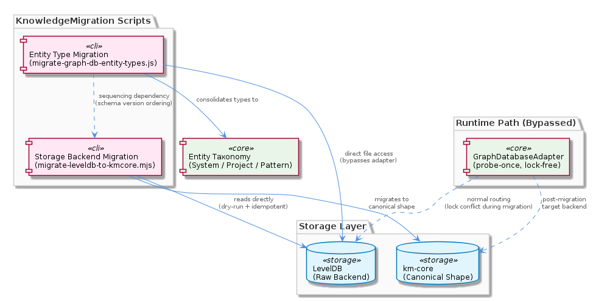
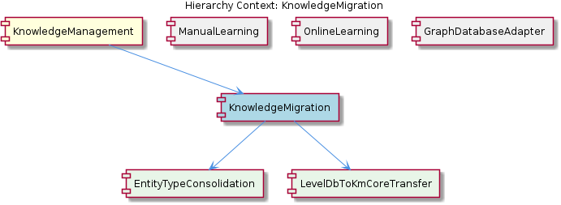

# KnowledgeMigration

**Type:** SubComponent

The existence of two separate migration scripts implies a sequencing concern: entity-type consolidation (migrate-graph-db-entity-types.js) may need to run before or after the storage backend migration (migrate-leveldb-to-kmcore.mjs) depending on which schema version each script expects as input

# KnowledgeMigration

## What It Is

KnowledgeMigration is a SubComponent of KnowledgeManagement that encapsulates the one-off, out-of-band data transformation scripts required to evolve the graph database schema and storage backend across breaking changes. It is implemented as a small collection of standalone scripts under the `scripts/` directory—specifically `scripts/migrate-graph-db-entity-types.js` and `scripts/migrate-leveldb-to-kmcore.mjs`—rather than as a long-running service or library. These scripts contain the two child components of KnowledgeMigration: EntityTypeConsolidation (the taxonomy normalizer) and LevelDbToKmCoreTransfer (the storage backend migrator).

Unlike its sibling components ManualLearning and OnlineLearning, which produce graph data and route it through the GraphDatabaseAdapter during normal operation, KnowledgeMigration operates *outside* the normal adapter routing path. It exists to retroactively reshape data that has already been written, either because the entity-type taxonomy was consolidated to a canonical three-value set (System/Project/Pattern) or because the underlying physical storage shape moved from raw LevelDB to the km-core canonical form.

## Architecture and Design

The architectural approach is intentionally minimal and script-based. Each migration concern is isolated into its own executable file, and the two scripts represent two orthogonal kinds of change: a *taxonomy* change (EntityTypeConsolidation in `scripts/migrate-graph-db-entity-types.js`) and a *storage shape* change (LevelDbToKmCoreTransfer in `scripts/migrate-leveldb-to-kmcore.mjs`). This separation reflects a design decision to keep each migration narrowly scoped so it can be reasoned about, tested, and re-run independently.

A defining architectural property of KnowledgeMigration is that it bypasses the parent KnowledgeManagement component's normal access channel—the GraphDatabaseAdapter. The adapter (`storage/graph-database-adapter.ts`) implements a probe-once, route-always pattern that commits at `initialize()` time to either the VKB HTTP API or direct GraphDatabaseService access. Because LevelDB does not permit multiple concurrent file-lock holders, the migration scripts cannot safely run while the adapter (or the VKB server it may be routing to) holds open file handles on the same LevelDB files. Consequently, migration scripts open LevelDB directly and require the rest of the system to be quiescent. This is a deliberate trade-off: simplicity and correctness during rare migration events at the cost of operational coordination (the system cannot self-migrate while live).

The `migrate-leveldb-to-kmcore.mjs` script in particular embodies a production-safety pattern with three explicit features: dry-run mode (preview the migration without writing), idempotency guarantees (safe re-execution producing the same end state), and error-budget controls (the migration can tolerate a bounded number of failures and continue, rather than aborting on the first error). Together these make partial reruns and incremental progress possible, which is critical when migrating large datasets where a single full-pass run would be impractical to retry.

## Implementation Details

EntityTypeConsolidation, implemented in `scripts/migrate-graph-db-entity-types.js`, exists because the graph schema's entity-type taxonomy was narrowed to a canonical set of three values: System, Project, and Pattern. The script reads existing entity records and normalizes their `type` field to one of these three values. Because it operates post-write on data that is already in the graph DB, it is effectively a data-fixup pass rather than an ingestion-time validator—any new code path that writes entities must produce the canonical values directly, and this script reconciles legacy values that pre-date the rule.

LevelDbToKmCoreTransfer, implemented in `scripts/migrate-leveldb-to-kmcore.mjs`, performs a deeper transformation: it migrates the physical storage from raw LevelDB records to the km-core canonical shape. The `.mjs` extension signals ES module syntax, which has implications for how CommonJS dependencies must be imported (typically via `createRequire` or dynamic `import()`) and constrains the toolchain configuration under which the script can be executed. The script's dry-run mode is implemented as a flag that suppresses write operations while still walking the full source dataset and reporting what would change. Idempotency is achieved by making the transformation a pure function of the source record—re-running on already-migrated data either no-ops or produces the same canonical output. Error-budget controls allow the script to log and skip individual record failures up to a threshold, rather than aborting the entire run, which is essential for large LevelDB datasets where transient or record-level corruption can otherwise block all progress.

A subtle sequencing concern arises from the coexistence of these two scripts. Because EntityTypeConsolidation expects a particular schema version as input and produces a particular version as output, and because LevelDbToKmCoreTransfer transforms the underlying storage shape, the operator must know which script expects which version. In practice, the entity-type consolidation may need to run either before storage migration (so the km-core target receives already-canonical types) or after (if the km-core shape itself carries new type-field semantics)—the script headers and dry-run output are the authoritative source for this ordering.

## Integration Points

KnowledgeMigration's primary integration point is the LevelDB files on disk, which it accesses directly rather than through the GraphDatabaseAdapter used by sibling components. This direct access is necessary precisely because the adapter's lock-free design—documented in the parent KnowledgeManagement insight as the "probe-once, route-always" pattern in `storage/graph-database-adapter.ts`—would conflict with the migration scripts also holding LevelDB file locks. The adapter's initialization probe via `VkbApiClient.isServerAvailable()` makes a single, immutable routing decision per process lifetime, and any migration that opened LevelDB while a VKB server or adapter-routed process was also running would risk write failures or corruption.

The km-core canonical shape is the target schema for `migrate-leveldb-to-kmcore.mjs`, making km-core (whichever module exposes it) a direct dependency. The canonical three-value type set (System/Project/Pattern) consumed by `migrate-graph-db-entity-types.js` represents an implicit contract with every other producer of graph entities in the system—including ManualLearning's hand-crafted writes and OnlineLearning's batch-analysis pipeline that converges git history, LSL sessions, and code analysis into graph writes. Any new producer must respect this taxonomy, or a future migration will be needed.

## Usage Guidelines

Treat migration runs as exclusive operations. Before invoking either `scripts/migrate-graph-db-entity-types.js` or `scripts/migrate-leveldb-to-kmcore.mjs`, ensure that no VKB server is running and no consumer process is holding the GraphDatabaseAdapter open against the same LevelDB files. Because the adapter's routing decision is immutable per process lifetime, any consumer that was running before the migration must be restarted afterward to pick up the new on-disk state.

Always run with `--dry-run` (or its equivalent flag) first when using `migrate-leveldb-to-kmcore.mjs`. The dry-run output reveals the scope of the change, the records that would be transformed, and any records that would be skipped under the error budget. Only after reviewing the dry-run report should a real migration be executed. Because the script is idempotent, a partial run that fails mid-way can be safely resumed by re-invoking the same command—the already-migrated records will be detected and either skipped or re-written identically.

Determine the script execution order from the current schema version of your LevelDB snapshot, not from assumption. If the graph DB still contains legacy entity-type values, run EntityTypeConsolidation first so that the storage migration receives canonical-typed records. If the km-core target shape mandates type normalization as part of its own transformation, the order may reverse. When in doubt, dry-run both scripts in both orders and compare the projected outputs.

Finally, do not extend KnowledgeMigration with continuous, in-process migration logic. The component is designed for rare, deliberate, out-of-band runs. Ongoing data-shape concerns belong in the producers (ManualLearning, OnlineLearning) or in the GraphDatabaseAdapter's write path—not in the migration scripts, which are reserved for breaking schema or storage transitions.

---

**Summary of analytical findings:**

1. **Architectural patterns identified:** Script-based out-of-band migration; dry-run / idempotency / error-budget production-safety triad; deliberate bypass of the parent's probe-once adapter to avoid LevelDB file-lock contention.
2. **Design decisions and trade-offs:** Isolation of taxonomy migration from storage migration (simpler reasoning, but introduces a sequencing concern); requiring system quiescence during runs (operational cost in exchange for correctness); ES module choice for the storage migrator (modern syntax at the cost of CommonJS interop complexity).
3. **System structure insights:** KnowledgeMigration is a peer to ManualLearning, OnlineLearning, and GraphDatabaseAdapter under KnowledgeManagement, but uniquely sits *outside* the adapter's routing path, accessing LevelDB directly.
4. **Scalability considerations:** Error budgets and idempotency enable large dataset migrations to make partial progress and resume; dry-run mode allows scope estimation before commitment. The primary scaling limit is exclusive LevelDB access, which means migration time is downtime time.
5. **Maintainability assessment:** Each migration is a self-contained script with a narrow purpose, which is easy to read and audit. The cost is that operators must understand cross-script sequencing manually—there is no orchestrator. Maintainability is good for the rare-event use case it targets, but would degrade if migrations became frequent.

## Hierarchy Context

### Parent
- [KnowledgeManagement](./KnowledgeManagement.md) -- [LLM] The GraphDatabaseAdapter (storage/graph-database-adapter.ts) implements a lock-free dual-routing architecture that permanently commits to one of two execution paths at initialization time, never re-evaluating afterward. During its first `initialize()` call, the adapter dynamically imports VkbApiClient and invokes `isServerAvailable()`—a single probe that determines forever whether all subsequent reads and writes are routed to the VKB HTTP API or directly to the underlying GraphDatabaseService. This 'probe-once, route-always' design is deliberately lock-free: because LevelDB does not support multiple concurrent file-lock holders, having both the VKB server process and a direct-access client attempt to open the same LevelDB files simultaneously would cause write failures or corruption. By detecting server presence at startup and never switching paths mid-session, the adapter avoids the race conditions that would arise from per-operation detection. A developer integrating with this component must understand that the routing decision is immutable per adapter instance: if the VKB server starts or stops after initialization, the adapter will not adapt, and a restart of the consumer process is required to pick up the new routing path.

### Children
- [EntityTypeConsolidation](./EntityTypeConsolidation.md) -- Resides at scripts/migrate-graph-db-entity-types.js (per SubComponent hierarchy context); its sole purpose is normalizing entity type values already stored in the graph DB, meaning it operates post-write on live or snapshot data rather than at ingestion time.
- [LevelDbToKmCoreTransfer](./LevelDbToKmCoreTransfer.md) -- Resides at scripts/migrate-leveldb-to-kmcore.mjs (per parent component analysis); the .mjs extension indicates it uses ES module syntax, which constrains how it can import CommonJS dependencies and affects toolchain compatibility during migration runs.

### Siblings
- [ManualLearning](./ManualLearning.md) -- ManualLearning entities are routed through GraphDatabaseAdapter, meaning all hand-crafted writes go either to the VKB HTTP API or directly to GraphDatabaseService depending on the probe-once initialization decision in storage/graph-database-adapter.ts
- [OnlineLearning](./OnlineLearning.md) -- OnlineLearning extraction runs as a batch analysis pipeline referencing git history, LSL sessions, and code analysis—three distinct source channels whose outputs converge into a single graph write path via GraphDatabaseAdapter in storage/graph-database-adapter.ts
- [GraphDatabaseAdapter](./GraphDatabaseAdapter.md) -- storage/graph-database-adapter.ts dynamically imports VkbApiClient during its first initialize() call and invokes isServerAvailable() exactly once, making this single probe the permanent routing decision for the adapter instance's lifetime

---

*Generated from 5 observations*
