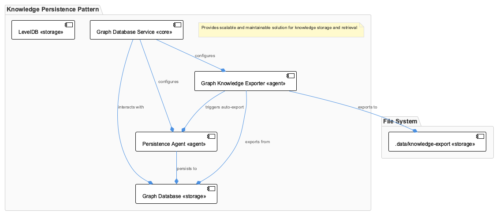
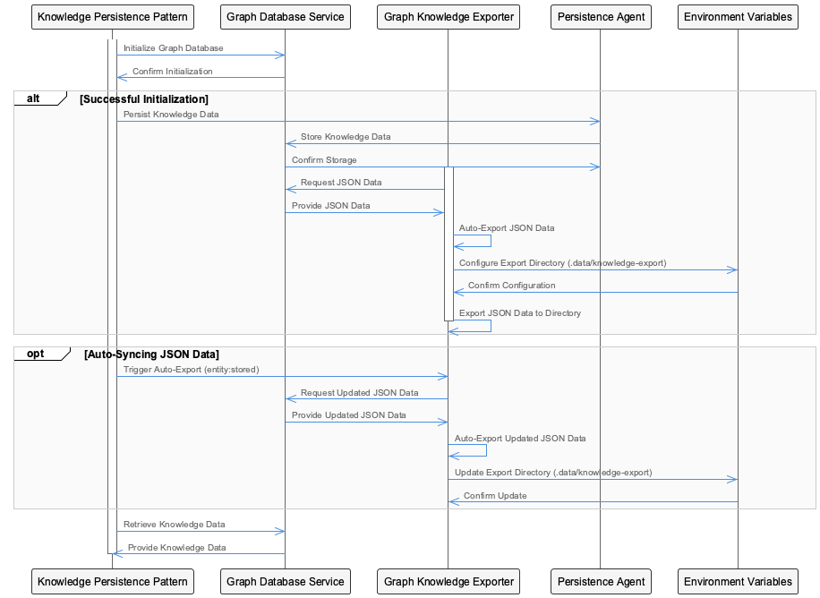
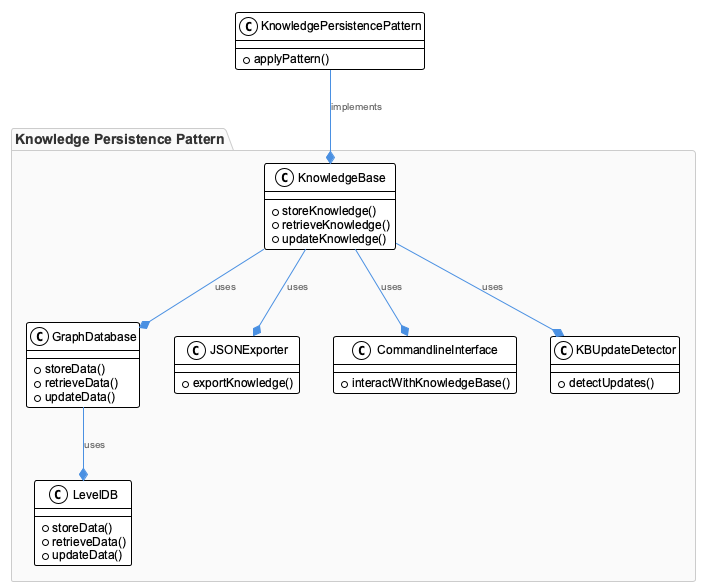
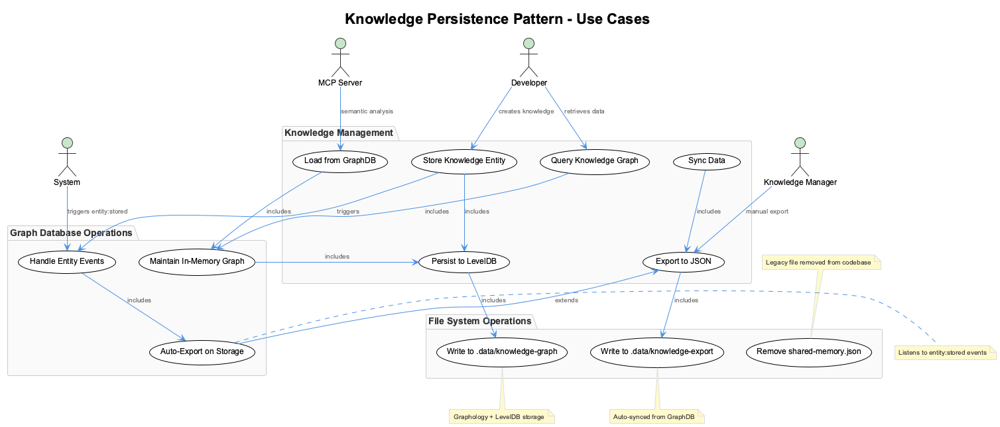

# KnowledgePersistencePattern

**Type:** GraphDatabase

KnowledgePersistencePattern is implemented across: src/knowledge-management, lib/ukb-unified, integrations/mcp-server-semantic-analysis/src

# KnowledgePersistencePattern: Architecture Analysis

## Core Purpose & Problem Domain

The KnowledgePersistencePattern represents a sophisticated dual-persistence architecture designed to solve the fundamental tension between performance and durability in knowledge management systems. At its core, this pattern addresses the challenge of maintaining fast, graph-based knowledge operations while ensuring data persistence and providing multiple access paradigms for different use cases.

The pattern emerged from the need to move beyond simple shared-memory approaches (evidenced by the removal of `shared-memory.json`) toward a more robust, scalable knowledge storage solution that can support both real-time graph operations and traditional file-based integrations.

## Architectural Patterns & Design Philosophy

### Hybrid Persistence Architecture

The system employs a sophisticated hybrid approach combining in-memory graph databases with persistent storage. This design reflects a clear understanding that knowledge management systems require both the performance characteristics of in-memory operations and the reliability of persistent storage. The architecture uses Graphology for in-memory graph operations backed by LevelDB for persistence, creating a write-through cache pattern at the database level.

### Event-Driven Synchronization

The implementation demonstrates an event-driven architecture through the `GraphKnowledgeExporter` component, which listens to `entity:stored` events. This decoupled approach ensures that JSON exports remain synchronized without creating tight coupling between the graph database operations and the export functionality. This pattern enables extensibility—additional listeners can be added without modifying core persistence logic.

### Multi-Format Knowledge Representation

The dual-output approach (GraphDB at `.data/knowledge-graph` and JSON exports at `.data/knowledge-export`) reveals a deliberate design decision to support multiple consumption patterns. The graph format optimizes for relationship traversal and complex queries, while JSON exports provide compatibility with traditional tooling and external integrations.

## Implementation Architecture & Component Design

### Core Service Layer

The `GraphDatabaseService` acts as the primary abstraction layer, encapsulating the complexity of managing both in-memory and persistent storage. This service likely implements a unified interface that abstracts the underlying Graphology + LevelDB complexity, providing clean separation between the knowledge management logic and storage implementation details.

### Persistence Agent Pattern

The `PersistenceAgent` component suggests an agent-based architecture where persistence operations are delegated to specialized components. This pattern enables sophisticated persistence strategies, potentially including batching, conflict resolution, and transaction management, while keeping the main knowledge management logic clean and focused.

### Export Automation Pipeline

The automatic synchronization from GraphDB to JSON exports represents a sophisticated data pipeline architecture. The `GraphKnowledgeExporter` component implements a reactive pattern that ensures data consistency across multiple representations without manual intervention or polling mechanisms.

## Integration & System Boundaries

### Cross-Module Architecture

The implementation spans multiple architectural layers (`src/knowledge-management`, `lib/ukb-unified`, `integrations/mcp-server-semantic-analysis/src`), indicating a carefully designed separation of concerns. The knowledge management layer handles core operations, the unified library provides shared abstractions, and the integration layer handles external protocol compliance (MCP server).

### Semantic Analysis Integration

The integration with semantic analysis infrastructure suggests that this persistence pattern is not merely a storage solution but part of a larger knowledge processing pipeline. The pattern likely supports the storage and retrieval of semantically analyzed knowledge entities, maintaining relationships and context that pure document storage cannot provide.

## Scalability Considerations

### Storage Scalability

The LevelDB backing provides horizontal scalability through its LSM-tree architecture, while the Graphology in-memory layer ensures that query performance remains consistent regardless of dataset size (within memory constraints). This hybrid approach allows the system to scale both in terms of data volume and query complexity.

### Processing Scalability

The event-driven export mechanism provides natural scalability for write operations. Multiple export formats or destinations can be added without impacting core persistence performance, and the asynchronous nature of the event system prevents export operations from blocking knowledge storage operations.

### Memory Management Implications

The in-memory graph approach requires careful consideration of memory usage patterns. The system must implement intelligent caching and eviction strategies, particularly for large knowledge graphs. The persistent backing ensures that memory constraints don't result in data loss, but performance degradation is a concern that must be monitored.

## Maintainability & Evolution Assessment

### Component Isolation

The clear separation between graph operations, persistence management, and export functionality creates maintainable boundaries. Each component can evolve independently, and the event-driven interfaces provide stable contracts that resist breaking changes.

### Technology Abstraction

The service-layer architecture abstracts the specific choice of Graphology and LevelDB, making it possible to migrate to alternative technologies without affecting higher-level code. This abstraction is crucial for long-term maintainability as the knowledge management requirements evolve.

### Observability & Debugging

The event-driven architecture provides natural points for monitoring and debugging. The `entity:stored` events create an audit trail of knowledge operations, and the dual-storage approach provides multiple verification points for data integrity validation.

### Extension Points

The pattern's architecture naturally supports extension through additional event listeners, alternative export formats, and pluggable persistence backends. This extensibility ensures that the system can adapt to changing requirements without requiring architectural rewrites.

## Diagrams

### Architecture

### Sequence

### Class

### Use cases

---

*Generated from 12 observations*
