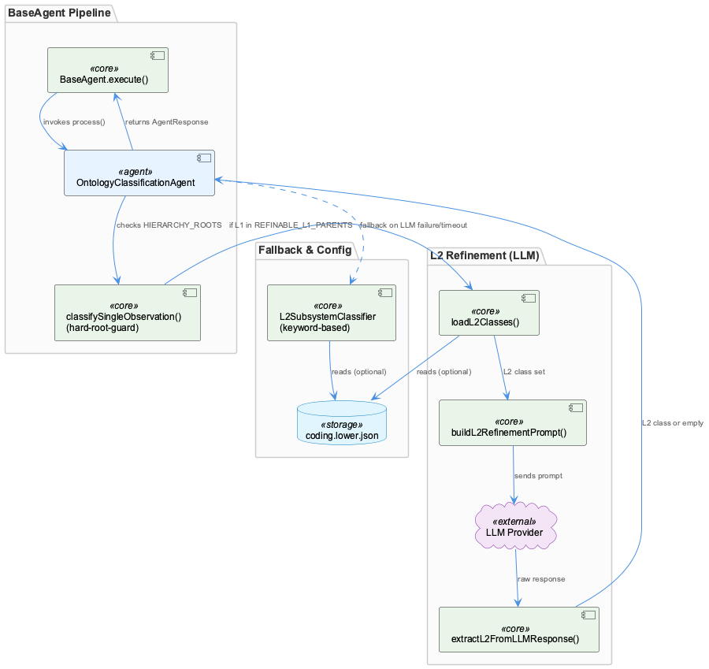
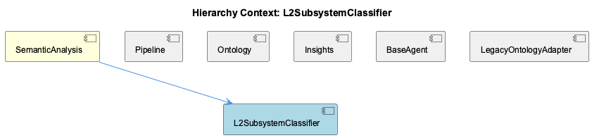

# L2SubsystemClassifier

**Type:** SubComponent

[LLM] Because L2 refinement sits downstream of BaseAgent's standard execute() pipeline (process() -> calculateConfidence() -> detectIssues() -> generateRouting() -> applyCorrections() -> buildMetadata()), any L2 classification result produced by ontology-classification-agent.ts still has to pass back through the shared confidence/issue-detection/routing machinery common to all agents. This means L2 refinement doesn't get its own bespoke confidence model — it inherits the same AgentResponse envelope and retry/escalation semantics as heuristic or hard-guard classifications, which simplifies the workflow-runner's handling but also means L2-specific failure modes (e.g. a bad regex match) surface through generic confidence/issue fields rather than dedicated L2 diagnostics.

# L2SubsystemClassifier — Technical Insight Document

## What It Is

L2SubsystemClassifier is implemented primarily as a deterministic keyword-based fallback classifier in `l2-subsystem-classifier.ts`, working in tandem with an LLM-driven refinement flow housed in `ontology-classification-agent.ts`. As a SubComponent of the parent SemanticAnalysis pipeline, it exists to refine the generic L1 classification buckets (Component, SubComponent, Detail) produced upstream into more specific, project-defined subsystem classes declared in `coding.lower.json`. It does not operate independently of the ontology classification machinery — rather, it is a second, optional refinement pass layered on top of classification decisions already made elsewhere in the pipeline.

## Architecture and Design

The defining architectural pattern is strategy/fallback: an LLM-backed refinement path attempts to produce a precise L2 subsystem class, while `l2-subsystem-classifier.ts` provides a deterministic keyword-based fallback that guarantees the pipeline can still emit an L2 class (or an empty result) even when the LLM call fails, times out, or `coding.lower.json` is absent. This directly embodies the project's "graceful degradation" design philosophy — classification failures degrade gracefully rather than throwing.

A guard-clause/allow-list pattern restricts refinement scope via `REFINABLE_L1_PARENTS = ['Component', 'SubComponent', 'Detail']`. Critically, this is layered strictly *after* the hard-coded `HIERARCHY_ROOTS` short-circuit in `OntologyClassificationAgent.classifySingleObservation()` (which handles CollectiveKnowledge, Coding, DynArch, Timeline, Normalisa via `classificationMethod='hard-root-guard'`). This two-tier layering — hard guard first, optional flexible refinement second — is a deliberate design decision ensuring L2 refinement can never contradict or destabilize the root-guard's LLM-drift protections. The sibling Ontology component (OntologyClassificationAgent) owns this hard-guard behavior, tested explicitly in `ontology-classification-agent.hierarchy-roots.test.ts`.

The refinement logic itself is decomposed into pure functions rather than a monolithic method, reflecting a testability-first architectural stance shared across the codebase's extensive `node:test` suites.

## Implementation Details

The LLM refinement path decomposes into three independently-testable pure functions: `loadL2Classes()`, `buildL2RefinementPrompt()`, and `extractL2FromLLMResponse()`. This decomposition allows each stage to be unit-tested against tmpdir-isolated ontology fixtures without invoking the full agent pipeline or mocking LLM calls per test case.

`extractL2FromLLMResponse()` deserves particular attention: it applies token-boundary regex matching (via `escapeRegex` plus word-boundary constructs) rather than naive substring/`includes()` matching. This defensive-parsing choice explicitly prevents false positives — e.g., a response mentioning "SuperEtmDaemonX" must not be mis-parsed as resolving to the known L2 class "EtmDaemon." The trade-off favors correctness over implementation simplicity, since silent misclassification is judged worse than an unmatched, empty result.

`loadL2Classes()` treats `coding.lower.json` as optional, hot-loadable configuration rather than a compiled-in constant — returning an empty set when the file is missing, which cascades into an empty L2 refinement result rather than an agent-level error. This makes L2 refinement effectively opt-in per project/ontology.

## Integration Points

L2 refinement sits downstream of, and is fully subordinate to, the shared BaseAgent execution pipeline (`execute() -> process() -> calculateConfidence() -> detectIssues() -> generateRouting() -> applyCorrections() -> buildMetadata()`), the same template-method pipeline used by all agents extending BaseAgent, including its sibling SemanticAnalysisAgent. Any L2 classification result produced through `ontology-classification-agent.ts` must still pass through this shared confidence/issue-detection/routing machinery — it inherits the standard AgentResponse envelope and retry/escalation semantics rather than receiving a bespoke confidence model.

Within its parent SemanticAnalysis pipeline, L2SubsystemClassifier depends on the hierarchy-root guard logic owned by the Ontology sibling to have already filtered out closed-set hierarchy roots, and it depends on the presence of `coding.lower.json` as its configuration source. It has no dependency relationship with unrelated "agent" concepts elsewhere in the codebase (e.g., the coding CLI's per-tool launch configs), a naming collision noted distinctly from this SubComponent's actual implementation.

## Usage Guidelines

Developers extending or invoking L2 refinement should understand that it only fires for the three generic L1 classes — Component, SubComponent, and Detail — and must never be made to override HIERARCHY_ROOTS decisions; any such change would violate the layering invariant that protects against LLM drift. When adding new subsystem classes, populate `coding.lower.json` rather than hard-coding classes into `l2-subsystem-classifier.ts`, preserving the configuration-driven, opt-in nature of this feature. When modifying `extractL2FromLLMResponse()`, preserve word-boundary matching semantics — reverting to substring matching would reintroduce false-positive misclassification risk. Because L2-specific failures surface only through generic confidence/issue fields rather than dedicated L2 diagnostics, developers debugging misclassifications should inspect the AgentResponse envelope's confidence/issue-detection output rather than expecting L2-specific error channels. Finally, favor the existing pure-function decomposition pattern (`loadL2Classes`, `buildL2RefinementPrompt`, `extractL2FromLLMResponse`) when adding new refinement logic, to maintain testability with tmpdir-isolated fixtures.

## Hierarchy Context

### Parent
- [SemanticAnalysis](./SemanticAnalysis.md) -- SemanticAnalysis is a multi-agent pipeline (integrations/semantic-analysis/src/agents/) that processes git history and LSL session data to extract, classify, and persist structured knowledge entities into the ontology-backed knowledge graph. It orchestrates specialized agents extending BaseAgent (base-agent.ts) which wrap agent-specific logic in a standardized AgentResponse envelope, computing confidence breakdowns, detecting issues, and generating routing suggestions for retry/escalation between workflow steps.

At its core, OntologyClassificationAgent (ontology-classification-agent.ts) assigns ontology metadata (class, confidence, method) to observations by combining heuristic classifiers, an LLM-backed OntologyClassifier, and hard-coded hierarchy-root guards for closed-set entities (CollectiveKnowledge, Coding, DynArch, Timeline, Normalisa) imported from @fwornle/km-core's HIERARCHY_ROOTS. A newer L2 refinement layer (Phase 57/60) further refines generic L1 classes (Component/SubComponent/Detail) into specific subsystem classes declared in coding.lower.json, using pure, independently-testable helper functions (loadL2Classes, buildL2RefinementPrompt, extractL2FromLLMResponse) alongside a deterministic keyword-based fallback classifier (l2-subsystem-classifier.ts).

The SemanticAnalysisAgent (semantic-analysis-agent.ts) performs the actual code/git/vibe cross-analysis, reading files from git history, computing complexity metrics and architectural pattern detection, and invoking an LLM (via @rapid/llm-proxy's LLMService) to generate deeper semantic insights that are merged with heuristically-detected patterns. The pipeline emphasizes testability (extensive node:test suites with tmpdir-isolated ontology fixtures) and graceful degradation (e.g., absent coding.lower.json yields empty L2 refinement rather than errors), reflecting an incremental, plan-driven development process (Phase 42/57/60 markers throughout the code).

### Siblings
- [Pipeline](./Pipeline.md) -- Pipeline agents extend BaseAgent (base-agent.ts) so each stage wraps its output in a standardized AgentResponse envelope with confidence breakdowns.
- [Ontology](./Ontology.md) -- OntologyClassificationAgent (ontology-classification-agent.ts) combines heuristic classifiers, an LLM-backed OntologyClassifier, and hard-coded hierarchy-root guards.
- [Insights](./Insights.md) -- [CGR] INSIGHTS (class) in kb-ab-sample-tasks.mjs
- [BaseAgent](./BaseAgent.md) -- [LLM] The code files supplied for this analysis (config/agents/copilot.sh, config/agents/opencode.sh, config/agents/pi.sh, config/agents/pi-extensions/no-unbounded-fs-scan.ts, integrations/system-health-dashboard/src/components/agent-badge.tsx) do not correspond to the parent-context description of BaseAgent (integrations/semantic-analysis/src/agents/base-agent.ts) and its execute() -> process() -> calculateConfidence() -> detectIssues() -> generateRouting() -> applyCorrections() -> buildMetadata() pipeline. There is a naming collision between two unrelated 'agent' concepts in this codebase: (1) semantic-analysis's BaseAgent subclasses (OntologyClassificationAgent, SemanticAnalysisAgent) that process observations into knowledge-graph entities, and (2) the top-level 'coding' CLI wrapper's per-tool agent launch configs (copilot/opencode/pi) that configure how a human-facing coding assistant CLI is started, proxied, and instrumented. No code_graph data was provided, so no [LLM+CGR] observations can be made; all statements below are grounded in the literal file contents shown, not in the BaseAgent class itself.
- [LegacyOntologyAdapter](./LegacyOntologyAdapter.md) -- [CGR] LegacyOntologyAdapter (class) in LegacyOntologyAdapter.ts

---

*Generated from 9 observations*
