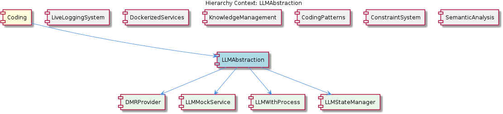
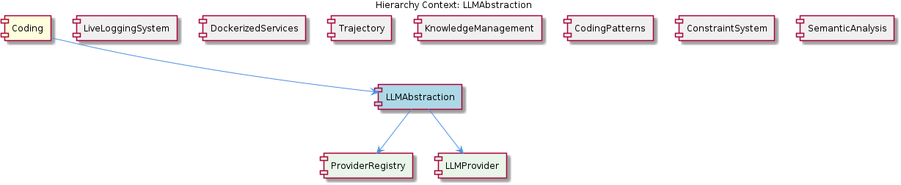

# LLMAbstraction

**Type:** Component

[LLM] The LLMAbstraction component's support for multiple LLM providers is a key aspect of its architecture, enabling developers to choose the provider that best suits their specific needs and requirements. The component's provider-agnostic approach, combined with its use of dependency injection and caching, makes it an ideal solution for applications that require a high degree of flexibility and customizability. The component's design decisions, such as the use of a provider registry and a circuit breaker, demonstrate a clear understanding of the challenges and complexities involved in integrating multiple LLM providers. By providing a unified interface for LLM operations, the component simplifies the development process and enables developers to focus on building applications that leverage the capabilities of LLM providers, rather than worrying about the underlying implementation details.

## What It Is  

The **LLMAbstraction** component lives under the `lib/llm/` folder of the codebase and is the canonical façade for all Large‑Language‑Model (LLM) interactions in the project. Its entry point is the **LLMService** class defined in `lib/llm/llm-service.ts`.  The service delegates work to concrete provider implementations that live alongside it, for example `lib/llm/providers/anthropic-provider.ts` and `lib/llm/providers/dmr-provider.ts`.  A central **ProviderRegistry** (`lib/llm/provider-registry.js`) holds the set of available providers, while auxiliary concerns such as budget tracking, sensitivity classification, and quota enforcement are injected into the service at construction time.  The component also ships a mock implementation (`integrations/mcp-server-semantic-analysis/src/mock/llm-mock-service.ts`) that is used by the test harnesses of sibling components like **SemanticAnalysis** and **CodingPatterns**.  

Together, these files give the system a single, provider‑agnostic surface for “ask the LLM” while allowing the rest of the **Coding** parent hierarchy (LiveLoggingSystem, DockerizedServices, Trajectory, KnowledgeManagement, ConstraintSystem, SemanticAnalysis) to remain oblivious to the particulars of any individual LLM vendor.

---

## Architecture and Design  

LLMAbstraction follows a **registry‑based provider model**.  The `ProviderRegistry` maintains a map of provider identifiers to concrete provider classes.  When `LLMService` receives a request, it looks up the appropriate provider in the registry and forwards the call.  This design decouples the service from any single vendor and makes adding a new provider as simple as implementing the provider interface and registering it – a pattern explicitly highlighted in Observation 1.

Resilience is addressed with a **Circuit Breaker** (`lib/llm/circuit-breaker.js`).  Each provider is monitored for error rates; once a configurable threshold is crossed the breaker trips, short‑circuiting further calls to that provider and allowing the rest of the system to continue operating.  The breaker’s reset timeout is also configurable, giving operators fine‑grained control over recovery behavior (Observation 2).

The component relies heavily on **Dependency Injection** (DI).  `LLMService` receives its budget tracker, sensitivity classifier, and quota manager as constructor arguments (Observation 3).  This makes the service highly composable: a consumer can swap the default budget tracker for a custom implementation without touching the core service code, and it also simplifies unit testing because each dependency can be replaced with a mock or stub.

Performance is boosted through a **Cache‑aside layer** embedded in `LLMService`.  Responses from each provider are cached separately, keyed by provider identifier and request payload (Observation 4).  The cache is configurable, allowing downstream developers to tune TTLs or storage back‑ends to match their workload.

Finally, the **MockLLMService** (`integrations/mcp-server-semantic-analysis/src/mock/llm-mock-service.ts`) provides a test double that mimics the behaviour of a real LLM provider while generating deterministic data.  This mock is used by sibling components (e.g., SemanticAnalysis) to validate error‑handling paths without incurring external API costs (Observation 5).

Overall, the architecture is a **layered façade**: the outer LLMService API, an internal provider registry, resilience and performance layers (circuit breaker, cache), and injected cross‑cutting concerns (budget, quota, classification).  The design mirrors the needs of the broader **Coding** parent component, which hosts multiple independent services that all require reliable, configurable LLM access.

---

## Implementation Details  

* **Provider Registry (`lib/llm/provider-registry.js`)** – Exposes `registerProvider(name, providerClass)` and `getProvider(name)`.  The file imports concrete providers such as `AnthropicProvider` (`lib/llm/providers/anthropic-provider.ts`) and `DMRProvider` (`lib/llm/providers/dmr-provider.ts`) and registers them at module load time.  The registry is a plain JavaScript object that the rest of the system treats as a read‑only source of truth.

* **LLMService (`lib/llm/llm-service.ts`)** – Implements the public API (`generate`, `chat`, `embed`, etc.).  In its constructor it receives:
  * `providerRegistry` – the singleton from the registry file.
  * `budgetTracker` – an object that records token usage and cost.
  * `sensitivityClassifier` – used to flag or redact unsafe content.
  * `quotaTracker` – enforces per‑user or per‑application limits.
  * `cache` – an optional cache interface (e.g., in‑memory LRU or Redis).  
  When a request arrives, the service:
  1. Checks the cache; a hit returns the cached response immediately.
  2. Looks up the target provider via the registry.
  3. Wraps the call with the **circuit breaker** (`circuitBreaker.execute(() => provider.call(...))`).
  4. Updates the budget and quota trackers after a successful call.
  5. Stores the response in the cache for future reuse.

* **Circuit Breaker (`lib/llm/circuit-breaker.js`)** – Implements the classic three‑state model (CLOSED, OPEN, HALF‑OPEN).  It tracks recent error counts per provider; when the error count exceeds `threshold` the breaker transitions to OPEN and rejects further calls with a fast‑fail error.  After `resetTimeout` milliseconds it moves to HALF‑OPEN, allowing a trial request to test recovery.  All thresholds and timeouts are exposed via a configuration object, making the behaviour tunable per deployment.

* **Caching** – The cache key is derived from a deterministic serialization of the provider name and request payload.  Because each provider may have different rate limits or latency profiles, the cache is **provider‑scoped**; a response from Anthropic does not pollute the cache for DMR.  The cache implementation is abstracted behind an interface so that developers can plug in Redis, Memcached, or a simple in‑process map.

* **MockLLMService (`integrations/mcp-server-semantic-analysis/src/mock/llm-mock-service.ts`)** – Provides the same method signatures as `LLMService` but returns canned or randomly generated data.  It also simulates latency and error conditions (e.g., forced timeouts) to let integration tests verify the circuit breaker and retry logic.  The mock is registered in the ProviderRegistry under a special name (e.g., `"mock"`), allowing any component to switch to it via configuration.

* **BudgetTracker (child component)** – Though not directly visible in the observations, it is referenced as a consumer of the ProviderRegistry.  It likely subscribes to provider usage events emitted by `LLMService` and aggregates cost information per‑provider, exposing alerts when budgets are exceeded.

* **Provider Implementations** – Each provider class implements a common interface (e.g., `IProvider` with methods like `call(request)`).  They encapsulate vendor‑specific authentication, endpoint URLs, and request formatting.  Because the registry holds only the class, the service can instantiate a provider lazily, reducing startup overhead.

---

## Integration Points  

* **Parent – Coding** – LLMAbstraction is one of eight major components under the root **Coding** node.  All sibling components that need LLM capabilities (LiveLoggingSystem, SemanticAnalysis, CodingPatterns, etc.) import `LLMService` from `lib/llm/llm-service.ts`.  The parent project’s configuration layer (often a `config/*.json` or environment variables) supplies the concrete implementations for the injected dependencies (budget tracker, quota manager, etc.).

* **Sibling Interaction** –  
  * **LiveLoggingSystem** uses the OntologyClassificationAgent, which in turn may call `LLMService` to enrich logs with semantic tags.  
  * **CodingPatterns** employs lazy initialization (`ensureLLMInitialized()`) that ultimately resolves to a call to `LLMService`.  
  * **SemanticAnalysis** runs integration tests against the `MockLLMService` to validate its agents without external calls.

* **Children – ProviderRegistry, LLMService, BudgetTracker** – The `ProviderRegistry` is the single source of truth for all provider classes.  `LLMService` is the façade that the rest of the system consumes.  `BudgetTracker` (though defined elsewhere) hooks into the service’s usage callbacks to enforce cost limits.

* **External Dependencies** – Each concrete provider reaches out to an external LLM vendor (Anthropic, DMR, etc.).  The circuit breaker shields the rest of the system from provider‑specific outages.  The caching layer may depend on a Redis instance if configured, but the abstraction allows a simple in‑process cache for development environments.

* **Configuration Interface** – The component reads a configuration object (likely from `process.env` or a JSON file) that specifies:
  * Which providers are enabled and their credentials.
  * Circuit‑breaker thresholds (`errorThreshold`, `resetTimeout`).
  * Cache TTLs and backend selection.
  * Budget limits per provider.

---

## Usage Guidelines  

1. **Prefer the Registry for Provider Selection** – When you need to target a specific vendor, pass its registered name to `LLMService`.  Do not instantiate provider classes directly; let the registry manage lifecycles.

2. **Inject Custom Dependencies via Constructor** – If your application has a bespoke budgeting model or a specialized sensitivity classifier, create an object that adheres to the expected interface and inject it when constructing `LLMService`.  This keeps the core service unchanged and maintains testability.

3. **Leverage the Cache for High‑Throughput Scenarios** – For repetitive prompts (e.g., template‑based code generation), enable caching and tune the TTL to balance freshness against cost.  Remember that the cache is provider‑scoped; identical prompts to different providers will be cached separately.

4. **Configure the Circuit Breaker Thoughtfully** – Set the error threshold low enough to catch flaky provider behaviour early, but high enough to avoid tripping on transient network hiccups.  Adjust `resetTimeout` based on the expected recovery time of the vendor’s API.

5. **Use the Mock Service in CI/CD** – Replace the real provider with the mock (`"mock"` registration) in test environments.  The mock can be configured to emit errors, timeouts, or latency spikes, allowing you to verify that your error‑handling, retry, and circuit‑breaker logic works as intended.

6. **Monitor Budget and Quota** – Hook into the `budgetTracker` events to surface cost warnings in your observability dashboards.  If a quota is reached, `LLMService` will reject further calls; ensure your callers handle this gracefully (e.g., fallback to a cheaper provider or degrade functionality).

---

### Architectural patterns identified  

| Pattern | Evidence |
|---------|----------|
| **Provider Registry (Registry pattern)** | `lib/llm/provider-registry.js` holds a map of provider classes; providers are added via registration. |
| **Circuit Breaker** | `lib/llm/circuit-breaker.js` implements threshold‑based failure detection and reset logic. |
| **Dependency Injection** | `LLMService` receives `budgetTracker`, `sensitivityClassifier`, `quotaTracker` via its constructor (Observation 3). |
| **Cache‑Aside** | `LLMService` checks a cache before invoking a provider and stores the response after a hit (Observation 4). |
| **Mock/Test Double** | `integrations/mcp-server-semantic-analysis/src/mock/llm-mock-service.ts` supplies a fake provider for testing (Observation 5). |

### Design decisions and trade‑offs  

* **Provider‑agnostic façade** – Gains extensibility (easy to add new vendors) at the cost of a slightly more complex initialization path (registry + DI).  
* **Circuit breaker per provider** – Improves resilience; however, it introduces stateful error tracking that must be persisted or reset appropriately in a distributed deployment.  
* **Caching per provider** – Reduces latency and cost, but stale data can appear if a provider’s model updates; developers must balance TTLs.  
* **Dependency injection** – Enables custom behaviour and testability, but requires consumers to understand the required interfaces and supply them, adding boilerplate.  
* **Mock service** – Allows fast, deterministic tests, yet it cannot capture all nuances of real provider latency or error patterns; integration tests against live providers remain necessary.

### System structure insights  

* **Layered hierarchy** – `Coding` (root) → `LLMAbstraction` (component) → children (`ProviderRegistry`, `LLMService`, `BudgetTracker`).  
* **Shared infrastructure** – Sibling components reuse the same LLM façade, ensuring a consistent contract across the codebase.  
* **Cross‑cutting concerns** (budget, quota, sensitivity) are externalised via DI, keeping the core service thin.  
* **Resilience and performance layers** (circuit breaker, cache) sit between the service façade and the concrete providers, providing a uniform safety net regardless of provider health.

### Scalability considerations  

* **Horizontal scaling** – Because `LLMService` is stateless aside from the cache and circuit‑breaker state, multiple instances can be run behind a load balancer.  The cache should be externalized (Redis, Memcached) to keep state shared across instances.  
* **Provider count** – Adding new providers does not affect existing request paths; the registry lookup is O(1).  However, each provider adds its own circuit‑breaker state, which must be replicated or sharded if the system scales out.  
* **Budget & quota enforcement** – These trackers may become bottlenecks if they rely on a single in‑process store; moving them to a distributed datastore (e.g., DynamoDB) would preserve correctness at scale.  
* **Circuit‑breaker configuration** – In a high‑traffic environment, thresholds may need to be higher to avoid premature tripping due to bursty traffic spikes.

### Maintainability assessment  

* **High modularity** – Clear separation between provider registration, service façade, resilience, and caching makes the codebase easy to navigate and modify.  
* **Extensibility** – New providers are added by implementing a small interface and registering the class; no changes to `LLMService` are required.  
* **Testability** – DI and the `MockLLMService` enable unit and integration tests without external API calls, reducing flakiness.  
* **Configuration‑driven** – Most behavioural knobs (circuit‑breaker thresholds, cache TTL, budget limits) are externalized, allowing ops teams to tune without code changes.  
* **Potential technical debt** – The circuit‑breaker and cache state are currently in‑process (as per observations).  If the component is later containerized (as other siblings are in DockerizedServices), this state will need to be externalized to avoid loss on container restart.  Monitoring of the registry and provider health also requires additional tooling to stay maintainable at scale.

---  

**In summary**, LLMAbstraction provides a clean, provider‑agnostic interface for all LLM interactions across the **Coding** ecosystem.  Its registry‑based provider model, circuit‑breaker resilience, dependency‑injected cross‑cutting services, and configurable caching together form a robust, extensible foundation that can evolve as new LLM vendors appear while remaining testable and maintainable.

## Diagrams

### Relationship

## Architecture Diagrams

## Hierarchy Context

### Parent
- [Coding](./Coding.md) -- Root node of the coding project knowledge hierarchy, encompassing all development infrastructure knowledge. The project consists of 8 major components: LiveLoggingSystem: [LLM] The LiveLoggingSystem component utilizes the OntologyClassificationAgent, which is defined in the integrations/mcp-server-semantic-analysis/src/; LLMAbstraction: [LLM] The LLMAbstraction component is designed with a provider-agnostic approach, allowing for seamless integration of multiple Large Language Model (; DockerizedServices: [LLM] The DockerizedServices component employs a modular architecture, with each service running in its own container. This is evident in the docker-c; Trajectory: [LLM] The Trajectory component's use of asynchronous programming is evident in the SpecstoryAdapter class, specifically in the connectViaHTTP function; KnowledgeManagement: [LLM] The KnowledgeManagement component utilizes a GraphDatabaseAdapter for storing and managing knowledge graphs. This adapter, implemented in storag; CodingPatterns: [LLM] The CodingPatterns component utilizes a lazy initialization approach for LLM services, which is evident in the ensureLLMInitialized() method wit; ConstraintSystem: [LLM] The ConstraintSystem component's modular architecture allows for a clear separation of concerns, with each sub-component interacting through wel; SemanticAnalysis: [LLM] The SemanticAnalysis component utilizes a modular architecture with multiple agents, each responsible for a specific task, such as the OntologyC.

### Children
- [BudgetTracker](./BudgetTracker.md) -- The lib/llm/provider-registry.js file maintains a registry of providers, enabling easy addition or removal of providers, which is used by the BudgetTracker to track costs.
- [ProviderRegistry](./ProviderRegistry.md) -- The lib/llm/provider-registry.js file maintains a registry of providers, enabling easy addition or removal of providers.
- [LLMService](./LLMService.md) -- The LLMService class (lib/llm/llm-service.ts) serves as the main entry point for all LLM operations, routing requests to the appropriate provider based on the registry.

### Siblings
- [LiveLoggingSystem](./LiveLoggingSystem.md) -- [LLM] The LiveLoggingSystem component utilizes the OntologyClassificationAgent, which is defined in the integrations/mcp-server-semantic-analysis/src/agents/ontology-classification-agent.ts file, for classifying observations against the ontology system. This agent is crucial in providing a standardized way of categorizing and understanding the interactions within the Claude Code conversations. The OntologyClassificationAgent follows a specific constructor and initialization pattern to ensure proper setup of the ontology system and classification capabilities. For instance, the agent initializes the ontology system by loading the necessary configuration files and setting up the classification models. This is evident in the code, where the constructor of the OntologyClassificationAgent class calls the initOntologySystem method, which in turn loads the configuration files and sets up the classification models.
- [DockerizedServices](./DockerizedServices.md) -- [LLM] The DockerizedServices component employs a modular architecture, with each service running in its own container. This is evident in the docker-compose.yaml file, where separate services such as the constraint monitoring API server and the dashboard server are defined. The use of Docker Compose for container orchestration allows for efficient resource utilization and easy maintenance. For instance, the constraint monitoring API server is defined in the scripts/api-service.js file, which utilizes environment variables and configuration files for customizable settings.
- [Trajectory](./Trajectory.md) -- [LLM] The Trajectory component's use of asynchronous programming is evident in the SpecstoryAdapter class, specifically in the connectViaHTTP function in lib/integrations/specstory-adapter.js, which establishes a connection to the Specstory service via HTTP. This asynchronous approach allows the component to handle multiple tasks concurrently, improving overall performance and responsiveness. The connectViaHTTP function is a prime example of this, as it uses callbacks to handle the connection establishment process. Furthermore, the SpecstoryAdapter class's implementation of the initialize function, which attempts connections to the Specstory service using different methods, demonstrates the component's ability to adapt to various connection scenarios.
- [KnowledgeManagement](./KnowledgeManagement.md) -- [LLM] The KnowledgeManagement component utilizes a GraphDatabaseAdapter for storing and managing knowledge graphs. This adapter, implemented in storage/graph-database-adapter.ts, enables Graphology+LevelDB persistence with automatic JSON export sync. By using this adapter, the component can efficiently store and query knowledge graphs, which are essential for entity persistence and knowledge decay tracking. Furthermore, the GraphDatabaseAdapter employs a lock-free architecture to prevent LevelDB lock conflicts, ensuring that the component can handle multiple concurrent requests without performance degradation.
- [CodingPatterns](./CodingPatterns.md) -- [LLM] The CodingPatterns component utilizes a lazy initialization approach for LLM services, which is evident in the ensureLLMInitialized() method within the base-agent.ts file. This method ensures that the LLM service is only initialized when it is actually needed, thus optimizing resource usage and improving performance. Furthermore, the use of lazy initialization allows for more flexibility in the component's design, as it enables the creation of agents that can be used with or without LLM services. The ensureLLMInitialized() method is typically called within the constructor of the agent classes, such as the CodeGraphAgent class in integrations/mcp-server-semantic-analysis/src/agent/code-graph-agent.ts, to guarantee that the LLM service is properly initialized before the agent's execution.
- [ConstraintSystem](./ConstraintSystem.md) -- [LLM] The ConstraintSystem component's modular architecture allows for a clear separation of concerns, with each sub-component interacting through well-defined interfaces. For instance, the ContentValidationAgent (integrations/mcp-server-semantic-analysis/src/agents/content-validation-agent.ts) interacts with the GraphDatabaseAdapter for graph database persistence and semantic analysis. This modular design enables easier maintenance and updates to individual components without affecting the overall system. Furthermore, the HookConfigLoader (lib/agent-api/hooks/hook-config.js) loads and merges hook configurations from user-level and project-level sources, applying project config overrides. This design decision allows for flexible configuration management and customization of hook behaviors.
- [SemanticAnalysis](./SemanticAnalysis.md) -- [LLM] The SemanticAnalysis component utilizes a modular architecture with multiple agents, each responsible for a specific task, such as the OntologyClassificationAgent, SemanticAnalysisAgent, and ContentValidationAgent. For instance, the OntologyClassificationAgent, defined in integrations/mcp-server-semantic-analysis/src/agents/ontology-classification-agent.ts, is used for classifying observations against the ontology system. This agent follows the BaseAgent pattern, providing a standardized structure for agent development, as seen in integrations/mcp-server-semantic-analysis/src/agents/base-agent.ts. The use of this pattern enables easier modification and extension of the agent's functionality, as demonstrated in the implementation of the SemanticAnalysisAgent in integrations/mcp-server-semantic-analysis/src/agents/semantic-analysis-agent.ts.

---

*Generated from 6 observations*
