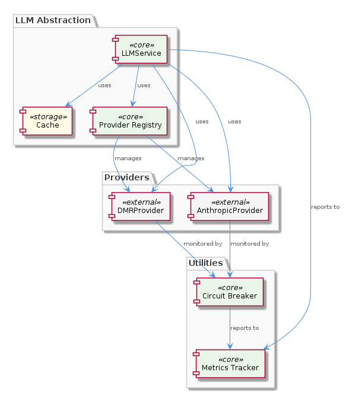

# LLMAbstraction

**Type:** Component

[LLM] The circuit breaker (lib/llm/circuit-breaker.js) is used to detect and prevent cascading failures when a provider becomes unavailable. The circuit breaker monitors the requests made to a provider and detects when the provider becomes unavailable. When a provider becomes unavailable, the circuit breaker prevents further requests from being made to that provider, preventing cascading failures. The circuit breaker includes methods for monitoring requests, detecting failures, and preventing requests. For example, the monitorRequest method in the circuit breaker monitors a request made to a provider and detects when the provider becomes unavailable. The preventRequest method prevents further requests from being made to an unavailable provider.

## What It Is  

The **LLMAbstraction** component is the dedicated façade for every Large‑Language‑Model (LLM) interaction in the codebase. Its core implementation lives in `lib/llm/llm-service.ts`, where the `LLMService` class exposes a single entry point for callers. Internally, `LLMService` orchestrates request routing, in‑memory caching, provider fallback, circuit‑breaking, and metrics collection. The concrete providers that actually talk to a model are housed under `lib/llm/providers/`, the most visible being `dmr-provider.ts` (local Docker Desktop Model Runner) and `anthropic-provider.ts` (remote Anthropic API). A lightweight provider registry (`lib/llm/provider-registry.js`) tracks which providers are available, while auxiliary utilities such as `lib/llm/circuit-breaker.js` and `lib/llm/metrics.js` add resilience and observability.  

LLMAbstraction sits one level beneath the root **Coding** component and shares its modular ethos with sibling components like **LiveLoggingSystem**, **DockerizedServices**, **Trajectory**, **KnowledgeManagement**, **CodingPatterns**, **ConstraintSystem**, and **SemanticAnalysis**. Its child, the `LLMService`, encapsulates the cache object that stores request‑to‑response mappings, reducing duplicate calls across the whole project.

---

## Architecture and Design  

The architecture of LLMAbstraction is deliberately layered. At the top sits the `LLMService` façade, which abstracts away the complexities of individual providers. This façade follows the **Facade pattern**, presenting a uniform API while delegating to the appropriate provider based on mode routing logic.  

Provider selection is mediated by the **Provider Registry** (`lib/llm/provider-registry.js`). The registry implements a **Registry pattern**: providers register themselves, are initialized on demand, and expose an `isAvailable()` check. Before `LLMService` issues a request, it queries the registry to ensure the chosen provider is healthy.  

Resilience is achieved through a classic **Circuit Breaker** (`lib/llm/circuit-breaker.js`). Each provider request is wrapped by `monitorRequest`; if failures exceed a threshold, the breaker trips and subsequent calls are short‑circuited via `preventRequest`. This prevents cascading failures when a provider (e.g., Anthropic) becomes unreachable.  

Observability is handled by the **Metrics Tracker** (`lib/llm/metrics.js`). It records request timestamps, response latencies, and error counts via `trackRequest`, `trackResponse`, and `trackError`. The collected data can be later analyzed with `analyzeData`, providing performance dashboards for the whole LLM stack.  

Caching is implemented as a simple in‑memory object inside `LLMService`. The cache key is derived from the request parameters, and the stored value is the full provider response. This **Cache‑Aside** approach reduces redundant external calls and improves latency for repeat queries.  

Together these patterns produce a **modular, pluggable, and resilient** LLM subsystem that can be extended with new providers without touching the façade logic.

---

## Implementation Details  

### LLMService (`lib/llm/llm-service.ts`)  
- **Cache object**: a plain JavaScript object (`{ [key: string]: any }`). The `makeRequest` method first looks up `cache[requestKey]`; if present and still valid, it returns the cached response.  
- **Mode routing**: based on a `mode` flag (e.g., `"local"` vs `"remote"`), the service picks either `DMRProvider` or `AnthropicProvider`.  
- **Provider fallback**: if the primary provider is unavailable (checked via the registry), the service falls back to the next registered provider, ensuring continuity of service.  

### DMRProvider (`lib/llm/providers/dmr-provider.ts`)  
- **initializeModelRunner**: spins up Docker Desktop’s Model Runner with a model name and configuration supplied through a per‑agent DMR config file.  
- **predict**: forwards the input to the initialized runner and returns the raw model output. Errors during prediction are caught, logged, and re‑thrown to be handled by the circuit breaker.  

### AnthropicProvider (`lib/llm/providers/anthropic-provider.ts`)  
- **createMessage**: builds the JSON payload required by the Anthropic API, embedding content, system prompts, and any temperature or max‑tokens settings.  
- **extractContent**: parses the API response to pull out the generated text, hiding the API‑specific envelope from callers.  
- **Error handling**: network or API errors are logged and surfaced so the circuit breaker can act.  

### Provider Registry (`lib/llm/provider-registry.js`)  
- **registerProvider(name, providerInstance)**: stores the instance in an internal map and calls `providerInstance.initialize()` if the provider defines such a method.  
- **isProviderAvailable(name)**: returns a boolean after invoking the provider’s health‑check routine.  

### Circuit Breaker (`lib/llm/circuit-breaker.js`)  
- **monitorRequest(providerName, fn)**: wraps the actual provider call; on success it resets failure counters, on error it increments them.  
- **preventRequest(providerName)**: when the failure count exceeds a threshold, further calls are short‑circuited and an immediate error is returned.  

### Metrics Tracker (`lib/llm/metrics.js`)  
- **trackRequest(providerName, payload)** records the start time and request metadata.  
- **trackResponse(providerName, response, latency)** logs success and latency.  
- **trackError(providerName, error)** records failure details.  
- **analyzeData()** aggregates the collected metrics, enabling statistical summaries and visualizations (e.g., average latency per provider).  

All of these pieces are wired together in `LLMService`. The service’s request flow can be summarised as:  

1. Build cache key → check cache.  
2. Query provider registry for an available provider.  
3. Pass the request through the circuit breaker.  
4. Invoke the concrete provider (`DMRProvider` or `AnthropicProvider`).  
5. Record metrics, update cache, and return the response.

---

## Integration Points  

- **Parent – Coding**: LLMAbstraction is a child of the overarching **Coding** component, meaning any higher‑level feature that needs language model capabilities (e.g., code generation, documentation assistance) calls `LLMService` directly.  
- **Sibling components**:  
  - **LiveLoggingSystem** consumes LLM responses to enrich logs with contextual explanations.  
  - **DockerizedServices** hosts the LLM Service as part of its micro‑service‑style deployment, leveraging the same façade for consistency across containers.  
  - **Trajectory**, **KnowledgeManagement**, **CodingPatterns**, **ConstraintSystem**, and **SemanticAnalysis** all rely on the same abstraction when they need to query an LLM for reasoning or classification.  
- **Provider registry** is the sole source of truth for which providers are active; any new provider must be added to `provider-registry.js` and expose the same interface (`initialize`, `predict`/`createMessage`, `isAvailable`).  
- **Circuit breaker** and **metrics tracker** are cross‑cutting concerns that other components can also import if they wish to monitor their own LLM‑related calls, but the default path is through `LLMService`.  

---

## Usage Guidelines  

1. **Always go through `LLMService`** – Directly invoking a provider circumvents caching, fallback, and resilience logic.  
2. **Cache key hygiene** – Ensure that request parameters that affect the answer (model name, temperature, system prompt) are part of the cache key; otherwise stale results may be returned.  
3. **Provider selection** – Use the `mode` flag or explicit provider name only when you have a strong reason; otherwise let the registry decide based on availability.  
4. **Handle errors gracefully** – Even with the circuit breaker, a call can still fail (e.g., after the breaker trips). Wrap calls in try/catch and surface user‑friendly messages.  
5. **Metrics awareness** – For performance‑critical paths, monitor the latency reported by `metrics.trackResponse`. If a provider consistently exceeds acceptable thresholds, consider adjusting the fallback order in the registry.  
6. **Extending providers** – To add a new LLM backend, implement the same public methods (`initialize`, `predict` or `createMessage`, `isAvailable`) and register it in `provider-registry.js`. The rest of the system will automatically benefit from caching, circuit breaking, and metrics.  

---

### Architectural patterns identified  

- **Facade pattern** – `LLMService` presents a unified API.  
- **Registry pattern** – `provider-registry.js` centralises provider lifecycle.  
- **Circuit Breaker pattern** – `circuit-breaker.js` isolates failing providers.  
- **Cache‑Aside pattern** – Simple in‑memory cache inside `LLMService`.  
- **Observer/Telemetry pattern** – `metrics.js` records and analyses usage data.  

### Design decisions and trade‑offs  

- **In‑memory cache** is fast but process‑local; it does not survive restarts and cannot be shared across multiple service instances. The trade‑off is simplicity versus distributed cache complexity.  
- **Provider fallback** improves availability but may introduce latency when the primary provider is down and a secondary (often slower) provider is used.  
- **Circuit breaker thresholds** are hard‑coded (as observed) – they provide safety but may need tuning per provider.  
- **Separate provider modules** keep the codebase modular, allowing independent evolution of local (DMR) and remote (Anthropic) backends.  

### System structure insights  

LLMAbstraction is a thin, well‑encapsulated layer that sits between the rest of the **Coding** ecosystem and the concrete LLM backends. Its internal sub‑components (registry, circuit breaker, metrics, cache) are each responsible for a single cross‑cutting concern, yielding a clean separation of concerns.  

### Scalability considerations  

- **Horizontal scaling**: Because the cache is in‑memory, scaling out to multiple instances will duplicate cache entries. If the workload becomes cache‑bound, a distributed cache (e.g., Redis) could be introduced without changing the façade contract.  
- **Provider concurrency**: Both `DMRProvider` (local Docker) and `AnthropicProvider` (remote HTTP) can handle concurrent requests, but the circuit breaker must be thread‑safe; the current implementation appears to rely on JavaScript’s single‑threaded event loop, which scales well for I/O‑bound workloads.  
- **Metrics aggregation**: `metrics.js` collects data locally; for large fleets a centralised metrics sink (Prometheus, etc.) would be needed, but the existing `analyzeData` method provides a clear extension point.  

### Maintainability assessment  

The component’s modular design—clear separation between façade, registry, providers, and cross‑cutting utilities—makes it straightforward to reason about and extend. Adding a new provider only requires implementing a small, well‑defined interface and updating the registry. The use of plain objects for cache and simple function wrappers keeps the codebase approachable for developers familiar with JavaScript/TypeScript. However, the reliance on in‑memory state means that future scaling or persistence requirements will necessitate refactoring of the cache and metrics subsystems, which should be planned early to avoid invasive changes. Overall, the current architecture balances simplicity with resilience, providing a solid foundation for incremental evolution.

## Hierarchy Context

### Parent
- [Coding](./Coding.md) -- Root node of the coding project knowledge hierarchy, encompassing all development infrastructure knowledge. The project consists of 8 major components: LiveLoggingSystem: [LLM] The LiveLoggingSystem component's modular architecture allows for easy extension and modification of agent-specific transcript formats. This is ; LLMAbstraction: [LLM] The LLMAbstraction component utilizes the LLMService class (lib/llm/llm-service.ts) as a single entry point for all LLM operations. This class i; DockerizedServices: [LLM] The DockerizedServices component utilizes a microservices architecture, with each sub-component responsible for a specific service or functional; Trajectory: [LLM] The Trajectory component's architecture is characterized by its use of adapters, such as the SpecstoryAdapter, to connect to different extension; KnowledgeManagement: [LLM] The KnowledgeManagement component utilizes the GraphDatabaseAdapter (integrations/mcp-server-semantic-analysis/src/storage/graph-database-adapte; CodingPatterns: [LLM] The CodingPatterns component utilizes the GraphDatabaseAdapter class in storage/graph-database-adapter.ts for persistence, allowing for automati; ConstraintSystem: [LLM] The ConstraintSystem component utilizes the GraphDatabaseAdapter for persistence, which is implemented in the storage/graph-database-adapter.ts ; SemanticAnalysis: [LLM] The SemanticAnalysis component utilizes a multi-agent system architecture, with agents such as OntologyClassificationAgent, SemanticAnalysisAgen.

### Children
- [LLMService](./LLMService.md) -- LLMService uses a cache object to store and retrieve responses, reducing the need for redundant requests.

### Siblings
- [LiveLoggingSystem](./LiveLoggingSystem.md) -- [LLM] The LiveLoggingSystem component's modular architecture allows for easy extension and modification of agent-specific transcript formats. This is achieved through the use of the TranscriptAdapter, which is implemented in the lib/agent-api/transcript-api.js file. The TranscriptAdapter provides a standardized interface for handling different agent formats, such as Claude Code and Copilot CLI, and converting them to the unified LSL format. For example, the ClaudeCodeTranscriptAdapter class in lib/agent-api/transcripts/claudia-transcript-adapter.js extends the TranscriptAdapter class and provides a specific implementation for handling Claude Code transcripts.
- [DockerizedServices](./DockerizedServices.md) -- [LLM] The DockerizedServices component utilizes a microservices architecture, with each sub-component responsible for a specific service or functionality. For instance, the LLM Service (lib/llm/llm-service.ts) acts as a high-level facade for all LLM operations, handling mode routing, caching, circuit breaking, and provider fallback. This modular design enables efficient and scalable operation, as well as easier maintenance and updates. The Service Starter (lib/service-starter.js) provides robust service startup with retry, timeout, and graceful degradation, using exponential backoff and health verification. This ensures that services are started reliably and with minimal downtime.
- [Trajectory](./Trajectory.md) -- [LLM] The Trajectory component's architecture is characterized by its use of adapters, such as the SpecstoryAdapter, to connect to different extensions and services. This is evident in the lib/integrations/specstory-adapter.js file, where the SpecstoryAdapter class is defined. The component's behavior is defined by its methods, including logConversation and connectViaHTTP, which enable logging and connection to the Specstory extension. For instance, the logConversation method in SpecstoryAdapter (lib/integrations/specstory-adapter.js:134) implements logging functionality, while the createLogger function from ../logging/Logger.js facilitates modular and flexible logging capabilities.
- [KnowledgeManagement](./KnowledgeManagement.md) -- [LLM] The KnowledgeManagement component utilizes the GraphDatabaseAdapter (integrations/mcp-server-semantic-analysis/src/storage/graph-database-adapter.ts) for persisting data in a graph database with automatic JSON export synchronization. This design decision enables efficient storage and retrieval of knowledge entities and relationships, which is crucial for the system's overall goals of knowledge discovery and insight generation. Furthermore, the use of Graphology+LevelDB persistence ensures a scalable and performant solution for managing the knowledge graph.
- [CodingPatterns](./CodingPatterns.md) -- [LLM] The CodingPatterns component utilizes the GraphDatabaseAdapter class in storage/graph-database-adapter.ts for persistence, allowing for automatic JSON export sync. This design decision enables seamless data synchronization and provides a robust foundation for the project's data management. The GraphDatabaseAdapter class is responsible for handling graph data storage and retrieval, making it a critical component of the project's architecture. By using this adapter, the CodingPatterns component can focus on its primary functionality, leaving data management to the GraphDatabaseAdapter.
- [ConstraintSystem](./ConstraintSystem.md) -- [LLM] The ConstraintSystem component utilizes the GraphDatabaseAdapter for persistence, which is implemented in the storage/graph-database-adapter.ts file. This adapter enables the system to store and manage constraints in a graph database, utilizing Graphology and LevelDB for efficient data storage and retrieval. The adapter also features automatic JSON export sync, allowing for seamless data exchange between the graph database and other components. For example, the ContentValidationAgent, located in integrations/mcp-server-semantic-analysis/src/agents/content-validation-agent.ts, relies on the GraphDatabaseAdapter to retrieve and validate entity content against configured rules.
- [SemanticAnalysis](./SemanticAnalysis.md) -- [LLM] The SemanticAnalysis component utilizes a multi-agent system architecture, with agents such as OntologyClassificationAgent, SemanticAnalysisAgent, and CodeGraphAgent, to process git history and LSL sessions. This is evident in the code files, such as integrations/mcp-server-semantic-analysis/src/agents/ontology-classification-agent.ts, integrations/mcp-server-semantic-analysis/src/agents/semantic-analysis-agent.ts, and integrations/mcp-server-semantic-analysis/src/agents/code-graph-agent.ts, which define the respective agents and their responsibilities. The use of multiple agents allows for a modular and scalable design, enabling the processing of large amounts of data and the integration of new agents as needed.

---

*Generated from 6 observations*
