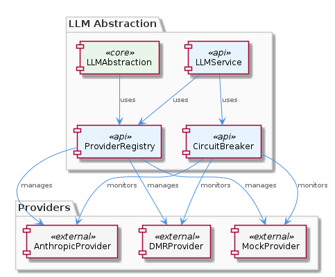

# LLMAbstraction

**Type:** Component

[LLM] The LLMAbstraction component handles mode routing, caching, and circuit breaking through the LLMService class (lib/llm/llm-service.ts). This class serves as the main entry point for all LLM operations, providing a unified interface for interacting with the different LLM providers. The LLMService class uses the provider registry to determine the appropriate provider to use for a given request, and then routes the request to the selected provider. The class also implements caching and circuit breaking mechanisms to optimize performance and reliability. The use of a single entry point for all LLM operations simplifies the component's architecture and makes it easier to manage and maintain.

## What It Is  

The **LLMAbstraction** component lives under the `lib/llm/` directory of the codebase. Its core files are:

* `lib/llm/provider-registry.js` – the central registry that discovers, configures and selects LLM providers.  
* `lib/llm/llm-service.ts` – the public façade that callers use for every LLM operation (routing, caching, circuit‑breaking).  
* `lib/llm/circuit-breaker.js` – a reusable circuit‑breaker implementation that protects the system from provider‑side failures.  
* `lib/llm/config.js` – a YAML‑based configuration loader that feeds the registry with provider settings.  
* Provider implementations such as `lib/llm/providers/anthropic-provider.ts`, `lib/llm/providers/dmr-provider.ts` and the test‑only `lib/llm/providers/mock-provider.js`.

Together these files give the **LLMAbstraction** component a *provider‑agnostic* surface: any LLM service that conforms to the `LLMProvider` contract can be swapped in or out without touching the rest of the system. The component is a child of the top‑level **Coding** node, sharing the same modular philosophy found in sibling components like **LiveLoggingSystem** and **DockerizedServices**. Its own children—**ProviderRegistry** and concrete **LLMProvider** subclasses—encapsulate the extensibility points.



---

## Architecture and Design  

### Provider‑Agnostic Registry  

The architecture hinges on the **ProviderRegistry** (`lib/llm/provider-registry.js`). It reads a YAML configuration (via `loadConfig` in `lib/llm/config.js`) that enumerates available providers, their credentials and any provider‑specific options. By decoupling registration from usage, the system follows the *registry* pattern: the registry holds a map of provider names → provider instances, and the `LLMService` queries it at request time to resolve the correct implementation.

### Single Entry Point – LLMService  

All external callers interact with a single façade, the **LLMService** class (`lib/llm/llm-service.ts`). This class orchestrates three cross‑cutting concerns:

1. **Mode routing** – selecting the appropriate provider based on request metadata (e.g., “mock”, “production”, “local”).  
2. **Caching** – storing recent LLM responses to avoid duplicate calls (the cache implementation is not detailed in the observations but is mentioned as a responsibility of `LLMService`).  
3. **Circuit breaking** – delegating to the **CircuitBreaker** (`lib/llm/circuit-breaker.js`) before invoking a provider, thereby preventing repeated calls to a failing endpoint.

The combination of these responsibilities makes `LLMService` a classic *Facade* pattern that hides the complexity of provider selection, resiliency and performance optimisation behind a clean API.

### Resilience – Circuit Breaker  

The **CircuitBreaker** class implements the classic circuit‑breaker pattern: it tracks failure counts and latency, trips to an open state when a threshold is breached, and later attempts a half‑open probe. By wrapping each provider call inside the breaker, the component can *fail fast* and avoid cascading failures across the system—a design decision echoed in the sibling **DockerizedServices** component, which also relies on robust service‑startup logic.

### Mock Provider for Testing  

A dedicated **MockProvider** (`lib/llm/providers/mock-provider.js`) implements the same `LLMProvider` interface but returns fabricated, plausible data. This enables unit‑ and integration‑tests to run without external API keys or network latency, reinforcing the *testability* aspect of the architecture. The mock is selected through mode routing in `LLMService`, keeping production code untouched.

### Configuration‑Driven Extensibility  

YAML configuration (`loadConfig` in `lib/llm/config.js`) lets operators enable, disable or reorder providers without code changes. Adding a new provider only requires:

1. Implementing a subclass of `LLMProvider` (as done for `AnthropicProvider` and `DMRProvider`).  
2. Registering the class in the YAML file.  

This mirrors the plug‑in style used in other parts of the **Coding** hierarchy (e.g., the **LiveLoggingSystem** integrations folder).


---

## Implementation Details  

### Provider Registry (`lib/llm/provider-registry.js`)  

* Exposes `register(name, providerInstance)` and `get(name)` methods.  
* During startup, it calls `loadConfig` to read a YAML file (path supplied by the caller or default location).  
* The config object contains entries like `{ name: "anthropic", class: "./providers/anthropic-provider", options: { apiKey: "..."} }`. The registry dynamically `require`s the class file, constructs the provider with its options, and stores it in an internal map.

### LLMProvider Base (`lib/llm/providers/…`)  

All concrete providers extend a common abstract base (implicitly referenced as **LLMProvider**). The base defines at minimum:

```ts
abstract class LLMProvider {
  abstract async generate(prompt: string, options?: any): Promise<string>;
}
```

* **AnthropicProvider** (`anthropic-provider.ts`) implements the Anthropic HTTP API, handling authentication, request shaping and response parsing.  
* **DMRProvider** (`dmr-provider.ts`) runs a local inference engine, likely invoking a binary or a library call.  
* **MockProvider** (`mock-provider.js`) returns deterministic or random strings that mimic real responses.

### Circuit Breaker (`lib/llm/circuit-breaker.js`)  

* Maintains state: `closed`, `open`, `halfOpen`.  
* Tracks `failureCount`, `successCount`, and a `timeout` after which the breaker attempts a half‑open transition.  
* Provides an `execute(fn)` method that runs the supplied async function only if the breaker is not open, otherwise throws a `CircuitOpenError`.  
* Integrated into `LLMService` such that each provider call is wrapped:

```ts
await circuitBreaker.execute(() => provider.generate(prompt, opts));
```

### LLMService (`lib/llm/llm-service.ts`)  

* Constructor receives a `ProviderRegistry` instance and optional `Cache` and `CircuitBreaker` instances (dependency injection is hinted at in the sibling **DockerizedServices** description).  
* `async invoke(request)` performs:  
  1. Resolve mode (`mock`, `primary`, `fallback`) → pick provider name.  
  2. Check cache; if hit, return cached response.  
  3. Retrieve provider from registry.  
  4. Run provider call through the circuit breaker.  
  5. Store successful response in cache before returning.  

* Exposes high‑level methods like `generateText`, `chat`, or any domain‑specific LLM operation needed by the rest of the **Coding** system.

### Configuration Loader (`lib/llm/config.js`)  

* Uses a YAML parser (e.g., `js-yaml`) to read a file such as `config/llm-providers.yaml`.  
* Returns a plain JavaScript object that the `ProviderRegistry` consumes.  
* Because the loader is isolated, environments can swap configuration files (dev vs prod) without code changes.

---

## Integration Points  

* **Parent – Coding**: The **LLMAbstraction** component is one of eight major components under the root **Coding** node. Its public API (`LLMService`) is consumed by higher‑level agents (e.g., the **Trajectory** component’s conversation logging) that need LLM‑generated text.  
* **Siblings**:  
  * **LiveLoggingSystem** also uses a modular “integrations” folder; both components share the philosophy of abstracting external services behind a registry.  
  * **DockerizedServices** demonstrates dependency injection, a pattern mirrored in `LLMService`’s constructor arguments (registry, cache, circuit breaker).  
* **Children**:  
  * **ProviderRegistry** is the glue that binds concrete **LLMProvider** implementations (`AnthropicProvider`, `DMRProvider`, `MockProvider`) to the service façade.  
  * Adding a new provider only requires extending `LLMProvider` and updating the YAML config, no changes to `LLMService` or other siblings.  
* **External Dependencies**:  
  * Network libraries for HTTP calls (used by `AnthropicProvider`).  
  * Local inference binaries or libraries (used by `DMRProvider`).  
  * The cache layer (not detailed, but likely a simple in‑memory map or Redis client).  
* **Configuration**: The component reads its own YAML file via `loadConfig`, but the same mechanism is used elsewhere in the project (e.g., LiveLoggingSystem’s config validator), promoting a consistent configuration strategy across the codebase.

---

## Usage Guidelines  

1. **Prefer the Facade** – All callers should import and use `LLMService` rather than interacting directly with a provider. This guarantees that caching, circuit breaking and mode routing are uniformly applied.  
2. **Select Modes Explicitly** – When invoking `LLMService`, pass a `mode` flag (`"mock"`, `"primary"`, `"fallback"`). The mock mode is intended for unit tests and CI pipelines; production code should default to the primary provider unless a fallback is required.  
3. **Configure via YAML** – Provider credentials, time‑outs and fallback ordering belong in the YAML file read by `loadConfig`. Do not hard‑code API keys; keep them in environment‑specific config files and reference them via placeholders.  
4. **Handle CircuitBreaker Errors** – Calls wrapped by the circuit breaker may throw a `CircuitOpenError`. Consumers should catch this exception and decide whether to retry with a different provider or surface a user‑friendly error.  
5. **Extend Carefully** – To add a new LLM vendor:  
   * Implement a class that extends the abstract `LLMProvider` and implements `generate`.  
   * Add the class path and any required options to the YAML configuration.  
   * Register the new provider name in the `ProviderRegistry` (this happens automatically at startup).  
   * Write unit tests that exercise the provider through `MockProvider` or a dedicated test harness.  
6. **Cache Invalidation** – If the underlying LLM model changes (e.g., a new version is deployed), invalidate the cache to avoid serving stale responses. The cache interface should expose an `invalidateAll` method that can be called during deployment scripts.  

---

### Summary of Architectural Insights  

| Aspect | Observation‑Based Insight |
|--------|---------------------------|
| **Pattern(s) Identified** | Registry (ProviderRegistry), Facade (LLMService), Circuit Breaker (CircuitBreaker), Strategy/Plug‑in (individual LLMProvider subclasses), Configuration‑Driven (YAML loader) |
| **Key Design Decisions** | Provider‑agnostic abstraction; single entry point for all LLM ops; resiliency via circuit breaker; testability via MockProvider; extensibility through YAML‑driven registration |
| **Trade‑offs** | Added indirection (registry + service) introduces slight latency but gains flexibility; circuit breaker adds complexity but prevents cascading failures; mock provider sacrifices realism for speed in tests |
| **Scalability** | New providers can be added without code changes; circuit breaker protects against provider overload; caching reduces external calls, enabling higher request throughput |
| **Maintainability** | Clear separation of concerns (registry, providers, service, resilience) simplifies unit testing; YAML config centralises provider settings; mock implementation encourages robust test suites |

The **LLMAbstraction** component therefore embodies a clean, modular, and resilient design that aligns with the broader architectural goals of the **Coding** project—namely, easy extensibility, consistent configuration, and robust operation across a heterogeneous set of external LLM services.

## Hierarchy Context

### Parent
- [Coding](./Coding.md) -- Root node of the coding project knowledge hierarchy, encompassing all development infrastructure knowledge. The project consists of 8 major components: LiveLoggingSystem: [LLM] The LiveLoggingSystem component utilizes a modular architecture, with separate components for logging, transcript processing, and configuration ; LLMAbstraction: [LLM] The LLMAbstraction component uses a provider-agnostic approach, allowing for easy switching between different LLM providers. This is achieved th; DockerizedServices: [LLM] The DockerizedServices component utilizes dependency injection to manage complex workflows and handle multiple requests efficiently. This is evi; Trajectory: [LLM] The Trajectory component utilizes the SpecstoryAdapter class, defined in lib/integrations/specstory-adapter.js, for logging conversations and ev; KnowledgeManagement: [LLM] The KnowledgeManagement component utilizes a GraphDatabaseAdapter for persistence, which is implemented in the file integrations/mcp-server-sema; CodingPatterns: [LLM] The CodingPatterns component utilizes a graph-based approach for code analysis, as seen in the integrations/code-graph-rag/README.md file, which; ConstraintSystem: [LLM] The ConstraintSystem component utilizes a GraphDatabaseAdapter for persistence, which is implemented in the storage/graph-database-adapter.ts fi; SemanticAnalysis: [LLM] The SemanticAnalysis component employs a multi-agent architecture, utilizing agents such as the OntologyClassificationAgent, SemanticAnalysisAge.

### Children
- [ProviderRegistry](./ProviderRegistry.md) -- The ProviderRegistry class (lib/llm/provider-registry.js) uses a provider-agnostic approach to manage LLM providers.
- [LLMProvider](./LLMProvider.md) -- The AnthropicProvider class (lib/llm/providers/anthropic-provider.ts) extends the LLMProvider class.

### Siblings
- [LiveLoggingSystem](./LiveLoggingSystem.md) -- [LLM] The LiveLoggingSystem component utilizes a modular architecture, with separate components for logging, transcript processing, and configuration validation. This is evident in the directory structure, where the 'integrations' folder contains subfolders for 'browser-access', 'code-graph-rag', and 'copi', each representing a distinct aspect of the system. For instance, the 'copi' subfolder contains files such as 'INSTALL.md' and 'USAGE.md', which provide installation and usage guidelines for the Copi component. The 'lib/agent-api' folder contains the TranscriptAdapter abstract base class, which is responsible for reading and converting transcripts from different agent formats. The 'scripts' folder contains the LSLConfigValidator, which is used for validating and optimizing LSL configuration. The logging module, located in 'integrations/mcp-server-semantic-analysis/src/logging.ts', provides a unified logging interface and is used throughout the system.
- [DockerizedServices](./DockerizedServices.md) -- [LLM] The DockerizedServices component utilizes dependency injection to manage complex workflows and handle multiple requests efficiently. This is evident in the lib/llm/llm-service.ts file, where the LLMService class is used for high-level LLM operations, including mode routing, caching, and provider fallback. The use of dependency injection allows for loose coupling between components, making it easier to test and maintain the codebase. Furthermore, the ServiceStarter class in lib/service-starter.js provides robust service startup with retry, timeout, and graceful degradation, ensuring that the component can recover from failures and provide a responsive user experience.
- [Trajectory](./Trajectory.md) -- [LLM] The Trajectory component utilizes the SpecstoryAdapter class, defined in lib/integrations/specstory-adapter.js, for logging conversations and events via Specstory. This class follows a specific pattern of constructor() + initialize() + logConversation() for its initialization and logging functionality. The logConversation() method employs a work-stealing concurrency pattern via a shared atomic index counter, allowing for efficient and concurrent logging of conversations and events.
- [KnowledgeManagement](./KnowledgeManagement.md) -- [LLM] The KnowledgeManagement component utilizes a GraphDatabaseAdapter for persistence, which is implemented in the file integrations/mcp-server-semantic-analysis/src/storage/graph-database-adapter.ts. This adapter provides an interface for agents to interact with the central Graphology + LevelDB knowledge graph. The adapter also includes automatic JSON export sync, ensuring that the knowledge graph remains up-to-date. Furthermore, the migrateGraphDatabase script, located in scripts/migrate-graph-db-entity-types.js, is used to update entity types in the live LevelDB/Graphology database, demonstrating a clear focus on data consistency and integrity.
- [CodingPatterns](./CodingPatterns.md) -- [LLM] The CodingPatterns component utilizes a graph-based approach for code analysis, as seen in the integrations/code-graph-rag/README.md file, which describes the Graph-Code RAG system. This system is used for graph-based code analysis and implies the use of graph structures and algorithms within the CodingPatterns component. The entity validation is performed by the EntityValidator class in integrations/mcp-server-semantic-analysis/src/agents/ontology-classification-agent.ts, suggesting a structured approach to validating entities within the coding patterns. Furthermore, the batch processing pipeline is defined in integrations/mcp-server-semantic-analysis/src/agents/ontology-classification-agent.ts, indicating that the CodingPatterns component may leverage batch processing for efficient handling of coding pattern analysis.
- [ConstraintSystem](./ConstraintSystem.md) -- [LLM] The ConstraintSystem component utilizes a GraphDatabaseAdapter for persistence, which is implemented in the storage/graph-database-adapter.ts file. This adapter enables the system to store and retrieve graph structures using Graphology and LevelDB, with automatic JSON export sync. The use of Graphology allows for efficient graph operations, while LevelDB provides a robust and scalable storage solution. The GraphDatabaseAdapter class in storage/graph-database-adapter.ts is responsible for managing the graph database, including creating and deleting graphs, as well as handling graph queries. The automatic JSON export sync feature ensures that the graph data is consistently updated and available for other components to access.
- [SemanticAnalysis](./SemanticAnalysis.md) -- [LLM] The SemanticAnalysis component employs a multi-agent architecture, utilizing agents such as the OntologyClassificationAgent, SemanticAnalysisAgent, and CodeGraphAgent, to perform tasks such as code analysis, ontology classification, and insight generation. The OntologyClassificationAgent, for instance, is implemented in the file integrations/mcp-server-semantic-analysis/src/agents/ontology-classification-agent.ts and is responsible for classifying observations against the ontology system. This agent-based approach allows for a modular and scalable design, enabling the component to handle large-scale codebases and provide meaningful insights.

---

*Generated from 6 observations*
