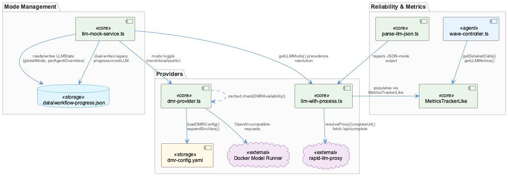
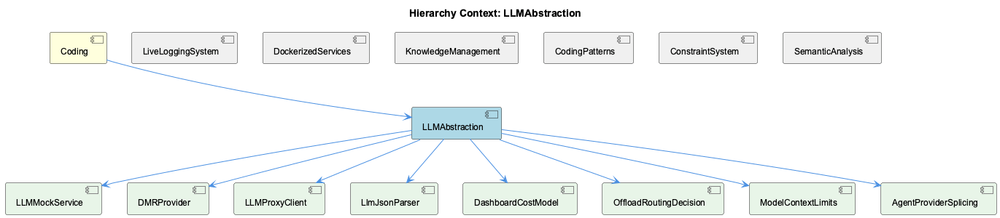

# LLMAbstraction

**Type:** Component

[LLM] The mode-resolution logic in getLLMMode() (llm-mock-service.ts) establishes a clear precedence chain that new developers must understand before debugging unexpected LLM behavior: per-agent overrides in workflow-progress.json take precedence over a global mode setting, which in turn overrides a legacy mockLLM boolean flag, with 'public' as the ultimate fallback. This four-tier resolution means that a developer trying to force mock mode for testing might set the global mode but be silently overridden by a stale per-agent override left in workflow-progress.json from a previous run. The dual-checking of both llmState (new) and mockLLM (legacy) shapes in isMockLLMEnabled() and getLLMState() is a deliberate backward-compatibility shim, indicating the config schema evolved over time but old state files or tooling that only write the legacy flag must continue to work without breaking the mock system.

# LLMAbstraction — Technical Insight Document

## What It Is

LLMAbstraction is the component within the Coding project responsible for mediating all access to large language model backends—whether local (via Docker Model Runner) or remote (via the rapid-llm-proxy daemon)—while normalizing configuration, cost accounting, and mock/production mode switching into a consistent interface. Its implementation spans several key files: `llm-mock-service.ts` (mode resolution and mock/production switching), `dmr-provider.ts` (local Docker Model Runner client), `llm-with-process.ts` (proxy completion client and token normalization), and `cost-model.ts` (pricing and cost computation). As the parent to DMRProvider, ProxyCompletionClient, CostModelEngine, ModelNormalization, and OffloadDecisionEngine, LLMAbstraction acts as the umbrella boundary separating "how the rest of Coding calls an LLM" from "which specific provider/runtime actually services that call."

## Architecture and Design

The component is built around several recurring architectural patterns rather than a single monolithic design. First, a **layered precedence-chain resolution pattern** appears repeatedly: `getLLMMode()` in `llm-mock-service.ts` resolves mode via a four-tier chain (per-agent override in `workflow-progress.json` → global mode → legacy `mockLLM` boolean → 'public' fallback), and `resolveProxyCompleteUrl()` in `llm-with-process.ts` similarly resolves the proxy endpoint via a four-tier environment variable chain (`RAPID_LLM_PROXY_URL` > `LLM_CLI_PROXY_URL` > `LLM_PROXY_URL` > localhost default). This is a deliberate strategy for backward compatibility across an evolving system where naming conventions and config schemas changed over time but old callers must not break.

Second, a **defensive multi-path configuration discovery pattern** is embodied in `loadDMRConfig()`, which tries three candidate file locations for `dmr-config.yaml` before failing, reflecting the reality that the same code runs on bare-metal dev machines, inside Docker containers, and in CI. This pattern recurs elsewhere in the codebase, signaling a broader architectural theme: configuration loading never assumes a single canonical location.

Third, the **singleton/caching pattern** in `dmr-provider.ts` (a reused `dmrClient` instance, plus a time-windowed `checkDMRAvailability()` health check) trades real-time accuracy for reduced load on the local DMR endpoint—an explicit reliability/performance tradeoff that yields eventually-consistent availability state.

Finally, a **response normalization/shim pattern** appears in `llmWithProcessComplete()`, which reconciles heterogeneous token-usage shapes (flat number vs. `{total, input, output}`) into a single canonical `LLMWithProcessResponse.tokens` structure, and in `priceForModel()` (CostModelEngine), which falls back through exact-match → family-representative → generic family match before defaulting to a zero-priced 'none' source (per the three-tier resolution documented on CostModelEngine itself).

## Implementation Details

`llm-mock-service.ts` contains the mode-resolution engine: `getLLMMode()`, `isMockLLMEnabled()`, and `getLLMState()` all consult both the new `llmState` shape and the legacy `mockLLM` boolean, deliberately dual-checking both to support state files or tooling written before the schema evolved. These functions are also CODING_ROOT-aware, normalizing filesystem path resolution for `workflow-progress.json` so that state is read correctly whether running natively on a host or inside a Docker container (a hybrid deployment concern also documented in `docker/README.md` under sibling component DockerizedServices).

`dmr-provider.ts` implements DMRProvider as an OpenAI-compatible client, allowing it to be substituted for remote providers without changing call sites. It centralizes access behind a singleton `dmrClient`, and its `loadDMRConfig()` function chains three file-path attempts before invoking `expandEnvVars()`, which performs `${VAR}`-style substitution specifically on the `baseUrl` field—enabling environment-specific endpoints like `QWEN_LAPTOP_API_BASE_URL` without hardcoding hostnames.

`llm-with-process.ts` implements ProxyCompletionClient, tagging each completion request with a process identifier that flows downstream into `CostRow.process` in `cost-model.ts`. Its `resolveProxyCompleteUrl()` handles the multi-variable proxy URL resolution described above, and `llmWithProcessComplete()` performs the token-shape normalization critical to downstream cost accuracy.

`cost-model.ts` implements CostModelEngine's `priceForModel()`, using `modelFamily()` classification (haiku/sonnet/opus/fable/gpt-4o/gpt-5) and `FAMILY_REPRESENTATIVE` fallback lookups to approximate pricing for model identifiers not present in the exact `modelPrices` table—a pragmatic response to the rapid cadence of dated model releases (e.g., `claude-3-5-sonnet-20241022`).

## Integration Points

LLMAbstraction's children each implement a distinct facet of the abstraction: DMRProvider handles local inference via an OpenAI-compatible interface; ProxyCompletionClient handles remote inference via the rapid-llm-proxy daemon and tags requests for cost tracking; CostModelEngine consumes normalized model identifiers (produced by ModelNormalization) as keys into `CostConfig.modelPrices`; and OffloadDecisionEngine's `evaluateOffload()` in `offload-gates.ts` reproduces the proxy's exact short-circuit gate order (considered→route-allows→band→target→target-band→scope→transport→offloaded) so that reason-string attribution stays consistent with the proxy's own decision logic.

Cross-component dependencies extend beyond LLMAbstraction's boundary: mode resolution reads `workflow-progress.json`, a state file shared with broader agent orchestration, and its CODING_ROOT-awareness mirrors deployment concerns documented under DockerizedServices. Token normalization output feeds both `cost-model.ts`'s `priceForModel()` and the dashboard's `models.ts`, meaning any change to the canonical tokens shape has direct billing-accuracy implications for downstream consumers.

## Usage Guidelines

Developers debugging unexpected LLM behavior should check the full four-tier precedence chain in `getLLMMode()` before assuming a global mode setting took effect—a stale per-agent override in `workflow-progress.json` silently wins. Similarly, when tracing why a proxy call hits an unexpected host, check all three legacy env vars (`LLM_CLI_PROXY_URL`, `LLM_PROXY_URL`) in addition to the preferred `RAPID_LLM_PROXY_URL`, since new code should adopt the latter but must not assume it's exclusive.

Because DMR availability checks are cached on a `healthCheckInterval` timer, treat availability as eventually-consistent, not real-time—a crashed DMR container may appear available for up to one interval window. Any new code reading `.data/workflow-progress.json` should replicate the CODING_ROOT-aware path resolution rather than hardcoding relative paths, to avoid reading stale state inside containers. Finally, when adding support for a new model's pricing, verify whether `priceForModel()`'s family-based fallback produces acceptable estimates before relying on it, or add an explicit `modelPrices` entry if precision matters.

## Hierarchy Context

### Parent
- [Coding](./Coding.md) -- Root node of the coding project knowledge hierarchy, encompassing all development infrastructure knowledge. The project consists of 7 major components: LiveLoggingSystem: [LLM] The LiveLoggingSystem centers around logging.ts, which owns the core responsibilities of session windowing, file routing, and transcript capture; LLMAbstraction: [LLM] The mode-resolution logic in getLLMMode() (llm-mock-service.ts) establishes a clear precedence chain that new developers must understand before ; DockerizedServices: [LLM] The DockerizedServices component centers on docker/README.md as the canonical deployment reference, describing how semantic analysis MCP, constr; KnowledgeManagement: [LLM] The KnowledgeManagement component centers around a VKB (Virtual Knowledge Base) server that exposes graph-based storage operations to the rest o; CodingPatterns: [LLM] The agent wrapper scripts under config/agents/ (claude.sh, copilot.sh, opencode.sh, pi.sh) implement a consistent adapter pattern where each scr; ConstraintSystem: The ConstraintSystem provides rule-based validation and enforcement of code actions and file operations during Claude Code sessions, spanning hook con; SemanticAnalysis: [LLM] The batch-analysis pipeline is organized as a multi-agent workflow where distinct responsibilities are separated into dedicated agent classes ra.

### Children
- [DMRProvider](./DMRProvider.md) -- DMRProvider (dmr-provider.ts) implements an OpenAI-compatible client interface so it can be substituted for remote providers without changing call sites
- [ProxyCompletionClient](./ProxyCompletionClient.md) -- llm-with-process.ts tags each completion request with a process identifier, which downstream shows up as CostRow.process in cost-model.ts
- [CostModelEngine](./CostModelEngine.md) -- priceForModel() implements a three-tier resolution: exact model key match, family-representative fallback via FAMILY_REPRESENTATIVE, then generic family match, defaulting to a zero-priced 'none' source
- [ModelNormalization](./ModelNormalization.md) -- Model identifiers normalized here feed directly into CostConfig.modelPrices keys consumed by priceForModel() in cost-model.ts
- [OffloadDecisionEngine](./OffloadDecisionEngine.md) -- evaluateOffload() in offload-gates.ts reproduces the proxy's short-circuit gate order exactly (considered→route-allows→band→target→target-band→scope→transport→offloaded), because gate order determines which reason string is attributed to a call

### Siblings
- [LiveLoggingSystem](./LiveLoggingSystem.md) -- [LLM] The LiveLoggingSystem centers around logging.ts, which owns the core responsibilities of session windowing, file routing, and transcript capture. This module acts as the single ingestion point for live Claude Code conversation data, meaning any change to session lifecycle semantics (e.g., how a 'session window' is defined or when it rolls over to a new file) has cascading effects on downstream consumers like the classification agent and config validation tooling. New developers should treat logging.ts as the authoritative source of truth for how raw conversation events are structured before they are persisted to disk.
- [DockerizedServices](./DockerizedServices.md) -- [LLM] The DockerizedServices component centers on docker/README.md as the canonical deployment reference, describing how semantic analysis MCP, constraint monitor, graphify, and their supporting databases (likely Postgres/Neo4j/Redis instances based on the memory-systems architecture) are packaged as isolated containers. This separation allows each service to be versioned, scaled, and restarted independently of the host Coding CLI tooling, which is critical since the host-side agent orchestration (per docs/architecture/adding-new-agent.md) expects these services to be reachable over well-known ports/URLs rather than in-process calls.
- [KnowledgeManagement](./KnowledgeManagement.md) -- [LLM] The KnowledgeManagement component centers around a VKB (Virtual Knowledge Base) server that exposes graph-based storage operations to the rest of the Coding infrastructure. This server acts as the primary access point for entity CRUD operations, query resolution, and relationship traversal across the knowledge graph, decoupling consumers (agents, CLI tools, other components) from the underlying storage engine. This abstraction layer is critical because it has allowed the project to migrate storage backends (LevelDB to KMCore) without requiring downstream consumers to change their integration code, as evidenced by the dedicated migration test suite.
- [CodingPatterns](./CodingPatterns.md) -- [LLM] The agent wrapper scripts under config/agents/ (claude.sh, copilot.sh, opencode.sh, pi.sh) implement a consistent adapter pattern where each script normalizes a distinct third-party CLI's invocation surface into a common interface expected by the rest of the Coding infrastructure. Rather than having callers branch on which agent is being invoked, each wrapper reads its own set of environment variables (e.g., CODING_OPENCODE_MODEL for opencode.sh) and translates them into the flags or config files that the underlying binary expects. This pattern lets orchestration code (likely in bin/coding or docs/architecture/agent-abstraction-api.md-described layers) treat all agents uniformly, at the cost of needing to keep each wrapper script in sync whenever a new common capability (like model selection or proxy routing) is added — a new developer adding agent support should look at an existing wrapper like claude.sh as the canonical template, per docs/architecture/adding-new-agent.md.
- [ConstraintSystem](./ConstraintSystem.md) -- The ConstraintSystem provides rule-based validation and enforcement of code actions and file operations during Claude Code sessions, spanning hook configuration loading, hook dispatch orchestration, and violation capture/persistence. It is built around a unified hook architecture that merges user-level (~/.coding-tools/hooks.json) and project-level (.coding/hooks.json) configurations, with project config taking precedence, and dispatches events (pre-tool, post-tool, pre-prompt, post-prompt, startup, shutdown, error) to registered handlers of type script, command, or module.

Core orchestration lives in UnifiedHookManager (lib/agent-api/hooks/hook-manager.js), which maintains a Map of event names to sorted handler arrays (by priority), supports duplicate-ID overwrite semantics, and exposes registerHandler/unregisterHandler APIs bridging agent-native hook systems to a common HookEvent enum. Configuration parsing and structural validation is handled separately by HookConfigLoader (lib/agent-api/hooks/hook-config.js), which loads, merges, and validates settings/hooks blocks, logging warnings (not throwing) on malformed entries.

Violation detection results are captured and persisted via ViolationCaptureService (scripts/violation-capture-service.js), which writes JSONL violation records to .mcp-sync/session-violations.jsonl and maintains an aggregated violation-history.json with session tracking and computed statistics (severity breakdowns, most common constraint, average violations per session) for dashboard consumption. Sensitive parameter values are redacted before being written to logs, and history is capped at 1000 entries to bound file growth.
- [SemanticAnalysis](./SemanticAnalysis.md) -- [LLM] The batch-analysis pipeline is organized as a multi-agent workflow where distinct responsibilities are separated into dedicated agent classes rather than a single monolithic analyzer. semantic-analysis-agent.ts is responsible for extracting structured knowledge entities from raw inputs (git history diffs/commits and LSL session logs), while ontology-classification-agent.ts takes those extracted entities and classifies them into a hierarchy (determining parent-child relationships and where a given entity fits within the broader ontology). This separation of extraction from classification allows each agent to have a narrower, more testable prompt/response contract with the underlying LLM, and lets the pipeline swap or tune one stage without affecting the other's logic.

---

*Generated from 7 observations*
