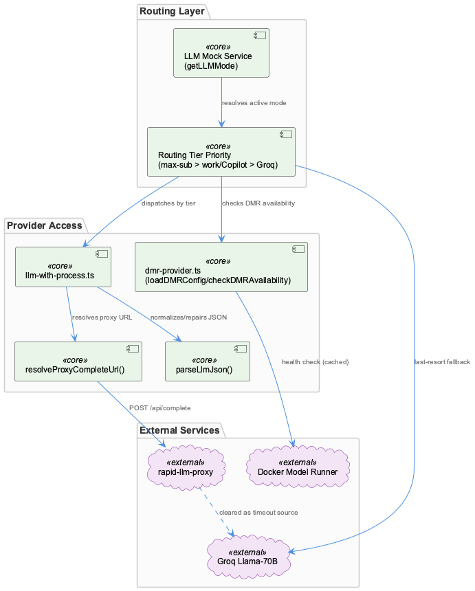
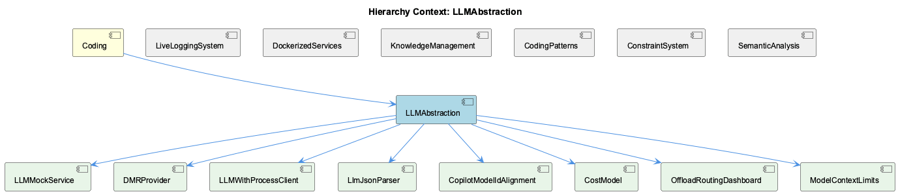

# LLMAbstraction

**Type:** Component

# LLMAbstraction — Technical Insight Document

## What It Is

LLMAbstraction is the component responsible for mediating access to LLM providers, mock/live mode selection, and request-level bookkeeping across the coding project. Its implementation is spread across several concrete files: `llm-mock-service.ts` (mock/live routing logic), `dmr-provider.ts` (local Docker Model Runner client), `llm-with-process.ts` (direct-fetch wrapper for process-tagged completions), and `parse-llm-json.ts` (JSON repair for LLM output). As the parent of LLMMockService, DMRProvider, ParseLlmJson, LLMWithProcessClient, CostModel, OffloadRoutingUI, AgentModelConfigSplice, and ModelContextLimits, it forms the abstraction layer sitting between agent/workflow code and actual model providers, sibling to components like LiveLoggingSystem, DockerizedServices, and SemanticAnalysis under the root Coding hierarchy.

## Architecture and Design

The dominant pattern is layered fallback resolution, appearing repeatedly at different levels of the stack. `getLLMMode()` in `llm-mock-service.ts` resolves mock-vs-live status through a three-tier precedence: per-agent override → global mode → legacy `progress.mockLLM` boolean → default `'public'`, preserving backward compatibility with older `workflow-progress.json` files. Similarly, `resolveProxyCompleteUrl()` in `llm-with-process.ts` applies a 4-tier environment variable precedence (`RAPID_LLM_PROXY_URL` > `LLM_CLI_PROXY_URL` > `LLM_PROXY_URL` > localhost fallback) so the same code runs correctly whether on host or inside a container. `loadDMRConfig()` in `dmr-provider.ts` follows the same philosophy with a three-location filesystem search for `dmr-config.yaml`. A distinct but related architectural concern — the intended provider **tier priority** (max-subscription → work/Copilot → Groq Llama-70B as absolute last resort) — is a routing-order policy documented at the session level, separate from these mode/config fallbacks; a known defect here was providers being demoted to primary rather than preserving that order.

## Implementation Details

`dmr-provider.ts` wraps an OpenAI-compatible client against a local Docker Model Runner endpoint and caches availability via module-level `isAvailable`/`lastHealthCheck` globals, re-probing only after `dmrConfig.connection.healthCheckInterval` (default 30000ms) elapses — a deliberate staleness-for-latency trade-off benefiting hot-loop callers like wave analysis. Its config loader applies `expandEnvVars()` to interpolate `${VAR}` and `${VAR:-default}` syntax, letting one YAML file resolve differently on host versus containerized deployments.

`llm-with-process.ts` exists specifically because the `@rapid/llm-proxy` SDK's `LLMCompletionRequest` type lacks a `process` field; without this bypass, wave-analysis calls would be attributed to `process='unknown'` in token-usage telemetry, breaking per-stage cost dashboards.

`parse-llm-json.ts` is a narrowly-scoped repair pipeline rather than a general lenient parser: `escapeControlCharsInStrings()` escapes stray control characters only inside string literals, and `truncateToLastCompleteElement()` only treats nested bracket closes as safe truncation points — both targeting specific production failure modes rather than arbitrary malformed JSON.

## Integration Points

LLMAbstraction's clients ultimately route through `rapid-llm-proxy`, the mandatory shared proxy confirmed by session records; `LLMWithProcessClient` targets its `/api/complete` endpoint directly. Diagnostic work has explicitly ruled out `rapid-llm-proxy` as a source of CLI/UKB timeout failures, redirecting attention to provider client code such as `dmr-provider.ts` and the Anthropic/OpenAI/Groq clients. Within the component, CostModel's `budgetForMonth` distinguishes explicit-null from absent-key budget entries via `Object.prototype.hasOwnProperty.call`, feeding cost accounting that depends on accurate process attribution from LLMWithProcessClient. Note that several children — DMRProvider and ParseLlmJson in particular — currently have retrieval results dominated by unrelated dashboard/CI files (cost-model.ts, offload-decision.tsx, use-classifier-judge.ts, provider.tsx), which are filename-adjacent but not their actual implementations.

## Usage Guidelines

Developers should respect the tiered fallback conventions rather than bypassing them: mode resolution must check per-agent overrides before global state before the legacy flag, and provider selection must preserve the max-subscription → Copilot → Groq last-resort order rather than treating lower tiers as primary. DMR health checks should not be forced on every call in hot paths — rely on the existing cache interval. When diagnosing timeout or provider errors, investigate provider-specific client code before suspecting the shared proxy layer, per prior diagnostic findings. Extensions to `parse-llm-json.ts` should remain targeted at observed failure patterns rather than growing into a general-purpose lenient JSON parser.

## Work Record

What working sessions recorded about this entity — decisions taken, problems hit, and why things are the way they are:

- 'LLM Routing Tier Priority' establishes that LLM requests must follow fallback tier order — max-subscription models first, then work/GH Copilot models, then Groq Llama-70B only as a last resort — rather than demoting to lower-tier providers as primary
- 'CLI/UKB Run Timeout and Provider Error Diagnostics' establishes that short-duration CLI timeouts affecting UKB runs were diagnosed as provider-specific failures further down the call chain, with rapid-llm-proxy explicitly ruled out as the timeout source based on log evidence — meaning fixes for this class of failure need to target provider client code (e.g. dmr-provider.ts or the Anthropic/OpenAI/Groq clients) rather than the shared proxy layer.
- 'LLM Routing Tier Priority' establishes that the intended fallback behavior for LLM requests is a strict ordering — max-subscription models first, then work/GH Copilot models, then Groq Llama-70B only as an absolute last resort — and documents that the observed bug was the system demoting to lower-tier providers as the primary choice instead of preserving this order, indicating the routing/tier-selection logic in this component had an ordering defect distinct from simple availability failures.

## Hierarchy Context

### Parent
- [Coding](./Coding.md) -- Root node of the coding project knowledge hierarchy, encompassing all development infrastructure knowledge. The project consists of 7 major components: LiveLoggingSystem: [LLM] The classification layer for LiveLoggingSystem is implemented in ontology-classification-agent.ts, which categorizes captured session content as; LLMAbstraction: [SESSION] 'LLM Routing Tier Priority' establishes that LLM requests must follow fallback tier order — max-subscription models first, then work/GH Copi; DockerizedServices: [LLM] lib/service-probe.js implements the health-check polling logic that determines readiness of dockerized services (semantic analysis MCP, constrai; KnowledgeManagement: [SESSION] Wave Insight Persistence work record establishes that Wave 4 wrote 73 insight documents but zero Insight graph nodes, because the History si; CodingPatterns: [SESSION] Documentation Style Guide for Diagrams and Markdown establishes that .puml source files must live in docs/puml/ and generated diagram artifa; ConstraintSystem: [SESSION] Statusline Click-Report Feature establishes that clicking the 'constraints' field in the tmux statusline opens or focuses the constraint-mon; SemanticAnalysis: [SESSION] Pipeline CodingLowerOntologySource Emission Bug documents an unresolved defect where the pipeline emits a CodingLowerOntologySource referenc.

### Children
- [LLMMockService](./LLMMockService.md) -- [SESSION] PlantUML Diagram Generation — Wave 4 Syntax Failures ties LLMMockService to diagnostic work on syntax failures and truncation in generated .puml files produced during mocked/simulated runs.
- [DMRProvider](./DMRProvider.md) -- [LLM] None of the five retrieved code files reference DMRProvider, dmr-provider.ts, dmr-config.yaml, Docker Model Runner, or any OpenAI-compatible local-endpoint client. The retrieved set is `tests/features/copilot-model-ids.test.mjs`, `integrations/system-health-dashboard/src/components/cost/cost-model.ts`, `.../llm-routing/offload-decision.tsx`, `.../llm-routing/use-classifier-judge.ts`, and `.../store/provider.tsx` — a drift-guard test, a pricing module, a routing-visualization component, a classifier-health hook, and a Redux provider wrapper, respectively. These are dashboard/observability and CI-guard code, not provider-client code, and share no function, class, import, or config key with the DMRProvider described in the parent context.
- [ParseLlmJson](./ParseLlmJson.md) -- [LLM] None of the supplied code files implement or reference the ParseLlmJson component. The five files retrieved — tests/features/copilot-model-ids.test.mjs, integrations/system-health-dashboard/src/components/cost/cost-model.ts, .../llm-routing/offload-decision.tsx, .../llm-routing/use-classifier-judge.ts, and .../store/provider.tsx — are drift-guard tests, cost-accounting logic, an offload-policy UI card, a classifier-judge polling hook, and a Redux provider wrapper respectively. None contain a JSON-repair pipeline, a function named escapeControlCharsInStrings or truncateToLastCompleteElement, or any parsing of LLM completion text. This is retrieval-by-filename noise: these files sit near LLM-routing infrastructure but are not parse-llm-json.ts.
- [LLMWithProcessClient](./LLMWithProcessClient.md) -- [SESSION] RapidLlmProxy — Universal Agent Routing, Worker Pool, Semantic Dispatch establishes that rapid-llm-proxy is the mandatory shared routing proxy all clients must go through, which this wrapper directly targets via /api/complete.
- [CostModel](./CostModel.md) -- [LLM] cost-model.ts:budgetForMonth implements month-scoped budget resolution where an explicit null in monthlyEurByMonth is distinguished from an absent key via Object.prototype.hasOwnProperty.call, meaning 'no cap this month' and 'not recorded, use standing cap' are two different states the function must not conflate — a subtle correctness detail visible only by reading the hasOwnProperty guard.
- [OffloadRoutingUI](./OffloadRoutingUI.md) -- [SESSION] Rapid-LLM-Proxy — Universal Agent Routing establishes rapid-llm-proxy as the mandatory routing authority these UI components mirror and must never silently diverge from.
- [AgentModelConfigSplice](./AgentModelConfigSplice.md) -- [LLM] tests/features/copilot-model-ids.test.mjs is a drift guard, not a routing implementation: it hardcodes a RETIRED list (currently ['claude-sonnet-4.6', 'claude-opus-4.6']) and asserts that integrations/semantic-analysis/scripts/align-copilot-model-ids.mjs rewrites every one of them to a non-retired successor. The test explicitly checks that the Dockerfile invokes the alignment script AFTER the last `npm install` for semantic-analysis (via `findLastIndex`), because an npm install re-vendors @rapid/llm-proxy's dist and would silently undo the rewrite if the script ran first. This encodes a real incident (2026-09-20) where the vendored SDK named a retired model, Copilot returned 400, and Wave 3 fell through to `[llm] All providers failed`, writing a ~600-char stub instead of a ~4400-char analysis, with nothing in the logs naming the model.
- [ModelContextLimits](./ModelContextLimits.md) -- [LLM] None of the supplied files define, import, or reference an entity named 'ModelContextLimits', nor any construct for per-model context-window/token-ceiling limits (e.g. a max-tokens-per-model table, a truncation-by-context-size guard, or a 'does this prompt fit' check). The five files retrieved — cost-model.ts, offload-decision.tsx, use-classifier-judge.ts, provider.tsx, and copilot-model-ids.test.mjs — were surfaced by filename/topic proximity to the parent LLM-routing area, not because they implement this component.

### Siblings
- [LiveLoggingSystem](./LiveLoggingSystem.md) -- [LLM] The classification layer for LiveLoggingSystem is implemented in ontology-classification-agent.ts, which categorizes captured session content as it flows through the logging pipeline. Its hierarchy-root validation logic is tested separately in ontology-classification-agent.hierarchy-roots.test.ts, indicating that root-node classification (i.e., correctly assigning top-level ontology categories rather than leaf nodes) is treated as a distinct correctness concern from general classification accuracy — likely because incorrect root assignment cascades into misfiled session data across the entire per-person or per-project vault structure.
- [DockerizedServices](./DockerizedServices.md) -- [LLM] lib/service-probe.js implements the health-check polling logic that determines readiness of dockerized services (semantic analysis MCP, constraint monitor) before dependent processes proceed. Rather than a single fixed timeout, the probe pattern issues periodic requests against known health endpoints and treats consecutive failures within a window as the signal for 'not ready' versus 'transiently slow', which matters in a Docker context where container startup order and cold-start times (loading models, connecting to databases) are highly variable across restarts.
- [KnowledgeManagement](./KnowledgeManagement.md) -- [SESSION] Wave Insight Persistence work record establishes that Wave 4 wrote 73 insight documents but zero Insight graph nodes, because the History sidebar filters strictly to entityType 'Insight' — documents alone are invisible to graph queries
- [CodingPatterns](./CodingPatterns.md) -- [SESSION] Documentation Style Guide for Diagrams and Markdown establishes that .puml source files must live in docs/puml/ and generated diagram artifacts have defined placement rules, enforcing a convention for the docs pipeline to render correctly.
- [ConstraintSystem](./ConstraintSystem.md) -- [SESSION] Statusline Click-Report Feature establishes that clicking the 'constraints' field in the tmux statusline opens or focuses the constraint-monitor dashboard tab, integrating HookManagementSystem-driven violation data with the dashboard UI
- [SemanticAnalysis](./SemanticAnalysis.md) -- [SESSION] Pipeline CodingLowerOntologySource Emission Bug documents an unresolved defect where the pipeline emits a CodingLowerOntologySource reference in output despite documentation stating this source type should never be produced, indicating a gap between the L2 refinement design and current emission behavior

---

*Generated from 8 observations*
