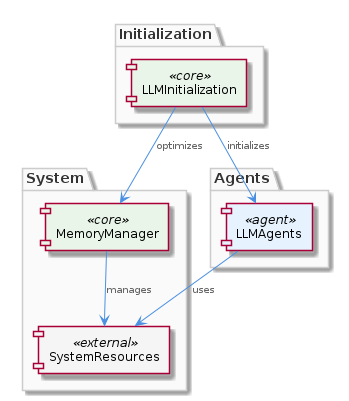
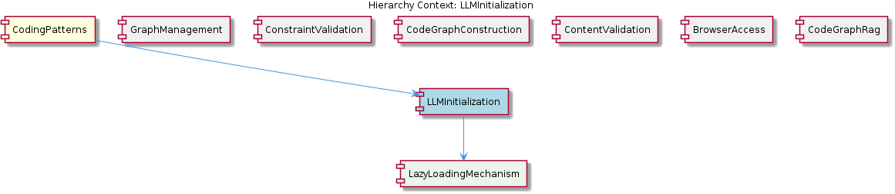

# LLMInitialization

**Type:** SubComponent

LLMInitialization ensures that LLM agents are initialized only when required, optimizing system performance.

## What It Is  

`LLMInitialization` is the **SubComponent** inside the **CodingPatterns** component that is dedicated to the lifecycle management of Large Language Model (LLM) agents. Although the observations do not expose an explicit source‑file location, its logical placement is within the `CodingPatterns` hierarchy, alongside siblings such as **GraphManagement**, **ConstraintValidation**, **CodeGraphConstruction**, **ContentValidation**, **BrowserAccess**, and **CodeGraphRag**. The sub‑component’s sole responsibility is to **initialize LLM agents lazily**—that is, an agent is instantiated only at the moment it is first required by the system. This approach reduces both the computational overhead and the memory footprint, while still allowing the system to support **multiple LLM agents** with minimal resource consumption.

  

The architecture diagram above shows `LLMInitialization` nested under **CodingPatterns** and owning the child component **LazyLoadingMechanism**, which implements the actual lazy‑loading logic.

---

## Architecture and Design  

The design of `LLMInitialization` is driven by a **lazy loading** architectural pattern. Rather than eagerly constructing every possible LLM agent at startup, the component defers creation until the first request arrives. This decision aligns with the broader **resource‑efficiency** goals of the **CodingPatterns** component, which also relies on other specialized sub‑components (e.g., **GraphManagement** for graph persistence) to off‑load their own concerns.

Interaction flow:  
1. A consumer (for example, a code‑generation routine in **CodeGraphRag**) asks for an LLM agent.  
2. `LLMInitialization` checks an internal registry to see if the requested agent already exists.  
3. If the agent is absent, the **LazyLoadingMechanism** is invoked to instantiate the agent on‑demand, register it, and return the reference.  
4. Subsequent calls receive the already‑initialized instance, avoiding repeated overhead.

The **relationship diagram** below visualizes these connections, highlighting how `LLMInitialization` sits between its parent **CodingPatterns** and its child **LazyLoadingMechanism**, while also interfacing with sibling components that may request LLM services.

  

Because the component is isolated to the initialization concern, it respects the **single‑responsibility principle** and keeps the initialization logic separate from the functional logic found in siblings such as **ConstraintValidation** or **ContentValidation**.

---

## Implementation Details  

The concrete implementation is encapsulated in the **LazyLoadingMechanism** child component. While the observations do not list concrete class or function names, the following logical structure can be inferred:

* **Registry / Cache** – a map keyed by agent identifier that stores already‑initialized LLM instances.  
* **`getAgent(id)`** – a public entry point used by other components. It performs a presence check in the registry.  
* **`createAgent(id)`** – a private helper within **LazyLoadingMechanism** that contains the heavy‑weight construction logic (loading model weights, establishing runtime contexts, etc.).  
* **`initializeIfNeeded(id)`** – a wrapper that combines the check and creation steps, embodying the lazy‑loading contract.

The lazy‑loading approach directly **reduces the system’s memory footprint** (Observation 6) because model weights and runtime resources are allocated only when needed. It also **optimizes performance** by avoiding unnecessary start‑up cost (Observations 1, 3, 4). Because the component can handle **multiple agents** (Observation 5), the registry is designed to be thread‑safe, ensuring that concurrent requests for the same agent do not trigger duplicate initializations.

---

## Integration Points  

`LLMInitialization` integrates with the rest of the system through well‑defined interfaces:

* **Parent – CodingPatterns**: The parent component delegates any LLM‑related initialization request to `LLMInitialization`. This keeps the higher‑level patterns focused on orchestration rather than on low‑level resource management.  
* **Siblings** – Components such as **CodeGraphConstruction**, **ContentValidation**, and **BrowserAccess** may request an LLM agent when they need to perform generation, analysis, or validation tasks. They do so by calling the public `getAgent` method, receiving a ready‑to‑use instance without needing to know the lazy‑loading internals.  
* **Child – LazyLoadingMechanism**: All actual creation logic lives here. The parent component (`LLMInitialization`) forwards calls to this child, preserving a clean separation between the public API and the implementation details.  

No external storage adapters (e.g., the `GraphDatabaseAdapter` used by **GraphManagement**) are directly involved in initialization, which keeps the dependency graph shallow and reduces coupling.

---

## Usage Guidelines  

1. **Request via the public API** – Always obtain an LLM agent through the `LLMInitialization` entry point (e.g., `getAgent`). Directly constructing agents bypasses the lazy‑loading benefits and may lead to duplicated resources.  
2. **Identify agents by stable IDs** – Use a consistent identifier when requesting an agent so the internal registry can correctly deduplicate instances.  
3. **Avoid premature eager loading** – Do not invoke the creation helper (`createAgent`) outside of the lazy‑loading flow; doing so defeats the memory‑saving design.  
4. **Handle asynchronous initialization** – Because loading a large model can be time‑consuming, callers should be prepared to await the result or handle a promise/future if the implementation is async.  
5. **Respect thread safety** – When multiple threads may request the same agent concurrently, rely on the component’s built‑in synchronization; do not implement external locking around the call.  

Following these conventions ensures that the system continues to benefit from the **resource‑efficient lazy loading** strategy while maintaining predictable behavior across all components that depend on LLM agents.

---

### Summary of Key Insights  

1. **Architectural patterns identified** – Lazy Loading (as a concrete pattern) implemented via a dedicated **LazyLoadingMechanism** child component.  
2. **Design decisions and trade‑offs** – Deferring LLM agent creation reduces startup cost and memory usage, at the expense of a slight latency on first use; the design isolates initialization concerns, enhancing modularity.  
3. **System structure insights** – `LLMInitialization` sits under **CodingPatterns**, shares a sibling relationship with other pattern‑focused sub‑components, and encapsulates its heavy logic in **LazyLoadingMechanism**, preserving a clean hierarchy.  
4. **Scalability considerations** – The registry‑based approach allows the system to support many distinct LLM agents concurrently without a proportional increase in baseline memory; thread‑safe lazy creation ensures safe scaling under concurrent workloads.  
5. **Maintainability assessment** – By adhering to single‑responsibility and clear API boundaries, the component is easy to test and evolve. Future changes to agent construction (e.g., swapping model providers) can be confined to **LazyLoadingMechanism** without rippling into siblings or the parent.

## Hierarchy Context

### Parent
- [CodingPatterns](./CodingPatterns.md) -- [LLM] The CodingPatterns component utilizes the GraphDatabaseAdapter class in storage/graph-database-adapter.ts for persistence, allowing for automatic JSON export sync. This design decision enables seamless data synchronization and provides a robust foundation for the project's data management. The GraphDatabaseAdapter class is responsible for handling graph data storage and retrieval, making it a critical component of the project's architecture. By using this adapter, the CodingPatterns component can focus on its primary functionality, leaving data management to the GraphDatabaseAdapter.

### Children
- [LazyLoadingMechanism](./LazyLoadingMechanism.md) -- The LLMInitialization sub-component uses a lazy loading approach to initialize LLM agents, as implied by its parent context in the CodingPatterns component.

### Siblings
- [GraphManagement](./GraphManagement.md) -- GraphDatabaseAdapter handles graph data storage and retrieval, making it a critical component of the project's architecture.
- [ConstraintValidation](./ConstraintValidation.md) -- ConstraintValidation uses a rules-based approach to validate constraints, ensuring system integrity.
- [CodeGraphConstruction](./CodeGraphConstruction.md) -- CodeGraphConstruction uses a graph-based approach to construct code graphs, enabling efficient data management.
- [ContentValidation](./ContentValidation.md) -- ContentValidation uses a rules-based approach to validate content, ensuring system integrity.
- [BrowserAccess](./BrowserAccess.md) -- BrowserAccess uses a browser-based approach to provide access to web-based interfaces.
- [CodeGraphRag](./CodeGraphRag.md) -- CodeGraphRag uses a graph-based approach to analyze code, providing a robust foundation for the project's functionality.

---

*Generated from 6 observations*
