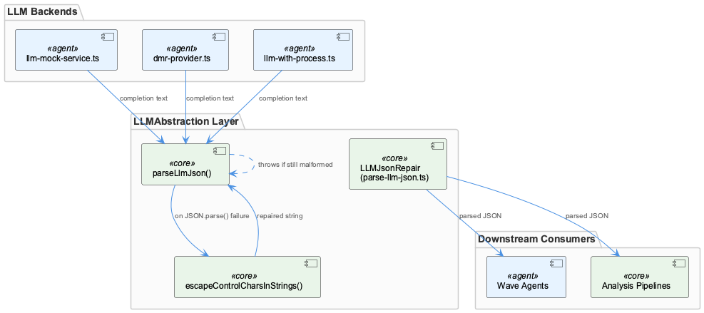
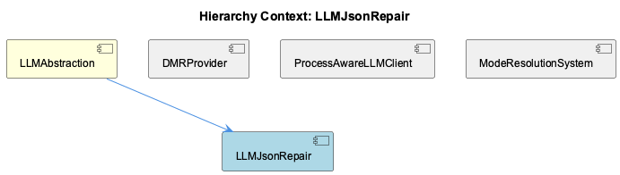

# LLMJsonRepair

**Type:** SubComponent

[Architecture Notes] LLMJsonRepair (parse-llm-json.ts) is stateless and pure, in contrast to sibling modules in LLMAbstraction (llm-mock-service.ts, dmr-provider.ts) which hold module-level mutable state (mode cache, singleton client, health-check timestamps); Acts as a shared post-processing chokepoint for completions coming from at least three distinct backends (mock, local DMR, proxied public providers via llm-with-process.ts), centralizing JSON-repair logic rather than duplicating it per provider; Deliberately does not implement general lenient JSON parsing — scope is constrained to one documented failure mode (unescaped control characters in string literals) to preserve fail-loud semantics for genuinely malformed output; Two-stage parse (JSON.parse then targeted repair) minimizes cost on the common case of well-formed output and isolates repair logic to only the failure path

# LLMJsonRepair — Technical Insight Document

## What It Is

LLMJsonRepair is implemented in `parse-llm-json.ts` within the `LLMAbstraction` component, and it exists to solve one narrow, empirically-observed problem: LLM completions that are otherwise valid JSON but contain raw, unescaped control characters (literal newlines, tabs) inside string literals. Its public entry point, `parseLlmJson()`, is a two-stage function — attempt a strict `JSON.parse()`, and only on failure fall back to a repair pass performed by `escapeControlCharsInStrings()`. It is not a general-purpose lenient JSON parser; it is a small, targeted utility whose scope is deliberately constrained.

## Architecture and Design

The defining architectural choice is the fail-fast / narrow-repair pattern: strict parsing is always attempted first, so well-formed LLM output pays zero repair overhead, and the repair codepath is exercised only for the one documented failure mode. Anything else — truncated JSON, trailing commas, unquoted keys — still throws, preserving what the component's design philosophy calls the invariant that "genuinely malformed replies still fail loudly rather than being silently misinterpreted." This is a conscious rejection of the approach taken by libraries like `jsonrepair` or `dirty-json`, which aggressively coerce almost any input into something parseable. The trade-off is recall for precision: fewer malformed inputs get "fixed," but no repair can silently alter the semantic meaning of a response feeding into wave-agents and analysis pipelines.

Within its parent `LLMAbstraction`, LLMJsonRepair functions as a chokepoint/normalization-layer: rather than each provider integration handling its own JSON quirks, all completions funnel through this one utility before being parsed downstream. This mirrors the parent component's broader design ethos of composing independently-focused, single-responsibility modules — the same philosophy visible in how `ModeResolutionSystem`, `DMRProvider`, and `ProcessAwareLLMClient` each own one narrow concern.

## Implementation Details

`escapeControlCharsInStrings()` is a single-pass, character-by-character scanner rather than a regex substitution. It must track in-string state as it walks the payload — recognizing when a quote toggles it in or out of a string literal, and correctly accounting for a preceding backslash so escaped quotes don't erroneously flip that state. This precision is what allows it to escape control characters found only inside string values while leaving structural whitespace and pretty-printing newlines between JSON tokens untouched. A naive regex approach risks either under-escaping (missing characters inside strings) or over-escaping (mangling formatting outside them). Because escape-sequence miscounting is a classic source of off-by-one bugs in this kind of scanner, the "well-tested" characterization implies test coverage clustered around string boundary edge cases: escaped quotes immediately preceding raw newlines, control characters appearing in keys versus values, and nested quote sequences.

## Integration Points

LLMJsonRepair sits downstream of three heterogeneous inference backends within `LLMAbstraction`: `llm-mock-service.ts` (mock-mode completions), `dmr-provider.ts` (local DMR/Docker Model Runner inference), and `llm-with-process.ts` (`llmWithProcessComplete()`, the telemetry-patched proxy path for public providers). Any provider-specific JSON quirk — for instance, a local model emitting more raw control characters than a hosted provider — surfaces and is handled here rather than requiring bespoke per-provider handling.

This centralization is a double-edged integration point: it eliminates duplicated repair logic across call sites, but it also makes `parseLlmJson()` a shared dependency whose behavioral changes ripple across every consumer in the analysis pipeline. Unlike its stateful siblings — `llm-mock-service.ts` with its mode cache, `dmr-provider.ts` with its singleton `dmrClient` and health-check timestamps — LLMJsonRepair is stateless and side-effect-free, requiring no awareness of environment configuration like `CODING_ROOT` or `workflow-progress.json`.

## Usage Guidelines

Developers should treat `parseLlmJson()` as the standard, sole entry point for interpreting LLM completion text as JSON, regardless of which backend (mock, DMR, or proxied) produced it — bypassing it to hand-roll parsing reintroduces the per-provider quirk-handling this component exists to eliminate. Because the repair scope is intentionally narrow, a `parseLlmJson()` throw should be treated as a genuine signal of malformed output, not papered over with broader lenient-parsing logic; expanding the repair surface (e.g., to also handle trailing commas) would undermine the fail-loud guarantee the component is designed to preserve. Given its stateless, pure nature, it is also the easiest of the `LLMAbstraction` modules to unit test exhaustively, and any future changes to `escapeControlCharsInStrings()` should be validated against string-boundary edge cases (escaped quotes near newlines, control characters in keys vs. values) given the fragility inherent in character-by-character escape tracking.

## Hierarchy Context

### Parent
- [LLMAbstraction](./LLMAbstraction.md) -- LLMAbstraction provides a provider-agnostic layer for interacting with multiple LLM backends (Anthropic, OpenAI, Groq, and local Docker Model Runner), enabling mode-switching between mock, local, and public inference without changing call-site code. It centers on a mode-resolution system stored in workflow-progress.json (llm-mock-service.ts) that supports global and per-agent overrides, allowing tests and specific agents to run against mock data while others hit real providers. This lets the broader system's wave-agents and analysis pipelines be developed and tested without incurring real API costs or requiring live credentials.

The component also handles local inference via DMR (dmr-provider.ts), which wraps Docker Desktop's Model Runner using an OpenAI-compatible client, with YAML-based configuration loading, environment variable expansion, and cached health checks to avoid excessive availability polling. A separate direct-fetch wrapper (llm-with-process.ts) bypasses the SDK's LLMService.complete() to inject a required 'process' telemetry field into proxy requests, addressing a specific attribution gap in token-usage telemetry — demonstrating the abstraction layer's willingness to parallel rather than replace the underlying SDK when the SDK lacks needed fields.

Robustness is a recurring theme: parse-llm-json.ts implements a narrow, well-tested JSON repair routine (escapeControlCharsInStrings) that fixes a specific documented failure mode (raw control characters like newlines inside LLM-generated JSON string values) without becoming a general-purpose lenient parser, preserving the invariant that genuinely malformed replies still fail loudly rather than being silently misinterpreted.

### Siblings
- [DMRProvider](./DMRProvider.md) -- [LLM] DMRProvider (dmr-provider.ts) implements a module-level singleton for its OpenAI-compatible client: a `dmrClient` variable initialized lazily via `initializeDMRClient()` rather than a class instance passed around by dependency injection. This is a pragmatic choice for a Node module that is imported once per process, but it means the client's lifecycle is tied to module load order and there is no explicit teardown/reset hook visible — a long-running process (e.g. the semantic-analysis service) that needs to reconnect after Docker Desktop restarts would have to either restart the process or add an explicit invalidation path, since nothing in the described API resets `dmrClient` to null on failure.
- [ProcessAwareLLMClient](./ProcessAwareLLMClient.md) -- [LLM] The core design decision in llm-with-process.ts is to bypass the @rapid/llm-proxy SDK's LLMService.complete() entirely rather than extend or monkey-patch it. llmWithProcessComplete() reimplements the HTTP call as a direct fetch to /api/complete purely to inject a required 'process' telemetry field the SDK's request shape has no slot for. This is a pragmatic but risky trade-off: it buys an immediate fix for a token-usage attribution gap, but it also means llm-with-process.ts must independently track any future changes to the proxy's request/response contract (auth headers, retry semantics, error shapes) that the SDK would otherwise absorb transparently. The 4-tier URL resolution in resolveProxyCompleteUrl() (RAPID_LLM_PROXY_URL > LLM_CLI_PROXY_URL > LLM_PROXY_URL > localhost default) duplicates configuration logic that presumably also exists inside the SDK client, a second place that must be kept in sync with any proxy endpoint change.
- [ModeResolutionSystem](./ModeResolutionSystem.md) -- [LLM] getLLMMode() in llm-mock-service.ts implements a strict priority chain (per-agent override > global mode > legacy mockLLM flag > 'public' default) sourced from .data/workflow-progress.json. This is a classic layered-config-resolution pattern: rather than a single boolean flag, it supports fine-grained per-agent testing (e.g. one wave-agent can be forced to mock while siblings hit real providers) while still honoring a global kill-switch and a deprecated legacy flag for backward compatibility. The trade-off is that debugging 'why is this agent using mode X' requires walking four resolution tiers rather than reading one value, but the alternative (a single flag) would prevent the mixed mock/live testing scenarios the parent LLMAbstraction is designed to support.

---

*Generated from 9 observations*
