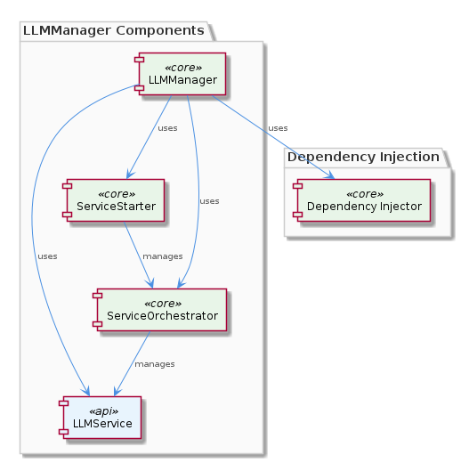
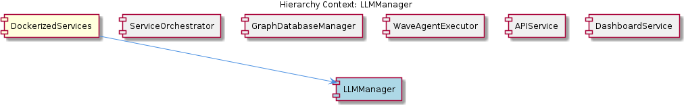

# LLMManager

**Type:** SubComponent

LLMManager might be designed to work with other sub-components, such as the ServiceOrchestrator, to manage service startup and shutdown.

## What It Is  

**LLMManager** is a sub‑component that lives inside the **DockerizedServices** container. The primary source files that reveal its responsibilities are `lib/llm/llm-service.ts`—where the **LLMService** class implements high‑level language‑model operations—and `lib/service-starter.js`, which supplies the **ServiceStarter** utility used for robust service startup. Within the DockerizedServices hierarchy, LLMManager sits alongside siblings such as **ServiceOrchestrator**, **GraphDatabaseManager**, **WaveAgentExecutor**, **APIService**, and **DashboardService**. Its role is to coordinate LLM‑related workloads, apply mode routing, caching, and provider fallback, and to do so in a way that remains loosely coupled to the rest of the system.

## Architecture and Design  

The design of LLMManager follows a **dependency‑injection (DI)** approach. Observation 3 notes that the manager “may use dependency injection to manage complex workflows and handle multiple requests efficiently.” By injecting the **LLMService** (from `lib/llm/llm-service.ts`) and the **ServiceStarter** (from `lib/service-starter.js`) rather than hard‑coding their instantiation, LLMManager can swap implementations (e.g., different LLM providers) without touching its own code. This DI strategy also enables the parent **DockerizedServices** component to compose the manager together with other sub‑components, fostering loose coupling (Observation 6).

The **ServiceStarter** class provides a **robust startup pattern** that includes retry, timeout, and graceful degradation. LLMManager leverages this pattern to ensure that the underlying LLM service is available before processing requests, aligning with the “responsive user experience” goal (Observation 7). The manager also implements **mode routing** and **caching** logic—features explicitly mentioned in Observation 4—allowing it to direct requests to the appropriate LLM mode (e.g., chat vs. completion) and to reuse prior responses when possible, reducing latency and cost.

LLMManager is positioned to collaborate with the **ServiceOrchestrator** sibling (Observation 5). While ServiceOrchestrator orchestrates the lifecycle of various services, LLMManager contributes the LLM‑specific lifecycle hooks (startup via ServiceStarter, shutdown via orchestrator callbacks). This division of concerns reflects a **separation‑of‑concerns** design: LLMManager focuses on domain‑specific logic, while ServiceOrchestrator handles generic service orchestration.

## Implementation Details  

At the core, the **LLMService** class in `lib/llm/llm-service.ts` encapsulates the high‑level LLM operations. It likely exposes methods such as `generate`, `chat`, or `complete`, each of which can be routed based on a *mode* identifier. The manager invokes these methods after the **ServiceStarter** confirms that the LLM backend is reachable.  

The **ServiceStarter** (found in `lib/service-starter.js`) implements a generic startup routine that accepts a callable (e.g., an async `init` function from LLMService). It repeatedly attempts the call, respects a configurable timeout, and, upon repeated failure, triggers a fallback path. LLMManager supplies the appropriate fallback logic—perhaps switching to a secondary LLM provider—fulfilling the “provider fallback logic” noted in Observation 4.

Caching is implemented within LLMManager (or delegated to LLMService) by maintaining an in‑memory map keyed by request signatures. When a request matches a cached entry, the manager returns the stored result instantly, bypassing the external LLM call. This mechanism not only improves response time but also aligns with the “handle multiple requests efficiently” goal.

The manager’s DI container (likely provided by DockerizedServices) registers **LLMService** and **ServiceStarter** as injectable tokens. When LLMManager is instantiated, it receives these dependencies via constructor injection, enabling unit tests to replace them with mocks—an explicit nod to the “loose coupling” and testability emphasis (Observation 6).

## Integration Points  

LLMManager interacts directly with two concrete modules:

1. **LLMService** (`lib/llm/llm-service.ts`) – the functional backbone for LLM calls, mode routing, caching, and provider fallback.  
2. **ServiceStarter** (`lib/service-starter.js`) – the lifecycle helper that guarantees the LLM backend is ready before any request is processed.

Beyond these, LLMManager is a consumer of the **ServiceOrchestrator** sibling, which coordinates start‑up and shutdown across the DockerizedServices ecosystem. When DockerizedServices boots, ServiceOrchestrator invokes ServiceStarter for each registered sub‑component, including LLMManager. Conversely, during graceful shutdown, ServiceOrchestrator signals LLMManager to flush caches and release any held resources.

Other siblings—**GraphDatabaseManager**, **WaveAgentExecutor**, **APIService**, and **DashboardService**—do not directly couple with LLMManager but share the same DI container and service‑starter infrastructure. This common foundation ensures consistent error handling and startup semantics across the entire DockerizedServices suite.

## Usage Guidelines  

1. **Instantiate via DI** – Always obtain LLMManager through the DockerizedServices dependency‑injection container. Direct `new LLMManager()` calls bypass the injected **LLMService** and **ServiceStarter**, breaking the startup guarantees.  
2. **Respect the startup contract** – Before issuing any LLM request, ensure that the manager’s `initialize()` (or the underlying ServiceStarter) has resolved. The manager will reject calls if the LLM backend is not yet healthy.  
3. **Leverage caching wisely** – Cache keys should be deterministic and include the full request payload plus the selected mode. Avoid caching volatile data (e.g., timestamps) to prevent stale responses.  
4. **Provide fallback providers** – When configuring LLMManager, register at least one secondary LLM provider. The fallback logic is only effective if an alternate endpoint is available.  
5. **Graceful shutdown** – Hook into ServiceOrchestrator’s shutdown event to call `LLMManager.shutdown()`. This flushes in‑memory caches and allows any pending LLM calls to complete, preventing data loss.  

---

### Architectural patterns identified  
* Dependency Injection (DI) for loose coupling and testability  
* Robust Service Startup (retry/timeout) via **ServiceStarter**  
* Mode Routing and Provider Fallback within **LLMService**  

### Design decisions and trade‑offs  
* **DI vs. direct instantiation** – Improves flexibility but adds container complexity.  
* **In‑memory caching** – Fast access but limited to a single container instance; scaling out requires a distributed cache.  
* **Provider fallback** – Increases reliability but may introduce latency when switching providers.  

### System structure insights  
LLMManager sits as a domain‑specific leaf under **DockerizedServices**, sharing a common service‑starter and DI backbone with its siblings. Its responsibilities are narrowly scoped to LLM workflow orchestration, leaving generic lifecycle concerns to **ServiceOrchestrator**.

### Scalability considerations  
* Horizontal scaling of DockerizedServices will duplicate the in‑memory cache; to scale efficiently, replace the local cache with a shared store (e.g., Redis).  
* The DI container can inject different **LLMService** implementations per container, enabling multi‑tenant or region‑aware provider selection.  

### Maintainability assessment  
The strict separation of concerns (LLM logic vs. startup logic) and the use of DI make the codebase easy to unit‑test and evolve. Adding new LLM providers or modes requires only extending **LLMService** and updating DI bindings, without touching LLMManager itself. The reliance on shared infrastructure (ServiceStarter, ServiceOrchestrator) further centralizes error handling, reducing duplicated boilerplate across siblings.

## Hierarchy Context

### Parent
- [DockerizedServices](./DockerizedServices.md) -- [LLM] The DockerizedServices component utilizes dependency injection to manage complex workflows and handle multiple requests efficiently. This is evident in the lib/llm/llm-service.ts file, where the LLMService class is used for high-level LLM operations, including mode routing, caching, and provider fallback. The use of dependency injection allows for loose coupling between components, making it easier to test and maintain the codebase. Furthermore, the ServiceStarter class in lib/service-starter.js provides robust service startup with retry, timeout, and graceful degradation, ensuring that the component can recover from failures and provide a responsive user experience.

### Siblings
- [ServiceOrchestrator](./ServiceOrchestrator.md) -- ServiceOrchestrator uses the ServiceStarter class in lib/service-starter.js to provide robust service startup with retry, timeout, and graceful degradation.
- [GraphDatabaseManager](./GraphDatabaseManager.md) -- GraphDatabaseManager likely uses Graphology and LevelDB to provide persistence and data storage capabilities.
- [WaveAgentExecutor](./WaveAgentExecutor.md) -- WaveAgentExecutor likely uses a specific constructor and execution pattern to execute wave-based agents.
- [APIService](./APIService.md) -- APIService likely interacts with the constraint monitoring API server to provide easy startup and management.
- [DashboardService](./DashboardService.md) -- DashboardService likely interacts with the constraint monitoring dashboard to provide easy startup and management.

---

*Generated from 7 observations*
