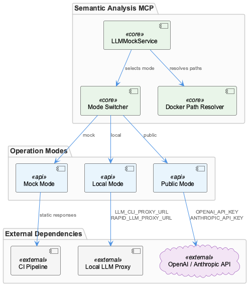
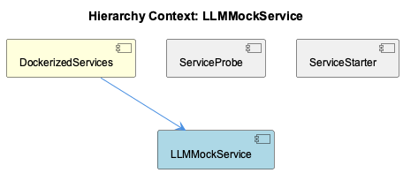

# LLMMockService

**Type:** SubComponent

The local mode in llm-mock-service.ts targets a locally running LLM (possibly via LLM_CLI_PROXY_URL or RAPID_LLM_PROXY_URL environment variables documented in the project), while public mode routes to the external API via OPENAI_API_KEY or ANTHROPIC_API_KEY

# LLMMockService — Technical Reference

## What It Is

LLMMockService is implemented in `integrations/mcp-server-semantic-analysis/src/mock/llm-mock-service.ts` as a three-mode LLM routing abstraction scoped specifically to the semantic analysis MCP integration. Its placement under the `mock/` subdirectory signals an intentional design boundary: this is not a shared infrastructure utility but a testing and environment-adaptation concern belonging exclusively to the semantic analysis MCP. Within the broader DockerizedServices deployment — which packages the semantic analysis MCP alongside services like code-graph-rag, Memgraph, and Redis under `docker/docker-compose.yml` — LLMMockService provides the seam that allows the semantic analysis component to operate across radically different runtime environments without code changes.

## Architecture and Design

The central architectural decision is a **three-mode switcher**: `mock`, `local`, and `public`. This pattern decouples the semantic analysis MCP's core logic from any specific LLM backend, letting the same codebase serve CI pipelines (mock), developer workstations (local), and production deployments (public) through a single configuration boundary. The mode selection is driven by environment variables rather than compile-time branching, which is consistent with the rest of the DockerizedServices philosophy of environment-driven configuration visible across `docker/docker-compose.yml`.

A second architectural concern embedded in LLMMockService is **Docker path resolution**: the service contains logic to adjust file or socket paths depending on whether the process is executing inside a container, bridging the gap between local development layouts and the containerized deployment managed by `docker/Dockerfile.coding-services` and `supervisord.conf`. This mirrors the dual-concern design seen in ServiceProbe, which similarly supports two distinct probe mechanisms (HTTP and TCP) so that different runtime contexts can be accommodated without forking code. The trade-off accepted here is that LLMMockService carries mild environmental awareness — knowledge of "am I in Docker?" — which is a form of infrastructure coupling, but one that is contained within a single file rather than spread across the integration.

## Implementation Details

In **mock mode**, LLMMockService returns static or templated responses, eliminating any network dependency on an LLM API. This makes it the correct backend for CI pipelines and integration test suites that need deterministic, credential-free execution of the semantic analysis MCP. The mock responses are presumably shaped to satisfy the same interface contract that the local and public modes return, meaning consuming code in the semantic analysis MCP does not need to branch on which mode is active.

In **local mode**, the service routes requests to a locally running LLM process, most likely addressed via `LLM_CLI_PROXY_URL` or `RAPID_LLM_PROXY_URL` environment variables documented in the project. This mode serves developers who want real LLM inference during development without incurring external API costs or latency. The Docker path resolution logic is most relevant here, since socket or file paths to a local LLM process differ between a host machine and the containerized environment.

In **public mode**, routing targets external APIs — OpenAI via `OPENAI_API_KEY` or Anthropic via `ANTHROPIC_API_KEY`. This is the production path and the only mode that requires external credentials. Separating this from the other modes means that credential requirements are never accidentally imposed on development or CI workflows.

## Integration Points

LLMMockService lives inside DockerizedServices as part of the semantic analysis MCP service boundary. It does not appear to be consumed by sibling components like ServiceProbe or ServiceStarter, which operate at the infrastructure health and lifecycle layer rather than the LLM routing layer. ServiceStarter's retry-with-backoff pattern handles bringing the semantic analysis MCP process up, and ServiceProbe monitors its health endpoint or TCP port — but neither interacts with LLMMockService's internal routing logic. The dependency boundary is clean: LLMMockService is an internal concern of the semantic analysis MCP, not an infrastructure primitive.

The environment variables `LLM_CLI_PROXY_URL`, `RAPID_LLM_PROXY_URL`, `OPENAI_API_KEY`, and `ANTHROPIC_API_KEY` are the primary external integration points. These are presumably injected via `docker/docker-compose.yml` for containerized runs or via local shell environment for development, consistent with how DockerizedServices manages configuration across its service portfolio.

## Usage Guidelines

Developers working on the semantic analysis MCP should default to **mock mode** in CI and automated test environments. This ensures no API credentials are required in pipelines and that test results remain deterministic. The mock mode's static responses should be kept representative of real LLM output shapes so that integration tests catch interface regressions.

When introducing changes that affect LLM path resolution or mode selection, the Docker path resolution logic inside `llm-mock-service.ts` must be tested both inside and outside the container environment. Because the same file handles both contexts, a change that fixes a local path issue can silently break the containerized deployment managed by `docker/docker-compose.yml` if not validated end-to-end.

LLMMockService should not be promoted to a shared utility across other integrations without deliberate architectural review. Its current scoping to `integrations/mcp-server-semantic-analysis/src/mock/` is a correct boundary decision — other integrations may have different LLM routing needs, and centralizing this logic prematurely would create unwanted coupling across services that DockerizedServices currently keeps independent.

## Hierarchy Context

### Parent
- [DockerizedServices](./DockerizedServices.md) -- DockerizedServices provides the containerization layer for the coding infrastructure, packaging services like the semantic analysis MCP, constraint monitor, code-graph-rag, Memgraph, and Redis into a unified Docker Compose deployment. The architecture centers on docker/docker-compose.yml and docker/Dockerfile.coding-services with supervisord.conf managing multiple processes within a container. Service health is verified through two probe mechanisms: HTTP health endpoints and TCP port checks, used by the health coordinator to track service liveness with strict contracts (never returning 'healthy', only 'running'/'stopped'/'unknown').

### Siblings
- [ServiceProbe](./ServiceProbe.md) -- ServiceProbe in lib/utils/service-probe.js implements two distinct probe mechanisms: HTTP endpoint checks and TCP port checks, allowing different services to be monitored via their most appropriate protocol
- [ServiceStarter](./ServiceStarter.md) -- ServiceStarter in lib/service-starter.js implements a retry-with-backoff pattern for service startup, meaning each failed health check attempt waits an increasing delay before retrying rather than polling at a fixed interval

---

*Generated from 5 observations*
