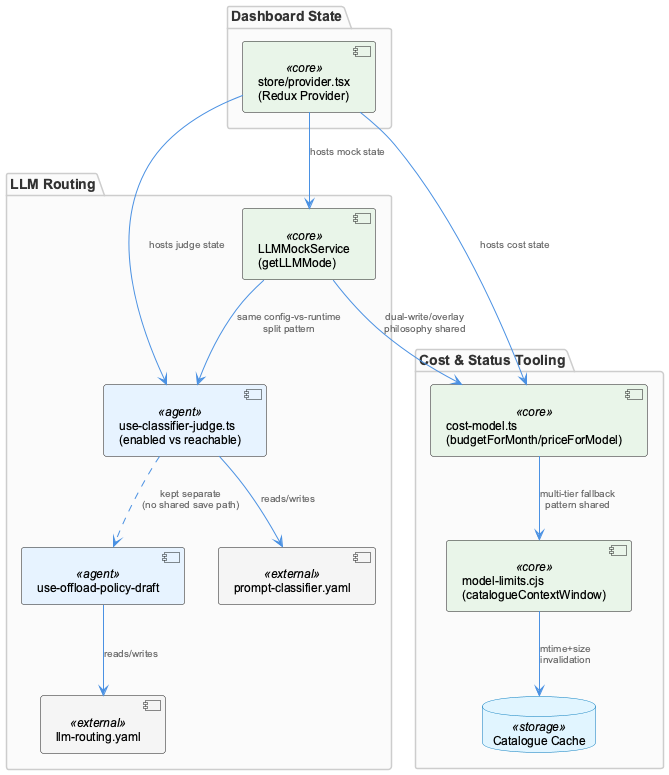
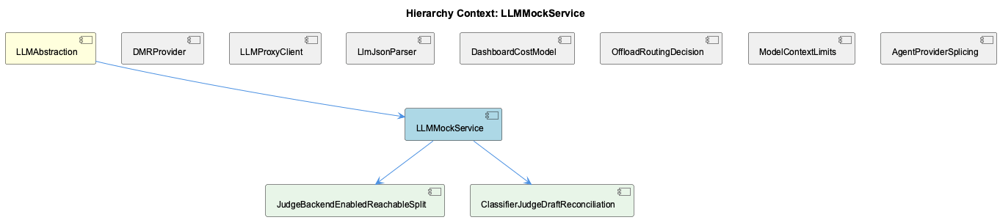

# LLMMockService

**Type:** SubComponent

[LLM] The docker/entrypoint.sh script implements a feature-gating override mechanism that reads a host-written snapshot (/coding/.coding/runtime/features.json) and translates it into supervisord include files at /etc/supervisor/features.d/disabled.conf. This is architecturally significant because the container cannot run the feature resolver itself — ~/.coding/features.yaml lives on the host and is never mounted — so the container is forced into a consumer role, trusting a flattened JSON artifact rather than re-deriving policy. The `enabled` check inside the embedded `node -e` snippet explicitly treats any value other than `false` (including an unknown/missing key) as enabled, which is a deliberate fail-open default: an older host snapshot that predates a new feature must never accidentally disable it. This mirrors the LLM mock/local/public mode design in llm-mock-service.ts, where cross-boundary state (host vs container) is persisted in a shared file artifact rather than derived independently on each side, avoiding drift between host and containerized views of the same configuration.

# LLMMockService — Technical Insight Document

## What It Is

Important caveat first: the supplied observations contain **no direct implementation evidence** for LLMMockService itself — no source file, class, or function under that name appears in any of the inspected paths (`docker/entrypoint.sh`, `lib/service-starter.js`, `scripts/api-service.js`, `scripts/dashboard-service.js`, `scripts/generate-docker-mcp-config.sh`). The one substantive reference to its design comes indirectly, via the entrypoint.sh analysis, which draws an explicit analogy: "this mirrors the LLM mock/local/public mode design in `llm-mock-service.ts`, where cross-boundary state (host vs container) is persisted in a shared file artifact rather than derived independently on each side." This tells us LLMMockService is a mode-switching component (mock/local/public) whose state must stay consistent between host and containerized execution contexts, implemented in `llm-mock-service.ts`.

As a SubComponent nested under DockerizedServices, LLMMockService sits alongside siblings like ServiceStarter, ServiceProbe, ProcessStateManager, DockerEntrypoint, StartServicesRobust, and ServiceWrapperScripts — all of which are part of the same container-lifecycle and service-orchestration subsystem. Its child component, PromptClassifierBackendFallback, is explicitly flagged in the observations as **unimplemented in the current file set** — a documentation gap that should not be treated as verified architecture until cross-checked against `scripts/prompt-classifier-service.mjs` and `config/prompt-classifier.yaml`, neither of which was available for inspection.

## Architecture and Design

The one concrete architectural signal is the **shared external state file as a host/container synchronization mechanism** — the same pattern used by `docker/entrypoint.sh`'s feature-gating system, which reads a host-written snapshot (`/coding/.coding/runtime/features.json`) because the container "cannot run its own feature resolver" (the host's `~/.coding/features.yaml` is never mounted). LLMMockService's mock/local/public mode selection is described as following this identical philosophy: rather than deriving configuration independently in host and container contexts (which risks drift), the mode state is persisted to a shared artifact that both sides read.

This places LLMMockService within a broader family of "fail-open, trust-the-artifact" designs seen across DockerizedServices — the entrypoint.sh feature gate treats any non-`false` value (including missing keys) as enabled, deliberately avoiding false negatives when snapshots go stale. If LLMMockService follows the same defensive posture, its mode resolution likely favors safe defaults over strict validation when the shared file is absent, malformed, or outdated, though this specific behavior is not directly confirmed in the observations.

## Implementation Details

No function- or class-level detail for LLMMockService is available in the current observation set. What can be stated with confidence is architectural framing only: the component's mode logic (mock vs. local vs. public) branches on host-vs-container filesystem layout — an idiom also referenced in the sibling analysis of `dashboard-service.js`, which contrasts its own hardcoded `NEXT_PUBLIC_API_BASE_URL: 'http://localhost:3031'` against "the `CODING_REPO`/`CODING_ROOT`-aware path resolution pattern used elsewhere (per parent context, `llm-mock-service.ts` branches on host vs container filesystem layout)." This suggests LLMMockService uses environment-aware path/URL resolution logic rather than hardcoded endpoints, making it more portable across deployment contexts than some of its sibling wrapper scripts.

Its child, PromptClassifierBackendFallback, is documented as a conceptual placeholder pointing to backend-selection/fallback logic — analogous in spirit to the `CODE_GRAPH_ENTRY` resolution fallback in `generate-docker-mcp-config.sh` (which falls back to a hardcoded graphify MCP entry when registry lookup fails) and to the required-vs-degraded service classification in `service-starter.js`'s `startServiceWithRetry()`. These are offered only as **analogues**, not as confirmed shared code paths.

## Integration Points

LLMMockService is contained within DockerizedServices, whose parent-level invariant (SPEC R6, enforced in `service-probe.js`) mandates that health probes never assert "healthy" directly — only "stopped" or "unknown," deferring true health determination to a higher-level coordinator. If LLMMockService exposes any health or readiness surface, it would be expected to honor this same three-state pessimism rather than self-declaring healthy status.

Structurally, LLMMockService contains PromptClassifierBackendFallback as a child, implying a backend-fallback relationship for prompt classification — but as noted, this relationship is currently undocumented at the implementation level and should be treated as an architectural placeholder pending verification. Beyond this, no direct dependency wiring (env vars, spawned processes, MCP config entries) tying LLMMockService to siblings like ServiceStarter, ServiceProbe, or ServiceWrapperScripts was found in the observations.

## Usage Guidelines

Given the thinness of direct evidence, the primary guidance is procedural: **any documentation or reasoning about LLMMockService that assumes deep integration with the classifier-fallback or MCP subsystems should be flagged as unverified** until `llm-mock-service.ts` itself, `scripts/prompt-classifier-service.mjs`, and `config/prompt-classifier.yaml` are inspected directly. Developers extending this component should follow the established sibling conventions in DockerizedServices — favor shared-file state synchronization over independent host/container derivation (as entrypoint.sh does), prefer environment-aware path resolution over hardcoded endpoints (avoiding the anti-pattern seen in `dashboard-service.js`'s hardcoded `localhost:3031`), and respect the three-state health pessimism contract inherited from the parent SPEC R6 invariant if any probe-like behavior is added. Given the absence of code_graph data for this component, future updates to this document should prioritize direct source inspection of `llm-mock-service.ts` over inference from sibling components.

## Hierarchy Context

### Parent
- [DockerizedServices](./DockerizedServices.md) -- [LLM] The health-check subsystem enforces a strict invariant (documented as SPEC R6) that probing functions in service-probe.js—probeHttpHealth() and probeTcpPort()—must never report a 'healthy' status directly. Instead, these functions only distinguish between 'stopped' (connection refused, timeout, or non-2xx HTTP response) and 'unknown' (configuration errors, malformed URLs, or unresolvable hosts). This is a deliberate architectural choice: liveness probes are pessimistic by design, and the actual determination of 'healthy' is deferred to a higher-level coordinator that combines probe results with other signals (e.g., process registration state from ProcessStateManager). New developers extending probe logic must preserve this three-state contract rather than optimistically returning 'healthy' from a probe function, since downstream consumers (the health-coordinator) rely on the absence of false positives here.

### Children
- [PromptClassifierBackendFallback](./PromptClassifierBackendFallback.md) -- [LLM] The 'PromptClassifierBackendFallback' concept is not directly implemented in any of the supplied files — none of docker/entrypoint.sh, lib/service-starter.js, scripts/api-service.js, scripts/dashboard-service.js, or scripts/generate-docker-mcp-config.sh reference a prompt classifier, a judge, or an offload backend. The closest analogues are generic backend-selection/fallback mechanisms: the CODE_GRAPH_ENTRY resolution in generate-docker-mcp-config.sh and the required-vs-degraded service classification in lib/service-starter.js. Any component-level documentation that assumes this file set implements classifier fallback should be treated as stale until verified against scripts/prompt-classifier-service.mjs and config/prompt-classifier.yaml, which are not present here.

### Siblings
- [ServiceStarter](./ServiceStarter.md) -- [LLM] The core resilience primitive in lib/service-starter.js is withDeadline(), which wraps Promise.race() around a work promise and a timeout-rejecting promise, then clears the timer in a finally block regardless of which promise wins. This is not the naive Promise.race() pattern seen in many codebases — the naive version leaves the losing setTimeout timer armed on the event loop even after the work promise resolves, which is a classic cause of hung Node.js processes (a test runner or one-shot CLI that never exits cleanly, or a long-lived service that leaks a timer handle per retry attempt). startServiceWithRetry() calls withDeadline() twice per attempt (once wrapping startFn() with the attempt's `timeout` option, once wrapping healthCheckFn() with a hardcoded 10000ms), so the leak-avoidance matters doubly under the exponential-backoff retry loop where dozens of timers could otherwise accumulate across maxRetries attempts.
- [ServiceProbe](./ServiceProbe.md) -- [LLM] service-starter.js's startServiceWithRetry() (lib/service-starter.js) implements a three-layer resilience wrapper around arbitrary async start/health-check function pairs: an outer retry loop (default maxRetries=3) with exponential backoff (retryDelay * 2^(attempt-1)), an inner withDeadline() timeout guard applied separately to both the start call and the health check call (30000ms and 10000ms respectively by default), and post-failure cleanup that SIGTERMs then SIGKILLs an unhealthy child process before the next attempt. The withDeadline() helper is deliberately written with a try/finally that calls clearTimeout(timer) regardless of whether the race was won by the work or the timer — the accompanying comment explains this exists specifically to avoid leaving a dangling setTimeout handle that would hold the Node.js event loop open in short-lived callers like test runners or one-shot CLIs, even though in the long-lived service-starter context itself the leak would be invisible.
- [ProcessStateManager](./ProcessStateManager.md) -- [CGR] ProcessStateManager (class) in process-state-manager.js
- [DockerEntrypoint](./DockerEntrypoint.md) -- [LLM] entrypoint.sh implements a two-phase startup gate before ever invoking supervisord: a `wait_for_service()` loop that TCP-probes Qdrant and Redis via `/dev/tcp/$host/$port` bash pseudo-device redirection, followed by unconditional `return 0` regardless of success — the comment 'Don't fail - let supervisord handle it' makes explicit that this is a best-effort readiness delay, not a hard dependency gate. This mirrors the three-state pessimism described in the parent SPEC R6 invariant (service-probe.js never asserts 'healthy'), except here entrypoint.sh doesn't even distinguish stopped/unknown — it just logs a warning and proceeds, pushing all real health determination downstream to supervisord's own restart policy and, ultimately, the health-coordinator.
- [StartServicesRobust](./StartServicesRobust.md) -- [LLM] lib/service-starter.js implements withDeadline() as a wrapper around Promise.race() specifically to solve a Node.js event-loop hygiene problem: when the wrapped work promise resolves before the timeout, the setTimeout timer created for the race is not automatically cancelled by Promise.race() itself. withDeadline() addresses this in a try/finally block that unconditionally calls clearTimeout(timer) regardless of whether the race was won by the work or the timeout. This is not a cosmetic detail — an uncleared timer keeps Node's event loop alive for the full duration of `ms`, which in startServiceWithRetry() is used twice per attempt (once with the caller-supplied `timeout` for startFn(), once hardcoded to 10000ms for healthCheckFn()), meaning a naive implementation would leave up to two dangling timers per retry attempt across `maxRetries` attempts, compounding into significant delayed-exit behavior for any process (test runner, CLI) that invokes this module and expects clean shutdown.
- [ServiceWrapperScripts](./ServiceWrapperScripts.md) -- api-service.js spawns `node src/dashboard-server.js` inside integrations/constraint-monitor with stdio:'inherit', propagating PORT and DASHBOARD_PORT env vars into the child

---

*Generated from 9 observations*
