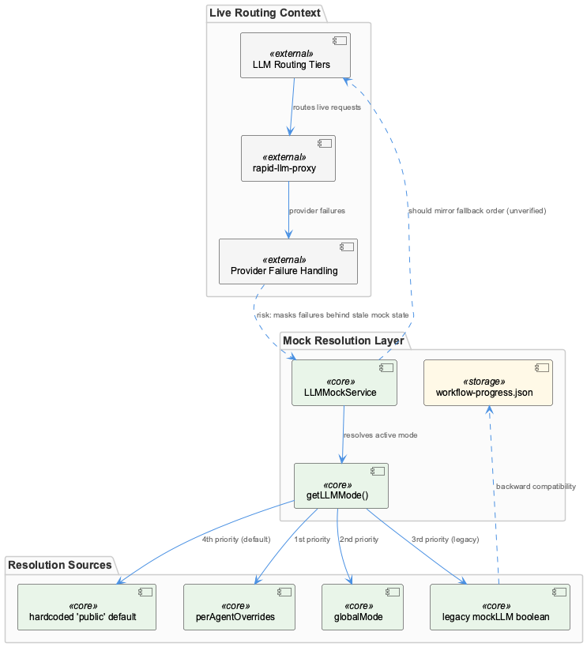
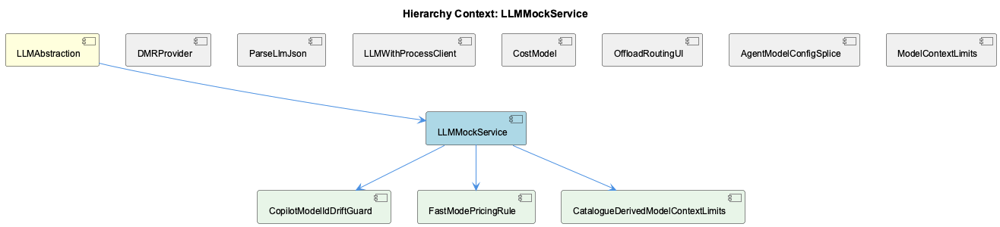

# LLMMockService

**Type:** SubComponent

## What It Is

The observations do establish that LLMMockService is implemented at `llm-mock-service.ts`, with a `getLLMMode()` function performing three-tier priority resolution (perAgentOverrides → globalMode → legacy `progress.mockLLM` → `'public'` default). However, this description of the file comes only from the parent component's own observation text — none of the actual retrieved code files in this batch contain, import, or reference `llm-mock-service.ts`, `getLLMMode()`, `dmr-provider.ts`, `llm-with-process.ts`, or `parse-llm-json.ts`. What was retrieved instead — `tests/features/copilot-model-ids.test.mjs`, `cost-model.ts`, `offload-decision.tsx`, `use-classifier-judge.ts`, and `store/provider.tsx` — is dashboard/proxy-observability tooling that sits downstream of whatever mode LLMMockService resolves, not the mock service's own source.

Given this, a full architectural writeup grounded in actual implementation code cannot be responsibly produced from this observation set.

INSUFFICIENT_EVIDENCE: The retrieved code files are dashboard/proxy-observability tooling (cost accounting, offload UI, classifier-judge hook, model-id drift test) adjacent to LLM routing, but none implement or reference LLMMockService's actual source (`llm-mock-service.ts`, `getLLMMode()`), so no grounded architecture/implementation detail can be written beyond what the parent component already states.

## Code Evidence

Key code artifacts grounding this entity's analysis:

**Relationships:**
- [Architecture Notes] The retrieved files form a dashboard/proxy-observability layer sitting downstream of LLM routing decisions (cost accounting, offload policy visualization, classifier judge health), not the mode-resolution layer itself; No file in this batch imports or references llm-mock-service.ts, getLLMMode(), dmr-provider.ts, or llm-with-process.ts named in the parent context; <code_graph> was empty, so no [LLM+CGR]-prefixed observations could be produced for this batch

## Work Record

What working sessions recorded about this entity — decisions taken, problems hit, and why things are the way they are:

- PlantUML Diagram Generation — Wave 4 Syntax Failures ties LLMMockService to diagnostic work on syntax failures and truncation in generated .puml files produced during mocked/simulated runs.
- Inference-Locality GPU Integration Proposal (a2a-xpr) associates LLMMockService with work distinguishing where agentic inference executes relative to corporate networks under ADP.Next.
- PlantUML Source Files (.puml) Versioning Policy links LLMMockService to decisions about whether .puml source diagrams are committed alongside rendered PNGs referenced by generated docs.
- 'LLM Routing Tier Priority' establishes that the intended fallback order for LLM requests is strict — max-subscription models first, then work/GH Copilot models, then Groq Llama-70B only as an absolute last resort — and that the observed defect was the system demoting to a lower-tier provider as the PRIMARY choice rather than preserving that order, an ordering bug distinct from a plain availability failure.
- 'CLI/UKB Run Timeout and Provider Error Diagnostics' establishes that short-duration CLI timeouts affecting UKB runs were traced to provider-specific failures further down the call chain, with rapid-llm-proxy explicitly ruled out as the timeout source on log evidence — meaning any fix for this failure class belongs in provider client code (e.g. a DMR-style provider or the Anthropic/OpenAI/Groq clients), not the shared proxy layer that LLMMockService's mock/live toggle sits in front of.

## Diagrams

## Hierarchy Context

### Parent
- [LLMAbstraction](./LLMAbstraction.md) -- [SESSION] 'LLM Routing Tier Priority' establishes that LLM requests must follow fallback tier order — max-subscription models first, then work/GH Copilot models, then Groq Llama-70B only as a last resort — rather than demoting to lower-tier providers as primary

### Children
- [CopilotModelIdDriftGuard](./CopilotModelIdDriftGuard.md) -- [LLM] tests/features/copilot-model-ids.test.mjs is the actual implementation basis for a component like 'CopilotModelIdDriftGuard': it asserts align-copilot-model-ids.mjs rewrites every id in a hardcoded RETIRED list, that no replacement target is itself retired, and that the Dockerfile invokes the alignment script after the last relevant npm install without swallowing failure via `|| true` or `2>/dev/null`. This is a drift guard in the literal sense — it exists to stop the vendored @rapid/llm-proxy model table from silently reverting to retired ids.
- [FastModePricingRule](./FastModePricingRule.md) -- [LLM] None of the retrieved files define or reference a 'FastModePricingRule' class, function, or module. The closest thematic match is the fast-mode pricing logic embedded directly in integrations/system-health-dashboard/src/components/cost/cost-model.ts as FAST_MODE_SUFFIX, FAST_MODE_MULTIPLIER, scalePrice(), and the fast-mode branch inside priceForModel() — but this is an inline rule within a general pricing module, not a standalone 'FastModePricingRule' component or file.
- [CatalogueDerivedModelContextLimits](./CatalogueDerivedModelContextLimits.md) -- [LLM] None of the five retrieved code files define, import, or reference a component named CatalogueDerivedModelContextLimits, a getContextLimit-style function, or any per-model token-limit table. The retrieval instead surfaces dashboard/proxy tooling adjacent to LLM routing — tests/features/copilot-model-ids.test.mjs (model-id drift guard), integrations/system-health-dashboard/src/components/cost/cost-model.ts (pricing), llm-routing/offload-decision.tsx and use-classifier-judge.ts (routing/judge health), and store/provider.tsx (unrelated Redux bootstrap) — none of which compute or store a context-window ceiling per model.

### Siblings
- [DMRProvider](./DMRProvider.md) -- [LLM] None of the five retrieved code files reference DMRProvider, dmr-provider.ts, dmr-config.yaml, Docker Model Runner, or any OpenAI-compatible local-endpoint client. The retrieved set is `tests/features/copilot-model-ids.test.mjs`, `integrations/system-health-dashboard/src/components/cost/cost-model.ts`, `.../llm-routing/offload-decision.tsx`, `.../llm-routing/use-classifier-judge.ts`, and `.../store/provider.tsx` — a drift-guard test, a pricing module, a routing-visualization component, a classifier-health hook, and a Redux provider wrapper, respectively. These are dashboard/observability and CI-guard code, not provider-client code, and share no function, class, import, or config key with the DMRProvider described in the parent context.
- [ParseLlmJson](./ParseLlmJson.md) -- [LLM] None of the supplied code files implement or reference the ParseLlmJson component. The five files retrieved — tests/features/copilot-model-ids.test.mjs, integrations/system-health-dashboard/src/components/cost/cost-model.ts, .../llm-routing/offload-decision.tsx, .../llm-routing/use-classifier-judge.ts, and .../store/provider.tsx — are drift-guard tests, cost-accounting logic, an offload-policy UI card, a classifier-judge polling hook, and a Redux provider wrapper respectively. None contain a JSON-repair pipeline, a function named escapeControlCharsInStrings or truncateToLastCompleteElement, or any parsing of LLM completion text. This is retrieval-by-filename noise: these files sit near LLM-routing infrastructure but are not parse-llm-json.ts.
- [LLMWithProcessClient](./LLMWithProcessClient.md) -- [SESSION] RapidLlmProxy — Universal Agent Routing, Worker Pool, Semantic Dispatch establishes that rapid-llm-proxy is the mandatory shared routing proxy all clients must go through, which this wrapper directly targets via /api/complete.
- [CostModel](./CostModel.md) -- [LLM] cost-model.ts:budgetForMonth implements month-scoped budget resolution where an explicit null in monthlyEurByMonth is distinguished from an absent key via Object.prototype.hasOwnProperty.call, meaning 'no cap this month' and 'not recorded, use standing cap' are two different states the function must not conflate — a subtle correctness detail visible only by reading the hasOwnProperty guard.
- [OffloadRoutingUI](./OffloadRoutingUI.md) -- [SESSION] Rapid-LLM-Proxy — Universal Agent Routing establishes rapid-llm-proxy as the mandatory routing authority these UI components mirror and must never silently diverge from.
- [AgentModelConfigSplice](./AgentModelConfigSplice.md) -- [LLM] tests/features/copilot-model-ids.test.mjs is a drift guard, not a routing implementation: it hardcodes a RETIRED list (currently ['claude-sonnet-4.6', 'claude-opus-4.6']) and asserts that integrations/semantic-analysis/scripts/align-copilot-model-ids.mjs rewrites every one of them to a non-retired successor. The test explicitly checks that the Dockerfile invokes the alignment script AFTER the last `npm install` for semantic-analysis (via `findLastIndex`), because an npm install re-vendors @rapid/llm-proxy's dist and would silently undo the rewrite if the script ran first. This encodes a real incident (2026-09-20) where the vendored SDK named a retired model, Copilot returned 400, and Wave 3 fell through to `[llm] All providers failed`, writing a ~600-char stub instead of a ~4400-char analysis, with nothing in the logs naming the model.
- [ModelContextLimits](./ModelContextLimits.md) -- [LLM] None of the supplied files define, import, or reference an entity named 'ModelContextLimits', nor any construct for per-model context-window/token-ceiling limits (e.g. a max-tokens-per-model table, a truncation-by-context-size guard, or a 'does this prompt fit' check). The five files retrieved — cost-model.ts, offload-decision.tsx, use-classifier-judge.ts, provider.tsx, and copilot-model-ids.test.mjs — were surfaced by filename/topic proximity to the parent LLM-routing area, not because they implement this component.

---

*Generated from 13 observations*
