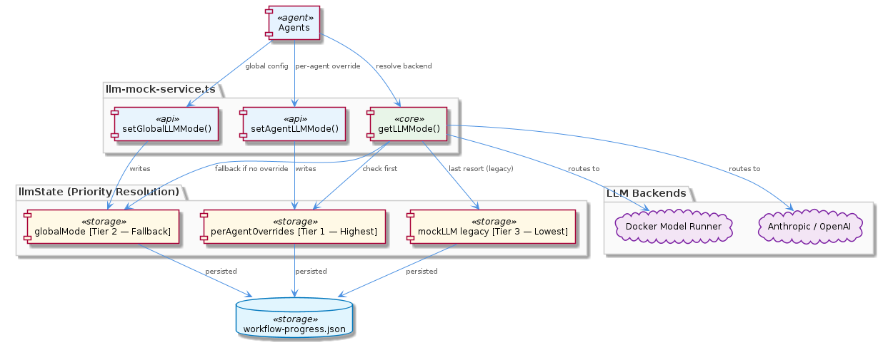
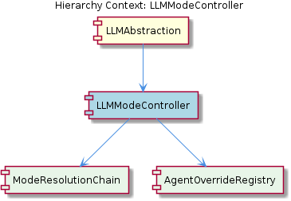

# LLMModeController

**Type:** SubComponent

`setAgentLLMMode` writes entries into `llmState.perAgentOverrides`, enabling mixed-mode workflows where distinct agents (e.g., a code-indexing agent vs. a complex reasoning agent) are routed to different LLM backends — Docker Model Runner or Anthropic/OpenAI — within a single workflow execution

# LLMModeController — Technical Insight Document

## What It Is

The `LLMModeController` is a SubComponent implemented within `llm-mock-service.ts`, where it materializes as the `getLLMMode()` resolution function and its companion mutators `setAgentLLMMode`, `setGlobalLLMMode`, and `getLLMState`. It operates on a shared in-memory structure named `llmState`, which contains two primary fields: `globalMode` (a single mode string) and `perAgentOverrides` (a keyed map of agent identifiers to mode strings). A legacy `mockLLM` boolean field is also consulted as a last-resort fallback.

Functionally, the controller is the decision authority that determines which LLM backend — for instance, Docker Model Runner for local inference or Anthropic/OpenAI for cloud-hosted reasoning — should service any given agent request at runtime. It sits inside its parent `LLMAbstraction` layer and delegates the actual ordered-lookup mechanics to its child `ModeResolutionChain`, while relying on its sibling-of-resolution child `AgentOverrideRegistry` to hold the per-agent mappings.

## Architecture and Design

The architecture follows a **prioritized chain-of-responsibility pattern** with three explicit tiers, ordered from most-specific to least-specific: per-agent overrides → global mode → legacy `mockLLM` boolean. This ordering is not incidental; it encodes the principle that **specificity wins over generality**. `getLLMMode()` opens by inspecting `llmState.perAgentOverrides` keyed on the requesting agent's identifier — a behavior fully implemented by the `ModeResolutionChain` child — and only falls through to `llmState.globalMode` when no override exists. If neither is populated, the legacy `mockLLM` boolean is consulted last, preserving backward compatibility without requiring migration of older configuration files.

The design also embodies a clean **separation between resolution and inspection**. `getLLMMode()` performs ordered resolution and returns the effective mode, while `getLLMState()` exposes the entire `llmState` object — both `globalMode` and the full `perAgentOverrides` map — as a read-only view. This separation means that audit and debugging callers can inspect current assignments without triggering the resolution side-effects or being subject to fallback collapsing, which is essential when diagnosing why a particular agent resolved to an unexpected mode.

State persistence is achieved through the shared `workflow-progress.json` file. This makes `LLMModeController` a **stateful, durable controller** rather than a transient resolver: mode assignments survive process restarts and are observable to every component participating in the workflow. This shared-file persistence model means the controller integrates naturally with the broader workflow lifecycle managed by its parent `LLMAbstraction`.

## Implementation Details

The core resolution logic lives in `getLLMMode()` inside `llm-mock-service.ts`. When invoked with an agent identifier, the function performs an ordered lookup:

1. **Tier 1 — Per-Agent Override:** It first checks `llmState.perAgentOverrides` for an entry matching the requesting agent's identifier. This is the realm of the `AgentOverrideRegistry` child component, which holds the keyed map associating each named agent with a specific LLM mode string. If a match is found, that mode is returned immediately.
2. **Tier 2 — Global Mode:** If no per-agent entry exists, the function reads `llmState.globalMode`, which acts as the system-wide default for all agents not individually overridden.
3. **Tier 3 — Legacy `mockLLM`:** If neither of the above is set, the function falls through to the legacy `mockLLM` boolean. This branch exists exclusively for backward compatibility with configurations that predate the `llmState` structure.

Mutation is split across two narrowly-scoped writers. `setAgentLLMMode` writes entries into `llmState.perAgentOverrides`, which is the mechanism that enables mixed-mode workflows — for example, routing a lightweight code-indexing agent to Docker Model Runner while routing a complex reasoning agent to a cloud API, all within a single workflow execution. `setGlobalLLMMode` writes to `llmState.globalMode`, establishing the intermediate fallback tier. Both writers ultimately cause the updated state to be persisted to `workflow-progress.json`, ensuring durability and cross-component visibility.

`getLLMState` is the inspection interface, returning the full `llmState` object so that callers can audit both `globalMode` and the entire `perAgentOverrides` map without going through the resolution chain. This is particularly important for debugging scenarios where a developer needs to see what is *configured* rather than what would be *resolved*.

## Integration Points

`LLMModeController` is contained by `LLMAbstraction`, which is the layer responsible for the broader three-tier mode resolution hierarchy and for choosing among backends like Docker Model Runner, Anthropic, and OpenAI. The controller in turn contains two children that partition its responsibilities: `ModeResolutionChain` owns the ordered lookup behavior implemented at the top of `getLLMMode()`, while `AgentOverrideRegistry` owns the `llmState.perAgentOverrides` keyed map structure that makes heterogeneous agent fleets possible.

Integration with the rest of the system flows through two channels. The first is the **function-level API surface** — `getLLMMode`, `setAgentLLMMode`, `setGlobalLLMMode`, and `getLLMState` — exported from `llm-mock-service.ts` and consumed wherever an agent needs to determine its backend or where orchestration code needs to assign modes. The second is the **shared persistence channel**: `workflow-progress.json` is read and written by multiple components across a workflow run, making the LLM mode state implicitly available to any participant that loads that file.

The legacy `mockLLM` boolean represents an integration point with **historical configuration formats**. Callers that predate the `llmState` structure can continue functioning without migration because their `mockLLM` field is still honored — just at the lowest priority.

## Usage Guidelines

When **setting modes**, prefer `setAgentLLMMode` whenever the intent is to target a specific agent within a heterogeneous workflow. Use `setGlobalLLMMode` only when the assignment should apply broadly to all agents not otherwise overridden. Avoid writing the legacy `mockLLM` field directly in new code; it exists solely for backward compatibility and will be silently shadowed by either of the higher-priority tiers.

When **debugging unexpected mode behavior**, always inspect all three tiers in order: `perAgentOverrides` first, then `globalMode`, then `mockLLM`. A common pitfall is observing a populated `mockLLM` field in a persisted `workflow-progress.json` and assuming it is in effect; if either `perAgentOverrides` (for the agent in question) or `globalMode` is set, `mockLLM` will silently lose. Use `getLLMState` rather than `getLLMMode` for this kind of audit, because `getLLMState` exposes the raw configuration without applying the resolution chain.

When **designing mixed-mode workflows**, the `perAgentOverrides` map is the intended mechanism. A canonical example is routing a code-indexing agent — which benefits from fast local inference — to Docker Model Runner via a per-agent override, while leaving a complex-reasoning agent to fall through to a `globalMode` of Anthropic or OpenAI. This pattern is precisely what the three-tier hierarchy was designed to support, and it is the primary architectural justification for the controller's existence.

Finally, because state is persisted to `workflow-progress.json` and shared across components, treat mode assignments as **durable side-effects**. Changes made in one part of a workflow will persist across process restarts and become visible to all readers of that file, so callers should consider whether they want a permanent assignment or whether they need to revert state at the end of an operation.

## Hierarchy Context

### Parent
- [LLMAbstraction](./LLMAbstraction.md) -- [LLM] The LLMAbstraction layer implements a three-tier mode resolution hierarchy in `getLLMMode()` within `llm-mock-service.ts` that prioritizes specificity over generality: a per-agent override stored in `llmState.perAgentOverrides` takes precedence over the `llmState.globalMode`, which in turn takes precedence over a legacy `mockLLM` boolean field. This design is significant because it allows the system to run mixed-mode configurations in production — for example, running a lightweight code-indexing agent against the local Docker Model Runner while routing a more complex reasoning agent to a cloud API like Anthropic or OpenAI, all within a single workflow execution. The legacy `mockLLM` boolean is retained explicitly for backward compatibility, meaning older configuration files or callers that predate the `llmState` structure continue to function without migration. New developers should be aware that if they observe unexpected behavior when `globalMode` is set but `mockLLM` is also present in a persisted state file, the `mockLLM` boolean is the lowest-priority fallback and will only activate when neither of the higher-priority fields are populated.

### Children
- [ModeResolutionChain](./ModeResolutionChain.md) -- `getLLMMode()` in `llm-mock-service.ts` opens by inspecting `llmState.perAgentOverrides` keyed on the requesting agent's identifier, making per-agent configuration the highest-priority tier and ensuring agent-specific settings always win over any system-wide state.
- [AgentOverrideRegistry](./AgentOverrideRegistry.md) -- `llmState.perAgentOverrides` is a keyed map where each entry associates a named agent identifier with a specific LLM mode string, allowing heterogeneous agent fleets within the same workflow to target different backends simultaneously.

---

*Generated from 7 observations*
