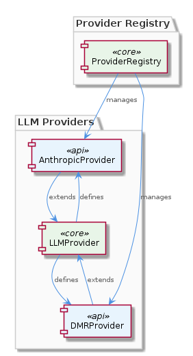
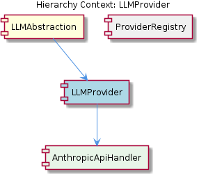

# LLMProvider

**Type:** SubComponent

Each LLMProvider implementation is responsible for handling the specifics of interacting with its respective API.

## What It Is  

`LLMProvider` is the core abstraction that enables the **LLMAbstraction** component to talk to any large‑language‑model service in a provider‑agnostic way. The concrete provider implementations live under `lib/llm/providers/` – for example `anthropic-provider.ts` defines **AnthropicProvider** and `dmr-provider.ts` defines **DMRProvider**. Both classes **extend** the `LLMProvider` interface, inheriting a common contract of methods that the rest of the system can rely on. Instances of these providers are not created ad‑hoc; they are constructed and cached by the **ProviderRegistry** (`lib/llm/provider-registry.js`). This arrangement lets the higher‑level `LLMAbstraction` component switch between providers (Anthropic, DMR, or future ones) without any code changes outside the registry.  

  

## Architecture and Design  

The design follows a classic **Strategy pattern**: `LLMProvider` defines the strategy interface, and each concrete provider (Anthropic, DMR) supplies a specific algorithm for communicating with its backend API. By coding against the interface, `LLMAbstraction` remains decoupled from provider details.  

Management of the concrete strategies is handled by a **Registry pattern** embodied in `ProviderRegistry`. The registry holds a map of provider names to instantiated `LLMProvider` objects, exposing a lookup API that `LLMAbstraction` uses to obtain the appropriate provider at runtime. This centralised instantiation also enables configuration sharing (e.g., API keys, endpoint URLs) and lazy loading if desired.  

The relationship between the components is visualised in the relationship diagram:  

  

Together, these patterns give the system a clean separation of concerns: the abstraction layer knows *what* it wants (generate text, stream completions, etc.), while each provider knows *how* to fulfil those requests for a particular service.

## Implementation Details  

- **LLMProvider Interface** – Located conceptually as the contract that all providers must implement. It declares methods such as `generate`, `stream`, and any lifecycle hooks required for request handling. Because the interface is shared, callers can treat any provider uniformly.  

- **AnthropicProvider (`lib/llm/providers/anthropic-provider.ts`)** – Extends `LLMProvider` and delegates the low‑level HTTP work to an **AnthropicApiHandler** (its child component). The handler encapsulates endpoint URLs, request payload construction, and response parsing specific to the Anthropic API. By keeping the API‑specific logic in a dedicated handler, the provider class stays focused on translating the generic `LLMProvider` contract into Anthropic‑specific calls.  

- **DMRProvider (`lib/llm/providers/dmr-provider.ts`)** – Also extends `LLMProvider` but targets a local inference engine (DMR). Its implementation mirrors the AnthropicProvider’s shape but swaps out the network handler for a local process invocation or library call.  

- **ProviderRegistry (`lib/llm/provider-registry.js`)** – Exposes methods such as `register(name, providerClass)` and `get(name)`. During application start‑up it registers `AnthropicProvider` under a key like `"anthropic"` and `DMRProvider` under `"dmr"`. When `LLMAbstraction` asks for a provider, the registry either returns an existing instance or constructs a new one, ensuring a single source of truth for configuration.  

All three files reside under the `lib/llm/` namespace, reinforcing a cohesive module boundary for language‑model interactions.

## Integration Points  

`LLMProvider` sits directly beneath the **LLMAbstraction** component, which consumes the provider via the registry. The abstraction layer never touches the concrete provider classes; it only calls the methods defined by the `LLMProvider` interface.  

The **ProviderRegistry** is the sibling component that orchestrates the lifecycle of each provider. It is the sole entry point for external code that wishes to add or replace a provider, making it the integration hotspot for new LLM services.  

Within the provider hierarchy, **AnthropicProvider** composes an **AnthropicApiHandler**. This child component is the integration point with the external Anthropic REST API, handling authentication headers, request throttling, and response deserialization.  

Because the contract is interface‑driven, any other system module that needs LLM capabilities—such as a chat UI, a batch processing job, or a testing harness—can obtain a provider through the registry without needing to know which backend is being used.

## Usage Guidelines  

1. **Obtain providers through the registry** – Never instantiate `AnthropicProvider` or `DMRProvider` directly. Call `ProviderRegistry.get('anthropic')` (or the appropriate key) to receive a ready‑to‑use instance that respects the global configuration.  

2. **Respect the interface contract** – Interact with the provider only via the methods defined on `LLMProvider`. This guarantees compatibility across current and future providers.  

3. **Configure providers centrally** – All API keys, endpoint URLs, and runtime flags should be supplied to the registry during start‑up. The registry will forward these settings to each provider’s constructor or its internal handler (e.g., `AnthropicApiHandler`).  

4. **Add new providers by extending `LLMProvider`** – To integrate a new LLM service, create a class under `lib/llm/providers/` that extends the interface, implement the required methods, and register it in `ProviderRegistry`. No changes to `LLMAbstraction` are required.  

5. **Handle errors at the abstraction level** – Since each provider may surface different error shapes (network failures, rate limits, model‑specific errors), wrap calls in try/catch blocks in `LLMAbstraction` and translate them into a unified error type before propagating upward.  

---

### Architectural Patterns Identified  
- **Strategy pattern** – `LLMProvider` interface + concrete providers.  
- **Registry pattern** – `ProviderRegistry` centralises provider creation and lookup.  

### Design Decisions and Trade‑offs  
- **Provider‑agnostic abstraction** improves flexibility but adds an indirection layer that can slightly increase latency.  
- **Separate API handler (AnthropicApiHandler)** isolates third‑party specifics, making the provider class easier to test but introduces an extra class to maintain.  

### System Structure Insights  
- The `LLMAbstraction` → `ProviderRegistry` → `LLMProvider` → (optional) `*ApiHandler` chain creates a clear vertical hierarchy, with each level responsible for a distinct concern (business logic, registration, API interaction).  

### Scalability Considerations  
- New providers can be added without touching existing code, supporting horizontal scaling across multiple LLM services.  
- The registry can be extended to lazily instantiate providers, reducing memory footprint when many providers are defined but only a few are used at runtime.  

### Maintainability Assessment  
- Strong interface boundaries and the registry centralisation make the codebase easy to navigate and modify.  
- Keeping provider‑specific logic in dedicated handler classes limits the blast radius of API changes, enhancing long‑term maintainability.

## Hierarchy Context

### Parent
- [LLMAbstraction](./LLMAbstraction.md) -- [LLM] The LLMAbstraction component uses a provider-agnostic approach, allowing for easy switching between different LLM providers. This is achieved through the ProviderRegistry class (lib/llm/provider-registry.js), which manages the different LLM providers and their configurations. For instance, the AnthropicProvider class (lib/llm/providers/anthropic-provider.ts) is used to interact with the Anthropic API, while the DMRProvider class (lib/llm/providers/dmr-provider.ts) is used for local LLM inference. The use of a provider registry enables the component to be highly flexible and scalable, as new providers can be easily added or removed without affecting the overall architecture.

### Children
- [AnthropicApiHandler](./AnthropicApiHandler.md) -- The AnthropicProvider class (lib/llm/providers/anthropic-provider.ts) likely extends the LLMProvider class and utilizes the Anthropic API for LLM operations.

### Siblings
- [ProviderRegistry](./ProviderRegistry.md) -- The ProviderRegistry class (lib/llm/provider-registry.js) uses a provider-agnostic approach to manage LLM providers.

---

*Generated from 5 observations*
