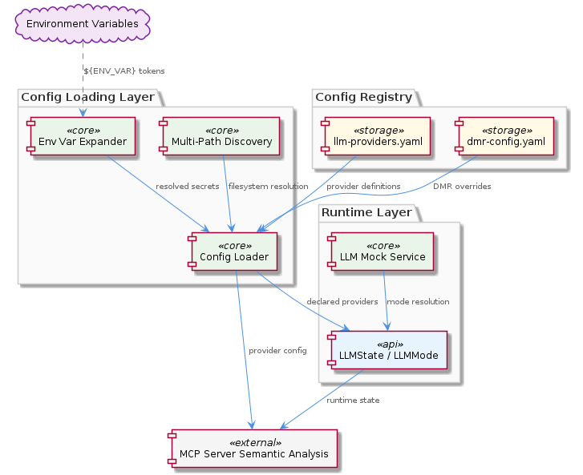
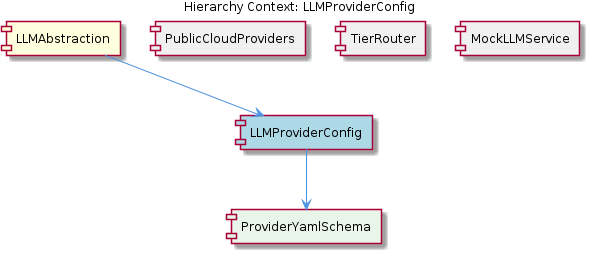

# LLMProviderConfig

**Type:** SubComponent

The LLMState interface and LLMMode type defined in src/mock/llm-mock-service.ts are consumed alongside provider config, creating an implicit coupling between runtime mode resolution and config-declared providers

# LLMProviderConfig — Technical Insight Document

## What It Is

LLMProviderConfig is the configuration sub-layer of the `LLMAbstraction` component, implemented primarily through YAML files under the `config/` directory. Its canonical entry point is `config/llm-providers.yaml`, which serves as the registry of all supported LLM providers, with `config/dmr-config.yaml` providing parallel, environment-specific overrides for DMR (Docker Model Runner) deployments. As a SubComponent, LLMProviderConfig owns the declarative definition of *which* providers exist and *how* they are addressed, while delegating mode-resolution logic to its parent `LLMAbstraction` and the runtime types defined in `src/mock/llm-mock-service.ts`.

The sub-component contains `ProviderYamlSchema`, which defines the shape of each provider entry and acts as the enforced gate for onboarding new providers — adapter code is structurally blocked from referencing a provider until a corresponding YAML entry exists. This design makes the YAML registry the single source of truth for provider identity, distinct from the runtime `LLMMode` taxonomy (`'mock' | 'local' | 'public'`) that governs *how* a provider is selected at execution time.

## Architecture and Design

The architecture follows a **declarative-registry pattern** with **per-environment file separation**. Rather than embedding provider metadata in code or consolidating all configuration into a single monolithic file, the system splits configuration along deployment-context boundaries: `config/llm-providers.yaml` defines the public cloud and general provider catalog, while `config/dmr-config.yaml` carves out DMR-specific overrides. This separation suggests the config layer was intentionally designed to support multiple, composable configuration files keyed by provider family or deployment target, avoiding the "single giant config" anti-pattern that often plagues provider-abstraction layers.

A second architectural pillar is **environment-variable expansion at load time**. Secrets such as API keys are never written directly into YAML; instead, the schema accepts `${ENV_VAR}` tokens that the config loader resolves when the file is parsed. This preserves the YAML files as safely committable artifacts and centralizes the secret-injection seam in the loader rather than scattering it across adapter code. Combined with **multi-path discovery** — the loader searches several filesystem locations in order — the same codebase can resolve different configurations in local development, CI, and containerized production deployments without code changes.

The relationship to the parent `LLMAbstraction` is intentionally narrow: LLMProviderConfig answers "what providers exist and how do I reach them," while LLMAbstraction's `getLLMMode()` function in `src/mock/llm-mock-service.ts` answers "which mode should this call use." This separation of concerns means that the four-level priority chain (per-agent override → global mode → legacy `mockLLM` boolean → default `'public'`) operates *over* the set of providers declared here. Sibling `PublicCloudProviders` consumes the `'public'` tier entries from this registry, sibling `MockLLMService` bypasses it entirely, and sibling `TierRouter` (designed per `integrations/mcp-server-semantic-analysis/docs/TIERED-MODEL-PROPOSAL.md`) reads tier metadata from these YAML files to make routing decisions.

## Implementation Details

The implementation revolves around two configuration files and their schema contract. `config/llm-providers.yaml` is the canonical registry — every provider must have an entry here before any adapter code can reference it. The child `ProviderYamlSchema` defines the structural contract that each entry must satisfy, making the YAML schema itself a form of compile-time-equivalent enforcement: adapters cannot be wired up to non-existent registry entries.

`config/dmr-config.yaml` demonstrates the layered-config pattern. Rather than duplicating the entire provider set, it provides DMR-specific overrides that are merged or selected based on deployment context. This pattern allows the public-cloud and DMR provider sets to evolve independently while sharing the same underlying schema and loader.

Environment variable expansion is the third critical mechanism. When the loader parses a YAML file, any `${ENV_VAR}` token is replaced with the corresponding environment variable's value. This means that a provider entry can declare `apiKey: ${OPENAI_API_KEY}` and the resolved configuration object delivered to adapter code will contain the live secret, with no committed credential and no per-adapter env-reading boilerplate. The multi-path discovery mechanism complements this by searching filesystem locations in a defined order, so the loader can transparently find configuration in `./config/`, a user-level config directory, or a container-mounted path without code branching.

Notably, the `LLMState` interface and `LLMMode` type — both defined in `src/mock/llm-mock-service.ts` — are consumed alongside the provider config at runtime. This creates an implicit coupling: provider entries declared in YAML must align with the modes the runtime understands. A provider whose `mode` field doesn't map to one of `'mock' | 'local' | 'public'` will not be selectable by `getLLMMode()` regardless of its presence in the registry.

## Integration Points

LLMProviderConfig is consumed by three principal integration paths. First, the parent `LLMAbstraction` reads the registry to enumerate available providers and feeds the mode-tagged entries into its priority-chain resolution logic. Second, the sibling `PublicCloudProviders` consumes entries tagged for the `'public'` tier, which is also the hardcoded default in `getLLMMode()` when no override or global mode is set. Third, `integrations/mcp-server-semantic-analysis/docs/configuration.md` references provider configuration, confirming that the MCP semantic-analysis server is a downstream consumer of this config layer — the same YAML registry feeds both the primary LLM abstraction and the MCP integration surface.

The child `ProviderYamlSchema` is the binding interface: any consumer that reads provider configuration does so through schema-validated objects, ensuring that adapter code, the MCP server, and the tier router all agree on field names, types, and resolution semantics. This makes the schema the de facto API contract between the configuration layer and everything that depends on it.

The relationship with `src/mock/llm-mock-service.ts` deserves explicit mention: although that file's name suggests it is only relevant to mocking, it defines the `LLMState` interface and `LLMMode` union that the runtime uses to interpret which configured provider applies. Developers debugging provider-resolution issues must therefore consult both the YAML registry (to confirm the provider is declared) and the mock service file (to confirm the mode taxonomy aligns).

## Usage Guidelines

When **onboarding a new provider**, always begin by adding an entry to `config/llm-providers.yaml` (or `config/dmr-config.yaml` for DMR-specific providers). Adapter code is structurally blocked from referencing a provider that lacks a registry entry, so attempting to wire up adapter code first will fail. This ordering — config first, then code — is a deliberate enforcement mechanism, not a convention.

For **secrets management**, never inline API keys or other credentials in YAML. Use the `${ENV_VAR}` token form and rely on the loader's expansion behavior. This keeps the YAML files safely committable and ensures that secret rotation happens at the environment level, not by editing tracked files. Verify that the corresponding environment variable is set in every deployment context where the provider will be used; an unresolved token will surface as a configuration error at load time rather than a silent failure.

When **debugging provider selection issues**, remember that LLMProviderConfig only declares *what* providers exist — it does not decide *which* one is used for a given call. That decision is made by `getLLMMode()` in `src/mock/llm-mock-service.ts`, which applies the four-level priority chain inherited from the parent `LLMAbstraction`. A provider can be correctly declared in YAML but never selected because a stale per-agent override in `llmState.perAgentOverrides[agentId]` is shadowing the global mode. Always check both the registry and the runtime mode state.

For **multi-environment deployments**, leverage the multi-path discovery feature rather than maintaining branched code paths. The loader's search order allows the same artifact to pick up developer-local configuration during development and container-mounted configuration in production. Avoid hardcoding configuration paths in adapter code; rely on the loader's discovery semantics.

Finally, when **extending the schema**, update `ProviderYamlSchema` and ensure that all downstream consumers — `LLMAbstraction`, `PublicCloudProviders`, `TierRouter`, and the MCP server documented in `integrations/mcp-server-semantic-analysis/docs/configuration.md` — are aware of new fields. Because the schema is the binding contract across multiple consumers, schema changes have a wider blast radius than they might initially appear.

---

### Summary of Key Insights

**Architectural patterns identified:** Declarative-registry pattern with per-environment file separation; environment-variable expansion at load time; multi-path filesystem discovery; schema-enforced provider onboarding.

**Design decisions and trade-offs:** Splitting `llm-providers.yaml` and `dmr-config.yaml` trades configuration locality for environment isolation. Externalizing secrets via `${ENV_VAR}` tokens trades a small loader complexity for major security and rotation benefits. Placing `LLMMode` in `src/mock/llm-mock-service.ts` rather than a shared types module is a notable inherited oddity that creates implicit coupling between config and the mock service.

**System structure insights:** The config layer is intentionally narrow — it declares providers but does not select them. Selection is delegated upward to `LLMAbstraction.getLLMMode()`. The `ProviderYamlSchema` child acts as the binding API contract across all consumers including the MCP integration.

**Scalability considerations:** The per-file separation pattern scales naturally — new provider families or deployment targets can introduce their own YAML files without touching the canonical registry. Multi-path discovery scales across deployment topologies without code changes. The primary scaling bottleneck is schema evolution, since any field change ripples to all consumers.

**Maintainability assessment:** Maintainability is strong due to the declarative, schema-enforced approach: provider additions are localized to YAML, and secrets are externalized. The main maintainability hazard is the implicit coupling to `src/mock/llm-mock-service.ts` for `LLMMode` and `LLMState` definitions — a developer modifying the mode taxonomy in the mock file must remember that production provider configuration depends on it.

## Hierarchy Context

### Parent
- [LLMAbstraction](./LLMAbstraction.md) -- [LLM] The LLMAbstraction component implements a strict, four-level priority chain for mode resolution that is critical to understand when debugging unexpected model behavior. Defined canonically in `src/mock/llm-mock-service.ts`, the resolution order is: (1) per-agent override stored in `llmState.perAgentOverrides[agentId]`, (2) global mode stored in `llmState.globalMode`, (3) legacy `mockLLM` boolean fallback for backward compatibility, and (4) a hardcoded default of `'public'`. This means that if a developer sets a global mode to `'local'` but an earlier agent run left a per-agent override in the progress file, that agent will silently continue using the override rather than the global setting. The `getLLMMode()` function is the entry point for this resolution logic and should be consulted first whenever a mode appears to be ignored. New developers should note that the `LLMMode` union type (`'mock' | 'local' | 'public'`) and `LLMState` interface are both defined in the mock service file rather than in a shared types module, which means the canonical type definitions live in a file whose name suggests it is only relevant to mocking — this can cause confusion when navigating the codebase.

### Children
- [ProviderYamlSchema](./ProviderYamlSchema.md) -- config/llm-providers.yaml (cited directly in the LLMProviderConfig parent context) is the single authoritative file that must be updated when onboarding a new provider — adapter code is blocked from referencing a provider until this entry exists, making the schema the enforced entry point for all provider registration.

### Siblings
- [PublicCloudProviders](./PublicCloudProviders.md) -- The parent component description references a 'public' LLMMode value, indicating cloud providers are the default fallback when no override or global mode is set in getLLMMode()
- [TierRouter](./TierRouter.md) -- integrations/mcp-server-semantic-analysis/docs/TIERED-MODEL-PROPOSAL.md is the authoritative design document for tier selection strategy, making it the first place to read when understanding why a request lands on a specific model
- [MockLLMService](./MockLLMService.md) -- src/mock/llm-mock-service.ts is the single source of truth for LLMMode ('mock' | 'local' | 'public') and LLMState, despite its filename implying it is only a test utility — new developers should treat it as a core types file

---

*Generated from 6 observations*
