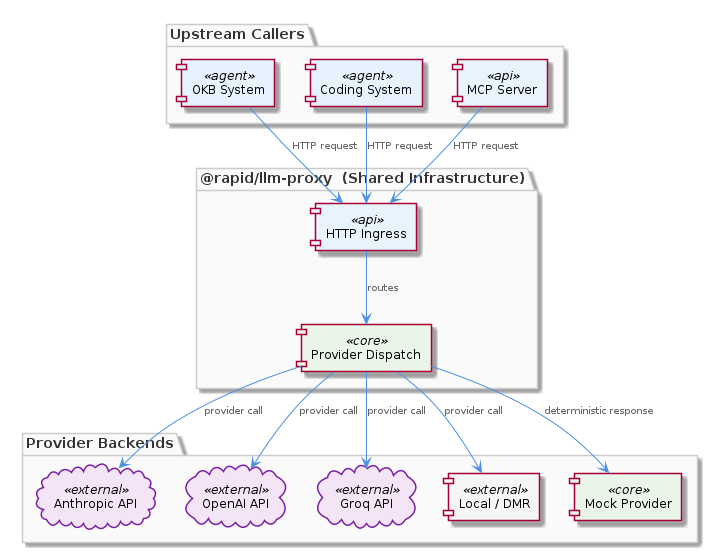
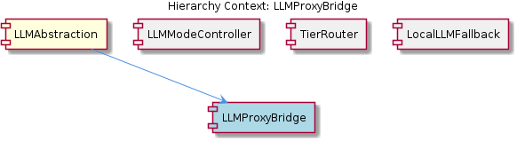

# LLMProxyBridge

**Type:** SubComponent

The architecture diagram `docs/puml/llm-cli-proxy-architecture.puml` shows the proxy acting as a single HTTP ingress point, decoupling all upstream callers from direct provider SDK dependencies

# LLMProxyBridge — Technical Insight Document

## What It Is

`LLMProxyBridge` is the architectural seam that connects the broader `LLMAbstraction` layer to the shared `@rapid/llm-proxy` package — a standalone HTTP service that centralises provider-routing logic across the OKB and coding systems. Rather than embedding provider SDK calls directly into each integration, the bridge funnels all LLM traffic through a single HTTP ingress point, as documented in the architecture diagram at `docs/puml/llm-cli-proxy-architecture.puml`.

The bridge exists as a SubComponent of `LLMAbstraction` and operates alongside sibling components (`LLMModeController`, `TierRouter`, `LocalLLMFallback`) that together form the runtime decision graph for how, where, and with what model an LLM call is ultimately served. Where `LLMModeController` (via `getLLMMode()` in `integrations/mcp-server-semantic-analysis/src/mock/llm-mock-service.ts`) resolves *which mode* applies, `LLMProxyBridge` is concerned with *how the request actually reaches a provider* once that mode has been determined.

## Architecture and Design

The bridge implements a **single-ingress HTTP proxy pattern**. By collapsing all provider interactions onto one HTTP service, `@rapid/llm-proxy` decouples upstream callers from direct provider SDK dependencies. Any caller — be it the MCP server, the coding system, or an OKB workflow — sees only a uniform HTTP interface, with the proxy itself responsible for adapting that uniform contract to the heterogeneous backends behind it.

Internally, the proxy supports five distinct provider backends: **Anthropic, OpenAI, Groq, local/DMR, and mock**. The presence of these as peer endpoints inside a single package strongly implies a **provider-dispatch (strategy) pattern**, where each provider is encapsulated as an interchangeable handler and selection occurs at request time. This dispatch layer is what allows `LocalLLMFallback` (`docs/puml/local-llm-fallback.puml`) to be activated either by explicit `'local'` mode assignment or by public-provider failure — the dispatch table is the natural place such failover logic lives.

The mock provider endpoint is architecturally significant: it allows the proxy to serve deterministic responses during testing without any external network calls. This dovetails with the mock mode in `llm-mock-service.ts`, meaning that the `'mock'` mode value resolved by `LLMModeController` corresponds directly to a provider entry the bridge can dispatch to.

## Implementation Details

The bridge is realised by the `@rapid/llm-proxy` package, which is run as a **standalone HTTP service**. This packaging decision means that `LLMProxyBridge` is not a library imported into each consumer; rather, it is a network endpoint that consumers call. The architecture diagram `docs/puml/llm-cli-proxy-architecture.puml` confirms the proxy as a single HTTP ingress point — every upstream caller sees the same URL and contract regardless of which underlying provider will service the request.

The provider-dispatch surface within the proxy must accept a request, examine its mode/provider parameters, and route to one of: an Anthropic backend, an OpenAI backend, a Groq backend, a local DMR (Docker Model Runner or similar local inference) backend, or the mock backend. Because `TierRouter` (`docs/puml/llm-tier-routing.puml`) performs tier-to-model mapping *before* provider selection, the bridge can rely on requests arriving already annotated with the appropriate model identifier; its job is to translate that abstract request into a concrete provider call.

Because the proxy is shared between the OKB and coding systems, its implementation must be provider-agnostic at the interface boundary. Provider-specific quirks (authentication schemes, request body shapes, streaming semantics) are absorbed inside the proxy, never leaked to callers. This is what makes the centralisation valuable — adding a sixth provider would require changes only inside `@rapid/llm-proxy`, with zero ripple to integrations.

## Integration Points

`LLMProxyBridge` integrates with several distinct layers of the system. Upstream, it is consumed by the MCP server (`integrations/mcp-server-semantic-analysis`) and by the coding-system integrations, both of which sit above the `LLMAbstraction` parent. The mode/tier resolution happens in those layers — specifically, `LLMModeController`'s `getLLMMode()` produces a mode value, and `TierRouter` produces a model identifier — and the resulting envelope is what the bridge transports over HTTP.

Downstream, the bridge integrates with five external provider surfaces: the **Anthropic** and **OpenAI** REST APIs, the **Groq** API, a **local DMR** runtime for on-device inference, and an internal **mock** endpoint. The local DMR integration is the same backend invoked by `LocalLLMFallback`, meaning the bridge serves as the activation point for the dual-role resilience mechanism described in `docs/puml/local-llm-fallback.puml` — both deliberate `'local'` routing and emergency public-provider fallback flow through the same proxy code path.

Operationally, the proxy reads no state from `.data/workflow-progress.json` itself; that state file is consulted by `LLMModeController` to decide the mode, and the mode is then forwarded to the bridge. This separation of concerns — *deciding* the mode versus *executing* the call — is what allows the components within `LLMAbstraction` to evolve independently.

## Usage Guidelines

Developers should treat `@rapid/llm-proxy` as **shared infrastructure** rather than an integration-specific component. The knowledge base explicitly documents it as shared across OKB and coding systems, which means changes to its HTTP contract or provider-dispatch table affect multiple consumers; backward-compatible API evolution is essential.

When adding a new provider, the work belongs **inside the proxy package**, not inside calling integrations. The strategy-style dispatch surface is the correct extension point; consumers should never gain awareness of provider-specific SDKs. Conversely, when adding a new mode value (extending beyond `'mock' | 'local' | 'public'`), coordination is required with `LLMModeController` so that the mode resolved by `getLLMMode()` maps cleanly to a dispatchable provider entry in the bridge.

For testing, prefer the proxy's **mock provider endpoint** over stubbing HTTP calls in test code. The mock endpoint exists precisely so that tests can exercise the full bridge path deterministically and without network I/O, and using it keeps test scenarios consistent with the runtime behaviour selected by `'mock'` mode in production code.

Finally, because the bridge is a **standalone HTTP service**, it can be scaled, deployed, restarted, or replaced independently of the MCP server and other consumers. Operators should monitor it as a first-class service: latency to upstream providers, dispatch errors, and fallback activations are all observable at this layer. Given that `LLMModeController`'s four-level priority chain makes the effective mode non-statically-determinable, logging the resolved provider per call at the bridge is the single most valuable observability hook for diagnosing routing surprises.

---

### Summary of Key Insights

1. **Architectural patterns identified**: Single HTTP ingress proxy, provider-dispatch (strategy) pattern over five backends, shared-infrastructure packaging (`@rapid/llm-proxy`), separation between mode resolution (sibling `LLMModeController`) and call execution (this bridge).

2. **Design decisions and trade-offs**: Centralising provider logic eliminates duplication across OKB and coding systems at the cost of introducing a network hop; standalone HTTP service enables independent scaling but requires service-management discipline; embedded mock provider gains deterministic testing at the cost of one additional dispatch branch.

3. **System structure insights**: The bridge sits beneath `LLMAbstraction` as the execution layer that complements its siblings' decision layers — `TierRouter` selects the model, `LLMModeController` selects the mode, `LocalLLMFallback` defines the resilience path, and `LLMProxyBridge` carries out the resulting call.

4. **Scalability considerations**: Because the proxy is a standalone HTTP service, it scales horizontally without coupling to the MCP server lifecycle; provider additions are local to the package; the mock endpoint allows load and integration testing without external rate-limit exposure.

5. **Maintainability assessment**: High — provider concerns are encapsulated behind a uniform HTTP contract, new providers slot into the dispatch table without touching consumers, and the diagrams (`llm-cli-proxy-architecture.puml`, `llm-provider-architecture.puml`, `llm-tier-routing.puml`, `local-llm-fallback.puml`) provide a coherent visual reference. The principal maintenance risk is contract drift between the bridge and the mode taxonomy maintained by `LLMModeController`, which should be guarded by integration tests exercising every mode value end-to-end.

## Hierarchy Context

### Parent
- [LLMAbstraction](./LLMAbstraction.md) -- [LLM] The `getLLMMode()` function in `integrations/mcp-server-semantic-analysis/src/mock/llm-mock-service.ts` implements a four-level priority resolution chain that determines which LLM backend any given agent operation will use at runtime. The chain evaluates, in descending priority: (1) a per-agent override stored in `llmState` keyed by agent ID, (2) the global `llmState.globalMode` field, (3) the legacy `mockLLM` boolean flag, and finally (4) a hardcoded fallback of `'public'`. This design is architecturally significant because it allows fine-grained routing decisions to be made without restarting any service — a running workflow can have individual agents reassigned to different backends purely by mutating the state in `.data/workflow-progress.json`. The priority chain also reflects an evolutionary history: the `mockLLM` boolean is clearly an earlier, simpler mechanism that predates the full `'mock' | 'local' | 'public'` mode taxonomy, and its presence in the chain at level 3 shows that the system was designed to degrade gracefully rather than force a hard cutover. A new developer should note that the effective mode for any agent call is never statically determinable from configuration alone — it must be traced through the runtime state file, making observability tooling (e.g., logging the resolved mode per call) particularly important for debugging routing surprises.

### Siblings
- [LLMModeController](./LLMModeController.md) -- `getLLMMode()` in `integrations/mcp-server-semantic-analysis/src/mock/llm-mock-service.ts` implements a four-level priority chain: per-agent override in `llmState` keyed by agent ID, then `llmState.globalMode`, then legacy `mockLLM` boolean, then hardcoded `'public'` fallback
- [TierRouter](./TierRouter.md) -- `docs/puml/llm-tier-routing.puml` diagrams the tier-to-model mapping, indicating that tier assignment happens before provider selection and feeds into the broader provider architecture shown in `docs/puml/llm-provider-architecture.puml`
- [LocalLLMFallback](./LocalLLMFallback.md) -- `docs/puml/local-llm-fallback.puml` diagrams the fallback flow, showing that local DMR inference is activated both by explicit `'local'` mode assignment and by public provider failure, making it serve dual roles as a mode target and a resilience mechanism

---

*Generated from 5 observations*
