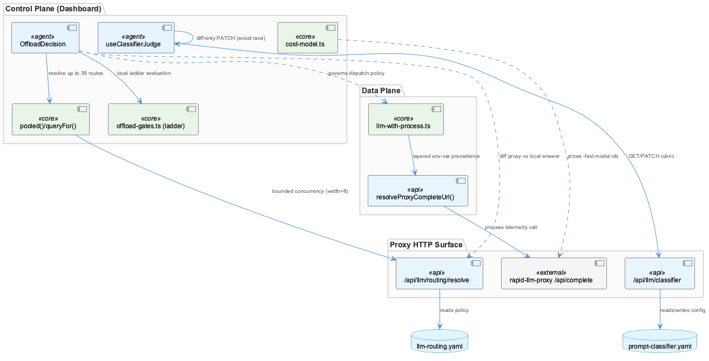
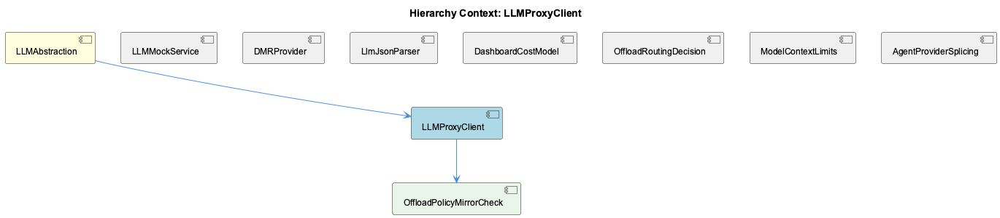

# LLMProxyClient

**Type:** SubComponent

# LLMProxyClient — Technical Insight Document

## What It Is

LLMProxyClient is the control-plane and data-plane boundary through which the dashboard application talks to the rapid-llm-proxy. Its actual transport layer is `llm-with-process.ts`, a deliberate fetch-based bypass around the SDK's `LLMService.complete()` built to inject the `process` telemetry tag the proxy's `/api/complete` endpoint requires; `resolveProxyCompleteUrl()` resolves the proxy's address via a layered precedence (`RAPID_LLM_PROXY_URL` → `LLM_CLI_PROXY_URL` → `LLM_PROXY_URL` → localhost default). Sitting above this transport is the operator-facing surface examined in this document: `integrations/system-health-dashboard/src/components/llm-routing/offload-decision.tsx` and `use-classifier-judge.ts`, along with the pricing logic in `cost-model.ts`. Neither of the routing/classifier files issues an LLM completion call directly — they instead GET/PATCH the proxy's HTTP surface (`/api/llm/routing/resolve`, `/api/llm/classifier`) to inspect and edit routing and classification policy.

As a child of LLMAbstraction, LLMProxyClient shares the parent's foundational concern — established by LLMMockService's `getLLMMode()` three-tier precedence and dual-write behavior — that ambiguous or collapsed state signals are dangerous, and it repeatedly re-derives that lesson in its own domain.

## Architecture and Design

The defining architectural pattern is a clean **control-plane/data-plane separation**: `llm-with-process.ts` performs actual proxied LLM calls, while `offload-decision.tsx` and `use-classifier-judge.ts` only read/patch routing and classifier configuration. This split means the two layers must independently agree on wire semantics, which the codebase addresses with explicit reconciliation rather than shared code.

That reconciliation is implemented by the child component **OffloadPolicyMirrorCheck**: `offload-decision.tsx`'s `OffloadDecision` component maintains its own client-side ladder logic (`evaluateOffload()`/`rungOfReason()` in `offload-gates.ts`) but refuses to trust it for a SAVED policy, instead independently resolving every route via `/api/llm/routing/resolve` through `queryFor()`/`pooled()` and diffing both verdicts in `configRungs`' disagreements array — surfacing mismatches as a destructive banner naming the specific route and both verdicts. This "never trust your own restatement" pattern directly mirrors the parent context's concern about `llm-with-process.ts`'s `MetricsTrackerLike` interface drifting from the SDK's real tracker, and structurally resembles sibling **LLMMockService**'s explicit precedence design: rather than trusting duplication to stay correct by construction, the system adds a comparison step to catch drift.

Because up to ~39 routes must be resolved per policy or network change, `pooled()` implements bounded-concurrency fan-out (width=8) against what is architecturally a per-route synchronous RPC rather than a batch API — a gap where a single batched resolve endpoint could have replaced N round-trips, compensated instead by client-side pooling and a `resolveKey` memoization (keyed on routes/defaults/network, deliberately excluding the traffic-volume `hours` parameter).

## Implementation Details

`use-classifier-judge.ts`'s `useClassifierJudge()` hook targets a config file (`config/prompt-classifier.yaml`) entirely separate from the offload policy's `llm-routing.yaml` — "two hooks, two saves, two failure domains," so a rubric typo cannot roll back an unrelated target toggle. This mirrors sibling **DMRProvider**'s `loadDMRConfig()`/`dmr-config.yaml` isolation and reflects a subsystem-wide preference for per-concern config over shared blobs. The hook's `save()` further enforces granularity at the field level, PATCHing only changed fields (`backends`, `rubric`, `strategy`) to avoid a poll-vs-edit race clobbering untouched fields — the same optimistic-concurrency concern behind the offload policy's `useOffloadPolicyDraft` dirty-tracking.

The `JudgeBackend.reachable` field (nullable boolean, distinct from `enabled`) was added after a documented 2026-09-02 incident where a dead backend silently masked itself behind `enabled: true` for about a day, with only a per-row error string as evidence. Its tri-state design (true/false/null-meaning-never-probed) goes further than the parent context's DMR `checkDMRAvailability()` health check by distinguishing "known broken" from "not yet probed on this network."

`cost-model.ts`, framed as pure "no React" logic (`budgetForMonth()`, `priceForModel()`, `cellCostUsd()`), implements `FAST_MODE_SUFFIX`/`FAST_MODE_MULTIPLIER` as a derivation rule (double the base price) rather than a hand-maintained lookup table, avoiding the silent-staleness failure mode also seen in `setGlobalLLMMode()`'s dual-write. Its `freshInputTokens()` function documents a resolved wire-protocol bug: OpenAI-wire providers used to double-report cache-inclusive `prompt_tokens`, prompting local subtraction of `cache_read_tokens`; once rapid-llm-proxy's `usage-cache.ts` fixed this at the parse boundary (`openAIFreshInputTokens`) and backfilled history, the dashboard's compensation became an erroneous second subtraction (zeroing already-corrected rows). `freshInputTokens()` is now deliberately an identity function with a warning comment against reintroducing it.

## Integration Points

LLMProxyClient's HTTP control surface (`proxyBase` + `/api/llm/routing/resolve`, `/api/llm/classifier`) is consumed by React hooks (`useOffloadPolicyDraft`, `useClassifierJudge`) rather than a unified SDK, each polling and saving independently. Two independently-evolving config files (`llm-routing.yaml`, `config/prompt-classifier.yaml`) feed one composite UI card, sibling **OffloadRoutingDecision**'s `OffloadDecision`, which resolves the resulting UX-cohesion-vs-failure-isolation tension via a dual-mode ('config' vs 'recorded') toggle sharing the same rung geometry.

Within the broader **LLMAbstraction** tree, LLMProxyClient sits alongside **LLMMockService** (mode precedence), **DMRProvider** (OpenAI-shape protocol reuse for Docker Model Runner), **LlmJsonParser** (two-stage malformed-JSON repair), **DashboardCostModel** (pure pricing functions), and **ModelContextLimits** (`model-limits.cjs`'s mtime+size-cached catalogue lookup) — all reinforcing a pattern of isolated, independently-verifiable subsystems rather than a monolithic client.

## Usage Guidelines

Developers extending this surface should preserve the config-domain isolation: do not merge `llm-routing.yaml` and `config/prompt-classifier.yaml` handling, and continue diff-only PATCHes rather than whole-object writes. Any new route-resolution UI should reuse `pooled()`'s concurrency cap rather than firing unbounded parallel requests, and should honor the resolveKey memoization semantics (exclude parameters that don't affect resolution, like `hours`). Treat `enabled` and `reachable` as orthogonal signals — never collapse them. Finally, when consuming proxy-produced fields directly (as `freshInputTokens()` learned the hard way), assume the producer's contract can change underneath you; prefer a single resolved accessor over ad hoc local compensation, and delete compensations once the upstream fix lands rather than let them become silent regressions.

## Hierarchy Context

### Parent
- [LLMAbstraction](./LLMAbstraction.md) -- [LLM] The mock/local/public mode toggle system in llm-mock-service.ts is designed around a persisted state file (.data/workflow-progress.json) rather than environment variables, which allows runtime mode switching without process restarts. The LLMState structure with globalMode and perAgentOverrides fields enables fine-grained control where a specific agent can be forced into mock mode for testing while the rest of the system runs against real providers. This is critical for integration testing scenarios where a developer wants to validate one agent's prompt-handling logic without incurring API costs or non-determinism from the LLM calls of other agents in a multi-agent pipeline. The getLLMMode() read path checks perAgentOverrides first, then falls back to globalMode, and finally to the legacy progress.mockLLM boolean, establishing a three-tier precedence resolution that any new developer must understand before assuming a single toggle controls behavior.

### Children
- [OffloadPolicyMirrorCheck](./OffloadPolicyMirrorCheck.md) -- [LLM] The OffloadDecision component (offload-decision.tsx) implements a 'restatement must be checked, not trusted' architecture: it maintains its own client-side evaluateOffload() ladder logic (imported from offload-gates.ts) but refuses to trust it whenever the operator is viewing a SAVED policy, instead independently resolving every route via GET /api/llm/routing/resolve and diffing the two verdicts in configRungs' disagreements array. This is a deliberate architectural redundancy — two independent implementations of the same decision logic (client prediction vs proxy ground truth) reconciled by an explicit comparison step rather than unified into one code path, traded off against the cost of extra network calls and duplicated logic that must be kept conceptually in sync.

### Siblings
- [LLMMockService](./LLMMockService.md) -- [LLM] The `use-classifier-judge.ts` hook (integrations/system-health-dashboard/src/components/llm-routing/use-classifier-judge.ts) implements the same config-vs-runtime split described for LLMMockService's `getLLMMode()` precedence chain, but for the offload judge rather than the mock toggle: `JudgeBackend.enabled` is what the YAML file says, while `JudgeBackend.reachable` is whether it actually answered on the last poll. The header comment documents a real incident (2026-09-02) where `enabled: true` masked a dead backend for about a day because nothing distinguished 'switched off' from 'not answering' — the exact class of ambiguity that `getLLMMode()`'s three-tier precedence (perAgentOverrides → globalMode → legacy progress.mockLLM) is designed to avoid by making precedence explicit rather than collapsing multiple signals into one boolean.
- [DMRProvider](./DMRProvider.md) -- [LLM] The DMR provider in dmr-provider.ts is deliberately built as a thin OpenAI-shape adapter rather than a bespoke client — it targets `http://${DMR_HOST}:${DMR_PORT}/engines/v1` but reuses the same request/response contract as the OpenAI SDK integration. This is a 'protocol reuse' strategy: instead of writing DMR-specific request builders, response parsers, and error mappers, the team accepts that Docker Model Runner exposes an OpenAI-compatible surface and piggybacks on existing code paths. The trade-off is that any DMR-specific quirks (different error codes, different streaming semantics, different rate-limit headers) would have to be shimmed into the OpenAI shape rather than handled natively, which could become a leaky abstraction if DMR's compatibility layer ever diverges meaningfully from the OpenAI spec it's mimicking.
- [LlmJsonParser](./LlmJsonParser.md) -- [LLM] parse-llm-json.ts's core value proposition is that it treats malformed JSON-mode output as a two-orthogonal-failure-mode problem rather than one generic 'try/catch and give up' problem. escapeControlCharsInStrings() targets corruption caused by raw control characters (e.g. literal newlines or tabs) embedded inside string literals — a byte-level defect that a naive JSON.parse() cannot tolerate — while truncateToLastCompleteElement() targets a structural defect: the provider hit its output-token ceiling mid-object/mid-array. Because these are independent failure modes with independent signatures, running them as a fixed two-stage pipeline rather than a single heuristic means each stage can be reasoned about, tested, and evolved in isolation, and a malformed-but-complete response only pays the cost of the first stage.
- [DashboardCostModel](./DashboardCostModel.md) -- [LLM] cost-model.ts is deliberately framed as "pure cost/budget logic... No React here" — every exported function (budgetForMonth, priceForModel, cellCostUsd, monthlySeries) is a pure function of CostRow[]/CostConfig inputs with no hooks, fetch calls, or component state. This is a sharp architectural boundary against sibling files like use-classifier-judge.ts and offload-decision.tsx, which interleave data-fetching, polling, and dirty-state tracking directly inside hooks and components. The payoff is testability (pure functions can be unit-tested without a DOM or mock fetch) and the ability to reuse the same pricing math in both the live dashboard tab and, presumably, offline reporting scripts — at the cost of pushing all I/O (GET /api/token-usage/cost, GET /api/llm/settings) to callers this file doesn't show.
- [OffloadRoutingDecision](./OffloadRoutingDecision.md) -- [LLM] OffloadDecision (offload-decision.tsx) is architected around a dual-mode toggle — 'config' (routes, answering 'what will happen') versus 'recorded' (calls, answering 'what did happen') — that deliberately share the same GATES/rung geometry so an operator can flip between intent and behaviour without re-reading a layout. This is a single-component design choice explicitly justified in the header comment rather than splitting into two cards, trading some internal branching complexity (mode-dependent counts, detail strings) for a consistent mental model at the UI layer.
- [ModelContextLimits](./ModelContextLimits.md) -- [LLM] The module in lib/statusline/model-limits.cjs implements a two-tier caching strategy specifically because it runs in a fresh process every 5 seconds per status-line pane (documented in the file's header comment). The in-process memo (`_memo`, `_userMemo`) only helps within a single tick's multiple calls to catalogueContextWindow(); the real cross-tick optimization is the on-disk derived cache at catalogueCachePath() (.logs/model-context-limits.json), which avoids re-parsing opencode's 4.5MB/213-provider models.json (a documented 33ms cost) on every single tick across every open pane. This is a deliberate departure from typical in-memory caching because the process boundary itself defeats memoization.
- [AgentProviderSplicing](./AgentProviderSplicing.md) -- [LLM] The cost-model.ts module in the dashboard's cost tab implements a layered price-resolution strategy in priceForModel(): exact model key match, then fast-mode suffix stripping with a 2x multiplier via scalePrice(), then family-based fallback through FAMILY_REPRESENTATIVE. This mirrors the same 'tiered precedence resolution' philosophy seen elsewhere in the LLM subsystem (e.g. getLLMMode()'s three-tier fallback), suggesting a project-wide convention of building explicit precedence chains rather than single flat lookups whenever provider/model identity is ambiguous or evolving.

---

*Generated from 10 observations*
