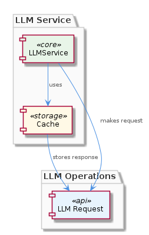
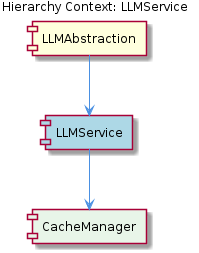

# LLMService

**Type:** SubComponent

LLMService includes a method for making LLM requests, which first checks the cache for a valid response before proceeding to make an actual request.

## What It Is  

`LLMService` is the concrete implementation that powers all Large‑Language‑Model (LLM) interactions for the **LLMAbstraction** component.  Its source lives in `lib/llm/llm-service.ts`, where the `LLMService` class is exported as the single entry point for every LLM‑related operation.  The class hides the complexities of mode routing, provider fallback and, most visibly, request‑level caching.  By encapsulating these concerns, callers—whether they are higher‑level business logic or other subsystems—talk to a unified API rather than dealing with individual providers or cache mechanics directly.  

The service relies on an internal **CacheManager** (exposed as a child component) that stores responses in a simple in‑memory object.  Cache keys are derived from the full set of request parameters, and the associated values are the raw LLM responses together with ontology metadata such as `entityType` and `metadata.ontologyClass`.  This design reduces duplicate LLM calls, especially for re‑classification scenarios where the same input would otherwise be sent repeatedly to the provider.

---

## Architecture and Design  

`LLMService` follows a **single‑responsibility façade** pattern: it presents a clean façade for LLM operations while delegating specific tasks (caching, provider selection) to dedicated collaborators.  The façade lives in `lib/llm/llm-service.ts`, and the caching concern is encapsulated in the `CacheManager` child.  Because the cache is a plain JavaScript object, the implementation adopts an **in‑memory cache** pattern rather than a distributed cache or external store.  

The interaction flow is straightforward: when a consumer invokes the service’s request method, the service first queries `CacheManager` for a matching entry.  If a cached response exists and is still considered valid, it is returned immediately; otherwise, the service proceeds to call the underlying LLM provider, receives the response, stores it in the cache, and finally returns it to the caller.  This “check‑then‑fetch” sequence is evident from the observation that “the LLMService class includes a method for making LLM requests, which first checks the cache for a valid response before proceeding to make an actual request.”  

The architecture diagram below illustrates the high‑level placement of `LLMService` within the broader **LLMAbstraction** component and its relationship to the `CacheManager`.  

### Architectural Patterns Identified  

1. **Facade / Single Entry Point** – `LLMService` centralises all LLM interactions.  
2. **In‑Memory Cache** – `CacheManager` uses a plain object for fast key/value storage.  
3. **Cache‑Aside (Lazy Loading)** – The service only populates the cache after a miss, avoiding premature writes.  

---

## Implementation Details  

The core of the implementation resides in the `LLMService` class defined in `lib/llm/llm-service.ts`.  Its public API typically includes a method such as `request(params: LLMRequestParams): Promise<LLMResponse>`.  Inside this method the following steps occur:

1. **Cache Key Generation** – The request parameters (including the prompt, model identifier, and any ontology hints) are serialized into a deterministic string that serves as the cache key.  This aligns with the observation that “keys are request parameters.”  
2. **Cache Lookup** – The service calls `CacheManager.get(key)`.  `CacheManager` holds an internal object, e.g. `{ [key: string]: CachedEntry }`, where each `CachedEntry` contains the raw response and the associated ontology metadata (`entityType`, `metadata.ontologyClass`).  
3. **Cache Hit Path** – If a matching entry is found, the service returns it directly, bypassing any network traffic.  This is the primary optimisation for “preventing redundant LLM re‑classification.”  
4. **Provider Invocation** – On a miss, the service forwards the request to the configured LLM provider (the exact provider logic is managed by the parent `LLMAbstraction` component, which handles mode routing and fallback).  
5. **Cache Population** – After receiving the provider’s response, the service stores the result in `CacheManager` using the same key, preserving the ontology metadata for future hits.  

`CacheManager` itself is lightweight: it exposes `get(key)`, `set(key, value)`, and possibly `clear()` or `invalidate(key)` methods.  Because the cache lives in process memory, no external dependencies are required, which simplifies testing and deployment but also ties the cache lifetime to the Node.js process.

---

## Integration Points  

`LLMService` sits directly under the **LLMAbstraction** parent component, which orchestrates mode routing, provider fallback, and overall lifecycle management.  The parent component references `LLMService` via the file path `lib/llm/llm-service.ts`, treating it as the canonical gateway for any LLM request.  Consequently, any subsystem that needs to classify text, retrieve embeddings, or perform any LLM‑driven operation imports `LLMService` rather than contacting providers directly.

The **CacheManager** child is instantiated inside `LLMService` (or injected via constructor in a more testable variant).  Other sibling components of `LLMService`—if they exist—would share the same parent (`LLMAbstraction`) but are not observed to interact with the cache directly; they rely on `LLMService` to surface cached data when appropriate.

The relationship diagram below visualises these connections, showing the parent‑child hierarchy and the flow of calls from external callers through `LLMService` to the cache and then to the provider.  

---

## Usage Guidelines  

1. **Always go through `LLMService`** – Direct provider calls bypass the cache and defeat the optimisation that prevents redundant re‑classification.  Import the class from `lib/llm/llm-service.ts` and use its request method.  
2. **Construct deterministic request parameters** – Since the cache key is derived from the full request payload, ensure that fields such as whitespace, ordering of JSON properties, or default values are normalised before calling the service.  Inconsistent keys will lead to unnecessary cache misses.  
3. **Be aware of memory limits** – The in‑memory cache grows with each unique request.  In long‑running processes, consider adding explicit cache eviction logic (e.g., TTL or size‑based pruning) inside `CacheManager` if the application’s memory budget is constrained.  
4. **Leverage ontology metadata** – When you need to classify entities, include `entityType` and `metadata.ontologyClass` in the request parameters; these are stored alongside the response and can be used for downstream logic without re‑querying the LLM.  
5. **Testing** – Because the cache is a simple object, unit tests can stub or reset `CacheManager` between test cases to guarantee isolation.  Mocking the provider layer is also straightforward since `LLMService` only calls it after a cache miss.

---

### Design Decisions and Trade‑offs  

| Decision | Rationale | Trade‑off |
|----------|-----------|-----------|
| **In‑memory object for cache** | Zero external dependencies, ultra‑fast look‑ups, simple implementation. | Cache is process‑local; data is lost on restart, and memory consumption grows with request diversity. |
| **Single façade (`LLMService`)** | Provides a unified API, hides provider details, centralises caching logic. | All callers must conform to the façade’s contract; any change to the façade can have wide impact. |
| **Cache‑aside pattern** | Populates cache only on miss, avoiding unnecessary writes. | No proactive pre‑warming; first request for a new key always incurs provider latency. |

### Scalability Considerations  

The current design scales well **vertically**: a single Node.js instance can serve many requests as long as the cached data fits in RAM and the LLM provider can handle the load.  However, horizontal scaling (multiple instances) will **not share cache state**, leading to duplicated LLM calls across instances.  If the system grows to a multi‑instance deployment, the in‑memory cache would need to be replaced or supplemented with a distributed store (e.g., Redis) to preserve the cache‑hit benefits across the fleet.

### Maintainability Assessment  

Because the caching logic is encapsulated in a dedicated `CacheManager` and the service itself is a thin façade, the codebase is **easy to understand and extend**.  Adding new cache policies (TTL, size limits) or swapping the cache implementation can be done by modifying `CacheManager` without touching the façade.  The primary maintenance risk lies in the reliance on deterministic key generation; any change to how request parameters are serialized must be coordinated across all callers to avoid silent cache fragmentation.  

Overall, `LLMService` presents a clean, well‑encapsulated component that fulfills its purpose of reducing redundant LLM calls while keeping the implementation deliberately simple and maintainable.

## Hierarchy Context

### Parent
- [LLMAbstraction](./LLMAbstraction.md) -- [LLM] The LLMAbstraction component utilizes the LLMService class (lib/llm/llm-service.ts) as a single entry point for all LLM operations. This class is responsible for managing mode routing, caching, and provider fallback. For instance, the LLMService class includes a method for making LLM requests, which first checks the cache for a valid response before proceeding to make an actual request. This is evident in the use of the cache object within the LLMService class, where it attempts to retrieve a cached response before making a request to the provider. The cache is implemented using a simple in-memory object, where the keys are the request parameters and the values are the corresponding responses.

### Children
- [CacheManager](./CacheManager.md) -- The parent analysis suggests the existence of a CacheManager, which is a common pattern in similar services to improve efficiency.

---

*Generated from 5 observations*
