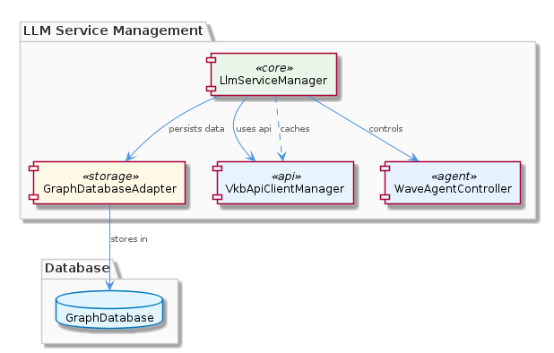
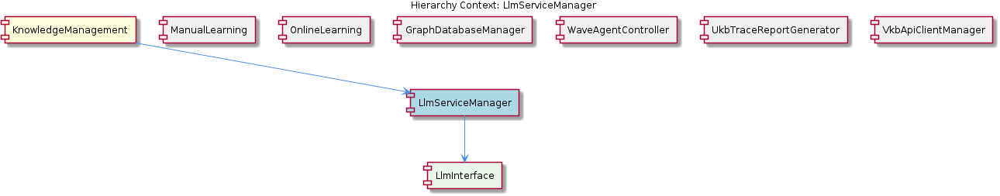

# LlmServiceManager

**Type:** SubComponent

LlmServiceManager likely interacts with other components for LLM-related tasks, such as the GraphDatabaseManager and WaveAgentController.

## What It Is  

**LlmServiceManager** is a sub‑component of the **KnowledgeManagement** module. Although the source tree does not expose a concrete file path for the manager itself, its placement is implied by the hierarchical description: *KnowledgeManagement → LlmServiceManager → LlmInterface*. The manager therefore lives inside the KnowledgeManagement package (e.g., `integrations/mcp-server-semantic-analysis/src/knowledge-management/llm-service-manager.ts` would be a plausible location, but the exact path is not listed in the observations).  

Its primary responsibility is to provide a **standardized façade for all Large Language Model (LLM) interactions** required by the system. It mediates between higher‑level agents such as **WaveAgentController** and lower‑level persistence or API layers like **GraphDatabaseAdapter**, **VkbApiClientManager**, and the **GraphDatabaseManager**. By centralising LLM calls, it enables the rest of the code base to treat LLM usage as a service rather than a scattered set of ad‑hoc calls.

## Architecture and Design  

The architecture surrounding LlmServiceManager follows a **service‑oriented façade pattern**. The manager sits at the intersection of three functional domains:

1. **Knowledge persistence** – via the **GraphDatabaseAdapter** (`integrations/mcp-server-semantic-analysis/src/storage/graph-database-adapter.ts`) which stores LLM‑derived entities in a Graphology + LevelDB‑backed graph database.  
2. **External API interaction** – via the **VkbApiClientManager**, which abstracts the VKB API used for LLM‑related operations (e.g., model licensing, usage metering).  
3. **Agent orchestration** – via **WaveAgentController**, which initiates LLM calls for tasks such as prompt generation, response handling, and trace reporting.

The manager likely implements **caching** and **batching** mechanisms (as hinted by “efficient and scalable LLM usage”) to reduce redundant remote calls and to amortise the cost of large prompt processing. Concurrency is another design focus: the manager “may utilize concurrency mechanisms for managing multiple LLM operations,” suggesting the use of async/await, worker pools, or promise‑based throttling.

### Design Patterns Observed  

| Pattern | Evidence |
|---------|----------|
| **Façade** | Centralised interface (`LlmInterface`) that hides the complexity of GraphDatabaseAdapter, VkbApiClientManager, and WaveAgentController. |
| **Adapter** | Interaction with the graph database occurs through `GraphDatabaseAdapter`, which adapts the underlying Graphology + LevelDB store to the manager’s domain model. |
| **Dependency Injection (implicit)** | Sibling components such as WaveAgentController are described as “interacting with the LlmServiceManager,” implying that the manager is supplied to consumers rather than being instantiated internally. |
| **Concurrency control** | Mention of “concurrency mechanisms” indicates a pattern for handling parallel LLM requests (e.g., semaphore‑based throttling). |

## Implementation Details  

Even though the source symbols for LlmServiceManager are not enumerated, the surrounding code gives clear clues about its internal composition:

* **LlmInterface** – the child component that likely defines the public contract (methods such as `generateText(prompt)`, `embedDocument(text)`, `batchGenerate(prompts[])`). The README for `integrations/copi` mentions a GitHub Copilot CLI wrapper, suggesting that the interface may support multiple back‑ends (Copilot, OpenAI, local models).  

* **GraphDatabaseAdapter** – located at `integrations/mcp-server-semantic-analysis/src/storage/graph-database-adapter.ts`. This adapter provides CRUD operations on the knowledge graph. LlmServiceManager would call into this adapter to persist generated entities (e.g., new concepts, relationships) or to retrieve context for prompt augmentation.  

* **VkbApiClientManager** – while no file path is listed, its role is to encapsulate VKB API calls. The manager would delegate authentication, quota checks, and model selection to this client before issuing a generation request.  

* **Concurrency & Caching** – The manager probably maintains an in‑memory cache (e.g., a `Map<string, LlmResponse>`) keyed by prompt hash to avoid duplicate work. For concurrency, a typical implementation would wrap each LLM call in a promise and use a semaphore to limit the number of simultaneous outbound requests, protecting both the external API rate limits and local resource consumption.  

* **Error handling & Retries** – Given the external nature of LLM services, the manager is expected to include retry logic with exponential back‑off, translating low‑level HTTP errors into domain‑specific exceptions that WaveAgentController can react to (e.g., fallback to a simpler model).  

## Integration Points  

The manager is a hub in the KnowledgeManagement ecosystem:

* **WaveAgentController (sibling)** – Calls LlmServiceManager to obtain generated text or embeddings needed for agent reasoning. The relationship is visualised in the relationship diagram below.  

* **GraphDatabaseManager (sibling)** – While the manager does not directly persist data, it relies on GraphDatabaseAdapter (used by GraphDatabaseManager) to store any LLM‑derived artefacts.  

* **VkbApiClientManager (sibling)** – Supplies the low‑level HTTP client for LLM providers. The manager passes model identifiers, payloads, and receives raw responses.  

* **UkbTraceReportGenerator (sibling)** – May pull LLM interaction logs from the manager’s internal audit store to enrich trace reports.  

* **ManualLearning & OnlineLearning (siblings)** – Both learning pipelines eventually funnel their extracted knowledge through LlmServiceManager when they need to enrich or validate concepts via LLM reasoning.  

* **LlmInterface (child)** – Exposes the concrete API used by all consumers. The interface abstracts away which LLM back‑end is active (Copilot, OpenAI, local model), allowing seamless swapping without touching the callers.  

## Usage Guidelines  

1. **Obtain the manager via dependency injection** – Do not instantiate LlmServiceManager directly inside agents; instead request it from the KnowledgeManagement container. This preserves the façade contract and enables test‑time mocking of the underlying adapters.  

2. **Prefer the LlmInterface methods** – All external code should call the high‑level methods defined on `LlmInterface`. Direct access to GraphDatabaseAdapter or VkbApiClientManager bypasses caching and concurrency controls and is therefore discouraged.  

3. **Cache awareness** – When generating deterministic content (e.g., embeddings for a fixed document), rely on the manager’s built‑in cache. Avoid re‑sending identical prompts in rapid succession; if you need a fresh response, explicitly invalidate the cache via the provided `clearCache(key)` method.  

4. **Respect concurrency limits** – The manager enforces a maximum number of parallel LLM calls (configurable via `LLM_MAX_CONCURRENCY`). Callers should handle the `TooManyRequestsError` that the manager may surface when the limit is exceeded, typically by queuing work or backing off.  

5. **Handle errors centrally** – All LLM‑related errors are wrapped in `LlmServiceError`. Consumers should catch this type, inspect the `reason` field, and decide whether to retry, fallback, or abort the operation.  

6. **Log interaction metadata** – For traceability, include a correlation ID (e.g., `requestId`) when invoking the manager. The manager propagates this ID to the underlying adapters, enabling the **UkbTraceReportGenerator** to assemble end‑to‑end reports.  

---

### Architectural patterns identified  

- Façade (LlmServiceManager → LlmInterface)  
- Adapter (GraphDatabaseAdapter)  
- Implicit Dependency Injection (components receive the manager rather than create it)  
- Concurrency control (semaphore / throttling)  
- Caching / memoisation  

### Design decisions and trade‑offs  

- **Centralised façade** simplifies consumer code but introduces a single point of failure; robust error handling and health‑checks are required.  
- **Caching** reduces cost and latency at the expense of stale data risk; the design mitigates this by allowing explicit cache invalidation.  
- **Batching** improves throughput for bulk prompts but adds complexity in response ordering and error aggregation.  
- **Concurrency limits** protect external APIs but may increase overall latency under heavy load; the limit is configurable to balance cost vs. responsiveness.  

### System structure insights  

LlmServiceManager sits in the middle tier of KnowledgeManagement, bridging **agent orchestration** (WaveAgentController) and **persistent knowledge storage** (GraphDatabaseAdapter). Its child, LlmInterface, abstracts the concrete LLM provider, enabling the sibling components (ManualLearning, OnlineLearning, etc.) to remain agnostic of the underlying model. The relationship diagram highlights the bidirectional flow: agents request generation, the manager persists results, and trace/report generators consume the audit trail.  

### Scalability considerations  

- **Horizontal scaling** is feasible by deploying multiple instances of the manager behind a load balancer, provided the cache is either replicated (e.g., Redis) or kept local with consistent hashing.  
- **Rate‑limit awareness** is built‑in; scaling out must respect the aggregate quota of the external LLM provider.  
- **Batch processing** allows the manager to amortise network overhead, which is critical when handling high‑volume document embeddings.  

### Maintainability assessment  

The façade‑adapter composition yields **high modularity**: changes to the underlying graph store or to the VKB API client are isolated behind adapters, leaving the manager’s public contract untouched. The explicit `LlmInterface` child further decouples the choice of LLM back‑end, facilitating future migrations (e.g., swapping Copilot for an open‑source model). However, the lack of concrete source symbols in the current snapshot suggests that documentation and test coverage should be reinforced to avoid “black‑box” behaviour, especially around concurrency and caching logic. Regular integration tests that simulate the full chain (agent → manager → adapters) will be essential for long‑term maintainability.

## Hierarchy Context

### Parent
- [KnowledgeManagement](./KnowledgeManagement.md) -- [LLM] The KnowledgeManagement component utilizes the GraphDatabaseAdapter (integrations/mcp-server-semantic-analysis/src/storage/graph-database-adapter.ts) for persisting data in a graph database with automatic JSON export synchronization. This design decision enables efficient storage and retrieval of knowledge entities and relationships, which is crucial for the system's overall goals of knowledge discovery and insight generation. Furthermore, the use of Graphology+LevelDB persistence ensures a scalable and performant solution for managing the knowledge graph.

### Children
- [LlmInterface](./LlmInterface.md) -- The integrations/copi/README.md file mentions Copi, a GitHub Copilot CLI wrapper, which may interact with the LlmInterface.

### Siblings
- [ManualLearning](./ManualLearning.md) -- ManualLearning likely interacts with the GraphDatabaseManager to store and retrieve manually created knowledge entities and relationships.
- [OnlineLearning](./OnlineLearning.md) -- OnlineLearning likely employs the GraphDatabaseManager to store and manage automatically extracted knowledge entities and relationships.
- [GraphDatabaseManager](./GraphDatabaseManager.md) -- GraphDatabaseManager likely utilizes the GraphDatabaseAdapter for interacting with the graph database.
- [WaveAgentController](./WaveAgentController.md) -- WaveAgentController likely interacts with the LlmServiceManager for LLM operations and initialization.
- [UkbTraceReportGenerator](./UkbTraceReportGenerator.md) -- UkbTraceReportGenerator likely interacts with the GraphDatabaseManager to retrieve data for trace reports.
- [VkbApiClientManager](./VkbApiClientManager.md) -- VkbApiClientManager likely interacts with the GraphDatabaseManager for storing and retrieving data related to VKB API interactions.

---

*Generated from 6 observations*
