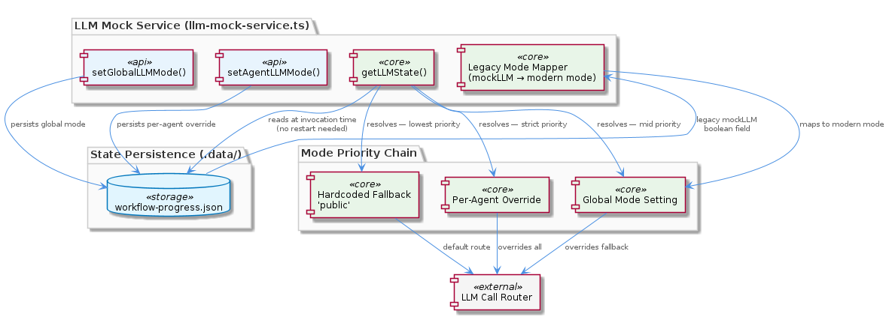
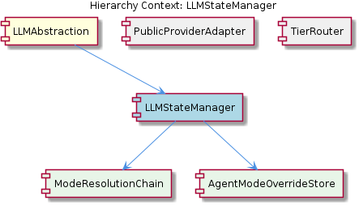

# LLMStateManager

**Type:** SubComponent

llm-mock-service.ts maintains backward compatibility by reading a legacy boolean mockLLM field from workflow-progress.json, mapping it to the equivalent modern mode value

# LLMStateManager — Technical Insight Document

## What It Is

LLMStateManager is a SubComponent implemented within `llm-mock-service.ts`, residing under the `LLMAbstraction` parent component in the broader `integrations/mcp-server-semantic-analysis/` codebase. It is responsible for resolving and persisting the operational mode that determines how LLM calls are routed across the three supported modes (mock, local, public). Rather than holding state in memory or environment variables, it externalizes state to a JSON file at `.data/workflow-progress.json`, which it reads at invocation time on every call to `getLLMState()`.

The component exposes a small, focused API surface centered on three functions in `llm-mock-service.ts`: `getLLMState()` for resolution, `setAgentLLMMode()` for per-agent overrides, and `setGlobalLLMMode()` for project-wide defaults. Together these implement a layered priority system where per-agent overrides win over global mode, which in turn overrides a hardcoded fallback of `'public'`. This makes the LLMStateManager the authoritative source of truth for "which mode is active right now, for this caller" within the LLMAbstraction layer.

## Architecture and Design

The architectural pattern at the heart of LLMStateManager is a **chain-of-responsibility-style resolution hierarchy**, manifested concretely through its child component `ModeResolutionChain`. When `getLLMState()` executes, it evaluates three tiers strictly in order: (1) the per-agent override entry in `.data/workflow-progress.json`, (2) the global mode field in the same file, and (3) the literal string `'public'` as a last-resort fallback. The first tier to yield a value short-circuits the rest, ensuring deterministic and testable resolution behavior.

A second key design decision is the choice of **file-based state persistence** over environment variables or in-memory storage. By writing to `.data/workflow-progress.json`, the LLMStateManager enables mode changes to persist across process invocations and to be modified by external tooling without requiring service restarts. This design fits the broader pattern established by the parent `LLMAbstraction`, which is explicitly described as supporting "runtime mode switching without service restarts."

The component also embraces **backward compatibility as a first-class concern**. The same `getLLMState()` reader handles a legacy boolean `mockLLM` field in `workflow-progress.json`, transparently mapping it to the equivalent modern mode value. This preserves correctness for older clients while allowing the new three-mode taxonomy (mock/local/public) to evolve forward — a pragmatic trade-off that accepts slightly more conditional logic in the reader in exchange for zero migration cost on the client side.

## Implementation Details

The core resolution function, `getLLMState()` in `llm-mock-service.ts`, opens and parses `.data/workflow-progress.json` on every invocation. This deliberate lack of caching is what enables runtime mode switching: any external write to the file is observed by the very next call. The function then walks the three-tier hierarchy embodied by `ModeResolutionChain`, returning the first defined value it encounters.

The per-agent override mechanism is implemented through `setAgentLLMMode()`, which delegates to the child component `AgentModeOverrideStore`. This function writes a keyed entry into `.data/workflow-progress.json` where the key identifies the agent and the value is the selected mode. During resolution, `getLLMState()` consults this keyed map before falling through to the global mode field, establishing agent entries as the highest-priority tier. This per-agent dimension is critical for scenarios where different agents in the same project need to operate in different modes simultaneously — for example, one agent on the mock provider for fast iteration while another runs against a public provider.

The `setGlobalLLMMode()` function writes the project-wide default into a single canonical field in the same JSON file. Because it sits at tier two of the resolution chain, it acts as the effective default whenever no agent-specific override exists, and itself overrides the hardcoded `'public'` literal that serves as the ultimate fallback. The hardcoded fallback ensures that even a missing or corrupted state file does not leave the system without a valid mode.

## Integration Points

LLMStateManager is contained by `LLMAbstraction`, which uses it to make routing decisions before dispatching LLM calls to one of its provider adapters. Among LLMStateManager's siblings, `PublicProviderAdapter` (located under `integrations/mcp-server-semantic-analysis/src/providers/`) represents one of the concrete provider implementations whose selection depends entirely on the mode resolved here. The relationship is unidirectional: LLMStateManager produces a mode value, and adapters like `PublicProviderAdapter` are activated as a consequence.

The other sibling, `TierRouter` (documented in `integrations/mcp-server-semantic-analysis/docs/TIERED-MODEL-PROPOSAL.md`), operates on an orthogonal axis — it selects model tiers based on task complexity, whereas LLMStateManager selects modes based on agent/global configuration. The two compose cleanly: a caller first consults LLMStateManager to know which mode (mock/local/public) is active, then consults `TierRouter` to know which model tier within that mode to target.

LLMStateManager's two children, `ModeResolutionChain` and `AgentModeOverrideStore`, are the internal building blocks rather than external integration points. `ModeResolutionChain` encodes the read-side traversal logic of `getLLMState()`, while `AgentModeOverrideStore` encodes the write-side semantics of `setAgentLLMMode()`. Both are anchored in the same `.data/workflow-progress.json` file, which is the de facto integration contract: any tool or process that wants to influence LLM routing simply writes to this file using the agreed-upon schema.

## Usage Guidelines

Developers should always go through `getLLMState()` in `llm-mock-service.ts` rather than reading `.data/workflow-progress.json` directly. This guarantees correct application of the three-tier resolution order and correct handling of the legacy `mockLLM` boolean. Bypassing the function risks subtle inconsistencies where agent overrides are missed or legacy fields are misinterpreted.

When changing mode at runtime, prefer `setAgentLLMMode()` for scoped, per-agent decisions and reserve `setGlobalLLMMode()` for genuine project-wide intent. Because per-agent overrides have strict priority, leaving a stale agent override in place will silently mask any subsequent change to the global mode for that agent — a common source of confusion. As a corollary, debugging unexpected routing behavior should start by inspecting the agent-keyed entries before examining the global mode field.

Treat the `'public'` hardcoded fallback as a safety net rather than a configured default. If `'public'` is the actual desired default for a deployment, set it explicitly via `setGlobalLLMMode()` so that the intent is recorded in `.data/workflow-progress.json` rather than implied by the absence of state. This makes the configuration self-documenting and avoids ambiguity for operators inspecting the file.

Finally, recognize that the file-based persistence model means every call to `getLLMState()` performs a filesystem read. This is an intentional trade-off favoring runtime responsiveness over performance; high-frequency callers should batch their LLM calls or cache the resolved mode for the duration of a logical operation rather than calling `getLLMState()` in tight loops.

## Hierarchy Context

### Parent
- [LLMAbstraction](./LLMAbstraction.md) -- LLMAbstraction is a multi-modal provider abstraction layer that routes LLM calls across three operational modes—mock, local, and public—without requiring callers to be aware of the underlying provider. The mode selection follows a strict priority hierarchy: per-agent overrides take precedence over a global mode, which itself overrides a fallback default of 'public'. This state is persisted in `.data/workflow-progress.json` and read at invocation time, enabling runtime mode switching without service restarts. The component also maintains backward compatibility with a legacy boolean `mockLLM` flag in the same file, ensuring older clients continue to function correctly.

### Children
- [ModeResolutionChain](./ModeResolutionChain.md) -- getLLMState() in llm-mock-service.ts evaluates three tiers in order — per-agent override, global mode, then the literal string 'public' — so the first matching tier short-circuits the rest, keeping the resolution path predictable and testable.
- [AgentModeOverrideStore](./AgentModeOverrideStore.md) -- setAgentLLMMode writes a keyed entry into .data/workflow-progress.json whose key identifies the agent and whose value is the chosen mode; getLLMState in llm-mock-service.ts looks up this key before consulting the global mode field, establishing agent entries as the highest-priority tier.

### Siblings
- [PublicProviderAdapter](./PublicProviderAdapter.md) -- Provider implementations are located under integrations/mcp-server-semantic-analysis/src/providers/, one adapter per cloud provider as implied by the three-mode architecture
- [TierRouter](./TierRouter.md) -- integrations/mcp-server-semantic-analysis/docs/TIERED-MODEL-PROPOSAL.md defines the tiered model selection strategy, distinguishing tiers by task complexity so that lightweight tasks avoid expensive frontier models

---

*Generated from 5 observations*
