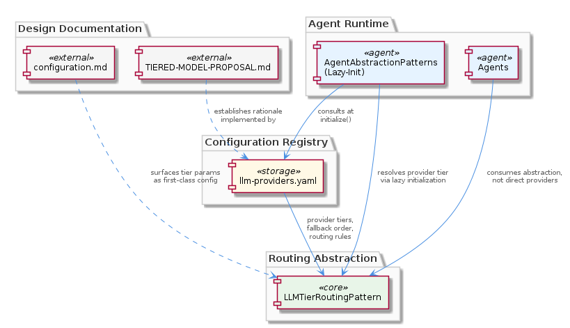
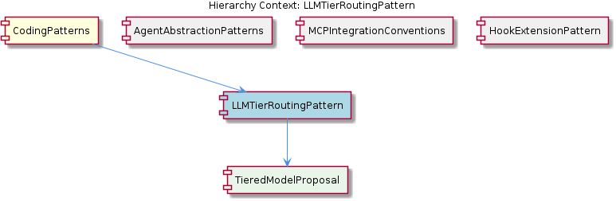

# LLMTierRoutingPattern

**Type:** SubComponent

integrations/mcp-server-semantic-analysis/docs/architecture/agents.md references the agent's dependency on the LLM provider layer, implying agents consume the tier-routing abstraction rather than addressing specific providers directly

# LLMTierRoutingPattern — Technical Insight Document

## What It Is

LLMTierRoutingPattern is a SubComponent of CodingPatterns that formalizes how agents in the Coding project select and route requests to LLM providers based on a tiered ranking system. Its authoritative artifacts live in two related locations: the formal design proposal at `integrations/mcp-server-semantic-analysis/docs/TIERED-MODEL-PROPOSAL.md` (captured as the child entity TieredModelProposal) and the runtime configuration at `llm-providers.yaml`, which the proposal directly motivates. Supporting configuration semantics are documented in `integrations/mcp-server-semantic-analysis/docs/configuration.md`, and the agent-side consumption contract is described in `integrations/mcp-server-semantic-analysis/docs/architecture/agents.md`.

In practical terms, the pattern defines a declarative registry of LLM providers organized by tier, the order in which they should be tried, and the rules governing fallback. Rather than agents hardcoding references to specific providers (e.g., a named vendor or a specific model identifier), they consult this registry at runtime and receive a resolved provider appropriate to their tier needs. This indirection is what makes the pattern a *routing* abstraction rather than a static configuration file.

## Architecture and Design

The architectural approach is a separation between *policy* (which tier should be used, with which fallbacks, under what conditions) and *mechanism* (the agent's actual invocation of an LLM client). Policy is externalized into `llm-providers.yaml`, while the mechanism remains inside each agent's initialization path. This is a classic registry/lookup design: at `initialize()` time, an agent <USER_ID_REDACTED> the registry, the registry resolves a concrete provider tier, and the agent then proceeds with a provider-agnostic interface.

The design dovetails tightly with the parent CodingPatterns concept of agent lazy-initialization. Because tier resolution happens during `initialize()` rather than in the constructor, the cost of consulting `llm-providers.yaml` — and any associated network calls, credential validation, or model loading — is deferred until the agent is actually invoked. This is a deliberate composition with AgentAbstractionPatterns, the sibling that documents the base agent interface enforcing the constructor/initialize() split. Together, these two patterns ensure that adding tier-routed providers does not regress the startup performance characteristics the rest of the system depends on.

A significant design decision visible in the observations is that tier routing parameters are surfaced as *first-class configuration* (per `configuration.md`) rather than baked into code. This implies the system treats provider selection as an operational concern that can be tuned without code changes — a deliberate trade-off favoring deployability and experimentation over compile-time guarantees about which provider an agent will use.

## Implementation Details

The implementation is split across three coordinated artifacts. First, `TIERED-MODEL-PROPOSAL.md` (the TieredModelProposal child entity) supplies the rationale: it establishes *why* models are ranked into tiers, *what* selection criteria define each tier, and *how* the system should escalate or de-escalate among them. This document is the conceptual source of truth — any change to tier semantics should originate here.

Second, `llm-providers.yaml` is the runtime expression of that proposal. It serves as the declarative registry of provider tiers, fallback order, and routing rules. Agents do not parse provider lists themselves; they read this YAML file (or consume it through a configuration layer described in `configuration.md`) and treat its contents as authoritative. Because it is declarative, modifying provider preferences requires only editing this file, not touching agent code.

Third, the consumption contract is in `integrations/mcp-server-semantic-analysis/docs/architecture/agents.md`, which documents the agent's dependency on the LLM provider layer. Agents reference the tier-routing abstraction rather than addressing specific providers directly. The lazy-initialization idiom from AgentAbstractionPatterns provides the mechanical hook: when `initialize()` runs, the agent resolves its tier against `llm-providers.yaml` and binds to a concrete provider at that moment. This means construction is cheap and routing decisions reflect the configuration state at first use rather than at import time.

## Integration Points

The most important integration is with AgentAbstractionPatterns: the constructor/initialize() lifecycle contract enforced there is precisely where tier resolution is plugged in. An agent that follows the base interface gets tier routing essentially for free — it inherits the initialization hook and the convention that LLM setup happens there. Violating the lazy-initialization rule would not only break startup performance assumptions (as noted in CodingPatterns) but also bypass the tier-routing resolution step, since that resolution is anchored to `initialize()`.

The pattern also integrates with the MCPIntegrationConventions sibling through directory placement: the proposal and configuration documents live under `integrations/mcp-server-semantic-analysis/docs/`, conforming to the canonical MCP integration layout (`docs/architecture/`, `docs/api/`, `docs/installation/`, `docs/configuration.md`). New MCP integrations that need their own tier routing should mirror this structure so that the configuration documentation is discoverable in the expected location.

The child TieredModelProposal entity provides the design-time integration point: changes to tier semantics flow from that document into `llm-providers.yaml`. The relationship is one-directional in terms of authority — the proposal defines what the YAML expresses. The HookExtensionPattern sibling is orthogonal: it governs the Claude Code hook contract rather than LLM routing, but both share the CodingPatterns lineage of externalizing contracts into documented files rather than hardcoding them.

## Usage Guidelines

Developers writing or modifying agents should never hardcode a specific LLM provider or model identifier inside agent code. Instead, declare the required tier and let the resolution against `llm-providers.yaml` happen during `initialize()`. This preserves the system's ability to reconfigure providers operationally and keeps agents portable across deployments where the available providers may differ.

When introducing a new tier or modifying fallback order, update `TIERED-MODEL-PROPOSAL.md` first to capture the rationale, then reflect the change in `llm-providers.yaml`. Keeping these two artifacts synchronized is essential — the proposal is the conceptual contract, and the YAML is its operational realization. Reviewers should treat divergence between them as a defect.

Because tier resolution occurs at `initialize()` time, agents must respect the lazy-initialization convention from the parent CodingPatterns. Performing LLM client setup in the constructor would both violate that convention and, more subtly, freeze the agent's provider binding at object-construction time rather than at first use — undermining the configuration-driven flexibility the pattern is designed to provide. Configuration parameters surfaced through `configuration.md` should be treated as the supported tuning surface; reaching past them into internal provider details defeats the abstraction.

Finally, new MCP integrations that need tier-aware LLM access should place their tier documentation under the standard layout established by MCPIntegrationConventions, ensuring `docs/configuration.md` documents any tier-related settings as first-class configuration rather than embedding them as implicit defaults in code.

---

### Summary of Requested Analysis

1. **Architectural patterns identified**: Declarative registry/lookup pattern (provider tiers in YAML), policy/mechanism separation, composition with lazy-initialization lifecycle, externalized configuration contract.
2. **Design decisions and trade-offs**: Tier parameters surfaced as first-class configuration (favors operability over compile-time guarantees); resolution deferred to `initialize()` (preserves startup performance, allows late binding); proposal document separated from runtime YAML (clear authority chain, but requires synchronization discipline).
3. **System structure insights**: Three-artifact structure — proposal (rationale) → YAML (runtime registry) → agent consumption (via `agents.md` contract) — anchored to the AgentAbstractionPatterns lifecycle.
4. **Scalability considerations**: Adding providers or tiers requires only YAML edits, not code changes; tier resolution cost is paid per-agent at first use, aligned with the lazy-initialization performance model; directory conventions from MCPIntegrationConventions support replication across new integrations.
5. **Maintainability assessment**: Strong — externalized configuration, documented rationale via TieredModelProposal, and a clear lifecycle hook minimize coupling. Primary maintenance risk is drift between `TIERED-MODEL-PROPOSAL.md` and `llm-providers.yaml`, which should be guarded by review discipline.

## Hierarchy Context

### Parent
- [CodingPatterns](./CodingPatterns.md) -- [LLM] Agent Lazy-Initialization Pattern: Across the Coding project's agent implementations, a consistent lazy-initialization idiom is applied where LLM client setup is deferred until actual execution rather than performed at construction time. This pattern is documented in docs/puml/agent-integration-flow.puml and docs/puml/agent-abstraction-architecture.puml. The motivation is to avoid paying the cost of LLM connection setup (which may involve network calls, credential validation, and model loading) when an agent object is instantiated—particularly important in systems where many agent types are registered but only a subset are invoked per workflow. A new developer working on an agent should expect a two-phase lifecycle: a lightweight constructor that stores configuration references, followed by an initialize() or setup() method (or equivalent lazy property) that establishes the actual LLM connection on first use. Violating this convention by eagerly connecting in the constructor would break the startup performance characteristics that the rest of the system assumes.

### Children
- [TieredModelProposal](./TieredModelProposal.md) -- The document 'Tiered Model Selection Proposal' (TIERED-MODEL-PROPOSAL.md) establishes the formal design basis for selecting models by tier rank, providing the rationale that the llm-providers.yaml configuration implements at runtime.

### Siblings
- [AgentAbstractionPatterns](./AgentAbstractionPatterns.md) -- docs/puml/agent-abstraction-architecture.puml documents the base agent interface enforcing the constructor/initialize() split, ensuring all concrete agent types adhere to the same lifecycle contract
- [MCPIntegrationConventions](./MCPIntegrationConventions.md) -- integrations/mcp-server-semantic-analysis/ follows the canonical MCP integration directory structure with subdirectories docs/architecture/, docs/api/, docs/installation/, and docs/configuration.md, establishing the expected layout new integrations must mirror
- [HookExtensionPattern](./HookExtensionPattern.md) -- integrations/mcp-constraint-monitor/docs/CLAUDE-CODE-HOOK-FORMAT.md documents the data format Claude Code emits at hook points, defining the contract between the hook producer and constraint-monitor consumer

---

*Generated from 5 observations*
