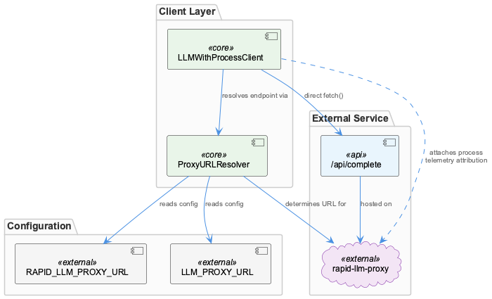
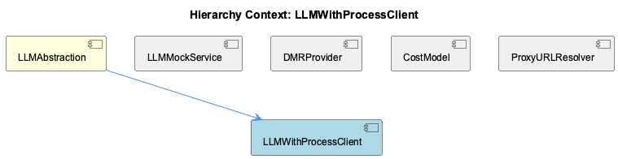

# LLMWithProcessClient

**Type:** SubComponent

It attaches process-level telemetry attribution to outgoing requests, letting downstream cost/usage tracking associate calls with the originating process

# LLMWithProcessClient — Technical Insight Document

## What It Is

LLMWithProcessClient is a client component within LLMAbstraction that issues direct HTTP calls to the `/api/complete` endpoint on rapid-llm-proxy. Unlike higher-level SDK-based clients, it deliberately bypasses SDK abstractions in favor of a raw `fetch()` call, giving it fine-grained control over request construction, headers, and attribution metadata. Its defining characteristic is that it attaches process-level telemetry to every outgoing request, enabling downstream cost and usage tracking systems to associate LLM calls with the specific process that originated them.

## Architecture and Design

The architectural approach here favors explicit, low-level control over convenience abstraction. By using a direct `fetch()` call rather than a wrapped SDK client, LLMWithProcessClient trades some ergonomic simplicity for precise control over request shape — this is likely necessary to inject process-attribution metadata that a generic SDK client wouldn't support natively.

This component depends on ProxyURLResolver to resolve the correct rapid-llm-proxy endpoint before any request is issued, establishing a clear separation of concerns: endpoint resolution logic is centralized in ProxyURLResolver, while LLMWithProcessClient focuses solely on request execution and attribution. This mirrors the design of sibling components like DMRProvider, which similarly wraps a specific provider's API surface, and CostModel, which handles pure downstream cost computation — together these components suggest a layered pipeline: resolve endpoint → execute request with attribution → measure cost.

## Implementation Details

The core mechanic is straightforward: a direct `fetch()` invocation targets `/api/complete` on the resolved rapid-llm-proxy endpoint. Before the call, the client consults ProxyURLResolver, which reads environment variables such as `RAPID_LLM_PROXY_URL` and `LLM_CLI_PROXY_URL` to determine which endpoint to target — LLMWithProcessClient itself also documents `RAPID_LLM_PROXY_URL` and `LLM_PROXY_URL` as relevant configuration knobs, indicating some overlap or complementary env var usage between the client and its resolver dependency.

The process-attribution mechanism is a defining implementation detail: each outgoing request carries metadata identifying the originating process, which downstream systems use to attribute cost and usage. This attribution presumably ties into CostModel's pure functions that map token counts to €/$ costs per provider — though the specific linkage isn't detailed in the observations, the architectural intent (attribution → cost tracking) is clear.

## Integration Points

LLMWithProcessClient sits within LLMAbstraction, the parent component that also governs mode-resolution logic via LLMMockService's `getLLMMode()` precedence chain (per-agent override → global mode → legacy `mockLLM` flag → 'public' default). While LLMWithProcessClient itself doesn't implement mode resolution, it operates within this broader dispatch hierarchy — meaning calls routed through LLMWithProcessClient are subject to whatever mode LLMAbstraction has resolved for the calling agent.

Its direct dependency is ProxyURLResolver, without which it cannot determine a valid rapid-llm-proxy endpoint. It is also configuration-dependent on environment variables (`RAPID_LLM_PROXY_URL`, `LLM_PROXY_URL`), making it inherently environment/container-aware. Siblings such as DMRProvider (Docker Model Runner wrapper) and CostModel (pricing computation) represent parallel concerns in the same LLMAbstraction layer — DMRProvider handles a different provider's API shape while CostModel consumes usage data likely produced by clients like this one.

## Usage Guidelines

Developers integrating with LLMWithProcessClient should ensure `RAPID_LLM_PROXY_URL` or `LLM_PROXY_URL` is correctly set per environment/container, since misconfiguration will cause ProxyURLResolver to resolve an incorrect or unreachable endpoint. Because this client bypasses SDK abstractions, any changes to the `/api/complete` contract on rapid-llm-proxy must be manually reflected in this client's request/response handling — there is no SDK layer to absorb such changes automatically.

When debugging unexpected cost/usage attribution, verify that process-level telemetry is being correctly attached to requests, since this is the mechanism downstream tracking relies on. Additionally, because LLMAbstraction's mode-resolution hierarchy (per-agent override, global mode, legacy flag, default) determines whether calls are dispatched to mock, local, or public providers, developers should confirm the resolved mode before assuming LLMWithProcessClient is actually the code path being exercised for a given agent call.

## Hierarchy Context

### Parent
- [LLMAbstraction](./LLMAbstraction.md) -- [LLM] The LLMAbstraction component implements a mode-resolution hierarchy that is critical for understanding how any given agent call is actually dispatched. getLLMMode() in llm-mock-service.ts checks, in strict order: a per-agent override (allowing individual agents to be pinned to mock/local/public independently of global state), then a global mode setting, then a legacy mockLLM boolean flag (retained for backward compatibility with older config schemas), and finally falls back to 'public' as the safe default. This layered precedence means a developer debugging unexpected LLM behavior for a specific agent must check all four levels rather than assuming the global setting applies uniformly—per-agent overrides silently win even if the global mode says otherwise, which is a common source of confusion during multi-agent experiments.

### Siblings
- [LLMMockService](./LLMMockService.md) -- getLLMMode() in llm-mock-service.ts implements a strict precedence chain: per-agent override, then global mode, then legacy mockLLM boolean, then 'public' default
- [DMRProvider](./DMRProvider.md) -- DMRProvider wraps Docker Model Runner's OpenAI-compatible API surface, letting existing OpenAI-style request/response code reuse the same client shape
- [CostModel](./CostModel.md) -- CostModel contains pure functions mapping token counts to €/$ costs based on per-provider pricing tables
- [ProxyURLResolver](./ProxyURLResolver.md) -- ProxyURLResolver reads environment variables such as RAPID_LLM_PROXY_URL and LLM_CLI_PROXY_URL to decide which endpoint to use

---

*Generated from 4 observations*
