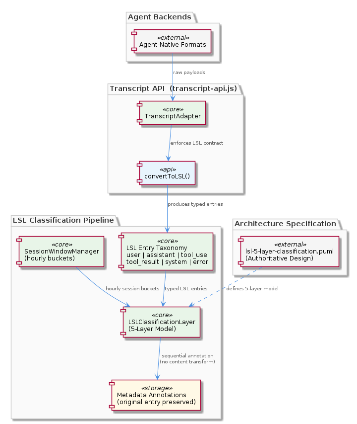
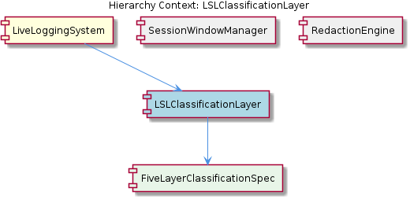

# LSLClassificationLayer

**Type:** SubComponent

The clean separation enforced by the TranscriptAdapter contract in transcript-api.js ensures LSLClassificationLayer never receives unconverted, agent-specific payloads, which keeps classifier logic stable across new agent backends

# LSLClassificationLayer — Technical Insight Document

## What It Is

LSLClassificationLayer is a SubComponent of the LiveLoggingSystem responsible for assigning classification metadata to Live Session Log (LSL) entries and to whole session windows. Its authoritative design is not held in a runtime module but in a specification artifact: `docs/puml/lsl-5-layer-classification.puml`. This PlantUML diagram is explicitly designated as the primary architectural specification a developer should read first, and it is structurally enclosed by the child entity FiveLayerClassificationSpec, which exists to formalize that designation.

The layer consumes the typed LSL entry taxonomy — the entry kinds `user`, `assistant`, `tool_use`, `tool_result`, `system`, and `error` — that is produced by `convertToLSL()` in `lib/agent-api/transcript-api.js`. Because it sits downstream of that conversion step, the classifier never sees agent-native message payloads (e.g., Claude Code–specific or Copilot CLI–specific structures). Instead, it operates on a normalized intermediate representation, which makes the classifier logic stable across any new agent backend that adheres to the TranscriptAdapter contract.

In effect, LSLClassificationLayer is a metadata-enrichment stage: it does not transform entry content, it annotates entries (and the session bucket as a whole) with classification information drawn from a five-layer taxonomy.

## Architecture and Design

The architectural pattern is a **sequential/hierarchical classification pipeline** organized into five distinct layers, as captured in `docs/puml/lsl-5-layer-classification.puml`. Each layer contributes a tier of metadata annotations rather than altering the underlying entry, an additive design that preserves the original entry verbatim for auditability. This append-only, non-destructive annotation model is critical for log integrity, because once an LSL entry has been written it represents a faithful record of what occurred in the agent transcript; classification layers decorate that record without rewriting history.

There is a deliberate **spec-as-source-of-truth** pattern at play here. Rather than burying the classification taxonomy inside a runtime module — where it would be difficult to discover and version — the design externalizes it into a PlantUML diagram and exposes that artifact through the FiveLayerClassificationSpec child entity. This is the same philosophy seen in the sibling RedactionEngine, whose patterns are data-driven via `.specstory/config/redaction-config.yaml`: declarative artifacts outside the code path govern behavior that would otherwise be hard-coded.

The layer also operates at **two distinct granularities**. Entry-level classification annotates individual LSL entries, while session-level classification aggregates signals across an entire hourly bucket — a bucket whose boundaries are defined by the sibling component SessionWindowManager via the `HHMM-HHMM` session-window field carried in LSLMetadata structures across `transcript-api.js` and `lsl-converter.js`. This dual-granularity design implies an aggregation step at the end of (or interleaved with) the per-entry classification pipeline, in which top-level session categories are assigned from rolled-up entry-level signals.

Decoupling is enforced upstream by the TranscriptAdapter contract in `lib/agent-api/transcript-api.js`. Because every adapter must implement `getAgentType()`, `getTranscriptDirectory()`, `readTranscripts()`, `convertToLSL()`, and `getCurrentSession()`, the LSLClassificationLayer is guaranteed to receive only LSL-typed entries. This contract acts as an **anti-corruption layer**: classifier code never branches on agent type and never has to handle raw vendor payloads.

## Implementation Details

The classification layer is specified as five sequential layers, each adding a different category of metadata to an LSL entry. The exact semantics of each layer are defined authoritatively in `docs/puml/lsl-5-layer-classification.puml`; the FiveLayerClassificationSpec child entity exists precisely to hold and surface that definition. Developers extending or debugging classification behavior should consult the PlantUML diagram before reading any runtime code, because the diagram defines the contract that runtime code is implementing.

Input shape is governed by `convertToLSL()` inside `lib/agent-api/transcript-api.js`. That function is responsible for mapping agent-specific message structures into the typed LSL entry taxonomy, so the LSLClassificationLayer's input is always one of `{ user, assistant, tool_use, tool_result, system, error }`. The classifier can therefore be written as a discriminated dispatch over this enumeration without having to detect or handle vendor-specific tool-call schemas, role markers, or message envelopes.

Session-level classification requires coordination with SessionWindowManager. The hourly bucket boundaries are encoded in LSLMetadata as a session-window field formatted `HHMM-HHMM`, and that field appears in both `transcript-api.js` and `lsl-converter.js`. The classifier must therefore group entries by their session-window field, aggregate per-entry signals across the group, and emit a session-level classification once all entries in that window are available (or progressively, depending on how the layer is invoked).

Because the layer's job is annotation rather than transformation, the implementation can be modeled as a fold over LSL entries that produces a metadata structure parallel to (not replacing) the entry stream. This keeps the original entries intact for downstream serialization and auditing.

## Integration Points

**Upstream: TranscriptAdapter (`lib/agent-api/transcript-api.js`).** LSLClassificationLayer depends on the TranscriptAdapter abstract base class established by its parent LiveLoggingSystem. Specifically, it depends on the output of `convertToLSL()`, which guarantees a normalized typed taxonomy. Any new agent backend (e.g., a hypothetical Copilot CLI adapter) is required to fulfill this contract before its output can flow into the classifier, so onboarding new agents does not modify classification code.

**Lateral: SessionWindowManager.** For session-level classification, the layer relies on the `HHMM-HHMM` session-window field that SessionWindowManager computes and assigns at write time. Without correct window assignment, session-level rollups would aggregate the wrong set of entries. The two siblings therefore have a producer/consumer relationship around the session-window metadata field present in LSLMetadata.

**Lateral: RedactionEngine.** RedactionEngine is a sibling that operates on entry content using rules from `.specstory/config/redaction-config.yaml`. Although the observations do not specify the exact ordering, both layers act on the same LSL entry stream. Classification working on annotation (not content rewriting) means it can in principle run independently of redaction, but developers should consult the LSL pipeline definition to confirm sequencing.

**Downstream: FiveLayerClassificationSpec.** The child entity FiveLayerClassificationSpec encapsulates the PlantUML specification at `docs/puml/lsl-5-layer-classification.puml`. Any change to the classification taxonomy should be made in this artifact first, then reflected in runtime code — never the other way around.

**Parent: LiveLoggingSystem.** As a contained SubComponent, LSLClassificationLayer participates in the broader pipeline orchestrated by LiveLoggingSystem, whose primary extension point is the TranscriptAdapter contract in `transcript-api.js`.

## Usage Guidelines

**Read the PlantUML first.** Before modifying classifier logic, open `docs/puml/lsl-5-layer-classification.puml`. This is explicitly the primary architectural specification, and the FiveLayerClassificationSpec child entity exists to enforce its primacy. Runtime code is an implementation of that spec — if the two disagree, the spec wins and the code should be corrected.

**Never branch on agent type.** The TranscriptAdapter contract guarantees that input has already been normalized to the LSL entry taxonomy (`user`, `assistant`, `tool_use`, `tool_result`, `system`, `error`). Adding agent-specific code paths inside the classifier would defeat the entire decoupling architecture and create a maintenance burden whenever a new adapter (e.g., for Copilot CLI) is onboarded.

**Annotate, do not transform.** The five-layer model adds metadata to LSL entries; it does not rewrite their content. This invariant preserves auditability — the original transcript material remains verifiable end-to-end. If you find yourself wanting to mutate entry content during classification, that work probably belongs in `convertToLSL()` upstream or in RedactionEngine laterally.

**Respect the two granularities.** Entry-level classification is local to a single LSL entry; session-level classification requires aggregating across all entries that share an `HHMM-HHMM` session-window value emitted by SessionWindowManager. Do not compute session-level categories until the corresponding hourly bucket is complete (or design progressive aggregation explicitly).

**Treat the taxonomy as stable.** Because so many components depend on the six entry kinds emitted by `convertToLSL()` in `transcript-api.js`, extending the taxonomy is a cross-cutting change. New categories should be added to the PlantUML specification, reflected in `convertToLSL()`, and only then handled in the classifier — in that order.

## Hierarchy Context

### Parent
- [LiveLoggingSystem](./LiveLoggingSystem.md) -- [LLM] The TranscriptAdapter (lib/agent-api/transcript-api.js) establishes a strict five-method contract that every agent integration must fulfill: getAgentType(), getTranscriptDirectory(), readTranscripts(), convertToLSL(), and getCurrentSession(). This abstract base class pattern is the primary extension point for onboarding new agent backends — for example, adding Copilot CLI support would require a concrete subclass that implements all five methods before the downstream knowledge-management pipeline could consume its output. The contract enforces a clean separation between agent-native transcript formats and the unified LSL intermediate representation, meaning that the rest of the system (file routing, classification, serialization) never needs to know whether it is processing a Claude Code session or any other agent. A developer implementing a new adapter should pay particular attention to convertToLSL(), which is responsible for mapping agent-specific message structures into the typed LSL entry taxonomy (user, assistant, tool_use, tool_result, system, error), and to getCurrentSession(), which must correctly identify the active session window so that the file-segmentation logic can place log entries in the right hourly bucket.

### Children
- [FiveLayerClassificationSpec](./FiveLayerClassificationSpec.md) -- The SubComponent (L2) description explicitly designates docs/puml/lsl-5-layer-classification.puml as 'the primary architectural specification a developer should read first', making it the single source of truth for all classification layer definitions rather than any runtime code module.

### Siblings
- [SessionWindowManager](./SessionWindowManager.md) -- LSLMetadata structures across transcript-api.js and lsl-converter.js carry a session-window field formatted as 'HHMM-HHMM', establishing hourly bucket boundaries that SessionWindowManager must compute and assign at write time
- [RedactionEngine](./RedactionEngine.md) -- Redaction rules are declared in .specstory/config/redaction-config.yaml, meaning the set of sensitive patterns (tokens, keys, PII) is data-driven and can be updated without code changes

---

*Generated from 5 observations*
