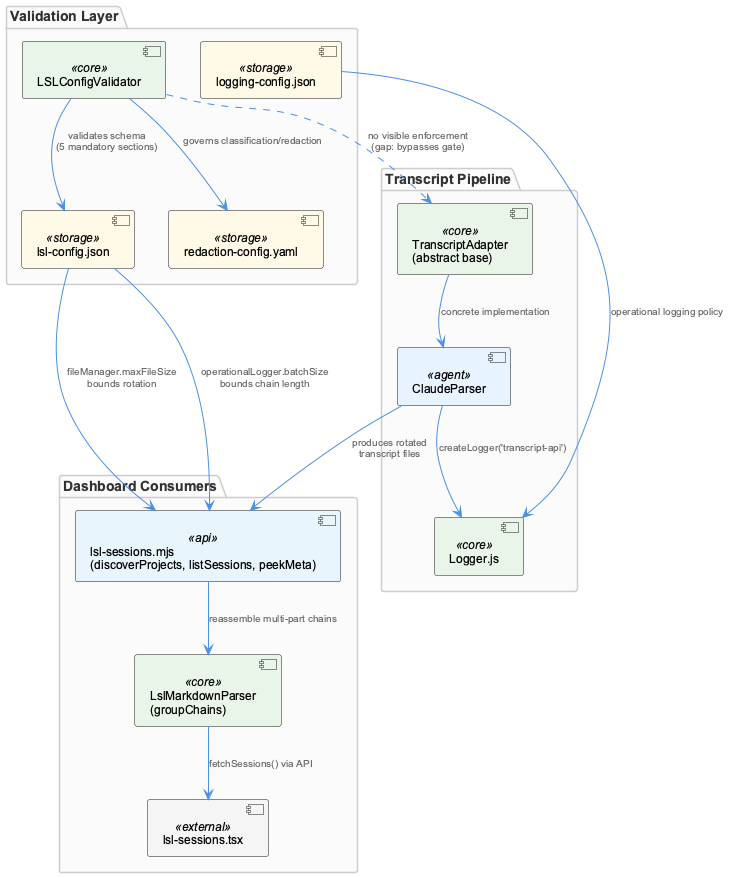
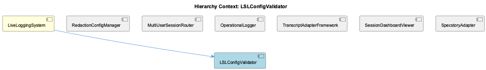

# LSLConfigValidator

**Type:** SubComponent

[Architecture Notes] Config validation (LSLConfigValidator) is fully decoupled from config consumption — no validator import or invocation is visible in the parser/adapter/dashboard layers examined, suggesting validation occurs only at a separate boot/CLI entry point (scripts/validate-lsl-config.js); Two parallel, independently-validated config systems exist side by side: config/logging-config.json (operational logging) and lsl-config.json/redaction-config.yaml (session transcript policy) — both consumed via createLogger but governing different concerns; Inconsistent user-hashing: claude-parser.js:132 stores raw process.env.USER as userHash, contradicting the SHA-256-truncated hashing convention documented for validateUserEnvironment() elsewhere in LSL; Dashboard layer (lsl-sessions.mjs, lsl-sessions.tsx) is a pure read-side consumer of the file-rotation output shaped by fileManager config bounds, with no write path back into the validated config; Abstract class enforcement (TranscriptAdapter) uses runtime throw-on-call rather than TypeScript interfaces, since these are .js files without compile-time enforcement; No visible call site connects TranscriptAdapter/ClaudeParser output to a classification/redaction step, despite the parent context asserting this is architecturally mandatory

# LSLConfigValidator — Technical Insight Document

## What It Is

`LSLConfigValidator` is implemented as the sole class-level entity in `scripts/validate-lsl-config.js`, and functions as the schema-enforcement gatekeeper for the `LiveLoggingSystem`. Although the class body itself is not present in the supplied code slice, both the code graph and its downstream consumers confirm its role: validating two distinct configuration artifacts — `.specstory/config/lsl-config.json` (structural/behavioral settings) and `.specstory/config/redaction-config.yaml` (privacy/classification rules) — before the logging pipeline is allowed to run. Its `initializeSchemas()` method enumerates five mandatory top-level sections: `version`, `multiUser`, `fileManager`, `operationalLogger`, and `classification`. Missing any one of these causes validation to fail outright, establishing a fail-closed posture appropriate for a system that handles potentially sensitive session transcripts.

## Architecture and Design

The validator embodies a **schema validation / fail-closed gatekeeper pattern**, deliberately separating "how the logger behaves" (fileManager, operationalLogger, multiUser) from "what the logger is allowed to record" (classification/redaction). This mirrors a broader defensive-layering strategy visible throughout the LSL codebase: `lib/agent-api/transcript-api.js` defines `TranscriptAdapter` as an abstract base class that throws explicit errors on unimplemented methods and on direct instantiation (constructor at lines 80-84, `new.target` check), while `lib/agent-api/transcripts/claude-parser.js` takes the opposite tolerance stance, wrapping I/O in try/catch blocks that log and continue. `LSLConfigValidator`'s strictness at config-load time is thus the *first* of several defensive layers — a hard gate at boot, followed by graceful per-entry tolerance further downstream.

Architecturally, config validation appears fully decoupled from config consumption: no validator import or invocation is visible anywhere in the parser, adapter, or dashboard layers examined, suggesting validation occurs only once, at a separate boot/CLI entry point (`scripts/validate-lsl-config.js`) rather than being re-checked at each consumption site. This is a deliberate trade-off — simplicity and a single point of enforcement — at the cost of no runtime safety net if a downstream module reads a config that was never actually validated (e.g., in tests or ad hoc scripts).

## Implementation Details

The five required schema sections map onto concrete, numerically-bounded consumers elsewhere in the system, revealing that the validator's constraints are not abstract policy but load-bearing numeric contracts. The `fileManager.maxFileSize` bound (1MB–100MB) directly determines file rotation behavior, and rotation is precisely why `integrations/system-health-dashboard/lsl-sessions.mjs` must reconstruct multi-part "chains" via `groupChains()` (imported from `src/live-logging/LslMarkdownParser.js`) — a legacy `-N_` markdown part is a headerless fragment split mid-token and cannot be read alone. Similarly, `operationalLogger.batchSize` (10–1000) governs rotation frequency, which in turn determines chain length, which in turn determines whether `peekMeta()`'s prompt-set aggregation logic under- or over-reports session activity if it naively samples only the first file in a chain. Any future change to `batchSize`'s valid range in the validator's schema should trigger re-verification of that aggregation logic.

## Integration Points

Within `LiveLoggingSystem`, `LSLConfigValidator` sits alongside sibling components `RedactionConfigManager`, `MultiUserSessionRouter`, `OperationalLogger`, `TranscriptAdapterFramework`, `SessionDashboardViewer`, and `SpecstoryAdapter`. Its classification schema is meant to be the gate that `TranscriptAdapter` implementations (the seam is `convertToLSL(_nativeEntry)`, lines 170-176 of `transcript-api.js`) pass through before entries are considered compliant. However, neither `TranscriptAdapter` nor its concrete implementation `ClaudeParser` shows any call into a classification or redaction step — `parseFile()` and `streamParse()` convert entries via `this.converter.fromClaudeEntry()` and push directly into the entries array with no visible gate. This is either an omission in the supplied slice or a genuine architectural gap.

A related and concrete symptom of this gap: `claude-parser.js:132` sets `userHash: process.env.USER` directly — the raw, unhashed OS username — contradicting the SHA-256-truncation convention documented for `validateUserEnvironment()` elsewhere in LSL, and flagged identically by the sibling `RedactionConfigManager`'s own observations. This suggests the parser path either predates the hashing convention or bypasses the validated `multiUser.userHashLength` constraint entirely, and is worth reconciling with whoever owns the redaction pipeline.

The validator is also architecturally adjacent to, but distinct from, `config/logging-config.json`, which governs operational logging categories (`transcript`, `workflow`) via a separately-validated system. Both `TranscriptAdapter` (via `createLogger('transcript-api')`) and the classification/redaction path flow through the same `Logger.js` module despite governing different concerns — diagnostic logging versus transcript content policy — creating two parallel, independently-validated configuration systems that are easy to conflate. Downstream, `SessionDashboardViewer`-adjacent code such as `lsl-sessions.mjs` and `lsl-sessions.tsx` (via `fetchSessions()` calling `/api/lsl/sessions` on port 3033) is a pure read-side consumer of file-rotation output shaped by the validator's `fileManager` bounds, with no write path back into the validated config.

## Usage Guidelines

Because validation is fail-closed and appears to run only at a single entry point, any config change to `lsl-config.json` or `redaction-config.yaml` should be run through `scripts/validate-lsl-config.js` before deployment — there is no evidence of runtime re-validation elsewhere. Developers modifying `fileManager.maxFileSize` or `operationalLogger.batchSize` should treat these as coupled to chain-reconstruction logic in `lsl-sessions.mjs`, not just as tuning knobs — changing the bounds changes rotation behavior and therefore correctness of downstream aggregation. Given the missing classification/redaction call site in `TranscriptAdapter`/`ClaudeParser`, and the raw-username leak at `claude-parser.js:132`, any new adapter (or fix to existing ones) should explicitly verify that entries pass through classification/redaction logic consistent with what `LSLConfigValidator`'s schema mandates, rather than assuming enforcement happens implicitly. Finally, because enforcement of abstract behavior in `TranscriptAdapter` is runtime-only (throw-on-call, no TypeScript interfaces), schema and contract violations — including config-shape drift — will surface at runtime rather than compile time, reinforcing the importance of the validator's fail-closed startup check as the primary safety net.

## Code Evidence

Key code artifacts grounding this entity's analysis:

**Structural:**
- LSLConfigValidator (class) in validate-lsl-config.js

**Other:**
- The code graph identifies LSLConfigValidator as the sole class-level entity in validate-lsl-config.js, confirming the parent context's description of it as a centralized gatekeeper. Its initializeSchemas() method — referenced in the parent observations rather than directly visible in the supplied code files — enumerates five mandatory top-level sections (version, multiUser, fileManager, operationalLogger, classification), and this fail-closed posture is architecturally consistent with the surrounding LSL codebase seen here: lib/agent-api/transcript-api.js defines TranscriptAdapter as an abstract base class whose unimplemented methods throw explicit errors rather than silently no-opping, and lib/agent-api/transcripts/claude-parser.js wraps nearly every I/O operation in try/catch blocks that log and continue rather than crash. The validator's strictness at config-load time is the first of several defensive layers in this pipeline, followed by per-entry parse-error tolerance further downstream.

## Hierarchy Context

### Parent
- [LiveLoggingSystem](./LiveLoggingSystem.md) -- [LLM] The LiveLoggingSystem's configuration validation is centralized in scripts/validate-lsl-config.js through the LSLConfigValidator class, which acts as a schema enforcement gatekeeper for two distinct config artifacts: .specstory/config/lsl-config.json (structural/behavioral settings) and .specstory/config/redaction-config.yaml (privacy/classification rules). This separation reflects a deliberate architectural decision to decouple 'how the logger behaves' from 'what the logger is allowed to record', allowing redaction policy to be iterated on independently from file-management or session-windowing logic. The initializeSchemas() method enumerates five required top-level sections (version, multiUser, fileManager, operationalLogger, classification), meaning any config missing even one of these fails validation outright—this is a strict fail-closed design rather than a permissive fail-open one, which is notable for a system handling potentially sensitive session transcripts.

### Siblings
- [RedactionConfigManager](./RedactionConfigManager.md) -- [LLM] lib/agent-api/transcripts/claude-parser.js:parseFile() sets session metadata `userHash: process.env.USER || 'unknown'` — this is the RAW, unhashed OS username, not a SHA-256 truncated hash. This directly contradicts the pseudonymization pattern described for LSL's `validateUserEnvironment()` (hash+truncate to 6 chars) referenced in the parent LiveLoggingSystem context. If ClaudeParser's output metadata is persisted or surfaced without passing back through a redaction/hashing step, this is a plaintext-username leak in exactly the kind of session transcript metadata the classification schema is meant to guard, and is worth verifying against whatever RedactionConfigManager rules apply downstream of this adapter.
- [MultiUserSessionRouter](./MultiUserSessionRouter.md) -- [LLM] [object Object]
- [OperationalLogger](./OperationalLogger.md) -- [CGR] OperationalLogger (class) in OperationalLogger.js
- [TranscriptAdapterFramework](./TranscriptAdapterFramework.md) -- [LLM] [object Object]
- [SessionDashboardViewer](./SessionDashboardViewer.md) -- [LLM] [object Object]
- [SpecstoryAdapter](./SpecstoryAdapter.md) -- [CGR] SpecstoryAdapter (class) in specstory-adapter.js

---

*Generated from 10 observations*
