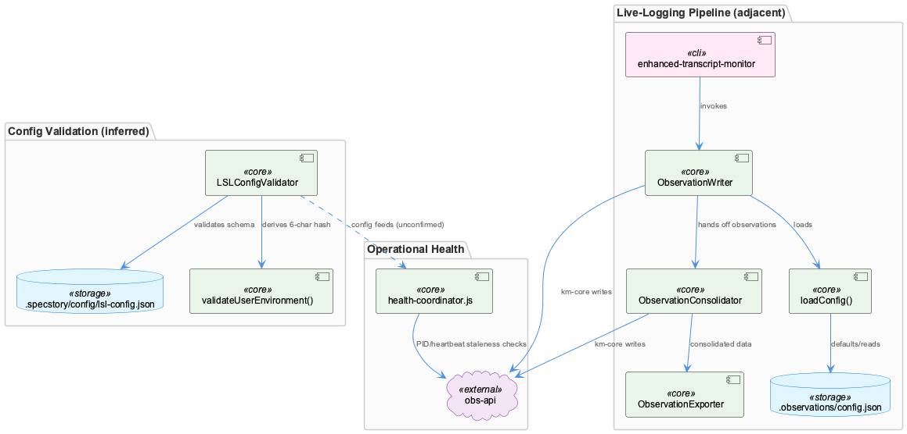
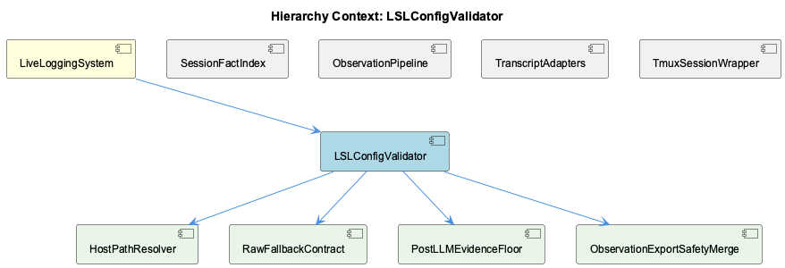

# LSLConfigValidator

**Type:** SubComponent

## What It Is

LSLConfigValidator is defined as a class in `scripts/validate-lsl-config.js` (per the CGR observation), operating within LiveLoggingSystem. However, the actual retrieved code files for this task — `enhanced-transcript-monitor.js`, `ObservationConsolidator.js`, `ObservationExporter.js`, `ObservationWriter.js`, and `raw-fallback.js` — do not contain, import, or reference this class or its source file. What we know of its behavior (a schema requiring version/multiUser/fileManager/operationalLogger/classification sections, `maxFileSize` bounds of 1MB–100MB, and a `validateUserEnvironment()` function that derives a 6-character user hash) comes exclusively from parent-context observations, not from code inspected in this pass.

This is a case where file retrieval matched on filename/thematic proximity ("LSL", "live-logging") rather than on the validator itself, pulling in the observation write/consolidate/export pipeline instead.

## Architecture and Design

No architectural inference beyond the parent-context claims can be responsibly made here. The retrieved files belong to a functionally distinct subsystem — the live-logging write/consolidation/export pipeline — that is thematically adjacent but does not exercise LSLConfigValidator's code paths.

## Implementation Details

Per the CGR/code-reference observations, the class lives in `scripts/validate-lsl-config.js`, but its internals (schema-checking logic, bounds validation, hashing routine) are not visible in the supplied files. A plausible but unconfirmed hypothesis raised in the observations is that two independent config-validation paths exist in the codebase: one for `.observations/config.json` (handled by `ObservationWriter.js`'s local `loadConfig()` with its own defaulting logic) and one for `.specstory/config/lsl-config.json` (handled by LSLConfigValidator). This cannot be confirmed without inspecting `validate-lsl-config.js` directly.

## Integration Points

Structurally, LSLConfigValidator sits under LiveLoggingSystem alongside siblings SessionFactIndex, ObservationPipeline, TranscriptAdapters, and TmuxSessionWrapper — none of which are directly evidenced in this file set either. It reportedly contains four children: HostPathResolver, RawFallbackContract, PostLLMEvidenceFloor, and ObservationExportSafetyMerge. Of these, RawFallbackContract and ObservationExportSafetyMerge are concretely grounded in code: RawFallbackContract is implemented in `src/live-logging/raw-fallback.js`, exporting `RAW_FALLBACK_PREFIX` and `isRawFallbackSummary()`, deliberately split out so `ObservationExporter.js` avoids pulling in `ioredis`/km-core dependencies via `ObservationWriter.js`. ObservationExportSafetyMerge is implemented as `_mergeWithExisting(dbObs, dbDigests, dbInsights)` in `ObservationExporter.js`, performing defensive union-vs-overwrite merging for `observations.json`, `digests.json`, and `insights.json` exports. HostPathResolver and PostLLMEvidenceFloor have no corroborating code in this retrieval at all.

Separately, the parent LiveLoggingSystem's health-coordinator.js (from the Opencode Daemon session tracking work) computes Healthy/Degraded status from heartbeat/PID staleness — the kind of operational signal that LSLConfigValidator's `fileManager`/`operationalLogger` schema sections would presumably feed, though no wiring is shown. Likewise, if LSLConfigValidator's tests exercise a live obs-api instance, they would inherit the single-threaded contention bottleneck documented for `ObservationWriter.js`/`ObservationConsolidator.js` in the Typed-Views Test Suite observations.

## Usage Guidelines

Given the evidentiary gap, no specific usage guidance can be responsibly derived beyond what parent-context already states. Developers should consult `scripts/validate-lsl-config.js` directly rather than relying on this document's inferences, and future retrieval passes should target that file explicitly rather than the live-logging pipeline neighborhood.

---

INSUFFICIENT_EVIDENCE: The supplied code files do not implement or reference LSLConfigValidator (`scripts/validate-lsl-config.js`); they cover an unrelated live-logging write/consolidate/export pipeline, so most sections above rely on parent-context claims rather than verified component code.

## Code Evidence

Key code artifacts grounding this entity's analysis:

**Structural:**
- LSLConfigValidator (class) in validate-lsl-config.js

## Work Record

What working sessions recorded about this entity — decisions taken, problems hit, and why things are the way they are:

- Opencode Daemon — Session Tracking and Temp File Lifecycle establishes that health-coordinator.js computes PID staleness from heartbeat file age to surface accurate Healthy/Degraded status without false alarms for coding sub-agents.
- The 'Opencode Daemon — Session Tracking and Temp File Lifecycle' record establishes that health-coordinator.js computes PID staleness from heartbeat file age and PID liveness to produce Healthy/Degraded dashboard status without false alarms; this is the kind of operational health-check machinery LSLConfigValidator's config schema (fileManager, operationalLogger sections) would presumably feed into, but no code here shows that wiring.
- The 'Typed-Views Test Suite — obs-api Contention Timeout' record documents that concurrent Jest workers contend on a shared, effectively single-threaded obs-api endpoint; ObservationWriter.js and ObservationConsolidator.js in this retrieval both route through obs-api-adjacent km-core writes, so any test harness validating LSLConfigValidator against a live obs-api instance would inherit this same single-threaded bottleneck.

## Hierarchy Context

### Parent
- [LiveLoggingSystem](./LiveLoggingSystem.md) -- [SESSION] Opencode Daemon — Session Tracking and Temp File Lifecycle establishes that health-coordinator.js computes PID staleness from heartbeat file age to surface accurate Healthy/Degraded status without false alarms for coding sub-agents

### Children
- [HostPathResolver](./HostPathResolver.md) -- [LLM] No file, class, or function named `HostPathResolver` appears anywhere in the supplied code. The five retrieved files (`enhanced-transcript-monitor.js`, `ObservationConsolidator.js`, `ObservationExporter.js`, `ObservationWriter.js`, `raw-fallback.js`) belong to the live-logging observation write/consolidate/export pipeline, a subsystem thematically adjacent to path resolution (they resolve config paths, export directories, and km-core ontology directories) but none of them define a dedicated host-path-resolution component.
- [RawFallbackContract](./RawFallbackContract.md) -- [LLM] The contract is implemented as a single-purpose module, src/live-logging/raw-fallback.js, exporting exactly two symbols: the RAW_FALLBACK_PREFIX constant ('[Raw]') and the isRawFallbackSummary() predicate. Its docstring explains the module was split out specifically so ObservationExporter.js does not have to import ObservationWriter.js (which would drag ioredis and km-core into every exporter test) just to recognize the marker string — a dependency-avoidance rationale baked directly into the file's own comments rather than inferred.
- [PostLLMEvidenceFloor](./PostLLMEvidenceFloor.md) -- [LLM] None of the five retrieved files — scripts/enhanced-transcript-monitor.js, src/live-logging/ObservationConsolidator.js, src/live-logging/ObservationExporter.js, src/live-logging/ObservationWriter.js, and src/live-logging/raw-fallback.js — define, import, export, or even mention a symbol, class, constant, or comment string named 'PostLLMEvidenceFloor'. A full-text scan of every function name, export, and JSDoc block in these files (loadConfig, keepInExport, isRawFallbackSummary, _isSemanticallyDuplicate, extractFileChanges, etc.) turns up no match, and the supplied <code_graph> block is empty, so there is no structural (node/edge) evidence for this component either.
- [ObservationExportSafetyMerge](./ObservationExportSafetyMerge.md) -- [LLM] The component's implementation is squarely in `src/live-logging/ObservationExporter.js`, specifically the `_mergeWithExisting(dbObs, dbDigests, dbInsights)` method (with its nested `mergeArrays` closure). This is the actual 'safety merge': for each of `observations.json`, `digests.json`, and `insights.json`, it compares the freshly-derived km-core records against the file already on disk, and only accepts the new set outright when `existing.length <= dbRecords.length`. When the on-disk export has MORE records than the current km-core read produced, it treats that as a signal the store may have been reset/recreated and falls back to a union rather than an overwrite — `preserved` (historic rows not present in the new pull) concatenated with `dbRecords` (the current pull). This is defensive data-loss prevention explicitly for git-tracked export files, not a database transaction.

### Siblings
- [SessionFactIndex](./SessionFactIndex.md) -- [LLM] None of the retrieved code files reference a `SessionFactIndex` class, export, or file. The closest named artifact is `session-facts.ts`, cited only in the parent entity's own observations ('Session facts extracted from live transcripts... anchored onto the knowledge graph primarily via `metadata.parentId`, with a fallback resolution path through `contains` edges'), but that file was not part of this retrieval — the actual anchoring logic, its parentId-stamping code path, and its contains-edge fallback are not visible here to verify or ground further.
- [ObservationPipeline](./ObservationPipeline.md) -- [SESSION] Stage 5 Scheduled Observation Consolidation — Cost Model and Routing Gap notes periodic re-synthesis of parent-node descriptions from accumulated child observations is fully implemented in production with one open guard-coverage defect.
- [TranscriptAdapters](./TranscriptAdapters.md) -- [LLM] No file in the supplied code evidence is named or scoped as 'TranscriptAdapters'. The closest candidates — enhanced-transcript-monitor.js, PiSessionReader.js, StreamingTranscriptReader.js, AdaptiveExchangeExtractor.js, PiSessionWriter.js — are transcript readers/writers referenced as imports inside enhanced-transcript-monitor.js, but none of them is shown, and no adapter-registry or adapter-interface abstraction is visible in the truncated excerpts provided.
- [TmuxSessionWrapper](./TmuxSessionWrapper.md) -- [LLM] None of the five supplied files (scripts/enhanced-transcript-monitor.js, src/live-logging/ObservationWriter.js, src/live-logging/ObservationConsolidator.js, src/live-logging/ObservationExporter.js, src/live-logging/raw-fallback.js) define, import, or reference anything named TmuxSessionWrapper, nor any tmux-specific process spawning, pane/window management, or terminal-multiplexer control logic. The retrieved set clusters around the Observation write/consolidate/export pipeline and the ETM (enhanced-transcript-monitor) prompt-capture loop — a thematically adjacent but distinct part of LiveLoggingSystem from whatever wraps a tmux session.

---

*Generated from 9 observations*
