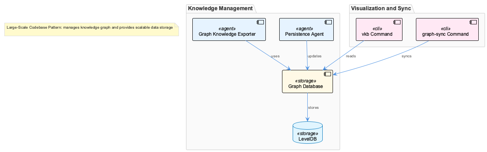
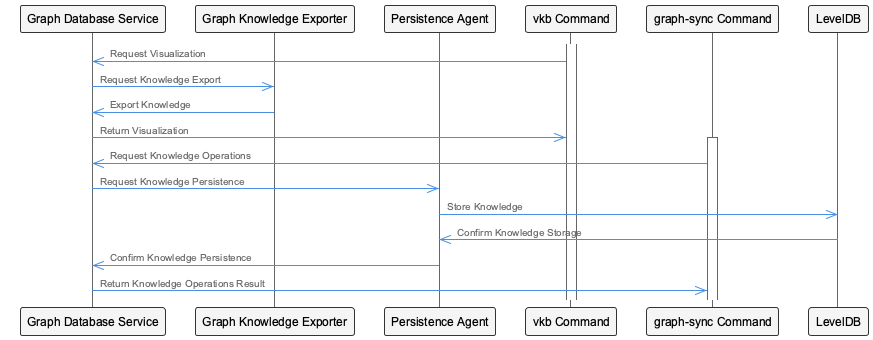
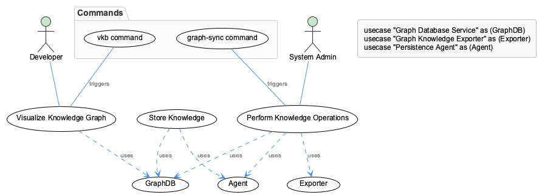

# Large-ScaleCodebasePattern

**Type:** TransferablePattern

The codebase uses a microservices architecture, with separate components for graph database service, graph knowledge exporter, and persistence agent.

## Introduction to Large-Scale Codebase Pattern
The Large-Scale Codebase Pattern is a complex entity that revolves around managing and utilizing a vast amount of knowledge stored in a scalable and efficient manner. At its core, this pattern aims to solve the problem of effectively storing, managing, and retrieving large-scale knowledge bases, particularly those represented as graphs. The use of a microservices architecture, graph databases, and specific commands for visualization and knowledge operations indicates a well-thought-out approach to handling the complexities of large-scale knowledge management.

## Synthesize Understanding
This entity is fundamentally about creating a scalable and maintainable system for handling large amounts of knowledge, structured as graphs. The core purpose is to provide an efficient and effective way to store, manage, and retrieve this knowledge, facilitating operations such as visualization and synchronization. By utilizing a microservices architecture, the system ensures modularity, flexibility, and scalability, allowing for easier maintenance and updates. The problem it solves is the efficient management of complex, large-scale knowledge bases, which is crucial for applications that rely on graph data, such as knowledge graphs, social networks, or recommendation systems.

## Architecture & Design
The architectural decisions evident in the Large-Scale Codebase Pattern include the adoption of a microservices architecture, which allows for the separation of concerns into distinct services such as the graph database service, graph knowledge exporter, and persistence agent. This separation enables independent development, deployment, and scaling of each service, enhancing the overall system's flexibility and resilience. The use of graph databases and LevelDB for knowledge storage is another significant decision, providing a scalable and efficient data storage solution capable of handling complex graph structures. The architectural patterns identified include the Microservices Pattern, the Graph Database Pattern, and the Command Pattern (as seen with the `vkb` and `graph-sync` commands).

Design decisions and trade-offs are also apparent. For instance, the choice of microservices over a monolithic architecture may introduce additional complexity in terms of service communication and coordination but offers greater scalability and maintainability. The selection of specific database technologies (graph database and LevelDB) for knowledge storage suggests a trade-off between the benefits of specialized databases for graph data and the potential complexity of managing multiple database technologies.

## Implementation Details
The implementation of the Large-Scale Codebase Pattern involves several key technologies and approaches. The microservices architecture is implemented with separate components for graph database services, graph knowledge export, and persistence. The `vkb` command is utilized for visualization purposes, indicating a command-line interface or API for interacting with the system's visualization capabilities. The `graph-sync` command suggests a mechanism for synchronizing knowledge graphs, possibly across different services or databases. The use of graph databases and LevelDB as storage solutions highlights the importance of efficient data retrieval and storage for graph-structured knowledge.

## Integration Points
The integration of the Large-Scale Codebase Pattern with other parts of the system is facilitated through the microservices architecture, which allows for loose coupling between services. The graph database service, for example, can be integrated with other components that require access to graph-structured knowledge, such as applications needing to query or update the knowledge base. The persistence agent can ensure data consistency across different services. The Command Pattern, as seen with the `vkb` and `graph-sync` commands, provides a standardized interface for interacting with the system, making it easier to integrate with other components or external systems.

## System Structure Insights
The system structure of the Large-Scale Codebase Pattern is modular and distributed, with a focus on scalability and efficiency. The separation into microservices allows for a more manageable and maintainable system, as each service can be developed, tested, and deployed independently. The centralized use of graph databases and LevelDB for knowledge storage ensures that data is handled consistently across the system, while the command-line interfaces (like `vkb` and `graph-sync`) provide a unified way to interact with the system's functionalities.

## Scalability Considerations
Scalability is a key consideration in the design of the Large-Scale Codebase Pattern. The use of microservices architecture allows for horizontal scaling, where each service can be scaled independently based on demand. The graph database and LevelDB are chosen for their ability to efficiently store and retrieve large amounts of graph-structured data, ensuring that the system can handle increasing amounts of knowledge without significant performance degradation. The overall system design enables it to scale both in terms of the amount of knowledge it can manage and the number of users or services interacting with it.

## Maintainability Assessment
The maintainability of the Large-Scale Codebase Pattern is enhanced by its modular design. The microservices architecture makes it easier to update, replace, or scale individual components without affecting the entire system. The use of standardized commands and interfaces (such as `vkb` and `graph-sync`) simplifies interactions with the system, reducing the complexity of integrating new services or components. Additionally, the choice of specialized databases for graph data (graph database and LevelDB) may require specific expertise but provides efficient data management, which is crucial for maintaining large-scale knowledge bases.

### Architectural Patterns Identified
1. **Microservices Pattern**: Allows for the separation of concerns into distinct services, enhancing scalability and maintainability.
2. **Graph Database Pattern**: Utilizes databases optimized for graph-structured data, providing efficient storage and retrieval.
3. **Command Pattern**: Standardizes interactions with the system through commands like `vkb` and `graph-sync`.

### Design Decisions and Trade-Offs
- **Microservices vs. Monolithic Architecture**: Offers scalability and maintainability but introduces complexity in service communication and coordination.
- **Specialized Databases**: Provides efficient data management for graph-structured knowledge but may require specific expertise.

### System Structure Insights
- **Modular and Distributed**: Allows for independent development, deployment, and scaling of services.
- **Centralized Knowledge Storage**: Ensures consistent data handling across the system.

### Scalability Considerations
- **Horizontal Scaling**: Enabled through the microservices architecture.
- **Efficient Data Storage**: Provided by graph databases and LevelDB, capable of handling large amounts of graph-structured data.

### Maintainability Assessment
- **Modular Design**: Enhances maintainability by allowing for updates or replacements of individual components without system-wide impact.
- **Standardized Interfaces**: Simplifies interactions and integrations, reducing complexity.

## Diagrams

### Architecture

### Sequence

### Class

### Use cases

---

*Generated from 3 observations*
