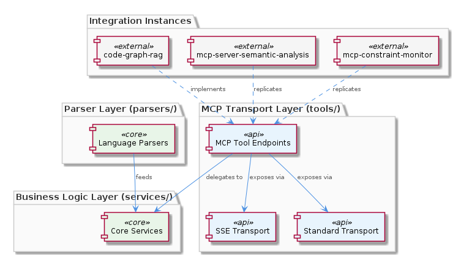
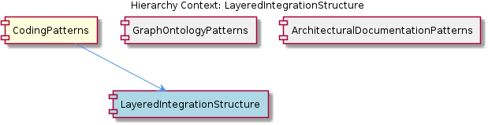

# LayeredIntegrationStructure

**Type:** SubComponent

The tools/ layer is specifically associated with MCP tool exposure (callable capabilities), distinguishing it from services/ which holds business logic — a ports-and-adapters boundary made visible through directory naming

# LayeredIntegrationStructure

## What It Is

LayeredIntegrationStructure is the canonical directory-level architectural convention applied consistently across integrations in this project. Its reference implementation lives at `integrations/code-graph-rag/codebase_rag/`, which is explicitly documented in `integrations/code-graph-rag/CONTRIBUTING.md` as the expected structure for new contributors. The same topology is replicated in `integrations/mcp-server-semantic-analysis/` and `integrations/mcp-constraint-monitor/`, confirming this is a project-wide standard rather than an artifact of a single integration's history.

The structure divides each integration into five named layers: `parsers/`, `providers/`, `services/`, `tools/`, and `utils/`. Each layer has a single, well-scoped responsibility, and the `CONTRIBUTING.md` explicitly names which layer owns which kind of addition — preventing cross-layer placement before it can happen.

## Architecture and Design

The five-layer split mirrors a ports-and-adapters (hexagonal) architectural style, made tangible through directory naming rather than through framework enforcement. The boundary between `tools/` and `services/` is particularly deliberate: `services/` holds business logic, while `tools/` holds MCP-exposed callable capabilities — the directory names themselves communicate the ports-and-adapters vocabulary to any reader of the filesystem.

`parsers/` sits at the outermost inbound edge, handling raw source ingestion (language parsing, in the `code-graph-rag` case). `providers/` abstracts data sources, acting as an anti-corruption layer between external data and internal logic. `services/` is the core domain layer. `tools/` is the outbound adapter layer facing MCP consumers. `utils/` holds shared, layer-agnostic helpers. The net effect is that each concern has exactly one home — a new language parser belongs only in `parsers/`, a new MCP-exposed capability belongs only in `tools/`.

The design decision to enforce this through convention rather than a build tool is significant. There is no compiler or linter mechanically preventing a developer from placing a parser in `services/`. The enforcement mechanism is social and documentary: `CONTRIBUTING.md` names the rules, and the consistent replication across `mcp-server-semantic-analysis/` and `mcp-constraint-monitor/` creates a visible pattern that new integrations are expected to follow.

As a subcomponent of CodingPatterns, LayeredIntegrationStructure represents one of the project's primary structural rules. It sits alongside GraphOntologyPatterns, which encodes containment hierarchies as first-class graph edges, and ArchitecturalDocumentationPatterns, which governs where PlantUML diagrams live in `docs/puml/`. Together these siblings define a project where structure — whether in directories, graphs, or documentation — is treated as an explicit design artifact.

## Implementation Details

Within `integrations/code-graph-rag/codebase_rag/`, the five layers are concrete subdirectories. The `parsers/` layer is responsible for language-specific source ingestion, meaning new language support is isolated to this directory. The `providers/` layer abstracts the data sources that `services/` consumes, which is the classic dependency inversion point in ports-and-adapters: the service layer depends on provider interfaces, not on specific data backends.

The `tools/` layer carries additional specificity beyond its name. The environment variables `CODE_GRAPH_RAG_PORT` and `CODE_GRAPH_RAG_SSE_PORT` indicate that this layer exposes capabilities over both a standard transport and a Server-Sent Events transport, both rooted in the same structural layer. This means `tools/` is not merely an organizational bucket — it is the single layer responsible for all external-facing MCP transport concerns, regardless of transport type.

`utils/` is intentionally layer-agnostic. Its placement as a peer to the other four layers (rather than nested within one) signals that it serves cross-cutting helpers that do not belong to any single layer's domain.

## Integration Points

LayeredIntegrationStructure is explicitly a subcomponent of CodingPatterns, meaning it is one of the enforced patterns that define how this codebase is written and extended. Its influence is visible across at least three integrations: `integrations/code-graph-rag/`, `integrations/mcp-server-semantic-analysis/`, and `integrations/mcp-constraint-monitor/`. Any new integration added to the project is expected to replicate this topology.

The `tools/` layer connects directly to MCP consumers — external callers invoking capabilities via the MCP protocol. This makes `tools/` the integration boundary between the integration's internal domain and the broader MCP ecosystem. The dual-transport support (standard port and SSE port) means this boundary handles multiple protocol variants without pushing that complexity into `services/`.

The relationship between this pattern and GraphOntologyPatterns is indirect but coherent: GraphOntologyPatterns encodes filesystem containment (`CONTAINS_FOLDER`, `CONTAINS_FILE`) as graph edges in `config/graph-database-config.json`, which means the directory hierarchy enforced by LayeredIntegrationStructure is itself queryable as graph structure — the layers are not just organizational conventions but nodes and edges in the project's knowledge graph.

## Usage Guidelines

The primary rule, documented in `CONTRIBUTING.md`, is placement discipline: new language parsers go in `parsers/`, new MCP-exposed capabilities go in `tools/`, and these boundaries are not to be crossed. This single rule prevents the most common form of architectural drift in layered systems — logic accumulating in the wrong layer because it was convenient at the time.

The distinction between `services/` and `tools/` deserves particular attention. A capability implemented in `services/` but exposed via MCP must have its MCP adapter in `tools/` — the business logic and the transport exposure are separate concerns even when they are closely related. Developers adding new MCP tools should implement domain logic in `services/` and add only the MCP-facing wrapper in `tools/`.

Because enforcement is convention-based rather than tooling-based, code review is the primary gate. Reviewers should treat a file placed in the wrong layer as a structural defect, not a style preference. The consistency across three existing integrations gives reviewers a clear reference: if the structure in a new integration does not match `integrations/code-graph-rag/codebase_rag/`, it should be flagged. New integrations should treat that directory as the template, consulting `CONTRIBUTING.md` as the authoritative scope document for each layer.

## Hierarchy Context

### Parent
- [CodingPatterns](./CodingPatterns.md) -- [LLM] The project enforces a strict layered architecture within each integration, most visibly in integrations/code-graph-rag/codebase_rag/ which separates concerns into parsers/, providers/, services/, tools/, and utils/ subdirectories. This mirrors a classic hexagonal/ports-and-adapters style: parsers handle raw source ingestion, providers abstract data sources, services contain business logic, tools expose callable capabilities (likely as MCP tools), and utils hold shared helpers. A new developer adding a language parser would add only to parsers/, while a new MCP-exposed capability would live in tools/ — the structure enforces that each concern has exactly one home. This same pattern repeats in integrations/mcp-server-semantic-analysis/ and integrations/mcp-constraint-monitor/, suggesting the project treats this directory layout as a project-wide architectural standard rather than an incidental choice.

### Siblings
- [GraphOntologyPatterns](./GraphOntologyPatterns.md) -- The relationship types CONTAINS_PACKAGE, CONTAINS_FOLDER, CONTAINS_FILE, CONTAINS_MODULE form a strict containment hierarchy in config/graph-database-config.json, encoding filesystem and module nesting as first-class graph edges
- [ArchitecturalDocumentationPatterns](./ArchitecturalDocumentationPatterns.md) -- The docs/puml/ directory is called out as the canonical home for PlantUML diagrams, establishing a convention that architecture diagrams live alongside but separate from prose documentation

---

*Generated from 5 observations*
