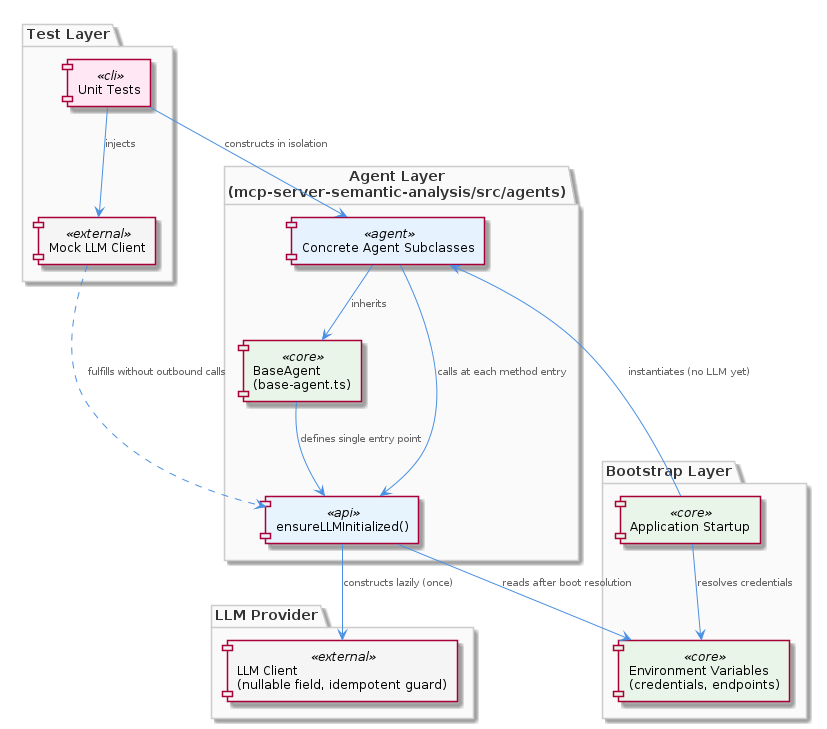
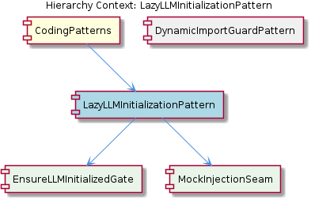

# LazyLLMInitializationPattern

**Type:** SubComponent

The deferred initialization solves a concrete boot-ordering problem: agents may be instantiated during application startup in integrations/mcp-server-semantic-analysis before environment variables (LLM provider credentials, endpoint URLs) are fully resolved

# LazyLLMInitializationPattern — Technical Insight Document

## What It Is

The `LazyLLMInitializationPattern` is a structural convention implemented in `integrations/mcp-server-semantic-analysis/src/agents/base-agent.ts`, which serves as the authoritative source defining `ensureLLMInitialized()` as the single sanctioned entry point for LLM client acquisition across all concrete agent subclasses. Rather than instantiating LLM clients at object construction time, agents defer this work until the moment a method actually requires a live LLM connection.

As a child of the `CodingPatterns` component, this pattern represents one of several deliberate architectural constraints enforced across the `mcp-server-semantic-analysis` codebase. It sits alongside its sibling `DynamicImportGuardPattern`, which solves an analogous problem for optional external services like Memgraph by probing availability before importing client libraries — both patterns share the underlying philosophy of decoupling object construction from I/O-bound resource acquisition.

The pattern decomposes into two child concerns: the `EnsureLLMInitializedGate` (the centralised gating logic in `base-agent.ts`) and the `MockInjectionSeam` (the implicit testability hook exposed by that same gate). Together these define both the runtime mechanics and the test-time affordances of the pattern.

## Architecture and Design

The architectural approach is a **two-phase construction pattern** combined with an **idempotent initialization guard**. Phase one — synchronous object graph construction — happens in agent constructors and is required to be free of LLM-related I/O. Phase two — resource acquisition — happens lazily at method-entry points via `ensureLLMInitialized()`. This split solves a concrete boot-ordering problem: agents in `integrations/mcp-server-semantic-analysis` may be instantiated during application startup before environment variables (LLM provider credentials, endpoint URLs) are fully resolved.

The design is enforced at the base-class level. Because all concrete agents extend `base-agent.ts`, the prohibition on constructor-level LLM instantiation is a **structural invariant** across the entire agent layer rather than a per-class convention that could drift. This top-down enforcement strategy mirrors how the `EnsureLLMInitializedGate` child component is described: no concrete subclass may bypass or duplicate the initialization logic, because the method is the sole sanctioned path to a live LLM client.

The trade-off accepted by this design is a slight runtime overhead — every method that needs the LLM must first invoke the guard — in exchange for offline-safe boot ordering, deterministic test isolation, and a single point of evolution for client lifecycle concerns. The decision is documented in `CRITICAL-ARCHITECTURE-ISSUES.md`, which explicitly categorizes constructor-based LLM construction as an anti-pattern in this codebase.

## Implementation Details

The core mechanism is the `ensureLLMInitialized()` method defined on the base agent class in `base-agent.ts`. It follows an **idempotent guard pattern**: the method is safe to call at the top of multiple methods without re-instantiating the client. This implies internal state tracking — most plausibly a nullable client field that is checked before construction, with the field populated on first invocation and short-circuited on all subsequent calls. The implementation guarantees that no matter how many methods invoke the gate, only one client instance is ever materialised per agent.

Concrete agents that extend `base-agent.ts` inherit this behavior automatically. Each method on a subclass that requires LLM access is expected to call `ensureLLMInitialized()` at the start of its body. Because the call is idempotent and cheap after first resolution, this becomes a uniform prologue across all LLM-touching methods rather than a conditional branch developers must reason about.

The `MockInjectionSeam` child entity describes the test-time exploitation of this same mechanism: a test that pre-populates the internal LLM client field before any method call will cause the guard's null-check to skip real initialisation entirely. This makes the gate function as an implicit dependency-injection point without requiring an explicit DI container or constructor parameter — the nullable field doubles as both lazy-init state and injection seam.

## Integration Points

The pattern integrates with the agent layer of `mcp-server-semantic-analysis` via inheritance: every concrete agent under `integrations/mcp-server-semantic-analysis/src/agents/` is bound by the contract defined in `base-agent.ts`. The connection is structural rather than registered — there is no plugin system or service locator; the integration is the class hierarchy itself.

Downstream, the pattern interfaces with whichever LLM client library is used inside `ensureLLMInitialized()`. Because all client construction is centralised in one method, swapping providers, adding retry logic, or layering observability around client acquisition becomes a single-file change. This integration shape echoes the `DynamicImportGuardPattern` sibling, which similarly centralises external-service probing for systems like Memgraph — both patterns funnel external-resource concerns through narrow, well-defined gates.

Upstream, the pattern integrates with the application bootstrap sequence. Because agents can be constructed before environment variables are resolved, any startup code that instantiates agents (e.g., during MCP server initialization) can do so safely without ordering dependencies on credential loading. This decoupling is the primary motivation cited in the observations.

For testing, the integration point is the `MockInjectionSeam`: unit tests construct any agent subclass, inject a mock LLM client by populating the internal field, and exercise agent methods with full control over LLM behavior. This achieves complete test isolation without outbound network calls or credential validation.

## Usage Guidelines

**Treat the base-agent convention as a hard rule.** Never place LLM client construction in an agent constructor or in any synchronous initialization path that runs at object creation time. Doing so would break offline startup, degrade test isolation, and violate the separation between object graph initialization and I/O-bound resource acquisition documented in `CRITICAL-ARCHITECTURE-ISSUES.md`.

**Call `ensureLLMInitialized()` at the top of any method that needs an LLM client.** Because the guard is idempotent, there is no cost to calling it defensively — and there is significant cost to forgetting it, since a method that assumes initialisation has happened will fail in scenarios where it is invoked first. Treat the call as a mandatory prologue analogous to a null-check on a lazy field.

**Do not duplicate or bypass the gate in subclasses.** As described by the `EnsureLLMInitializedGate` child component, `ensureLLMInitialized()` is the sole sanctioned path to a live LLM client. Subclasses must not introduce their own client construction logic, parallel guards, or shortcuts that read the internal field directly outside of test contexts.

**Leverage the `MockInjectionSeam` in tests rather than mocking at a higher level.** Pre-populate the internal client field with a mock before exercising agent methods; the guard will skip real initialisation and your test runs with no environment dependencies. This is the codebase's idiomatic test-isolation strategy for agent code.

**When extending the pattern**, recognize that any new cross-cutting concern around LLM client lifecycle (retries, instrumentation, provider switching, connection pooling) belongs inside `ensureLLMInitialized()` in `base-agent.ts`. The centralisation is the value — diffusing such logic across subclasses would erode the structural invariant that makes the pattern reliable.

## Hierarchy Context

### Parent
- [CodingPatterns](./CodingPatterns.md) -- [LLM] The lazy LLM initialization pattern enforced in `integrations/mcp-server-semantic-analysis/src/agents/base-agent.ts` represents a deliberate architectural constraint: constructors across all agent classes are prohibited from instantiating LLM clients directly. Instead, a deferred `ensureLLMInitialized()` method is invoked at the beginning of any method that requires an active LLM connection. This two-phase construction approach solves a concrete problem in environments where LLM provider credentials, network availability, or configuration may not be ready at object construction time — for example, when agents are instantiated during application boot before environment variables are fully resolved.

This pattern also has a secondary benefit for testability: unit tests can construct agent instances without triggering any outbound LLM calls or credential validation, and can inject mock clients by controlling when and how `ensureLLMInitialized()` resolves. A new developer working in this codebase should treat the base-agent convention as a hard rule — placing LLM client construction in a constructor is an anti-pattern that would break offline startup, degrade test isolation, and violate the separation between object graph initialization and I/O-bound resource acquisition. The pattern propagates to all concrete agents that extend `base-agent.ts`, making it a structural invariant across the entire agent layer of `mcp-server-semantic-analysis`.

### Children
- [EnsureLLMInitializedGate](./EnsureLLMInitializedGate.md) -- `base-agent.ts` in `integrations/mcp-server-semantic-analysis/src/agents/` centralises LLM client acquisition in `ensureLLMInitialized()`, meaning no concrete subclass may bypass or duplicate this logic — the method is the sole sanctioned path to a live LLM client.
- [MockInjectionSeam](./MockInjectionSeam.md) -- The lazy gate in `base-agent.ts` acts as an implicit injection point: a test that pre-populates the internal LLM client field before calling `ensureLLMInitialized()` will cause the guard to skip real initialisation, giving tests full control over the client without environment credentials.

### Siblings
- [DynamicImportGuardPattern](./DynamicImportGuardPattern.md) -- The pattern appears in integrations/mcp-server-semantic-analysis where optional external services (e.g., Memgraph, external analysis servers) may or may not be running, requiring a probe before importing or invoking their client libraries

---

*Generated from 6 observations*
