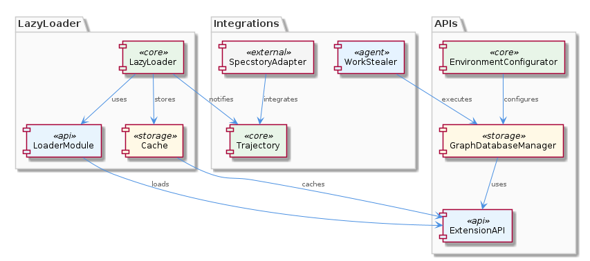
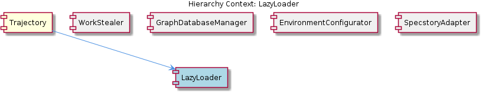

# LazyLoader

**Type:** SubComponent

The LazyLoader provides a callback-based mechanism for notifying the Trajectory component of loaded APIs, enabling efficient and timely integration, as seen in the SpecstoryAdapter's logging functionality.

## What It Is  

LazyLoader is the sub‑component responsible for bringing external extension APIs into the **Trajectory** runtime. All of its concrete loader modules live under the shared **integrations** directory (e.g., `lib/integrations/*‑loader.js`), mirroring the layout used by sibling components such as **GraphDatabaseManager** and **SpecstoryAdapter**. Each API—whether a logging service, a graph store, or an environment‑specific connector—has its own dedicated loader file, giving LazyLoader a clear, file‑system‑driven boundary. The component is invoked by the parent **Trajectory** component whenever an API is first required, and it subsequently hands the loaded module back to Trajectory through a callback mechanism.

---

## Architecture and Design  

LazyLoader follows a **modular loading architecture**. The integrations directory acts as a registry of loader modules, each exposing a **standardized interface** (typically `load()` / `initialize()` signatures). This mirrors the interface contract used by **WorkStealer** for task execution, ensuring that every loader can be treated uniformly by the orchestrating code in Trajectory.  

The loading pipeline is **asynchronous**, allowing multiple APIs to be fetched and instantiated in parallel without blocking the main event loop. This non‑blocking behavior is analogous to the concurrency model observed in **GraphDatabaseManager**, where data stores are brought online concurrently.  

A **caching layer** sits between the loader modules and the consuming components. Once an API has been successfully loaded, its instance is stored in an in‑memory cache whose lifetime and eviction policy are driven by configuration values supplied by **EnvironmentConfigurator**. This reduces repeated initialization costs and aligns with the caching hint found in the configurator’s connectivity setup.  

To close the loop, LazyLoader emits a **callback** once an API is ready. The callback is consumed by the **Trajectory** component, which can then wire the freshly loaded API into its processing pipeline (for example, passing a logging client to **SpecstoryAdapter**). This callback‑based notification pattern enables timely integration while keeping the loader decoupled from its consumers.  

---

## Implementation Details  

1. **Loader Modules** – Each file in `lib/integrations/` (e.g., `specstory-loader.js`, `graphdb-loader.js`) implements a small, self‑contained module that knows how to acquire and initialise its target API. The modules expose a common entry point, often a `load()` function that returns a Promise. By adhering to this contract, the modules can be enumerated and invoked dynamically by LazyLoader.  

2. **Standardised Interface** – The interface mirrors the pattern used by **WorkStealer** (`constructor() → initialize() → execute()`), providing predictability: the loader’s constructor sets up any static configuration, `initialize()` performs any required async handshakes (such as authentication), and the final step returns the ready API object.  

3. **Asynchronous Coordination** – LazyLoader aggregates the promises from the individual `load()` calls, using `Promise.allSettled` (or a similar construct) to allow concurrent loading while still handling failures gracefully. This design enables the system to start up quickly, even when several external services must be contacted.  

4. **Caching Mechanism** – After a loader resolves, the resulting API instance is placed into a cache map keyed by the API name. The cache respects configuration knobs exposed by **EnvironmentConfigurator**—for instance, `CACHE_TTL_MS` or `CACHE_MAX_SIZE`. When a cached entry expires or is invalidated, LazyLoader will re‑invoke the corresponding loader module, ensuring freshness without manual intervention.  

5. **Callback Notification** – LazyLoader accepts a callback function from **Trajectory** (e.g., `onApiLoaded(apiName, apiInstance)`). Once an API is cached (or retrieved from cache), LazyLoader invokes this callback, allowing Trajectory to bind the API to downstream components such as **SpecstoryAdapter**. This decoupled notification avoids tight coupling and keeps the loading logic reusable across different consumers.  

6. **Configurability** – The caching behaviour, the list of enabled loaders, and timeout thresholds are all driven by configuration files managed by **EnvironmentConfigurator**. This makes it straightforward to toggle an API on or off, adjust cache lifetimes, or inject mock implementations for testing.  

---

## Integration Points  

LazyLoader sits at the heart of **Trajectory**, acting as the bridge between the core runtime and any external service. When Trajectory needs a capability (e.g., logging via Specstory or graph persistence), it calls LazyLoader with the desired API identifier. LazyLoader then:

* **Queries the integrations directory** for the matching loader module.  
* **Leverages EnvironmentConfigurator** to read any required connection strings, credentials, or cache settings.  
* **Uses the same async pattern** employed by **GraphDatabaseManager** to load the service without blocking other Trajectory activities.  
* **Caches the result** according to the policies defined in EnvironmentConfigurator, mirroring the caching approach used elsewhere in the system.  
* **Notifies Trajectory** via the supplied callback, after which Trajectory can hand the API to **SpecstoryAdapter** for logging or to other components that need the service.  

Because the loader modules follow the same interface as **WorkStealer** tasks, they can be scheduled on the same work‑stealing thread pool if needed, further unifying the concurrency model across the codebase.  

---

## Usage Guidelines  

1. **Add New APIs via the integrations Directory** – Create a new loader file under `lib/integrations/` that implements the standard `load()` / `initialize()` contract. Keep the module self‑contained; it should only depend on configuration values exposed by **EnvironmentConfigurator**.  

2. **Configure Caching Thoughtfully** – Adjust `CACHE_TTL_MS` and `CACHE_MAX_SIZE` in the environment configuration to balance memory usage against the cost of re‑initialising heavy APIs. Short TTLs give fresher connections but increase load traffic; longer TTLs improve performance but may keep stale connections alive.  

3. **Handle Callback Errors** – The callback supplied by **Trajectory** should be defensive: verify that the `apiInstance` is valid before wiring it into downstream components. Propagate any errors back to Trajectory so that fallback strategies (e.g., using a mock implementation) can be applied.  

4. **Prefer Asynchronous Invocation** – Never call a loader’s `load()` method synchronously; always await the returned Promise or attach `.then()` handlers. This respects the non‑blocking design and prevents the main thread from stalling during network handshakes.  

5. **Leverage the Standard Interface for Testing** – Because each loader conforms to the same shape, test suites can swap a real loader with a stub that returns a pre‑constructed mock API, simplifying unit testing of Trajectory and its dependents.  

---

### Architectural Patterns Identified  

* **Modular Loader Architecture** – Separate loader per API, located in a common directory.  
* **Standardised Interface Pattern** – Uniform `load()/initialize()` contract across loaders.  
* **Asynchronous Concurrency** – Promise‑based parallel loading, similar to GraphDatabaseManager.  
* **Cache‑Aside Pattern** – Lazy loading with configurable caching driven by EnvironmentConfigurator.  
* **Callback Notification** – Decoupled event‑driven hand‑off to the parent component (Trajectory).  

### Design Decisions and Trade‑offs  

* **Modularity vs. Overhead** – Isolating each API in its own file simplifies maintenance but introduces a small runtime cost for module discovery.  
* **Configurable Caching** – Gives flexibility but requires careful tuning to avoid memory bloat or stale connections.  
* **Async Loading** – Improves startup latency but adds complexity in error aggregation and ordering; developers must manage Promise rejections explicitly.  
* **Callback Mechanism** – Keeps LazyLoader loosely coupled to Trajectory but places responsibility on the consumer to handle race conditions and idempotency.  

### System Structure Insights  

LazyLoader is a leaf sub‑component under **Trajectory**, yet it shares architectural DNA with its siblings: **WorkStealer** (standardised task interface), **GraphDatabaseManager** (async modular design), **EnvironmentConfigurator** (centralised configuration), and **SpecstoryAdapter** (integration‑specific modules). This commonality creates a cohesive ecosystem where new integrations can be added with minimal friction.  

### Scalability Considerations  

* **Horizontal Scaling** – Because each loader operates independently and caches are in‑process, scaling the overall service horizontally (multiple Trajectory instances) will duplicate caches. For large‑scale deployments, a shared external cache (e.g., Redis) could be introduced without altering the loader interface.  
* **Concurrent Loading** – The async, Promise‑based approach allows many APIs to be fetched simultaneously, limited only by network I/O and the underlying thread pool used by **WorkStealer**.  

### Maintainability Assessment  

The clear separation of concerns—individual loader modules, a central caching layer, and configuration driven by **EnvironmentConfigurator**—makes the codebase highly maintainable. Adding or removing an API requires only a new file in the integrations directory and optional configuration entries. The standardized interface reduces the learning curve for new contributors, and the callback pattern isolates LazyLoader from downstream logic, limiting the impact of changes. The primary maintenance burden lies in keeping cache configuration in sync with the operational characteristics of each external service.

## Hierarchy Context

### Parent
- [Trajectory](./Trajectory.md) -- [LLM] The Trajectory component utilizes the SpecstoryAdapter class, defined in lib/integrations/specstory-adapter.js, for logging conversations and events via Specstory. This class follows a specific pattern of constructor() + initialize() + logConversation() for its initialization and logging functionality. The logConversation() method employs a work-stealing concurrency pattern via a shared atomic index counter, allowing for efficient and concurrent logging of conversations and events.

### Siblings
- [WorkStealer](./WorkStealer.md) -- WorkStealer uses a shared atomic index counter to enable work-stealing, allowing idle workers to pull tasks immediately, as seen in the WaveController's runWithConcurrency method.
- [GraphDatabaseManager](./GraphDatabaseManager.md) -- GraphDatabaseManager uses a modular approach to data storage and management, with each graph having its own dedicated storage module, as seen in the integrations directory.
- [EnvironmentConfigurator](./EnvironmentConfigurator.md) -- EnvironmentConfigurator uses a modular approach to environment configuration and connectivity, with each environment variable having its own dedicated configuration module, as seen in the integrations directory.
- [SpecstoryAdapter](./SpecstoryAdapter.md) -- SpecstoryAdapter uses a modular approach to logging and tracking conversations and events, with each conversation having its own dedicated logging module, as seen in the integrations directory.

---

*Generated from 7 observations*
