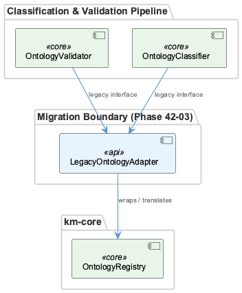
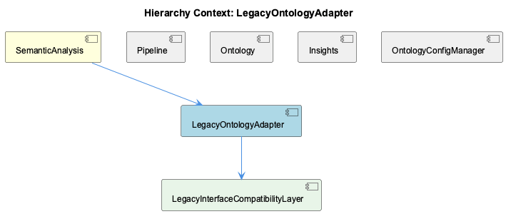

# LegacyOntologyAdapter

**Type:** SubComponent

The adapter's existence is explicitly scoped to the Phase 42-03 migration period, implying it carries a planned deprecation once OntologyValidator and OntologyClassifier are updated to consume OntologyRegistry directly

# LegacyOntologyAdapter — Technical Insight Document

---

## What It Is

`LegacyOntologyAdapter` is a deliberately scoped migration component residing within the `SemanticAnalysis` system (`integrations/mcp-server-semantic-analysis`). It functions as a compatibility shim between the legacy ontology interface consumed by `OntologyValidator` and `OntologyClassifier` and the modern `OntologyRegistry` API exposed by `km-core`. Its existence is formally documented in `docs/RELEASE-2.0.md` as part of the ontology integration system rollout, underscoring that it is a purposeful architectural decision rather than an incidental abstraction that accumulated over time.

The adapter sits inside the `SemanticAnalysis` parent component, which orchestrates a pipeline of specialized agents that extract, classify, validate, and persist structured knowledge from git history and LSL sessions. Within that broader pipeline, `LegacyOntologyAdapter` occupies a narrow but critical position: it guards the boundary between the new `km-core`-backed ontology registry and the downstream classification and validation agents that have not yet been migrated to consume `OntologyRegistry` directly. Its scope is explicitly tied to the Phase 42-03 migration period, after which it carries a planned deprecation.

---

## Architecture and Design

The central architectural pattern is the **Anti-Corruption Layer (ACL)**, a well-established pattern in domain-driven design for protecting a bounded context from the churn of an upstream model. `LegacyOntologyAdapter` absorbs any API surface changes in `km-core`'s `OntologyRegistry`, preventing those changes from cascading into `OntologyValidator` and `OntologyClassifier`. Without this layer, every refactor of `OntologyRegistry` would require simultaneous updates to the classification and validation pipeline — a high-risk coupling inside a live, batch-processing system.

A second key design decision is the **parallel operation model**. By presenting a stable legacy interface, the adapter allows the old and new registry implementations to coexist during the rollout window. This supports an incremental cutover strategy: teams can migrate `OntologyValidator` and `OntologyClassifier` independently, at their own pace, without requiring a hard flag-day replacement. This is particularly important given that `OntologyConfigManager` is implemented as a singleton ensuring all pipeline agents share identical ontology configuration throughout a batch run — any abrupt registry switch would risk mid-run config drift, which the adapter helps avoid.

The adapter is also architecturally honest about its own temporality. Its scope is explicitly bounded to Phase 42-03, and its documentation in `docs/RELEASE-2.0.md` confirms it was introduced as a deliberate seam, not a permanent fixture. This is a meaningful design discipline: acknowledging migration scaffolding as scaffolding, rather than allowing it to silently calcify into permanent infrastructure.

---

## Implementation Details

`LegacyOntologyAdapter` contains one documented child component: `LegacyInterfaceCompatibilityLayer`. This child component carries the translation mechanics — mapping legacy ontology lookup and classification call signatures to the equivalent operations on `km-core`'s `OntologyRegistry` — without touching any downstream consumer code. The separation of concerns here is deliberate: `LegacyOntologyAdapter` owns the boundary identity and lifecycle, while `LegacyInterfaceCompatibilityLayer` owns the low-level call translation.

No source file paths or code symbols were available at analysis time, which means the precise method signatures and internal dispatch logic cannot be confirmed from direct inspection. However, the functional contract is clear from the observations: the adapter must present whichever interface `OntologyValidator` and `OntologyClassifier` expect to call, and internally delegate those calls to `OntologyRegistry` in `km-core`. Any argument shape mismatches, return type differences, or error contract divergences between the two APIs are the responsibility of `LegacyInterfaceCompatibilityLayer` to reconcile.

Given that the `Ontology` sibling component manages a two-level ontology hierarchy (upper/lower) through separate definition files, and that `OntologyConfigManager` controls the paths to those files as a singleton, the adapter must be careful not to introduce a second configuration pathway for ontology lookups. All registry access should remain routed through the configuration surface that `OntologyConfigManager` governs, so that classifier and validator instances remain consistent throughout a batch run.

---

## Integration Points

`LegacyOntologyAdapter` connects two distinct subsystems within `SemanticAnalysis`. On its upstream face, it depends on `km-core`'s `OntologyRegistry` — the authoritative, modern registry that the broader system is migrating toward. On its downstream face, it serves `OntologyValidator` and `OntologyClassifier`, which expect the legacy interface contract. These two consumers are the adapter's only justified clients; any new code introduced to `SemanticAnalysis` after Phase 42-03 should consume `OntologyRegistry` directly rather than routing through this adapter.

The relationship with the `Pipeline` sibling is indirect: the pipeline orchestrates the agents that invoke `OntologyValidator` and `OntologyClassifier`, meaning the adapter is implicitly in the critical path of every batch analysis run. If the adapter introduces latency, errors, or inconsistent ontology resolution, those effects propagate through the entire classification and validation stage. Similarly, the `Insights` sibling, which performs LLM-driven insight generation within token budget constraints configured via `OntologyConfigManager`, depends on correctly classified ontology metadata upstream — making the adapter's correctness a silent prerequisite for insight <USER_ID_REDACTED>.

---

## Usage Guidelines

**Do not extend the adapter's interface.** Any new ontology access patterns introduced during or after Phase 42-03 should be built against `OntologyRegistry` directly. Adding capabilities to `LegacyOntologyAdapter` would widen the migration surface and increase the cost of eventual deprecation.

**Treat deprecation as a first-class deliverable.** The adapter's exit condition is well-defined: once `OntologyValidator` and `OntologyClassifier` are updated to consume `OntologyRegistry` directly, the adapter and its child `LegacyInterfaceCompatibilityLayer` should be removed in the same release cycle. Leaving the adapter in place after Phase 42-03 completes would convert migration scaffolding into permanent technical debt and obscure the true dependency structure of the pipeline.

**Do not use the adapter as a model for new abstractions.** Its design is correct for a time-bounded migration context, but it is not a general pattern for ontology access within `SemanticAnalysis`. Future ontology integration work should reference the `Ontology` sibling and `OntologyConfigManager` as the stable configuration and definition layer, and `OntologyRegistry` as the runtime access layer.

**Monitor for config consistency.** Because `OntologyConfigManager` is a singleton governing all pipeline agents, any logic inside the adapter that independently resolves ontology paths or registry endpoints — outside the configuration surface `OntologyConfigManager` controls — risks introducing subtle inconsistencies between what the classifier and validator resolve at runtime. All registry delegation inside `LegacyInterfaceCompatibilityLayer` should respect the configuration state established by `OntologyConfigManager` at batch-run initialization.

---

### Architectural Patterns Identified
- **Anti-Corruption Layer (ACL):** Core pattern; isolates legacy consumers from upstream API evolution.
- **Adapter Pattern:** Structural translation between two incompatible interfaces with no behavioral addition.
- **Seam-based incremental migration:** Enables parallel operation of old and new implementations without a hard cutover.

### Key Design Trade-offs
| Decision | Benefit | Cost |
|---|---|---|
| Explicit Phase 42-03 scope | Prevents adapter from becoming permanent | Requires disciplined deprecation execution |
| Isolation in a child `LegacyInterfaceCompatibilityLayer` | Keeps translation logic separated from boundary identity | Adds one layer of indirection to trace |
| No modification to `OntologyValidator`/`OntologyClassifier` | Zero risk to live classification pipeline during migration | Delays full modernization of those consumers |

### Maintainability Assessment
The component's maintainability risk is low in the short term and high if neglected past its intended lifespan. Its design is clean, its purpose is singular, and its deprecation path is explicit. The primary maintenance risk is organizational: if Phase 42-03 completion criteria are not enforced, the adapter will persist past its useful life and become an opaque indirection layer that obscures how ontology data actually flows through `SemanticAnalysis`.

## Hierarchy Context

### Parent
- [SemanticAnalysis](./SemanticAnalysis.md) -- The SemanticAnalysis component is a multi-agent MCP server (`integrations/mcp-server-semantic-analysis`) that orchestrates a pipeline of specialized agents to extract, classify, validate, and persist structured knowledge from git history and LSL (Live Session Log) sessions. It combines AST-based code graph construction, LLM-powered semantic insight generation, ontology classification, and content validation into a coordinated batch-analysis workflow. The pipeline produces structured knowledge entities enriched with ontology metadata before persisting them to a graph-based knowledge store.

### Children
- [LegacyInterfaceCompatibilityLayer](./LegacyInterfaceCompatibilityLayer.md) -- Since no source files are available, the component's purpose as described in the parent context implies translation logic that maps legacy ontology lookup and classification calls to km-core OntologyRegistry equivalents without touching downstream consumers.

### Siblings
- [Pipeline](./Pipeline.md) -- Pipeline is hosted within the `integrations/mcp-server-semantic-analysis` directory, establishing it as an MCP server that exposes pipeline control as tool endpoints to orchestrating agents
- [Ontology](./Ontology.md) -- The system maintains a two-level ontology hierarchy (upper/lower) with separate definition files, paths to which are managed by OntologyConfigManager, allowing the classification tier to be reconfigured without code changes
- [Insights](./Insights.md) -- Insight generation is LLM-driven, operating within the LLM budget constraints configured in OntologyConfigManager, meaning insight depth scales with available token budget per batch run
- [OntologyConfigManager](./OntologyConfigManager.md) -- Implemented as a singleton to ensure all pipeline agents share identical ontology configuration throughout a batch run, preventing mid-run config drift between classifier and validator instances

---

*Generated from 5 observations*
