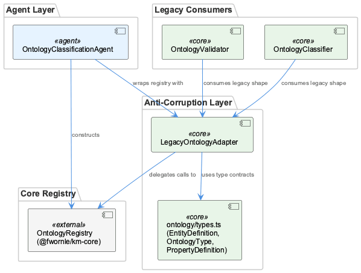
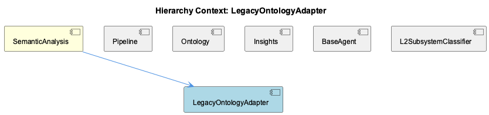

# LegacyOntologyAdapter

**Type:** SubComponent

[LLM] Because OntologyClassificationAgent 'constructs an OntologyRegistry (@fwornle/km-core) directly and wraps it with LegacyOntologyAdapter,' this creates a layered dependency: OntologyClassificationAgent -> LegacyOntologyAdapter -> OntologyRegistry (km-core) -> (consumed indirectly by) OntologyValidator/OntologyClassifier. This is architecturally significant because it means the 'legacy' consumers never talk to km-core's registry directly; they are fully insulated by the adapter's EntityDefinition/OntologyType/PropertyDefinition-shaped interface. Any future change to km-core's OntologyRegistry API should, in principle, only require updating LegacyOntologyAdapter.ts rather than every legacy call site — a clear separation-of-concerns benefit, though it also means the adapter is a single point of failure/staleness risk if km-core's registry evolves faster than the adapter is maintained.

# LegacyOntologyAdapter — Technical Insight Document

## What It Is

`LegacyOntologyAdapter` is implemented in `integrations/semantic-analysis/src/agents/ontology/LegacyOntologyAdapter.ts` as part of the `SemanticAnalysis` pipeline's `Ontology` subsystem. It is a class-level adapter whose sole declared dependency is on type definitions from `ontology/types.ts` — specifically `EntityDefinition`, `OntologyType`, and `PropertyDefinition`. No concrete classes or runtime helper functions are imported alongside these types, which is a strong structural signal: this component is a thin translation layer with no independent business logic of its own. Its purpose is to preserve compatibility for `OntologyValidator` and `OntologyClassifier`, allowing them to continue operating against the pre-existing legacy type contract after the Phase 42-03 refactor introduced a new ontology backend.

## Architecture and Design

The dominant pattern here is the **Adapter pattern**, deployed specifically as an **anti-corruption layer**. Rather than rewriting `OntologyValidator` and `OntologyClassifier` to consume the `OntologyRegistry` API from `@fwornle/km-core` directly, the team inserted `LegacyOntologyAdapter` between the new registry and these legacy consumers. `OntologyClassificationAgent` (in `ontology-classification-agent.ts`) constructs the `OntologyRegistry` directly and wraps it with this adapter, establishing a layered dependency chain: `OntologyClassificationAgent` → `LegacyOntologyAdapter` → `OntologyRegistry` (km-core) → legacy consumers (`OntologyValidator`/`OntologyClassifier`).

This also reflects **composition over inheritance**: the agent composes a registry instance and hands it to the adapter rather than subclassing or reimplementing registry behavior. As a design trade-off, this pattern accepts a small mapping/indirection overhead in exchange for avoiding a much larger, riskier rewrite of all validator/classifier call sites during the refactor — a pragmatic choice consistent with the project's broader phase-marked (Phase 42/57/60), plan-driven development style seen across sibling components like `L2SubsystemClassifier`.

## Implementation Details

Because the adapter's only imports are type-only constructs (`EntityDefinition`, `OntologyType`, `PropertyDefinition`), its internal methods almost certainly accept and return values shaped by these legacy types while delegating underlying operations to the wrapped `OntologyRegistry` instance passed in by `OntologyClassificationAgent`. This is the canonical Adapter structure: the class exposes the legacy-facing interface at its boundary while holding a reference to the adaptee (the km-core registry) internally, translating calls and data shapes at each method invocation. No factory functions or concrete runtime classes from `ontology/types.ts` are imported, reinforcing that `types.ts` serves purely as the source of shape definitions (`integrations/semantic-analysis/src/agents/ontology/types.ts`) rather than providing behavior.

## Integration Points

The adapter's primary integration point is upstream with `OntologyClassificationAgent`, which is responsible for constructing the `OntologyRegistry` and wrapping it before any legacy consumer touches it. Downstream, `OntologyValidator` and `OntologyClassifier` — the legacy consumers referenced throughout the observations — depend on this adapter's stable interface rather than on km-core's registry directly, fully insulating them from the underlying implementation. Within the broader `SemanticAnalysis` pipeline, this sits alongside sibling components `Pipeline`, `Insights`, `BaseAgent`, and `L2SubsystemClassifier`; notably, the L2 refinement logic (`loadL2Classes`, `buildL2RefinementPrompt`, `extractL2FromLLMResponse`) and hierarchy-root guards in `OntologyClassificationAgent` operate independently of this adapter, since they concern classification logic rather than the legacy type-shape translation this component handles.

## Usage Guidelines

Developers should treat `LegacyOntologyAdapter` as transitional scaffolding, not a permanent architectural fixture — its "Legacy" naming is a deliberate maintenance signal tied to the Phase 42-03 refactor. Any future change to km-core's `OntologyRegistry` API should, in principle, only require updating this single file rather than every legacy call site, which is the primary maintainability benefit of the pattern; however, it also makes the adapter a single point of failure or staleness risk if km-core evolves faster than the adapter is maintained. Notably, no dedicated test file for this adapter appears among key entities, in contrast to `OntologyClassificationAgent`'s `ontology-classification-agent.hierarchy-roots.test.ts` — teams extending or modifying this adapter should consider adding colocated tests, and should treat this component as a strong candidate for removal once `OntologyValidator`/`OntologyClassifier` are migrated to consume the native km-core API directly.

## Code Evidence

Key code artifacts grounding this entity's analysis:

**Structural:**
- LegacyOntologyAdapter (class) in LegacyOntologyAdapter.ts

**Relationships:**
- Imports: ontology/types.ts, EntityDefinition, OntologyType, PropertyDefinition
- LegacyOntologyAdapter.ts imports EntityDefinition, OntologyType, and PropertyDefinition from ontology/types.ts, indicating the adapter's primary role is translating between a legacy type system (EntityDefinition/PropertyDefinition shape) and whatever internal representation OntologyClassificationAgent's newly-constructed OntologyRegistry (from @fwornle/km-core) expects. The narrow import surface — only type-level constructs, no runtime helper functions — suggests LegacyOntologyAdapter.ts is structurally a thin translation/mapping layer rather than a component with independent business logic, consistent with the parent observation that it exists specifically 'to keep the pre-existing OntologyValidator/OntologyClassifier working post Phase 42-03 refactor.'

**Other:**
- LegacyOntologyAdapter.ts (module) in LegacyOntologyAdapter.ts

## Hierarchy Context

### Parent
- [SemanticAnalysis](./SemanticAnalysis.md) -- SemanticAnalysis is a multi-agent pipeline (integrations/semantic-analysis/src/agents/) that processes git history and LSL session data to extract, classify, and persist structured knowledge entities into the ontology-backed knowledge graph. It orchestrates specialized agents extending BaseAgent (base-agent.ts) which wrap agent-specific logic in a standardized AgentResponse envelope, computing confidence breakdowns, detecting issues, and generating routing suggestions for retry/escalation between workflow steps.

At its core, OntologyClassificationAgent (ontology-classification-agent.ts) assigns ontology metadata (class, confidence, method) to observations by combining heuristic classifiers, an LLM-backed OntologyClassifier, and hard-coded hierarchy-root guards for closed-set entities (CollectiveKnowledge, Coding, DynArch, Timeline, Normalisa) imported from @fwornle/km-core's HIERARCHY_ROOTS. A newer L2 refinement layer (Phase 57/60) further refines generic L1 classes (Component/SubComponent/Detail) into specific subsystem classes declared in coding.lower.json, using pure, independently-testable helper functions (loadL2Classes, buildL2RefinementPrompt, extractL2FromLLMResponse) alongside a deterministic keyword-based fallback classifier (l2-subsystem-classifier.ts).

The SemanticAnalysisAgent (semantic-analysis-agent.ts) performs the actual code/git/vibe cross-analysis, reading files from git history, computing complexity metrics and architectural pattern detection, and invoking an LLM (via @rapid/llm-proxy's LLMService) to generate deeper semantic insights that are merged with heuristically-detected patterns. The pipeline emphasizes testability (extensive node:test suites with tmpdir-isolated ontology fixtures) and graceful degradation (e.g., absent coding.lower.json yields empty L2 refinement rather than errors), reflecting an incremental, plan-driven development process (Phase 42/57/60 markers throughout the code).

### Siblings
- [Pipeline](./Pipeline.md) -- Pipeline agents extend BaseAgent (base-agent.ts) so each stage wraps its output in a standardized AgentResponse envelope with confidence breakdowns.
- [Ontology](./Ontology.md) -- OntologyClassificationAgent (ontology-classification-agent.ts) combines heuristic classifiers, an LLM-backed OntologyClassifier, and hard-coded hierarchy-root guards.
- [Insights](./Insights.md) -- [CGR] INSIGHTS (class) in kb-ab-sample-tasks.mjs
- [BaseAgent](./BaseAgent.md) -- [LLM] The code files supplied for this analysis (config/agents/copilot.sh, config/agents/opencode.sh, config/agents/pi.sh, config/agents/pi-extensions/no-unbounded-fs-scan.ts, integrations/system-health-dashboard/src/components/agent-badge.tsx) do not correspond to the parent-context description of BaseAgent (integrations/semantic-analysis/src/agents/base-agent.ts) and its execute() -> process() -> calculateConfidence() -> detectIssues() -> generateRouting() -> applyCorrections() -> buildMetadata() pipeline. There is a naming collision between two unrelated 'agent' concepts in this codebase: (1) semantic-analysis's BaseAgent subclasses (OntologyClassificationAgent, SemanticAnalysisAgent) that process observations into knowledge-graph entities, and (2) the top-level 'coding' CLI wrapper's per-tool agent launch configs (copilot/opencode/pi) that configure how a human-facing coding assistant CLI is started, proxied, and instrumented. No code_graph data was provided, so no [LLM+CGR] observations can be made; all statements below are grounded in the literal file contents shown, not in the BaseAgent class itself.
- [L2SubsystemClassifier](./L2SubsystemClassifier.md) -- [LLM] The L2SubsystemClassifier's fallback path is a deterministic keyword-based classifier housed in l2-subsystem-classifier.ts, separate from the LLM-driven refinement in ontology-classification-agent.ts. This separation lets the pipeline degrade gracefully: when the LLM call fails, times out, or coding.lower.json is absent, the workflow can still emit an L2 class (or empty result) without throwing, consistent with the project's stated 'graceful degradation' design goal rather than hard-failing the whole classification step.

---

*Generated from 12 observations*
