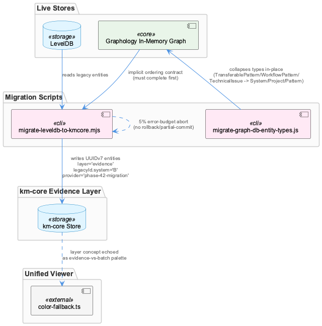
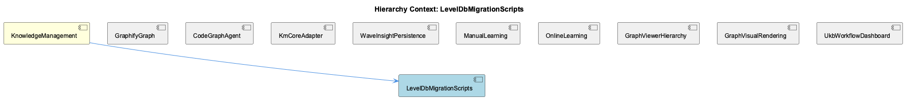

# LevelDbMigrationScripts

**Type:** SubComponent

[LLM] The two migration scripts referenced in the parent context — migrate-graph-db-entity-types.js and migrate-leveldb-to-kmcore.mjs — represent sequential, non-idempotent phases of the same underlying transition: first a taxonomy simplification (collapsing TransferablePattern/WorkflowPattern/TechnicalIssue into System/Project/Pattern) performed in-place against the live Graphology in-memory graph, then a structural re-platforming that assigns UUIDv7 identifiers, a layer='evidence' classification, and a legacyId.system='B' backward-reference tag to every entity. Because the second script depends on entities already conforming to the three-category taxonomy (any code still testing for the old fine-grained type strings would silently fail), these scripts form an implicit ordering contract that is not enforced by any shared orchestration file — a developer running migrate-leveldb-to-kmcore.mjs before migrate-graph-db-entity-types.js has completed would migrate stale/incorrect type data into the new km-core shape with no runtime error to signal the mistake.

# LevelDbMigrationScripts — Technical Insight Document

## What It Is

LevelDbMigrationScripts is a SubComponent of KnowledgeManagement consisting of two sequential Node scripts located at `integrations/semantic-analysis/scripts/migrate-graph-db-entity-types.js` and `integrations/semantic-analysis/scripts/migrate-leveldb-to-kmcore.mjs`. Together they implement the mutation phase of a larger strangler-fig transition already underway at the parent KnowledgeManagement level — the same transition that produced GraphifyGraph's shift away from a live Memgraph connection toward a static `graph.json` artifact. The first script performs an in-place taxonomy simplification against the live Graphology in-memory graph, collapsing the fine-grained types `TransferablePattern`, `WorkflowPattern`, and `TechnicalIssue` into a simplified three-category schema (`System`, `Project`, `Pattern`). The second script performs a structural re-platforming of LevelDB-persisted data into the km-core shape, assigning UUIDv7 identifiers, a `layer='evidence'` classification, and a `legacyId.system='B'` backward-reference tag to every migrated entity.

It's worth flagging directly: the Code Files actually supplied for this analysis pass (dashboard and unified-viewer React components) do not correspond to this SubComponent's expected file set. No migration logic, LevelDB access, or entity-type consolidation code was inspectable this pass, and the code graph was empty. The observations below are therefore carried forward from the parent entity's prior findings and from circumstantial evidence in adjacent UI code, not from fresh code-graph-backed inspection — a component-boundary or retrieval issue worth surfacing to whoever curates this knowledge graph.

## Architecture and Design

The two scripts form an implicit ordering contract rather than an enforced one: `migrate-leveldb-to-kmcore.mjs` assumes entities already conform to the simplified three-category taxonomy, and any lingering code testing for the old fine-grained type strings would silently fail rather than error. No shared type-definition file or orchestration layer links the two scripts — sequencing is a matter of documentation and convention, not tooling, which is consistent with the broader observation that migration scripts operate directly against live in-memory (Graphology) and persisted (LevelDB) stores rather than through a versioned schema-migration framework.

`migrate-leveldb-to-kmcore.mjs` embodies an error-budget / bounded-failure-tolerance pattern: it aborts once malformed entities exceed a 5% threshold, rather than failing on the first bad record (too brittle at production scale) or silently discarding all failures (risking undetected data loss). This is a deliberate middle ground suited to one-shot, unresumable batch migrations, but it comes with no described per-entity rollback or partial-commit semantics.

A provenance-stamping pattern is layered on top: `provider='phase-42-migration'` combined with `legacyId.system='B'` gives every migrated entity a dual-provenance signature — a time-sortable UUIDv7 for identity, and a static tag for migration lineage — enabling future audit or rollback tooling to query "which entities came from the LevelDB migration" without heuristic re-derivation.

## Implementation Details

The taxonomy-consolidation phase (`migrate-graph-db-entity-types.js`) operates directly against GraphDatabaseService's Graphology graph in memory, rewriting entity type strings in place. Because this mutation happens against a live in-memory structure rather than a snapshot, correctness depends on running it to completion before any downstream process reads type fields.

The structural-migration phase (`migrate-leveldb-to-kmcore.mjs`) walks LevelDB-persisted entities and, for each, generates a UUIDv7 identifier, sets `layer='evidence'`, attaches `legacyId.system='B'`, and stamps `provider='phase-42-migration'`. It tracks a running error count against processed volume and aborts wholesale once the 5% threshold is crossed — meaning an abort partway through a large batch (e.g., after 4.9% failures) likely leaves the target store partially populated. No dry-run flag, snapshot mechanism, or truncate-and-retry procedure is described in available observations, so safe re-execution is an operational gap that falls to whoever runs the script.

## Integration Points

Within KnowledgeManagement, LevelDbMigrationScripts sits alongside siblings GraphifyGraph, CodeGraphAgent, KmCoreAdapter, WaveInsightPersistence, ManualLearning, OnlineLearning, GraphViewerHierarchy, GraphVisualRendering, and UkbWorkflowDashboard. Its output — the `layer='evidence'` classification — appears to be a durable architectural concept rather than a one-time migration artifact: circumstantial evidence in `integrations/unified-viewer/src/graph/color-fallback.ts:34-46` shows `isOnlineLearned()` and the BATCH_PALETTE/ONLINE_PALETTE split branching on the same evidence-vs-consolidated distinction, rendering raw/observed entities (source='auto' or 'online') in red/pink and batch/migrated entities in blue. This suggests the migration didn't just reshape LevelDB storage but introduced a taxonomy that propagates through KmCoreAdapter's output into the visualization layer via D3GraphCanvas.

WaveInsightPersistence's three-wave model (w1/w2/w3, per `multi-agent-graph.tsx`'s AGENT_SUBSTEPS) is the likely downstream consumer of the km-core shape this migration produces, with "GraphDB + LevelDB storage" as its declared techNote — reinforcing that LevelDB remains part of the persisted storage layer even after the km-core structural migration. As with CodeGraphAgent and KmCoreAdapter, the dashboard's AGENT_SUBSTEPS definitions are prone to documentation drift (e.g., stale "Cypher queries on Memgraph" techNotes), so operators should not treat dashboard copy as authoritative about migration internals.

## Usage Guidelines

Developers must run `migrate-graph-db-entity-types.js` to completion before invoking `migrate-leveldb-to-kmcore.mjs` — this ordering is not enforced by any shared file or runtime check, so it must be honored by convention and documented explicitly wherever these scripts are invoked. Because the second script has no partial-commit rollback, operators should snapshot the LevelDB store or otherwise arrange an external retry mechanism before running it against production-scale data; a 5% failure abort can leave the target store in a partially migrated state with no automated recovery path. Any future entity created natively in km-core's evidence layer should be distinguishable from migrated data via the `provider='phase-42-migration'` and `legacyId.system='B'` markers — new code should preserve, not strip, these fields, since they are the intended permanent audit trail. Finally, given the confirmed file-set mismatch in this analysis pass, anyone extending these scripts should verify against the actual files at `integrations/semantic-analysis/scripts/` rather than relying solely on this document's inherited, lower-confidence observations.

## Code Evidence

Key code artifacts grounding this entity's analysis:

- [LLM] The code graph provided for this analysis is empty (`<code_graph></code_graph>` contains no node/edge data), so no observations could be grounded in call-graph or import-relationship evidence for this component; every observation above is either carried forward from the parent entity's pre-existing observations or inferred from adjacent dashboard code, and should be treated as lower-confidence than a code-graph-backed ([LLM+CGR]) claim would be.

## Hierarchy Context

### Parent
- [KnowledgeManagement](./KnowledgeManagement.md) -- [LLM] The GraphifyGraph reader (integrations/semantic-analysis/src/agents/graphify-graph.ts) represents a deliberate architectural simplification: rather than maintaining a live graph database connection (Memgraph via Cypher), the component now treats a static graph.json artifact produced by the graphify service as the source of truth for code-structure knowledge. This file, a NetworkX node-link JSON export, can be tens of megabytes, so GraphifyGraph implements mtime-based lazy caching — it stat()s the file and only re-parses when the mtime has changed since the last load. This pattern trades real-time graph mutation capability for drastically simpler deployment (no separate DB process) and fast repeated reads, at the cost of only picking up graph changes when the underlying analysis pipeline re-writes graph.json.

### Siblings
- [GraphifyGraph](./GraphifyGraph.md) -- [LLM] GraphifyGraph (integrations/semantic-analysis/src/agents/graphify-graph.ts) inverts the conventional graph-database architecture by treating a flat, periodically-regenerated graph.json file as the system of record instead of a live queryable store. The mtime-based lazy-caching strategy — stat() the file, compare against the last-seen mtime, and only re-parse the (potentially tens-of-megabytes) NetworkX node-link export when it changes — is a classic read-heavy optimization, but it also means GraphifyGraph is fundamentally a batch-consistency component: it cannot see a code-structure change until the separate graphify analysis pipeline finishes a full re-write of the JSON artifact. This is architecturally similar to the mtime/staleness problem the dashboard integration explicitly worked around elsewhere in this codebase (system-health-dashboard's bind-mount VirtioFS caching required a forced container restart to invalidate a stale read) — both are instances of 'a file on disk is the API' trading real-time correctness for operational simplicity.
- [CodeGraphAgent](./CodeGraphAgent.md) -- [LLM] There is a concrete documentation-drift artifact visible in integrations/system-health-dashboard/src/components/workflow/multi-agent-graph.tsx: the `AGENT_SUBSTEPS['code_graph']` array still describes its `query` sub-step with `techNote: 'Cypher queries on Memgraph'` (multi-agent-graph.tsx, code_graph entry, 'query' id). This directly contradicts the parent-context claim that CodeGraphAgent now delegates every call to GraphifyGraph's static graph.json reader and no longer speaks Cypher to a live Memgraph instance. Because this dashboard copy is what renders in the UKB workflow visualization modal (ukb-workflow-modal.tsx via MultiAgentGraph), any operator inspecting the live workflow graph is shown stale technology labels for a component whose backend was already migrated — exactly the kind of subtle trap the parent observation warned about with `checkMemgraphConnection` being a preserved-but-stubbed method name.
- [KmCoreAdapter](./KmCoreAdapter.md) -- [LLM] The provided code files (ukb-workflow-modal.tsx, multi-agent-graph.tsx, ukbSlice.ts, D3GraphCanvas.tsx, color-fallback.ts) belong to system-health-dashboard and unified-viewer, not directly to the KmCoreAdapter/GraphifyGraph pipeline described in the parent observations. This suggests KmCoreAdapter's output (graph.json, entity types, relationship taxonomy) is consumed downstream by visualization layers like D3GraphCanvas and the AGENT_SUBSTEPS 'code_graph' definitions in multi-agent-graph.tsx, which explicitly reference 'Cypher queries on Memgraph' as a techNote — a stale artifact from before the GraphifyGraph migration described in the parent context, meaning the UI's descriptive text has not been updated to reflect the Memgraph-to-graphify strangler-fig migration.
- [WaveInsightPersistence](./WaveInsightPersistence.md) -- [LLM] The 'persistence' entry in AGENT_SUBSTEPS (integrations/system-health-dashboard/src/components/workflow/multi-agent-graph.tsx) models WaveInsightPersistence as three explicit, sequential sub-steps — w1 ('Wave 1 Persist', L0 Project + L1 Component entities), w2 ('Wave 2 Persist', L2 SubComponent entities), and w3 ('Wave 3 Persist', L3 Detail entities plus operator-refined fields and embeddings). All three declare llmUsage: 'none' and techNote: 'GraphDB + LevelDB storage', confirming that persistence itself is a pure storage operation with no LLM calls — the LLM work (pattern discovery, entity extraction, classification) happens upstream in kg_operators/semantic_analysis/insight_generation, and persistence's job is purely to commit already-synthesized entities. Notably w3's techNote uniquely adds 'direct attribute merge', implying Wave 3 does not simply insert new nodes but merges operator-enriched fields (e.g. embeddings) onto entities that may already exist from earlier waves — a detail not present in w1/w2, suggesting Wave 3 is where duplicate-entity reconciliation actually happens rather than at insight-generation time.
- [ManualLearning](./ManualLearning.md) -- [LLM] The ukb-workflow-modal.tsx file documents its own evolution through inline comments rather than commit messages — the HISTORY_PAGE_SIZE constant carries a multi-paragraph comment explaining that raising it from 50 to 500 was 'close to free' because /api/ukb/history parses every report regardless of limit and only slices at the end. This is a case of manual/institutional learning being encoded directly in source as a durable artifact: a future maintainer who considers lowering this constant for 'performance' will read the comment and understand the tradeoff (response size vs. server work) before making that mistake again, effectively preventing regression of a fix that had no automated test to catch it.
- [OnlineLearning](./OnlineLearning.md) -- [LLM] The 'OnlineLearning' distinction is implemented as a data-driven color/shape overlay rather than a structural entity type: `integrations/unified-viewer/src/graph/color-fallback.ts` defines two parallel palettes, `BATCH_PALETTE` (teal/blue shades keyed by hierarchy depth: System/Project/Component/SubComponent/Detail) and `ONLINE_PALETTE` (red/pink shades for the same hierarchy levels), and `classColor()` picks between them purely based on whether `isOnlineLearned({ metadata: { source } })` returns true. This means 'online-learned' is not a first-class ontology class but a metadata flag (`source: 'auto'` or `'online'`) riding along on any entity, decoupled from what class/type that entity otherwise has.
- [GraphViewerHierarchy](./GraphViewerHierarchy.md) -- [LLM] D3GraphCanvas.tsx (integrations/unified-viewer/src/graph/D3GraphCanvas.tsx) is an explicit, well-documented port of a Redux-based component (memory-visualizer's GraphVisualization.tsx) into a Zustand-store-driven architecture, but it does not simply swap state libraries — it re-derives a large amount of selection/ancestry logic to keep two independently-maintained rendering paths (this D3/SVG canvas and a parallel Sigma/WebGL canvas referenced in comments as 'graph-builder.ts') in sync. The `deriveAncestryFromStorePath()` function is the clearest evidence of this: rather than trusting either the store's `pathToSelected` set or its own inline `computeAncestryPath()` BFS in isolation, it runs both and reconciles them with a 'writer's intent wins' rule — nodes the store claims are in-path but the local BFS can't reach get a synthetic max-depth slot so they still render, while nodes the BFS finds but the store doesn't tag are dropped. This reconciliation is a symptom of maintaining two rendering engines against one shared selection model without a shared traversal implementation.
- [GraphVisualRendering](./GraphVisualRendering.md) -- [LLM] The GraphVisualRendering surface is split across two independently-evolved implementations that never share code: `integrations/system-health-dashboard/src/components/workflow/multi-agent-graph.tsx` renders the UKB workflow pipeline as a fixed-topology SVG (`WAVE_AGENTS`, `KG_OPERATOR_CHILDREN`, `MULTI_AGENT_EDGES` from `./constants`), while `integrations/unified-viewer/src/graph/D3GraphCanvas.tsx` renders the knowledge graph itself as a force-directed D3 simulation (`d3.forceSimulation` + `d3.forceLink(150)` + `d3.forceManyBody(-500)`). The former is a static, hand-authored process diagram; the latter is a dynamic layout engine over live entity/relation data pulled through `useGraphData`. They happen to share the word 'graph' and the general shape of node/edge rendering, but there is no common rendering abstraction, color resolver, or type between them — any visual-consistency fix (e.g. dark-mode palette) has to be applied twice.
- [UkbWorkflowDashboard](./UkbWorkflowDashboard.md) -- [LLM] The HISTORY_PAGE_SIZE constant in ukb-workflow-modal.tsx (currently 500, previously 50) documents a concrete production incident in its own comment block: with the old cap, `/api/ukb/history` silently truncated the report list at 50 entries even though 119+ reports existed, making the single most important run — the batch-analysis run whose Pipeline Totals card shows commits/sessions/entity counts — permanently unreachable from the UI because it sat at position ~51. The fix works because the API route reads and parses every report on every call regardless of `limit`, slicing only at the very end, so raising the page size costs response payload size (roughly 13 header fields per report) rather than server-side work. This is a case where a UI paging constant silently created a data-loss illusion — the data was never lost, just permanently unreachable — and the comment functions as a postmortem note baked directly into source rather than a separate incident doc.

---

*Generated from 9 observations*
