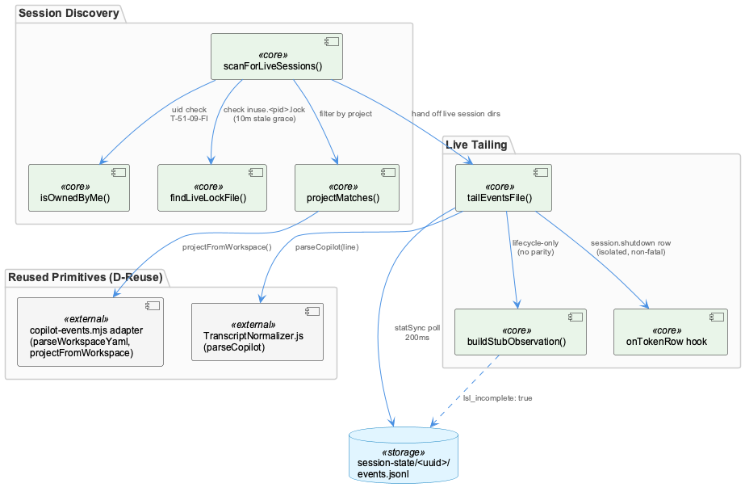
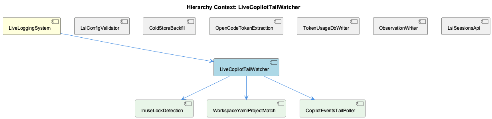

# LiveCopilotTailWatcher

**Type:** SubComponent

## What It Is

LiveCopilotTailWatcher is implemented entirely in `lib/lsl/live/copilot-events-tail.mjs`, described in its own module docblock as the "Copilot Path A live watcher." It is the live-tailing subsystem responsible for discovering active Copilot CLI sub-agent sessions under `~/.copilot/session-state/<uuid>/`, filtering them by ownership and project relevance, and incrementally streaming their `events.jsonl` files into LSL observations. As a child of LiveLoggingSystem, it plays the same continuity role for Copilot sessions that other live watchers play for their respective sources, feeding into the broader session-history mechanism that the `/sl` continuity bootstrap later reads from `.specstory/history/`.

The component is not a separate class hierarchy but a set of cohesive functions in one file; the three "child components" listed (InuseLockDetection, WorkspaceYamlProjectMatch, CopilotEventsTailPoller) are documentation-level decompositions of this single module rather than distinct files — as the CopilotEventsTailPoller observation itself notes, no such class exists; it's an abstraction label over `scanForLiveSessions()`, `tailEventsFile()`, and related functions.

## Architecture and Design

The watcher uses poll-based file tailing (`statSync` + offset tracking) rather than `fs.watch`, consistent with the Plan 51-07 per-file tail precedent, polling every 200ms (`TAIL_POLL_INTERVAL_MS`). Session discovery (`scanForLiveSessions()`) applies a layered filter pipeline before any content is read: an ownership check (`isOwnedByMe`), a liveness check via lock file (`findLiveLockFile`, implemented as InuseLockDetection), and a project-relevance check (`projectMatches`, implemented as WorkspaceYamlProjectMatch). This ordering is deliberate defense-in-depth — the uid check runs even before the lock file is inspected, per the documented threat model entry `T-51-09-FI`.

A key architectural decision (D-Reuse) is composition over duplication: rather than re-deriving session/workspace parsing, the module imports `parseWorkspaceYaml`, `projectFromWorkspace`, and `stripToolCallIdPrefix` from the Plan 51-04 adapter (`../adapters/copilot-events.mjs`) and `parseCopilot` from `TranscriptNormalizer.js`, bypassing the Phase 50 primitives (`lib/lsl/window.mjs`, `lib/lsl/scan-and-convert.mjs`) entirely. This mirrors the reuse posture seen in sibling ColdStoreBackfill and OpenCodeTokenExtraction, each drawing on shared adapters/normalizers rather than reimplementing parsing logic.

Live tailing (this module) and historical sweep/backfill (handled by Plan 51-04 / ColdStoreBackfill) are architecturally separate passes over the same underlying files, distinguished downstream by `metadata.source` (`sub-agent` vs `sub-agent-backfill`) — an important structural insight for anyone reconciling live vs. cold-store Copilot data.

## Implementation Details

`scanForLiveSessions()` walks session-state directories, rejecting non-owned ones via `isOwnedByMe(sessionDir, myUid)` (a POSIX-only uid comparison, skipped gracefully elsewhere) and logging skips as `[live-copilot] skipping non-owned session <id>`. Surviving directories are checked with `findLiveLockFile()`, which matches `/^inuse\.\d+\.lock$/` filenames and enforces a 10-minute `LOCK_STALE_GRACE_MS` grace window — collapsing "no lock" and "expired lock" into the same negative signal, by design.

`tailEventsFile()` implements the actual poll loop: `fs.openSync`/`fs.readSync` reads only newly appended bytes at a stored offset, splitting on newlines while retaining a `residual` buffer for partial trailing lines. Since Copilot's `events.jsonl` contains only lifecycle bookends (`subagent.started/.completed/.failed`) and never real transcript content, `buildStubObservation()` synthesizes a two-message placeholder — `[Copilot sub-agent invocation: <agentName>]` plus a completion-status assistant turn — stamping every such row `lsl_incomplete: true` with the test-asserted constant `COPILOT_LSL_INCOMPLETE_NOTE = 'Copilot CLI emits only lifecycle bookends'`. The module explicitly states there is "no live mitigation possible" for this gap.

A later, structurally isolated addition (Phase 69 Plan 69-06) attaches an `onTokenRow` callback inside the same poll loop, firing on raw-JSON-detected `session.shutdown` lines (since `parseCopilot` returns null for lifecycle events). It reuses the `Promise.resolve(...).catch(...)` isolation pattern from the subagent dispatch path but reports failures via a distinct `[copilot-events-tail] onTokenRow threw (non-fatal): <msg>` stderr line rather than the shared `onError` callback — enforcing design invariant D-08 that token-row emission must never crash or pollute observation ingestion.

## Integration Points

The watcher sits beneath LiveLoggingSystem and depends on the Plan 51-04 adapter (`../adapters/copilot-events.mjs`) and `TranscriptNormalizer.js` for parsing — it deliberately avoids the Phase 50 window/scan-and-convert primitives used elsewhere. Downstream, its `lsl_incomplete` stubs surface as a heartbeat field (`lsl_incomplete_marker_present`) rather than being silently absorbed, giving consumers (and future backfill efforts) visibility into degraded parity.

Its `metadata.source: sub-agent` observations are distinguishable from ColdStoreBackfill's `sub-agent-backfill` rows produced over the same `events.jsonl` files, and any future enrichment of these incomplete stubs should heed the precedent set by Cold-Store Backfill — Artifacts Field Recovery, which deliberately used exact-timestamp matching rather than fuzzy/time-window matching to avoid false-positive reconstruction; the same caution applies to any attempt to backfill Copilot's inherently missing inner reasoning. Separately, the 'Meeting Recording Pipeline' session record notes that Copilot-sourced LSL data can fail upstream of this watcher entirely (proxy misconfiguration preventing capture), a distinct failure mode from the intentional incompleteness this module produces once capture succeeds.

## Usage Guidelines

Developers should treat `lsl_incomplete: true` observations from this watcher as expected, permanent output for Copilot sessions — not a bug to "fix" locally, since the underlying data (real user/assistant turns) simply doesn't exist in `events.jsonl`. Any enrichment attempt belongs downstream (à la ColdStoreBackfill) and must use conservative, exact matching rather than fuzzy heuristics. The module is pure ESM/stdlib-only (fs, path, process), adds zero dependencies, and follows the project's no-console-log convention, writing all operator diagnostics to stderr. When extending the poll loop (as `onTokenRow` did), new hooks should preserve the D-08 invariant of isolated, non-fatal error handling so that side-channel features can never destabilize the primary observation-ingestion path.

## Work Record

What working sessions recorded about this entity — decisions taken, problems hit, and why things are the way they are:

- The work record 'Meeting Recording Pipeline — Session Attribution and Proxy Failure Recovery' (about LiveLoggingSystem) documents that an invoking agent can crash before capture even starts due to a misconfigured Copilot proxy model — a failure mode upstream of and distinct from the degraded-parity gap this watcher accepts, meaning Copilot-sourced LSL data can fail in at least two independent ways: proxy misconfiguration preventing capture entirely, and lifecycle-only events yielding an intentionally incomplete stub once capture does succeed.
- The work record 'Cold-Store Backfill — Artifacts Field Recovery' (about LiveLoggingSystem) establishes that a prior repair used exact-timestamp matching against editing-turn data specifically to avoid false-positive matches when reconstructing missing fields on cold-store rows — a precedent directly relevant to any future attempt to enrich or backfill the `lsl_incomplete` stub observations this watcher produces for Copilot, since a fuzzy/time-window match was implicitly rejected there as too risky for exactly this kind of after-the-fact reconstruction.

## Hierarchy Context

### Parent
- [LiveLoggingSystem](./LiveLoggingSystem.md) -- [SESSION] LSL Session Continuity Bootstrap (/sl command): re-establishes full project context at session start by loading the most recent LSL transcript files under .specstory/history/ and producing a structured continuity summary covering time range, projects touched, branch state, and pending work

### Children
- [InuseLockDetection](./InuseLockDetection.md) -- [LLM] The InuseLockDetection logic lives entirely in `findLiveLockFile(sessionDir)` in lib/lsl/live/copilot-events-tail.mjs: it calls `fs.readdirSync(sessionDir)`, filters names against the regex `/^inuse\.\d+\.lock$/`, and for each match `fs.statSync`s the lock file and compares `now - st.mtimeMs` against the module-level `LOCK_STALE_GRACE_MS` constant (10 minutes, i.e. `10 * 60 * 1000`). It returns the lock's filename on the first match found within the grace window, or `null` if the directory is unreadable, has no matching lock, or every matching lock is stale — there is no distinction in the return value between 'no lock present' and 'lock present but expired', both collapse to the same negative signal.
- [WorkspaceYamlProjectMatch](./WorkspaceYamlProjectMatch.md) -- [LLM] `projectMatches(workspaceYaml, projectRoot)` in `lib/lsl/live/copilot-events-tail.mjs` is the concrete implementation of workspace-to-project matching: it short-circuits to `true` when no `projectRoot` filter is active, otherwise calls the imported `projectFromWorkspace(workspaceYaml)` to derive the session's project name and rejects any session that resolves to the literal string `'unknown'` — the sentinel `projectFromWorkspace` returns when a session directory has no readable `workspace.yaml`. This 'unknown' exclusion is a deliberate resource-conservation decision documented inline: it saves tail-poll cycles on stray Copilot sessions on the same host that don't belong to the project being watched, rather than tailing every live session indiscriminately.
- [CopilotEventsTailPoller](./CopilotEventsTailPoller.md) -- [LLM] No file or function named 'CopilotEventsTailPoller' appears anywhere in the supplied code. The closest implementation is `lib/lsl/live/copilot-events-tail.mjs`, whose exported/internal surface is `scanForLiveSessions()`, `findLiveLockFile()`, `isOwnedByMe()`, `readWorkspace()`, `projectMatches()`, `buildStubObservation()`, and `tailEventsFile()` — none of which is a class or export called `CopilotEventsTailPoller`. The parent-context observations describe this module as 'LiveCopilotTailWatcher', a different name again, suggesting the requested Detail entity is either a rename/alias not reflected in the current source, a documentation label applied at a higher abstraction level, or a component that does not exist as a discrete unit in this codebase.

### Siblings
- [LslConfigValidator](./LslConfigValidator.md) -- [CGR] LSLConfigValidator (class) in validate-lsl-config.js
- [ColdStoreBackfill](./ColdStoreBackfill.md) -- [SESSION] Cold-Store Backfill — Artifacts Field Recovery: reconstructs missing Artifacts fields in cold-storage observation rows by exact-timestamp matching against editing-turn data, explicitly designed to avoid false-positive matches that would corrupt unrelated rows
- [OpenCodeTokenExtraction](./OpenCodeTokenExtraction.md) -- [LLM+CGR] `buildOpencodeTokenRows` in lib/lsl/token/opencode-token-rows.mjs is the core extraction function: it opens `~/.local/share/opencode/opencode.db` read-only via better-sqlite3, scans the most recent `MESSAGE_SCAN_LIMIT` (4000) rows of the `message` table by `rowid DESC`, and for each assistant message whose `providerID`/`provider` field is in `BYPASS_PROVIDERS = Set(['github-copilot'])` emits one `TokenUsageRow`-shaped object via `extractTokens(d)`. Messages from proxy-routed providers (e.g. `anthropic`) are explicitly skipped — this is the D-04 no-double-count invariant stated in the file's header comment: a message already captured as a proxy wire row must never be reconstructed a second time from OpenCode's own store.
- [TokenUsageDbWriter](./TokenUsageDbWriter.md) -- [LLM] The closest match to a 'TokenUsageDbWriter' in the supplied files is lib/lsl/token/token-db.mjs, whose insertTokenRow() function performs the actual database write to token_usage.db. It uses an id-allocation seed (NEXT_ID_SQL) scoped per adapter user_hash and wraps the INSERT in a bounded retry loop (INSERT_ID_RETRY_ATTEMPTS=3) that recomputes MAX(id)+1 on SQLITE_CONSTRAINT collisions, distinguishing genuine duplicate tool_call_id rows (dropped) from lost id races (retried).
- [ObservationWriter](./ObservationWriter.md) -- [SESSION] Attribution Router Module: ObservationWriter now uses deterministic path-based routing (repo-router.mjs) instead of a prior unreliable embedding-similarity voting approach, fixing misattribution of KB observations to owning teams/repos
- [LslSessionsApi](./LslSessionsApi.md) -- [LLM] None of the supplied files define, export, route, or reference an entity named `LslSessionsApi`. The closest thematic neighbor is `lib/lsl/live/copilot-events-tail.mjs`, whose `scanForLiveSessions(sessionStateDir, myUid)` function enumerates session directories under `~/.copilot/session-state/<uuid>/` by checking for a live `inuse.<pid>.lock` file (via `findLiveLockFile`) and uid ownership (via `isOwnedByMe`). This is a filesystem-polling live-session *detector* for one specific agent (Copilot), not a generic sessions API surface — it has no HTTP route, no REST handler, and no shared session-listing contract that other agents (Claude, opencode) go through.

---

*Generated from 10 observations*
