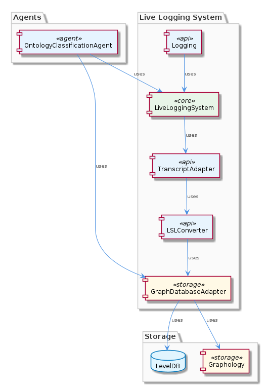
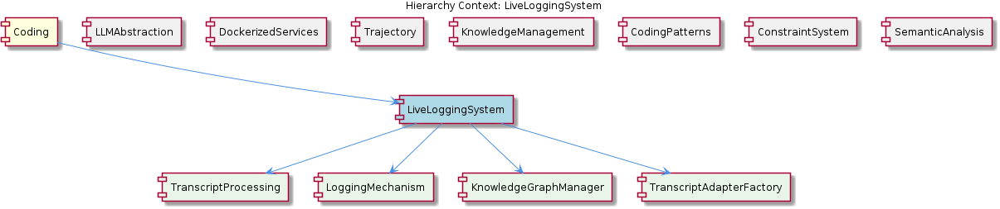

# LiveLoggingSystem

**Type:** Component

[LLM] The LiveLoggingSystem component's graph-based approach to storing and querying knowledge enables efficient and scalable storage and retrieval of large amounts of data. The GraphDatabaseAdapter, which is implemented in storage/graph-database-adapter.ts, utilizes Graphology+LevelDB persistence with automatic JSON export sync, allowing for efficient storage and retrieval of knowledge. The GraphDatabaseAdapter's query function, for example, takes a query object as input and returns a list of matching observations, enabling developers to easily retrieve specific observations or subsets of observations. This graph-based approach also enables the LiveLoggingSystem component to perform complex queries and analytics on the stored knowledge, such as calculating observation frequencies and relationships between observations.

## What It Is  

The **LiveLoggingSystem** component lives primarily under the `lib/agent‑api/` and `storage/` directories. Its core entry points are  

* `lib/agent-api/transcript-api.js` – defines the **TranscriptAdapter** interface and the **TranscriptAdapterFactory** that creates concrete adapters.  
* `lib/agent-api/transcripts/claudia-transcript-adapter.js` – an example concrete adapter (`ClaudeCodeTranscriptAdapter`) that implements the standardized transcript handling contract.  
* `lib/agent-api/transcripts/lsl-converter.js` – the **LSLConverter** that turns LSL session objects into Markdown and JSON‑Lines representations.  
* `storage/graph-database-adapter.ts` – the **GraphDatabaseAdapter** that persists knowledge in a Graphology + LevelDB store and automatically syncs a JSON export.  
* `logging.ts` – a shared, non‑blocking logging utility used throughout the component.  

Together these files give LiveLoggingSystem the ability to ingest heterogeneous agent transcripts, normalise them to the unified **Live‑Logging‑Specification (LSL)** format, convert that format for downstream consumption, and store the resulting knowledge in a graph database that can be queried by other services (e.g., the **OntologyClassificationAgent** in the SemanticAnalysis sibling component).

---

## Architecture and Design  

LiveLoggingSystem follows a **modular, adapter‑based architecture**. The central abstraction is the `TranscriptAdapter` (defined in `lib/agent-api/transcript-api.js`). Each agent‑specific transcript format (Claude Code, Copilot CLI, etc.) is encapsulated in its own subclass (e.g., `ClaudeCodeTranscriptAdapter`), allowing the system to **extend** support for new agents without touching the core processing pipeline. The `TranscriptAdapterFactory` further decouples creation logic from consumers, adhering to the **Factory Method** pattern.

The **knowledge‑graph layer** is built on the `GraphDatabaseAdapter` (`storage/graph-database-adapter.ts`). This adapter hides the details of Graphology and LevelDB, exposing a simple `query` API used by agents such as `OntologyClassificationAgent` (see `integrations/mcp-server-semantic-analysis/src/agents/ontology-classification-agent.ts`). The persistence strategy—Graphology + LevelDB with automatic JSON export sync—provides a **graph‑based storage pattern** that enables complex relationship queries while keeping a lightweight on‑disk representation.

Logging is handled by a **centralised, async‑buffered logger** (`logging.ts`). Functions like `logEvent` and `logError` write to a non‑blocking buffer, preventing event‑loop stalls even under heavy traffic. This design mirrors the **Decorator** pattern for logging (wrapping events with timestamp, severity, etc.) and ensures a consistent observability surface across the component.

All of these pieces sit under the parent **Coding** component, sharing the same GraphDatabaseAdapter implementation that is also used by sibling components such as **KnowledgeManagement**, **CodingPatterns**, and **ConstraintSystem**. This reuse reinforces a **single source of truth** for persistence across the codebase.

---

## Implementation Details  

### Transcript handling  
* **Interface** – `TranscriptAdapter` (in `lib/agent-api/transcript-api.js`) declares methods such as `parse(rawTranscript)` and `toLSL()`.  
* **Concrete adapter** – `ClaudeCodeTranscriptAdapter` (in `lib/agent-api/transcripts/claudia-transcript-adapter.js`) extends the base class and implements the parsing logic specific to Claude Code’s JSON output.  
* **Factory** – `TranscriptAdapterFactory` (same file as the interface) inspects a supplied agent identifier and returns the appropriate subclass, keeping the caller agnostic of the concrete type.

### LSL conversion  
* The `LSLConverter` (`lib/agent-api/transcripts/lsl-converter.js`) offers `convertToMarkdown(lslSession)` and `convertToJsonLines(lslSession)`. The Markdown conversion builds a human‑readable transcript, while the JSON‑Lines format is ideal for streaming ingestion downstream.  

### Graph persistence  
* `GraphDatabaseAdapter` (`storage/graph-database-adapter.ts`) initialises a Graphology graph backed by LevelDB. It registers a change listener that writes the current graph state to a JSON file on each mutation, achieving **automatic JSON export sync**.  
* The `query(queryObj)` method accepts a simple query descriptor (e.g., node type, edge label) and returns matching observations, enabling agents like `OntologyClassificationAgent` to enrich incoming data with semantic metadata.

### Logging  
* `logging.ts` exports `logEvent(event)`, `logError(error)`, and an internal `logBuffer` that batches writes. The buffer is flushed asynchronously, guaranteeing that logging does not block the main event loop. Contextual data (timestamp, severity, stack trace) is automatically attached, giving developers a uniform debugging experience.

### Integration with other components  
* The **OntologyClassificationAgent** (in `integrations/mcp-server-semantic-analysis/src/agents/ontology-classification-agent.ts`) consumes the `GraphDatabaseAdapter` to store classified observations. Its `classifyObservation(observation)` method enriches the raw observation with ontology‑derived types and relationships, then persists the result via the shared graph adapter.  
* Sibling components such as **KnowledgeManagement** and **CodingPatterns** also rely on the same graph adapter, allowing cross‑component queries and analytics without duplication of storage logic.

---

## Integration Points  

LiveLoggingSystem sits at the intersection of **transcript ingestion**, **knowledge conversion**, and **graph persistence**.  

* **Upstream** – Agents (Claude, Copilot CLI, etc.) produce raw transcripts that are fed into the `TranscriptAdapterFactory`. The factory selects the correct adapter, which normalises the data to the LSL schema.  
* **Mid‑stream** – The `LSLConverter` transforms the LSL objects into Markdown or JSON‑Lines, which can be streamed to downstream services (e.g., reporting dashboards or RAG pipelines).  
* **Downstream** – The `GraphDatabaseAdapter` persists the converted knowledge. Other components—most notably the **OntologyClassificationAgent** in the SemanticAnalysis sibling—query this graph to enrich observations or to run analytics such as frequency counts and relationship traversals.  

Because the graph adapter is a shared library (`storage/graph-database-adapter.ts`), any component that needs graph‑based storage can import it, ensuring a **consistent persistence contract** across the entire Coding parent component.

---

## Usage Guidelines  

1. **Add a new agent format** – Implement a subclass of `TranscriptAdapter` in `lib/agent-api/transcripts/` and register it in `TranscriptAdapterFactory`. No changes to the conversion or storage pipelines are required.  
2. **Convert to downstream formats** – Use `LSLConverter.convertToMarkdown(lslSession)` for human‑readable logs or `convertToJsonLines(lslSession)` when feeding a streaming processor. Both functions expect a valid LSL session object produced by an adapter.  
3. **Persist or query knowledge** – Interact with the graph through `GraphDatabaseAdapter`. For writes, call `addNode`, `addEdge`, or higher‑level helper methods supplied by the adapter. For reads, construct a query object and invoke `query`. Remember that the adapter automatically synchronises a JSON export, so manual export steps are unnecessary.  
4. **Log consistently** – Prefer `logEvent` for informational messages and `logError` for exceptions. Do not write directly to `console` or to the file system; the async buffer in `logging.ts` guarantees non‑blocking behaviour and uniform formatting.  
5. **Error handling** – When an adapter throws, catch the exception at the top‑level ingestion point and pass it to `logError`. The logger will include the stack trace and any additional context you provide, aiding rapid debugging.  

---

### Architectural patterns identified  
* **Adapter / Interface pattern** – `TranscriptAdapter` abstracts agent‑specific transcript formats.  
* **Factory Method** – `TranscriptAdapterFactory` creates concrete adapters based on runtime data.  
* **Graph‑based persistence** – `GraphDatabaseAdapter` encapsulates Graphology + LevelDB storage, exposing a query API.  
* **Async Buffer / Decorator for logging** – `logging.ts` decorates events with metadata and buffers writes to avoid blocking.  

### Design decisions and trade‑offs  
* **Modularity vs. runtime overhead** – The adapter layer adds an indirection layer that eases extensibility but introduces a small performance cost for each transcript parse.  
* **Graphology + LevelDB** – Provides rich relationship queries with a lightweight embedded store, but may require careful tuning for very large graphs compared to a dedicated graph database service.  
* **Automatic JSON export** – Guarantees an easy‑to‑share snapshot for external tools, at the expense of occasional I/O spikes during bulk updates.  

### System structure insights  
LiveLoggingSystem is a **child of the Coding parent component** and shares its persistence backbone with siblings such as KnowledgeManagement and ConstraintSystem. Its own children—**TranscriptProcessing**, **LoggingMechanism**, **KnowledgeGraphManager**, and **TranscriptAdapterFactory**—encapsulate distinct responsibilities, reinforcing the **single‑responsibility principle** throughout the hierarchy.  

### Scalability considerations  
* The async log buffer allows the system to sustain high logging volumes without saturating the event loop.  
* Graphology’s LevelDB backend scales well for moderate‑size graphs; for massive datasets, sharding or migration to a dedicated graph store would be a logical evolution.  
* Adding new adapters does not affect existing throughput, as each adapter runs independently and only the factory incurs minimal lookup cost.  

### Maintainability assessment  
* **High** – Clear separation of concerns (adapter, converter, persistence, logging) makes the codebase approachable.  
* **Medium** – The shared `GraphDatabaseAdapter` is a critical piece; changes to its API ripple across many siblings, so versioning and thorough testing are essential.  
* **Low** – The logging module’s buffer logic is simple and well‑documented, reducing risk of deadlocks or memory leaks.  

By adhering to the conventions above, developers can confidently extend LiveLoggingSystem, integrate new agents, and rely on its graph‑based knowledge store for analytics across the broader Coding project.

## Hierarchy Context

### Parent
- [Coding](./Coding.md) -- Root node of the coding project knowledge hierarchy, encompassing all development infrastructure knowledge. The project consists of 8 major components: LiveLoggingSystem: [LLM] The LiveLoggingSystem component's modular architecture allows for easy extension and modification of agent-specific transcript formats. This is ; LLMAbstraction: [LLM] The LLMAbstraction component utilizes the LLMService class (lib/llm/llm-service.ts) as a single entry point for all LLM operations. This class i; DockerizedServices: [LLM] The DockerizedServices component utilizes a microservices architecture, with each sub-component responsible for a specific service or functional; Trajectory: [LLM] The Trajectory component's architecture is characterized by its use of adapters, such as the SpecstoryAdapter, to connect to different extension; KnowledgeManagement: [LLM] The KnowledgeManagement component utilizes the GraphDatabaseAdapter (integrations/mcp-server-semantic-analysis/src/storage/graph-database-adapte; CodingPatterns: [LLM] The CodingPatterns component utilizes the GraphDatabaseAdapter class in storage/graph-database-adapter.ts for persistence, allowing for automati; ConstraintSystem: [LLM] The ConstraintSystem component utilizes the GraphDatabaseAdapter for persistence, which is implemented in the storage/graph-database-adapter.ts ; SemanticAnalysis: [LLM] The SemanticAnalysis component utilizes a multi-agent system architecture, with agents such as OntologyClassificationAgent, SemanticAnalysisAgen.

### Children
- [TranscriptProcessing](./TranscriptProcessing.md) -- TranscriptAdapter in lib/agent-api/transcript-api.js provides a standardized interface for handling different agent formats.
- [LoggingMechanism](./LoggingMechanism.md) -- The LoggingMechanism sub-component may utilize the integrations/copi/USAGE.md and integrations/copi/docs/hooks.md to handle logging for Copilot CLI.
- [KnowledgeGraphManager](./KnowledgeGraphManager.md) -- The KnowledgeGraphManager sub-component may utilize the integrations/code-graph-rag/README.md Graph-Code system for graph-based knowledge storage and querying.
- [TranscriptAdapterFactory](./TranscriptAdapterFactory.md) -- The TranscriptAdapterFactory class may be implemented in the lib/agent-api/transcript-api.js file.

### Siblings
- [LLMAbstraction](./LLMAbstraction.md) -- [LLM] The LLMAbstraction component utilizes the LLMService class (lib/llm/llm-service.ts) as a single entry point for all LLM operations. This class is responsible for managing mode routing, caching, and provider fallback. For instance, the LLMService class includes a method for making LLM requests, which first checks the cache for a valid response before proceeding to make an actual request. This is evident in the use of the cache object within the LLMService class, where it attempts to retrieve a cached response before making a request to the provider. The cache is implemented using a simple in-memory object, where the keys are the request parameters and the values are the corresponding responses.
- [DockerizedServices](./DockerizedServices.md) -- [LLM] The DockerizedServices component utilizes a microservices architecture, with each sub-component responsible for a specific service or functionality. For instance, the LLM Service (lib/llm/llm-service.ts) acts as a high-level facade for all LLM operations, handling mode routing, caching, circuit breaking, and provider fallback. This modular design enables efficient and scalable operation, as well as easier maintenance and updates. The Service Starter (lib/service-starter.js) provides robust service startup with retry, timeout, and graceful degradation, using exponential backoff and health verification. This ensures that services are started reliably and with minimal downtime.
- [Trajectory](./Trajectory.md) -- [LLM] The Trajectory component's architecture is characterized by its use of adapters, such as the SpecstoryAdapter, to connect to different extensions and services. This is evident in the lib/integrations/specstory-adapter.js file, where the SpecstoryAdapter class is defined. The component's behavior is defined by its methods, including logConversation and connectViaHTTP, which enable logging and connection to the Specstory extension. For instance, the logConversation method in SpecstoryAdapter (lib/integrations/specstory-adapter.js:134) implements logging functionality, while the createLogger function from ../logging/Logger.js facilitates modular and flexible logging capabilities.
- [KnowledgeManagement](./KnowledgeManagement.md) -- [LLM] The KnowledgeManagement component utilizes the GraphDatabaseAdapter (integrations/mcp-server-semantic-analysis/src/storage/graph-database-adapter.ts) for persisting data in a graph database with automatic JSON export synchronization. This design decision enables efficient storage and retrieval of knowledge entities and relationships, which is crucial for the system's overall goals of knowledge discovery and insight generation. Furthermore, the use of Graphology+LevelDB persistence ensures a scalable and performant solution for managing the knowledge graph.
- [CodingPatterns](./CodingPatterns.md) -- [LLM] The CodingPatterns component utilizes the GraphDatabaseAdapter class in storage/graph-database-adapter.ts for persistence, allowing for automatic JSON export sync. This design decision enables seamless data synchronization and provides a robust foundation for the project's data management. The GraphDatabaseAdapter class is responsible for handling graph data storage and retrieval, making it a critical component of the project's architecture. By using this adapter, the CodingPatterns component can focus on its primary functionality, leaving data management to the GraphDatabaseAdapter.
- [ConstraintSystem](./ConstraintSystem.md) -- [LLM] The ConstraintSystem component utilizes the GraphDatabaseAdapter for persistence, which is implemented in the storage/graph-database-adapter.ts file. This adapter enables the system to store and manage constraints in a graph database, utilizing Graphology and LevelDB for efficient data storage and retrieval. The adapter also features automatic JSON export sync, allowing for seamless data exchange between the graph database and other components. For example, the ContentValidationAgent, located in integrations/mcp-server-semantic-analysis/src/agents/content-validation-agent.ts, relies on the GraphDatabaseAdapter to retrieve and validate entity content against configured rules.
- [SemanticAnalysis](./SemanticAnalysis.md) -- [LLM] The SemanticAnalysis component utilizes a multi-agent system architecture, with agents such as OntologyClassificationAgent, SemanticAnalysisAgent, and CodeGraphAgent, to process git history and LSL sessions. This is evident in the code files, such as integrations/mcp-server-semantic-analysis/src/agents/ontology-classification-agent.ts, integrations/mcp-server-semantic-analysis/src/agents/semantic-analysis-agent.ts, and integrations/mcp-server-semantic-analysis/src/agents/code-graph-agent.ts, which define the respective agents and their responsibilities. The use of multiple agents allows for a modular and scalable design, enabling the processing of large amounts of data and the integration of new agents as needed.

---

*Generated from 6 observations*
