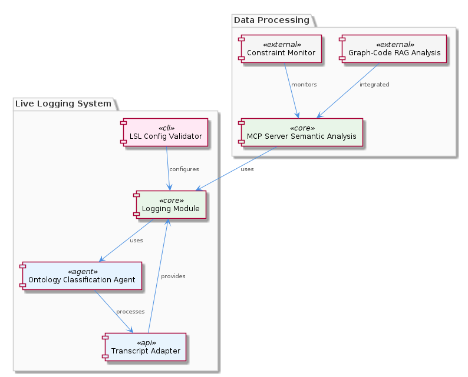
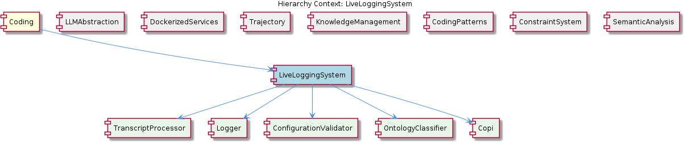

# LiveLoggingSystem

**Type:** Component

[LLM] The LiveLoggingSystem component utilizes a modular architecture, with separate components for logging, transcript processing, and configuration validation. This is evident in the directory structure, where the 'integrations' folder contains subfolders for 'browser-access', 'code-graph-rag', and 'copi', each representing a distinct aspect of the system. For instance, the 'copi' subfolder contains files such as 'INSTALL.md' and 'USAGE.md', which provide installation and usage guidelines for the Copi component. The 'lib/agent-api' folder contains the TranscriptAdapter abstract base class, which is responsible for reading and converting transcripts from different agent formats. The 'scripts' folder contains the LSLConfigValidator, which is used for validating and optimizing LSL configuration. The logging module, located in 'integrations/mcp-server-semantic-analysis/src/logging.ts', provides a unified logging interface and is used throughout the system.

## What It Is  

The **LiveLoggingSystem** is the central component that stitches together logging, transcript handling, configuration validation, and ontology‑based classification for the broader *Coding* knowledge‑graph. Its implementation lives across several clearly demarcated folders:

* **Logging** – `integrations/mcp-server-semantic-analysis/src/logging.ts` supplies a unified logger that every module imports.  
* **Transcript processing** – the abstract base class `lib/agent-api/transcript-api.js` (named **TranscriptAdapter**) defines the contract for reading and converting agent transcripts; a concrete implementation, `lib/agent-api/transcripts/lsl-converter.js`, performs the actual LSL format conversion.  
* **Configuration validation** – the script `scripts/validate-lsl-config.js` (the **LSLConfigValidator**) parses the Live‑Logging‑System (LSL) configuration file and reports inconsistencies.  
* **Ontology classification** – `integrations/mcp-server-semantic-analysis/src/agents/ontology-classification-agent.ts` houses the **OntologyClassificationAgent**, which tags observations against the Claude Code Hook ontology.  
* **Copi integration** – the folder `integrations/copi` (with `INSTALL.md`, `USAGE.md`, and hook documentation) wraps the GitHub Copilot CLI, exposing a tmux status‑line integration and tying its output back into the logging pipeline.

Together these pieces deliver a modular, extensible system that can ingest raw agent output, validate its configuration, classify observations, and surface them through a consistent logging API.

---

## Architecture and Design  

The observations reveal a **modular architecture** built around clear separation of concerns. Each functional domain resides in its own directory, allowing teams to evolve them independently:

1. **Unified logging** – `logging.ts` provides a single façade for all log emission. By centralising log formatting, severity handling, and output routing, the system avoids duplicated log logic across agents and adapters.  
2. **Adapter abstraction** – the **TranscriptAdapter** abstract class (`lib/agent-api/transcript-api.js`) embodies the *Adapter* pattern. Concrete adapters such as `lsl-converter.js` inherit the contract, guaranteeing that any new transcript format can be plugged in without touching downstream consumers.  
3. **Configuration validation script** – the **LSLConfigValidator** (`scripts/validate-lsl-config.js`) follows a *script‑oriented* pattern: it is invoked as a stand‑alone utility during CI or local setup to ensure the LSL configuration file is well‑formed and optimal.  
4. **Ontology classification agent** – `ontology-classification-agent.ts` acts as a thin wrapper around the Claude Code Hook data format (documented in `integrations/mcp-constraint-monitor/docs/CLAUDE-CODE-HOOK-FORMAT.md`). It classifies observations into predefined categories, enabling downstream analytics to work on a normalized taxonomy.  
5. **Copi integration** – the `integrations/copi` subtree supplies a **wrapper** around the Copilot CLI, exposing hooks (`integrations/copi/docs/hooks.md`) and tmux status‑line scripts (`integrations/copi/scripts/README.md`). This component demonstrates *composition*: it re‑uses the unified logger and the transcript adapter to feed Copi‑generated events back into the LiveLoggingSystem.

The architecture aligns with the parent **Coding** component’s emphasis on modularity (see sibling components such as **SemanticAnalysis** and **ConstraintSystem**, which also rely on shared adapters and logging). No monolithic service is evident; instead, each folder can be built, tested, and deployed independently, supporting a clean dependency graph.

---

## Implementation Details  

### Logging (`integrations/mcp-server-semantic-analysis/src/logging.ts`)  
The logger exports functions such as `logInfo`, `logWarn`, and `logError`. Internally it formats messages with timestamps, severity tags, and optional context objects. Because every module imports this file, log output is consistent across the entire LiveLoggingSystem, simplifying downstream aggregation and analysis.

### TranscriptAdapter (`lib/agent-api/transcript-api.js`)  
This abstract class defines methods like `readTranscript(source)` and `convertToLSL(raw)`. Implementers must return a normalized LSL object, which downstream agents (e.g., the OntologyClassificationAgent) consume. The concrete **LSLConverter** (`lib/agent-api/transcripts/lsl-converter.js`) reads agent‑specific JSON payloads, extracts conversation turns, and builds the LSL structure required by the rest of the system.

### OntologyClassificationAgent (`integrations/mcp-server-semantic-analysis/src/agents/ontology-classification-agent.ts`)  
The agent receives an LSL transcript, extracts observation snippets, and maps them to ontology nodes using the Claude Code Hook format. It logs each classification via the unified logger, enabling traceability. The agent’s design isolates the classification logic from the logging mechanism, allowing future replacement of the ontology source without touching the logger.

### Configuration Validation (`scripts/validate-lsl-config.js`)  
Executed as a Node script, the validator parses the LSL configuration YAML/JSON, checks required fields, validates environment‑variable references (e.g., `BROWSER_ACCESS_PORT`, `BROWSER_ACCESS_SSE_URL`), and reports any mismatches. The script is referenced in the Copi installation guide (`integrations/copi/INSTALL.md`), ensuring developers run it before deploying Copi‑related hooks.

### Copi Integration (`integrations/copi/*`)  
The Copi component provides a GitHub Copilot CLI wrapper. Installation steps (`INSTALL.md`) instruct users to set environment variables, run the LSL validator, and then start the Copi tmux status‑line script (`integrations/copi/scripts/README.md`). Hook documentation (`hooks.md`) describes how Copi emits events that are captured by the **TranscriptAdapter** and subsequently logged.

All these pieces interlock through well‑defined TypeScript/JavaScript modules, avoiding circular dependencies and preserving a clear import hierarchy.

---

## Integration Points  

LiveLoggingSystem sits at the nexus of several sibling components:

* **SemanticAnalysis** – shares the same logging façade and may consume classifications from the OntologyClassificationAgent for deeper semantic processing.  
* **ConstraintSystem** – references the same constraint‑configuration documentation (`integrations/mcp-constraint-monitor/docs/constraint-configuration.md`) that the logger uses to enrich log entries with constraint context.  
* **DockerizedServices** – while not directly imported, the DockerizedServices component’s dependency‑injection pattern influences how the LiveLoggingSystem’s scripts (e.g., the LSLConfigValidator) can be containerised and started with graceful retries.

External integrations include:

* **Copi** – relies on environment variables (`BROWSER_ACCESS_PORT`, `BROWSER_ACCESS_SSE_URL`) defined in the Copi installation guide and validated by the LSLConfigValidator.  
* **Code‑Graph‑RAG** – the README (`integrations/code-graph-rag/README.md`) mentions a graph‑based retrieval‑augmented generation pipeline that consumes logs produced by LiveLoggingSystem, illustrating a downstream data‑flow relationship.

These connections are visualised in the relationship diagram below.

---

## Usage Guidelines  

1. **Always import the unified logger** from `integrations/mcp-server-semantic-analysis/src/logging.ts`. Do not create ad‑hoc console statements; the logger adds timestamps, severity, and optional context that downstream analytics expect.  
2. **Extend the TranscriptAdapter** when introducing a new agent format. Implement `readTranscript` and `convertToLSL` so that the rest of the pipeline (classification, logging, Copi hooks) can operate on a consistent LSL object.  
3. **Run the LSLConfigValidator** (`scripts/validate-lsl-config.js`) as part of any CI pipeline or local setup. The validator will surface missing environment variables and mis‑typed fields before the system starts.  
4. **Follow Copi’s installation and usage docs** (`integrations/copi/INSTALL.md` and `USAGE.md`). Set the required environment variables, verify the configuration with the validator, and launch the tmux status‑line script as described.  
5. **When using the OntologyClassificationAgent**, ensure that observation payloads conform to the Claude Code Hook format (see `integrations/mcp-constraint-monitor/docs/CLAUDE-CODE-HOOK-FORMAT.md`). Mis‑formatted observations will be logged as errors and will not be classified.  
6. **Keep documentation in sync**. Any change to environment variables, configuration schema, or hook signatures must be reflected in the corresponding markdown files to avoid drift between code and docs.

---

### Architectural patterns identified  

* **Modular decomposition** – distinct folders for logging, transcript adapters, validation, classification, and external integrations.  
* **Adapter pattern** – `TranscriptAdapter` abstracts over heterogeneous transcript sources.  
* **Facade pattern** – the `logging.ts` module acts as a façade for all logging concerns.  
* **Script‑oriented validation** – the LSLConfigValidator script enforces configuration correctness as a first‑class operation.  

### Design decisions and trade‑offs  

* **Centralised logging vs. distributed loggers** – a single logger simplifies correlation but creates a single point of change; however, the module’s small size mitigates performance concerns.  
* **Abstract adapter vs. concrete parsers** – the abstract base class enforces a contract, making it easy to add new formats, but it introduces an extra inheritance layer that developers must understand.  
* **Configuration validation as a separate script** – isolates validation logic, enabling it to run in CI without loading the full application, at the cost of an additional maintenance artifact.  

### System structure insights  

The hierarchy mirrors the parent **Coding** component: LiveLoggingSystem is a child of the root, exposing its own children (TranscriptProcessor, Logger, ConfigurationValidator, OntologyClassifier, Copi). Each child maps to a concrete implementation file, reinforcing a clean one‑to‑one relationship between conceptual responsibilities and code artifacts.

### Scalability considerations  

* **Log volume** – because all modules funnel through a single logger, scaling to high‑throughput scenarios may require extending `logging.ts` with asynchronous buffering or external log sinks (e.g., Loki, Elastic).  
* **Transcript conversion** – the adapter design permits parallel conversion of multiple transcripts; however, the current LSLConverter is single‑threaded, so a future improvement could introduce worker‑pool processing for bulk ingest.  
* **Ontology classification** – the OntologyClassificationAgent currently processes observations synchronously; decoupling it via a message queue would allow horizontal scaling as the number of observations grows.  

### Maintainability assessment  

The strong modular boundaries, explicit abstract contracts, and comprehensive markdown documentation (INSTALL, USAGE, hooks) make the LiveLoggingSystem **highly maintainable**. New features can be added by extending existing adapters or agents without touching unrelated code. The only maintenance pressure lies in keeping the configuration validator and documentation aligned with any schema changes, a task mitigated by the script‑first approach and the clear location of all relevant markdown files.

## Hierarchy Context

### Parent
- [Coding](./Coding.md) -- Root node of the coding project knowledge hierarchy, encompassing all development infrastructure knowledge. The project consists of 8 major components: LiveLoggingSystem: [LLM] The LiveLoggingSystem component utilizes a modular architecture, with separate components for logging, transcript processing, and configuration ; LLMAbstraction: [LLM] The LLMAbstraction component uses a provider-agnostic approach, allowing for easy switching between different LLM providers. This is achieved th; DockerizedServices: [LLM] The DockerizedServices component utilizes dependency injection to manage complex workflows and handle multiple requests efficiently. This is evi; Trajectory: [LLM] The Trajectory component utilizes the SpecstoryAdapter class, defined in lib/integrations/specstory-adapter.js, for logging conversations and ev; KnowledgeManagement: [LLM] The KnowledgeManagement component utilizes a GraphDatabaseAdapter for persistence, which is implemented in the file integrations/mcp-server-sema; CodingPatterns: [LLM] The CodingPatterns component utilizes a graph-based approach for code analysis, as seen in the integrations/code-graph-rag/README.md file, which; ConstraintSystem: [LLM] The ConstraintSystem component utilizes a GraphDatabaseAdapter for persistence, which is implemented in the storage/graph-database-adapter.ts fi; SemanticAnalysis: [LLM] The SemanticAnalysis component employs a multi-agent architecture, utilizing agents such as the OntologyClassificationAgent, SemanticAnalysisAge.

### Children
- [TranscriptProcessor](./TranscriptProcessor.md) -- The TranscriptProcessor uses the TranscriptAdapter abstract base class in 'lib/agent-api' to read and convert transcripts from various agent formats.
- [Logger](./Logger.md) -- The Logger component is implemented in 'integrations/mcp-server-semantic-analysis/src/logging.ts', providing a unified logging interface.
- [ConfigurationValidator](./ConfigurationValidator.md) -- The ConfigurationValidator is implemented in the 'scripts' folder, using the LSLConfigValidator script to validate and optimize configuration.
- [OntologyClassifier](./OntologyClassifier.md) -- The OntologyClassifier uses a modular design, allowing for easy integration of new ontology systems and classification mechanisms.
- [Copi](./Copi.md) -- The Copi component is implemented in the 'integrations/copi' folder, providing a GitHub Copilot CLI wrapper with logging and Tmux integration.

### Siblings
- [LLMAbstraction](./LLMAbstraction.md) -- [LLM] The LLMAbstraction component uses a provider-agnostic approach, allowing for easy switching between different LLM providers. This is achieved through the ProviderRegistry class (lib/llm/provider-registry.js), which manages the different LLM providers and their configurations. For instance, the AnthropicProvider class (lib/llm/providers/anthropic-provider.ts) is used to interact with the Anthropic API, while the DMRProvider class (lib/llm/providers/dmr-provider.ts) is used for local LLM inference. The use of a provider registry enables the component to be highly flexible and scalable, as new providers can be easily added or removed without affecting the overall architecture.
- [DockerizedServices](./DockerizedServices.md) -- [LLM] The DockerizedServices component utilizes dependency injection to manage complex workflows and handle multiple requests efficiently. This is evident in the lib/llm/llm-service.ts file, where the LLMService class is used for high-level LLM operations, including mode routing, caching, and provider fallback. The use of dependency injection allows for loose coupling between components, making it easier to test and maintain the codebase. Furthermore, the ServiceStarter class in lib/service-starter.js provides robust service startup with retry, timeout, and graceful degradation, ensuring that the component can recover from failures and provide a responsive user experience.
- [Trajectory](./Trajectory.md) -- [LLM] The Trajectory component utilizes the SpecstoryAdapter class, defined in lib/integrations/specstory-adapter.js, for logging conversations and events via Specstory. This class follows a specific pattern of constructor() + initialize() + logConversation() for its initialization and logging functionality. The logConversation() method employs a work-stealing concurrency pattern via a shared atomic index counter, allowing for efficient and concurrent logging of conversations and events.
- [KnowledgeManagement](./KnowledgeManagement.md) -- [LLM] The KnowledgeManagement component utilizes a GraphDatabaseAdapter for persistence, which is implemented in the file integrations/mcp-server-semantic-analysis/src/storage/graph-database-adapter.ts. This adapter provides an interface for agents to interact with the central Graphology + LevelDB knowledge graph. The adapter also includes automatic JSON export sync, ensuring that the knowledge graph remains up-to-date. Furthermore, the migrateGraphDatabase script, located in scripts/migrate-graph-db-entity-types.js, is used to update entity types in the live LevelDB/Graphology database, demonstrating a clear focus on data consistency and integrity.
- [CodingPatterns](./CodingPatterns.md) -- [LLM] The CodingPatterns component utilizes a graph-based approach for code analysis, as seen in the integrations/code-graph-rag/README.md file, which describes the Graph-Code RAG system. This system is used for graph-based code analysis and implies the use of graph structures and algorithms within the CodingPatterns component. The entity validation is performed by the EntityValidator class in integrations/mcp-server-semantic-analysis/src/agents/ontology-classification-agent.ts, suggesting a structured approach to validating entities within the coding patterns. Furthermore, the batch processing pipeline is defined in integrations/mcp-server-semantic-analysis/src/agents/ontology-classification-agent.ts, indicating that the CodingPatterns component may leverage batch processing for efficient handling of coding pattern analysis.
- [ConstraintSystem](./ConstraintSystem.md) -- [LLM] The ConstraintSystem component utilizes a GraphDatabaseAdapter for persistence, which is implemented in the storage/graph-database-adapter.ts file. This adapter enables the system to store and retrieve graph structures using Graphology and LevelDB, with automatic JSON export sync. The use of Graphology allows for efficient graph operations, while LevelDB provides a robust and scalable storage solution. The GraphDatabaseAdapter class in storage/graph-database-adapter.ts is responsible for managing the graph database, including creating and deleting graphs, as well as handling graph queries. The automatic JSON export sync feature ensures that the graph data is consistently updated and available for other components to access.
- [SemanticAnalysis](./SemanticAnalysis.md) -- [LLM] The SemanticAnalysis component employs a multi-agent architecture, utilizing agents such as the OntologyClassificationAgent, SemanticAnalysisAgent, and CodeGraphAgent, to perform tasks such as code analysis, ontology classification, and insight generation. The OntologyClassificationAgent, for instance, is implemented in the file integrations/mcp-server-semantic-analysis/src/agents/ontology-classification-agent.ts and is responsible for classifying observations against the ontology system. This agent-based approach allows for a modular and scalable design, enabling the component to handle large-scale codebases and provide meaningful insights.

---

*Generated from 6 observations*
