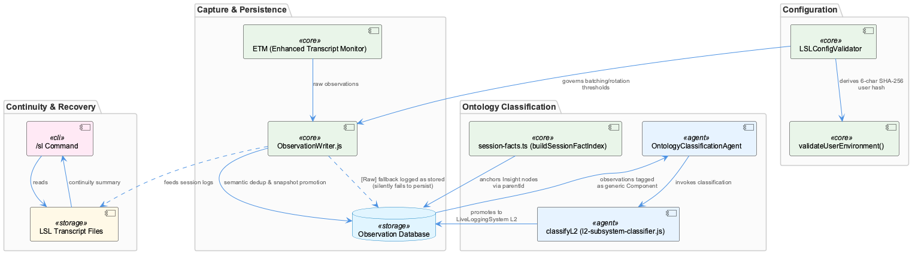
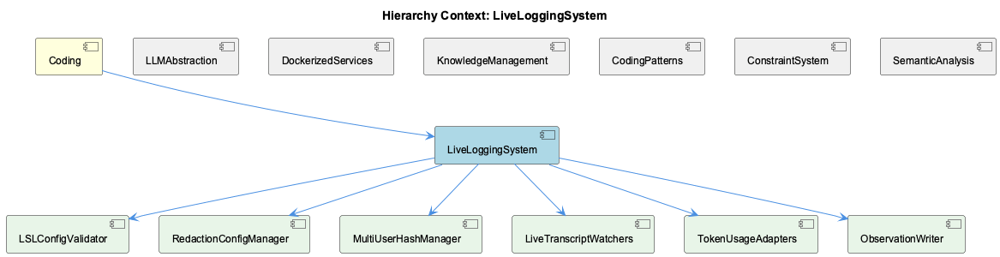

# LiveLoggingSystem

**Type:** Component

[LLM] LiveLoggingSystem occupies a formal position in the project's ontology system as an L2 class extending the L1 'Component' carrier, defined in .data/ontologies/coding.lower.json and verified by an explicit assertion in ontology-classification-agent.test.ts (Test 1, which checks for exactly 10 expected L2 class names including LiveLoggingSystem). This means observations about the codebase that are initially classified at the generic 'Component' level can later be refined into the more specific 'LiveLoggingSystem' class through the OntologyClassificationAgent's L2 refinement pipeline, implemented via buildL2RefinementPrompt() in ontology-classification-agent.ts. Notably, this refinement prompt's description of LiveLoggingSystem references 'ETM', creating a documented conceptual linkage between LSL's session/heartbeat handling and EtmDaemon-related processing—an important cross-component relationship for anyone tracing how session lifecycle events propagate between logging and daemon-management subsystems.

# LiveLoggingSystem — Technical Insight Document

## What It Is

LiveLoggingSystem (LSL) is the Coding project's infrastructure for capturing, validating, and privacy-guarding session transcripts, centered on `scripts/validate-lsl-config.js` and its `LSLConfigValidator` class. It governs two distinct configuration artifacts — `.specstory/config/lsl-config.json` for structural/behavioral settings and `.specstory/config/redaction-config.yaml` for privacy/classification rules — and enforces their correctness before the system is allowed to record anything. Within the project's ontology (`.data/ontologies/coding.lower.json`), LiveLoggingSystem is formally registered as one of exactly ten L2 classes extending the L1 'Component' carrier, a fact asserted directly in `ontology-classification-agent.test.ts` (Test 1). As a child of the root **Coding** hierarchy, it sits alongside sibling components like **LLMAbstraction**, **DockerizedServices**, **KnowledgeManagement**, **ConstraintSystem**, **SemanticAnalysis**, and **CodingPatterns**, but occupies a distinct niche: durable, privacy-aware logging of live agent/user sessions.

## Architecture and Design

The defining architectural decision in LSL is the separation of "how the logger behaves" from "what the logger is allowed to record." Behavioral concerns (multi-user session windowing, file rotation, batching) live in `lsl-config.json`, while privacy/classification concerns live in `redaction-config.yaml`. This decoupling allows redaction policy to evolve independently of file-management logic, a design mirrored in the child components: **RedactionConfigManager** owns privacy enforcement, **MultiUserSessionRouter** owns per-user routing, **OperationalLogger** owns batched write mechanics, and **TranscriptAdapterFramework** (with its concrete **SpecstoryAdapter** implementation) owns ingestion of external transcript formats.

Validation itself follows a strict fail-closed model: `initializeSchemas()` in `LSLConfigValidator` requires five top-level sections — `version`, `multiUser`, `fileManager`, `operationalLogger`, and `classification` — and rejects configs missing any one of them outright. Critically, `classification` is treated as a mandatory, first-class schema section rather than an optional add-on, placing redaction on equal architectural footing with file-rotation and session-windowing settings. This signals that privacy protections were designed into LSL from inception rather than bolted on, a constraint that any new adapter (such as **SpecstoryAdapter** or future transcript formats built on **TranscriptAdapterFramework**) must respect by flowing through classification validation rather than bypassing it during development.

## Implementation Details

`LSLConfigValidator` enforces specific numeric invariants that encode operational experience rather than arbitrary defaults: `multiUser.userHashLength` must be 6–12 characters (balancing collision resistance against filesystem path practicality), `fileManager.maxFileSize` must be 1MB–100MB, and `operationalLogger.batchSize` must be 10–1000 (balancing write amplification against memory-buffering risk and durability delay). Developers extending file-rotation or multi-user routing logic — likely touching **OperationalLogger** (`OperationalLogger.js`) or **MultiUserSessionRouter** — should treat these bounds as documented invariants, not casual defaults.

User isolation is implemented via SHA-256 hashing rather than raw usernames: `validateUserEnvironment()` in `validate-lsl-config.js` hashes `process.env.USER` and truncates it to 6 characters for deterministic, pseudonymized file routing, tying into the project-wide `FOREGROUND_USER_HASHES` convention used elsewhere in Coding infrastructure. Notably, this invariant is *not* uniformly honored downstream: **RedactionConfigManager**'s associated observation flags that `lib/agent-api/transcripts/claude-parser.js:parseFile()` sets `userHash: process.env.USER || 'unknown'` — the raw, unhashed OS username — directly contradicting LSL's pseudonymization pattern. This is a concrete plaintext-username leak risk in exactly the transcript metadata the classification schema is meant to guard, and should be reconciled against whatever rules **RedactionConfigManager** applies downstream of the Claude adapter.

At the ontology-tooling layer, `buildL2RefinementPrompt()` and `extractL2FromLLMResponse()` in `ontology-classification-agent.ts` use token-boundary regex matching (not substring search) to avoid misclassifying names like a hypothetical "SuperLiveLoggingSystemX" as LiveLoggingSystem — a defensive parsing pattern worth replicating in any future L2 extraction logic.

## Integration Points

LSL's refinement prompt in the ontology classification pipeline explicitly references 'ETM', creating a documented conceptual link between LSL's session/heartbeat handling and EtmDaemon-related processing — an important cross-subsystem relationship for tracing how session lifecycle events propagate between logging and daemon management. Internally, LSL's seven children — **LSLConfigValidator**, **RedactionConfigManager**, **MultiUserSessionRouter**, **OperationalLogger**, **TranscriptAdapterFramework**, **SessionDashboardViewer**, and **SpecstoryAdapter** — form the functional pipeline: validation gatekeeping, redaction enforcement, user-routed session isolation, batched operational logging, adapter-based transcript ingestion, and dashboard visualization. The hashing convention shared with `FOREGROUND_USER_HASHES` suggests LSL is not isolated but part of a broader user-identification pattern reused across Coding infrastructure, similar in spirit to how **CodingPatterns** documents cross-cutting idioms (adapter patterns, *Manager/*Adapter naming) applied throughout the codebase.

## Usage Guidelines

Any config touching LSL must supply all five required schema sections or fail validation — there is no permissive fallback. When extending file-rotation, batching, or multi-user hashing logic, respect the documented numeric bounds rather than override them casually, since they encode production safety margins. New transcript adapters must route their output through the classification/redaction schema validation path before being considered pipeline-compliant — bypassing it, as `claude-parser.js` currently appears to do with raw `process.env.USER`, reintroduces the exact plaintext-leak risk the classification schema exists to prevent, and should be audited/fixed to hash-and-truncate consistently with `validateUserEnvironment()`. Finally, anyone extending ontology classification logic for LSL-adjacent names should follow the token-boundary matching precedent in `ontology-classification-agent.ts` to avoid naming collisions.

## Hierarchy Context

### Parent
- [Coding](./Coding.md) -- Root node of the coding project knowledge hierarchy, encompassing all development infrastructure knowledge. The project consists of 7 major components: LiveLoggingSystem: [LLM] The LiveLoggingSystem's configuration validation is centralized in scripts/validate-lsl-config.js through the LSLConfigValidator class, which ac; LLMAbstraction: LLMAbstraction provides a provider-agnostic interface over multiple LLM backends (Anthropic, OpenAI, Groq, and local Docker Model Runner) enabling tie; DockerizedServices: [LLM] The health-check subsystem enforces a strict invariant (documented as SPEC R6) that probing functions in service-probe.js—probeHttpHealth() and ; KnowledgeManagement: [LLM] The KnowledgeManagement component centers on the VKB (Virtual Knowledge Base) server, which acts as the primary interface for storing, querying,; CodingPatterns: CodingPatterns serves as a catch-all component for general programming wisdom, design patterns, conventions, and best practices that are applied acros; ConstraintSystem: [LLM] The ConstraintSystem's configuration architecture follows a strict two-tier layered merge pattern implemented in HookConfigLoader (lib/agent-api; SemanticAnalysis: SemanticAnalysis is a multi-agent pipeline (integrations/semantic-analysis/src/agents/) that processes git history and LSL session data to extract, cl.

### Children
- [LSLConfigValidator](./LSLConfigValidator.md) -- [CGR] LSLConfigValidator (class) in validate-lsl-config.js
- [RedactionConfigManager](./RedactionConfigManager.md) -- [LLM] lib/agent-api/transcripts/claude-parser.js:parseFile() sets session metadata `userHash: process.env.USER || 'unknown'` — this is the RAW, unhashed OS username, not a SHA-256 truncated hash. This directly contradicts the pseudonymization pattern described for LSL's `validateUserEnvironment()` (hash+truncate to 6 chars) referenced in the parent LiveLoggingSystem context. If ClaudeParser's output metadata is persisted or surfaced without passing back through a redaction/hashing step, this is a plaintext-username leak in exactly the kind of session transcript metadata the classification schema is meant to guard, and is worth verifying against whatever RedactionConfigManager rules apply downstream of this adapter.
- [MultiUserSessionRouter](./MultiUserSessionRouter.md) -- [LLM] [object Object]
- [OperationalLogger](./OperationalLogger.md) -- [CGR] OperationalLogger (class) in OperationalLogger.js
- [TranscriptAdapterFramework](./TranscriptAdapterFramework.md) -- [LLM] [object Object]
- [SessionDashboardViewer](./SessionDashboardViewer.md) -- [LLM] [object Object]
- [SpecstoryAdapter](./SpecstoryAdapter.md) -- [CGR] SpecstoryAdapter (class) in specstory-adapter.js

### Siblings
- [LLMAbstraction](./LLMAbstraction.md) -- LLMAbstraction provides a provider-agnostic interface over multiple LLM backends (Anthropic, OpenAI, Groq, and local Docker Model Runner) enabling tier-based routing, mock mode for testing, and resilient proxy communication. The component spans mock-mode simulation for frontend testing, a local-inference DMR provider that mirrors OpenAI's API shape, a direct-fetch proxy client that patches gaps in the SDK's request schema, and shared JSON-repair utilities that harden all LLM response parsing against malformed replies.

Architecturally, the component favors thin wrappers over deep abstraction: llm-mock-service.ts persists mode state (mock/local/public) per-agent in a shared workflow-progress.json file with legacy fallback support; dmr-provider.ts implements a singleton client pattern with cached health checks and YAML-based config loading across multiple candidate paths; llm-with-process.ts is explicitly documented as a deliberate 'Option B' single-repo wrapper chosen over modifying the upstream @rapid/llm-proxy SDK, preserving SDK metrics tracking while injecting a missing 'process' telemetry field into requests.

A cross-cutting concern is defensive parsing of LLM output: parse-llm-json.ts implements a narrow, character-level state machine that repairs only raw control characters inside string literals (the specific failure mode observed in production on 2026-09-07), deliberately avoiding broader JSON-guessing to keep failures loud and diagnosable rather than silently misinterpreted.
- [DockerizedServices](./DockerizedServices.md) -- [LLM] The health-check subsystem enforces a strict invariant (documented as SPEC R6) that probing functions in service-probe.js—probeHttpHealth() and probeTcpPort()—must never report a 'healthy' status directly. Instead, these functions only distinguish between 'stopped' (connection refused, timeout, or non-2xx HTTP response) and 'unknown' (configuration errors, malformed URLs, or unresolvable hosts). This is a deliberate architectural choice: liveness probes are pessimistic by design, and the actual determination of 'healthy' is deferred to a higher-level coordinator that combines probe results with other signals (e.g., process registration state from ProcessStateManager). New developers extending probe logic must preserve this three-state contract rather than optimistically returning 'healthy' from a probe function, since downstream consumers (the health-coordinator) rely on the absence of false positives here.
- [KnowledgeManagement](./KnowledgeManagement.md) -- [LLM] The KnowledgeManagement component centers on the VKB (Virtual Knowledge Base) server, which acts as the primary interface for storing, querying, and decaying knowledge graph entities. This server sits atop a graph database backend (KMCore) that replaced an earlier LevelDB-based storage engine. Developers working on this component should understand that the VKB server is not just a passthrough to the database—it implements query logic, caching, and decay scheduling that must be preserved across any storage backend swap, as evidenced by the dedicated migration test suite.
- [CodingPatterns](./CodingPatterns.md) -- CodingPatterns serves as a catch-all component for general programming wisdom, design patterns, conventions, and best practices that are applied across the Coding project but do not belong to any single functional subsystem. Rather than being a discrete module with its own directory, it manifests as recurring architectural idioms observed across the codebase—such as adapter patterns for storage backends, lazy initialization patterns for agent classes, circuit-breaker and caching wrappers around external services, and shared concurrency utilities like work-stealing task distribution. These patterns are documented in docs/architecture/*.md files and implemented consistently across SubComponents like GraphDatabaseManager, LLMServiceProvider, and CircuitBreakerManager.

Because no representative source files were directly attributed to this component, its presence is inferred from cross-cutting conventions referenced in the broader Existing Knowledge graph (e.g., Detail-level entities like ProviderRegistryManager and GraphDatabaseManager) and from architecture documentation describing system-wide approaches (health monitoring, LLM routing, memory systems). The component effectively functions as a conceptual umbrella capturing idiomatic code style, naming conventions (e.g., *Manager, *Adapter, *Service suffixes), and best-practice enforcement mechanisms like the ConstraintMonitoringService and egress-lint-allowlist.json.

Key architectural patterns include the consistent use of dependency-injected registries (ProviderRegistryManager), decorator-like wrapping of network calls (CircuitBreakerManager, CachingMechanism), and configuration-driven behavior (config/features.yaml, config/agent-profiles.json) rather than hardcoded logic, reflecting a broader project convention of externalizing policy from mechanism.
- [ConstraintSystem](./ConstraintSystem.md) -- [LLM] The ConstraintSystem's configuration architecture follows a strict two-tier layered merge pattern implemented in HookConfigLoader (lib/agent-api/hooks/hook-config.js). User-level configuration lives at ~/.coding-tools/hooks.json and represents global defaults applicable across all projects, while project-level configuration at .coding/hooks.json can override specific handlers or add project-specific constraints. The mergeConfigs() function performs this layering, meaning a new developer modifying constraint behavior needs to understand which file actually takes effect at runtime — project config wins on key collisions, but non-overlapping keys from both sources are preserved. This design allows teams to ship organization-wide constraints via user config while individual projects retain the ability to loosen or tighten specific rules without forking the entire config file.
- [SemanticAnalysis](./SemanticAnalysis.md) -- SemanticAnalysis is a multi-agent pipeline (integrations/semantic-analysis/src/agents/) that processes git history and LSL session data to extract, classify, and persist structured knowledge entities into the ontology-backed knowledge graph. It orchestrates specialized agents extending BaseAgent (base-agent.ts) which wrap agent-specific logic in a standardized AgentResponse envelope, computing confidence breakdowns, detecting issues, and generating routing suggestions for retry/escalation between workflow steps.

At its core, OntologyClassificationAgent (ontology-classification-agent.ts) assigns ontology metadata (class, confidence, method) to observations by combining heuristic classifiers, an LLM-backed OntologyClassifier, and hard-coded hierarchy-root guards for closed-set entities (CollectiveKnowledge, Coding, DynArch, Timeline, Normalisa) imported from @fwornle/km-core's HIERARCHY_ROOTS. A newer L2 refinement layer (Phase 57/60) further refines generic L1 classes (Component/SubComponent/Detail) into specific subsystem classes declared in coding.lower.json, using pure, independently-testable helper functions (loadL2Classes, buildL2RefinementPrompt, extractL2FromLLMResponse) alongside a deterministic keyword-based fallback classifier (l2-subsystem-classifier.ts).

The SemanticAnalysisAgent (semantic-analysis-agent.ts) performs the actual code/git/vibe cross-analysis, reading files from git history, computing complexity metrics and architectural pattern detection, and invoking an LLM (via @rapid/llm-proxy's LLMService) to generate deeper semantic insights that are merged with heuristically-detected patterns. The pipeline emphasizes testability (extensive node:test suites with tmpdir-isolated ontology fixtures) and graceful degradation (e.g., absent coding.lower.json yields empty L2 refinement rather than errors), reflecting an incremental, plan-driven development process (Phase 42/57/60 markers throughout the code).

---

*Generated from 6 observations*
