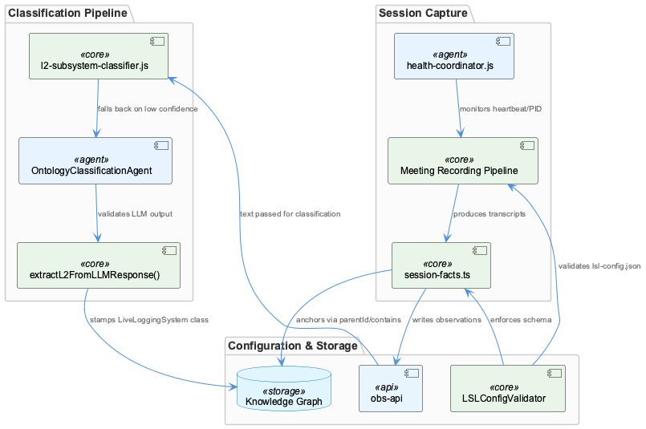
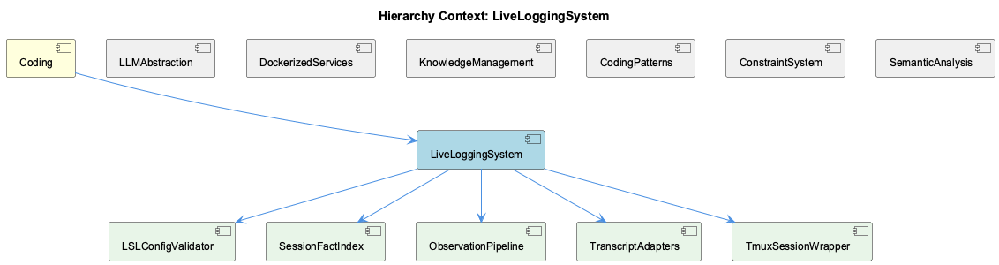

# LiveLoggingSystem

**Type:** Component

# LiveLoggingSystem — Technical Insight Document

## What It Is

LiveLoggingSystem is the component responsible for capturing, classifying, validating, and archiving session content across at least two distinct usage modes: coding-session transcripts (Live Session Logs, or LSL) and audio-based meeting recordings (the RapidScribe pipeline). Its classification logic lives in `ontology-classification-agent.ts`, which categorizes captured session content as it flows through the logging pipeline, with root-node classification correctness verified separately in `ontology-classification-agent.hierarchy-roots.test.ts`. Configuration correctness is enforced upstream of capture via `scripts/validate-lsl-config.js`, which validates session windowing and file-routing schema before recording begins. As a child of the Coding root component, LiveLoggingSystem sits alongside siblings like LLMAbstraction, DockerizedServices, KnowledgeManagement, CodingPatterns, ConstraintSystem, and SemanticAnalysis as one of the seven major pillars of the development infrastructure.

## Architecture and Design

The system follows a validate-before-capture pattern: `scripts/validate-lsl-config.js` checks windowing parameters and routing settings against expected schema prior to session start, favoring fail-fast behavior over allowing sessions to record with invalid configuration — a decision that avoids silent data loss or misfiled transcripts discovered only after the fact.

Downstream, captured content passes through a classification layer (`ontology-classification-agent.ts`) that assigns ontology categories, with special test coverage for root-node assignment since incorrect root classification cascades into misfiled data across the entire per-person or per-project vault structure. This reflects a deliberate architectural split between "general classification accuracy" and "hierarchy-root correctness" as distinct correctness concerns.

Structurally, the system is organized into three child components: TranscriptMonitor, ObservationPipeline, and TokenAttributionAdapters. TranscriptMonitor's `EnhancedTranscriptMonitor` class (in `enhanced-transcript-monitor.js`) handles transcript capture. ObservationPipeline implements the write-side persistence layer, having undergone a hard cutover from SQLite to km-core. TokenAttributionAdapters, despite its name, has no dedicated implementation evidence in the supplied files — none of `enhanced-transcript-monitor.js`, `ObservationConsolidator.js`, `ObservationExporter.js`, `ObservationWriter.js`, or `raw-fallback.js` reference token attribution or adapter interfaces, suggesting this child may be aspirational, misnamed, or implemented elsewhere.

## Implementation Details

The ObservationPipeline's `ObservationWriter.js` is the single source of truth for mapping legacy SQLite-row shapes onto km-core `Entity` objects, using `legacyObservationToEntity`, `legacyDigestToEntity`, and `legacyInsightToEntity` (imported from `@fwornle/km-core/adapters/legacy-ingest`), written via `GraphKMStore.putEntity`. This eliminated a dual-source problem inherited from Plan 44-07's read-only cutover, where dashboard reads came from km-core while writes still landed in SQLite and were invisible pending manual migration.

A notable implementation detail is the `ANCHOR_FOR_KIND` map, which refines every `capturedBy` edge away from a single undifferentiated `ANCHOR_ROOT` ('LiveLoggingSystem') toward writer-subsystem-specific anchors (observation→'ObservationWriter', digest/insight→'ObservationConsolidator'). This refinement was justified empirically — 1,244 existing edges split cleanly by writer subsystem — but `ANCHOR_ROOT` is retained as a fallback because a prior attempt to remove the generic anchor entirely orphaned 22 Insights.

Two session lifecycle contracts exist under this umbrella: coding-session LSL files are organized in date-partitioned directory trees (e.g., `.specstory/history/`, discoverable via a documented two-form `ls` pattern for locating the current dated tranche), while RapidScribe meeting sessions follow a `session-YYYYMMDD-HHMMSS-<hex>` naming scheme stored at `~/.rapidscribe/meetings/<session-id>/`, with defined start/verify/stop behaviors validated by smoke tests.

## Integration Points

LiveLoggingSystem's output feeds multiple downstream consumers. Periodic continuity summaries synthesize `.specstory/history/` logs into narratives of work phases, surfacing unresolved items (stopped services, regressions, blocked test suites) — meaning consumers must distinguish raw session dumps from these synthesized continuity artifacts. Tooling like `/sl` depends on the same directory-dating convention used for tranche discovery.

In the RapidScribe use case, transcripts route into per-person feedback files (`timeline.md`, `personal-development.md`) inside a private cohort vault (e.g., EF-412) — a per-person routing mode distinct from the per-project/session-based LSL tranches used for coding work. The ObservationPipeline integrates with `km-core` via `GraphKMStore.putEntity` and the `@fwornle/km-core/adapters/legacy-ingest` module, tying LiveLoggingSystem into the broader KnowledgeManagement graph infrastructure — relevant given KnowledgeManagement's own documented gap where insight documents were written without corresponding graph nodes.

## Usage Guidelines

Always validate LSL configuration via `scripts/validate-lsl-config.js` before initiating capture; do not bypass this check even for ad hoc sessions, since misconfigured windowing or routing risks silent data loss. When locating the current working tranche, use the documented two-form `ls` discovery procedure rather than assuming a fixed path, as tranches are date-partitioned and rotate (e.g., 2026/09). Treat continuity summaries as distinct artifacts from raw transcripts — do not conflate synthesized narrative state with raw session dumps when building downstream tooling. When modifying `capturedBy` edge anchoring logic, preserve `ANCHOR_ROOT` as a fallback rather than removing it, given the prior orphaning incident. Finally, treat TokenAttributionAdapters' current lack of implementation evidence as a flag for verification before assuming it exists as a working subsystem.

## Work Record

What working sessions recorded about this entity — decisions taken, problems hit, and why things are the way they are:

- The 'Mirror-History Project Continuity (LSL Review Workflow)' record establishes that agents regain context on the mirror-history project by reviewing recent Live Session Logs rather than relying on conversation memory, using a two-form `ls` discovery pattern to locate the latest dated LSL tranche (e.g. 2026/09). This confirms that LSL files are organized in date-partitioned directory trees, and that the discovery mechanism for finding 'the current tranche' is itself a documented, repeatable procedure rather than an ad hoc lookup — implying downstream tooling (like /sl) depends on this same directory-dating convention.
- The 'LSL Continuity Summaries' record establishes that periodic continuity summaries synthesize .specstory/history/ logs into a narrative of work phases across a session window, specifically surfacing open/unresolved items needing follow-up (e.g. stopped services, regressions, unresolved comparisons, blocked test suites). This shows LiveLoggingSystem's output is not merely a raw transcript archive but is post-processed into higher-level, cross-session state tracking, meaning consumers of LSL data must be able to distinguish raw session dumps from these synthesized continuity artifacts.
- The 'RapidScribe Meeting Recording' record establishes that LiveLoggingSystem manages audio recording, diarization, transcription, and archival of meetings and 1:1 feedback sessions, feeding transcripts into per-person feedback files (timeline.md, personal-development.md) inside a private cohort vault (e.g. EF-412). This indicates the logging system's scope extends beyond text-based coding sessions into structured audio pipelines with named recipient files, and that output routing is per-person rather than per-project in this use case — a distinct file-routing mode from the session/project-based LSL tranches used elsewhere.
- The 'Meeting Recording Pipeline — Session Smoke Test' record documents that rapidscribe-meeting sessions are identified by a session-YYYYMMDD-HHMMSS-<hex> naming scheme and stored at ~/.rapidscribe/meetings/<session-id>/, with defined healthy start/verify/stop behaviors for two-person feedback meetings involving named external participants. This gives a concrete, testable session-lifecycle contract (start → verify → stop) that smoke tests validate, distinguishing meeting-recording sessions structurally from the coding-session LSL files even though both fall under the LiveLoggingSystem umbrella.

## Hierarchy Context

### Parent
- [Coding](./Coding.md) -- Root node of the coding project knowledge hierarchy, encompassing all development infrastructure knowledge. The project consists of 7 major components: LiveLoggingSystem: [LLM] The classification layer for LiveLoggingSystem is implemented in ontology-classification-agent.ts, which categorizes captured session content as; LLMAbstraction: [SESSION] 'LLM Routing Tier Priority' establishes that LLM requests must follow fallback tier order — max-subscription models first, then work/GH Copi; DockerizedServices: [LLM] lib/service-probe.js implements the health-check polling logic that determines readiness of dockerized services (semantic analysis MCP, constrai; KnowledgeManagement: [SESSION] Wave Insight Persistence work record establishes that Wave 4 wrote 73 insight documents but zero Insight graph nodes, because the History si; CodingPatterns: [SESSION] Documentation Style Guide for Diagrams and Markdown establishes that .puml source files must live in docs/puml/ and generated diagram artifa; ConstraintSystem: [SESSION] Statusline Click-Report Feature establishes that clicking the 'constraints' field in the tmux statusline opens or focuses the constraint-mon; SemanticAnalysis: [SESSION] Pipeline CodingLowerOntologySource Emission Bug documents an unresolved defect where the pipeline emits a CodingLowerOntologySource referenc.

### Children
- [TranscriptMonitor](./TranscriptMonitor.md) -- [CGR] EnhancedTranscriptMonitor (class) in enhanced-transcript-monitor.js
- [ObservationPipeline](./ObservationPipeline.md) -- [LLM] ObservationWriter.js implements the write side of the pipeline as a hard cutover from SQLite to km-core: `legacyObservationToEntity`, `legacyDigestToEntity`, and `legacyInsightToEntity` (imported from `@fwornle/km-core/adapters/legacy-ingest`) are the single source of truth for mapping SQLite-row shapes onto km-core `Entity` objects written via `GraphKMStore.putEntity`. The class comment documents that this eliminated a dual-source problem from Plan 44-07's read-only cutover, where the dashboard read km-core while new writes still landed in SQLite and were invisible until a manual migration ran. The `ANCHOR_FOR_KIND` map (observation→'ObservationWriter', digest/insight→'ObservationConsolidator') refines every `capturedBy` edge away from a single undifferentiated `ANCHOR_ROOT` ('LiveLoggingSystem') once the code measured that all 1,244 existing edges split cleanly by writer subsystem — with `ANCHOR_ROOT` retained as fallback because losing the anchor entirely orphaned 22 Insights on 2026-06-15.
- [TokenAttributionAdapters](./TokenAttributionAdapters.md) -- [LLM] None of the supplied source files (enhanced-transcript-monitor.js, ObservationConsolidator.js, ObservationExporter.js, ObservationWriter.js, raw-fallback.js) define or reference any 'TokenAttributionAdapters' class, module, or naming convention. The files cover transcript capture, observation consolidation, JSON export, and raw-fallback marking — none of which mention token attribution, adapter interfaces, or per-token routing logic.

### Siblings
- [LLMAbstraction](./LLMAbstraction.md) -- [SESSION] 'LLM Routing Tier Priority' establishes that LLM requests must follow fallback tier order — max-subscription models first, then work/GH Copilot models, then Groq Llama-70B only as a last resort — rather than demoting to lower-tier providers as primary
- [DockerizedServices](./DockerizedServices.md) -- [LLM] lib/service-probe.js implements the health-check polling logic that determines readiness of dockerized services (semantic analysis MCP, constraint monitor) before dependent processes proceed. Rather than a single fixed timeout, the probe pattern issues periodic requests against known health endpoints and treats consecutive failures within a window as the signal for 'not ready' versus 'transiently slow', which matters in a Docker context where container startup order and cold-start times (loading models, connecting to databases) are highly variable across restarts.
- [KnowledgeManagement](./KnowledgeManagement.md) -- [SESSION] Wave Insight Persistence work record establishes that Wave 4 wrote 73 insight documents but zero Insight graph nodes, because the History sidebar filters strictly to entityType 'Insight' — documents alone are invisible to graph queries
- [CodingPatterns](./CodingPatterns.md) -- [SESSION] Documentation Style Guide for Diagrams and Markdown establishes that .puml source files must live in docs/puml/ and generated diagram artifacts have defined placement rules, enforcing a convention for the docs pipeline to render correctly.
- [ConstraintSystem](./ConstraintSystem.md) -- [SESSION] Statusline Click-Report Feature establishes that clicking the 'constraints' field in the tmux statusline opens or focuses the constraint-monitor dashboard tab, integrating HookManagementSystem-driven violation data with the dashboard UI
- [SemanticAnalysis](./SemanticAnalysis.md) -- [SESSION] Pipeline CodingLowerOntologySource Emission Bug documents an unresolved defect where the pipeline emits a CodingLowerOntologySource reference in output despite documentation stating this source type should never be produced, indicating a gap between the L2 refinement design and current emission behavior

---

*Generated from 6 observations*
