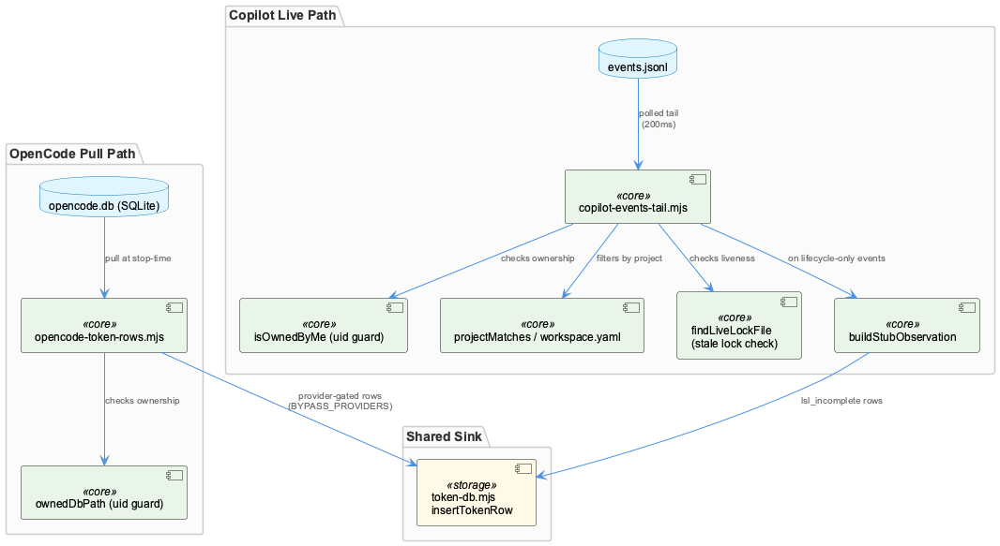
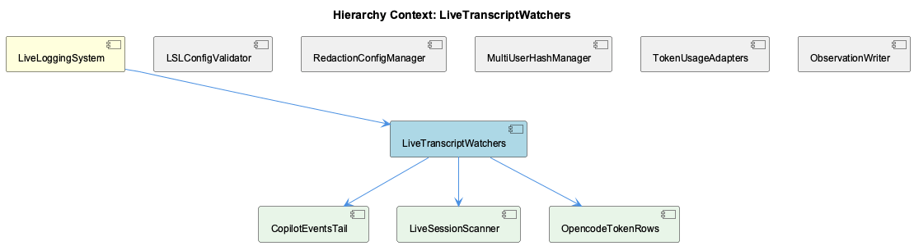

# LiveTranscriptWatchers

**Type:** SubComponent

[LLM] copilot-events-tail.mjs documents and accepts a permanent capability gap rather than attempting a workaround: because Copilot CLI persists only subagent.started/completed/failed lifecycle events (never the sub-agent's actual messages/tool calls) to events.jsonl, every observation it produces is stamped `lsl_incomplete: true` with a locked note constant (COPILOT_LSL_INCOMPLETE_NOTE = 'Copilot CLI emits only lifecycle bookends'). The function buildStubObservation() synthesizes a fake 2-message user/assistant exchange purely from spawn metadata (agentName, agentDescription, started_at, completed_at, completion_status) to satisfy the shape LSL observations expect, rather than leaving a gap in the transcript. This is a deliberate 'honest degradation' design: the system chooses to produce a clearly-marked incomplete artifact over silently dropping the sub-agent's activity, and Plan 51-11 surfaces this degradation via a `lsl_incomplete_marker_present` heartbeat field rather than hiding it.

# LiveTranscriptWatchers — Technical Insight Document

## What It Is

LiveTranscriptWatchers is a SubComponent of LiveLoggingSystem that captures sub-agent/foreign-agent activity that would otherwise be invisible to the LSL observation pipeline. It is realized concretely across two files with no shared code: `lib/lsl/live/copilot-events-tail.mjs` (the Copilot side, implementing its child CopilotEventsTail and the session-discovery logic of LiveSessionScanner) and `lib/lsl/token/opencode-token-rows.mjs` (the OpenCode side, implementing OpencodeTokenRows via `buildOpencodeTokenRows()`). Despite sharing a conceptual name and parent, these two are structurally different systems: one is a polled file-tail against `~/.copilot/session-state/<uuid>/events.jsonl`, the other a pull-based SQLite reader against `~/.local/share/opencode/opencode.db` invoked only at measurement-stop. "Watcher" here is a loose umbrella term, not a single reusable abstraction — a future third-agent integration must choose the model (push-like polling vs. on-demand snapshot) that fits that agent's on-disk artifact shape.

## Architecture and Design

The dominant pattern is convergent, independently-reinvented defensive design rather than shared inheritance. Both `isOwnedByMe()` (Copilot) and `ownedDbPath()` (OpenCode) perform an identical uid-ownership check via `fs.statSync().uid` vs `process.getuid()` before touching another process's session state, fail closed to empty results on stat/read errors, and emit stderr-only diagnostics (honoring the no-console-log rule) when skipping non-owned files. This convergence across two files targeting different agents suggests uid-based sandboxing is a project-wide security posture, not a one-off — though Architecture Notes flag it as duplicated logic risking future drift if one adapter's check is updated without the other.

CopilotEventsTail is a filesystem-polling state machine (`TAIL_POLL_INTERVAL_MS=200`), not an event-subscription system — no fs.watch/inotify — trading a bounded 200ms detection lag for zero new package installs (stdlib-only, per T-51-09-SC). OpencodeTokenRows takes the opposite trade-off entirely: no polling, no live latency guarantee, a single bounded SQLite query (`MESSAGE_SCAN_LIMIT=4000`, ORDER BY rowid DESC) at stop-time, optimizing for zero background CPU. Live capture and backfill/sweep (Plan 51-04) are separate processes coordinated only through shared metadata tags (`metadata.source = 'sub-agent'` vs `'sub-agent-backfill'`), not shared state or locking — `tailEventsFile()` is explicitly forward-looking only ("Path A is strictly forward-looking. Pre-existing rows are the sweep's job").

## Implementation Details

`tailEventsFile()` seeds `lastSize` from the file's current size, then polls via `statSync`, reassembling lines from a residual buffer plus `chunk.split('\n')`. `findLiveLockFile()` guards against a real observed failure mode ("RESEARCH landmine #5"): a crashed Copilot session leaving a stale `inuse.<pid>.lock`; it applies `LOCK_STALE_GRACE_MS` (10 minutes) against the lock's mtime as a heuristic liveness signal, trading correctness on long-idle edge cases for robustness against dead locks. `projectMatches()` further scopes live session discovery: when a projectRoot filter is active, sessions whose `workspace.yaml` resolves to `sessionProject === 'unknown'` are explicitly excluded, reusing `parseWorkspaceYaml`/`projectFromWorkspace` from `../adapters/copilot-events.mjs` (a Plan 51-04 artifact).

Because Copilot CLI only persists lifecycle bookends (subagent.started/completed/failed), never actual messages, `buildStubObservation()` synthesizes a fake two-message user/assistant exchange from spawn metadata, and every such observation carries `lsl_incomplete: true` plus the locked `COPILOT_LSL_INCOMPLETE_NOTE`. This is "honest degradation" — Plan 51-11 surfaces it via a `lsl_incomplete_marker_present` heartbeat field rather than hiding the gap.

On the OpenCode side, `buildOpencodeTokenRows()` enforces the D-04 no-double-count invariant: it only emits rows for assistant messages whose provider is in the frozen `BYPASS_PROVIDERS` set (currently just `'github-copilot'`), skipping proxy-routed providers like `'anthropic'` whose tokens are already captured by rapid-llm-proxy's wire-level accounting.

## Integration Points

LiveTranscriptWatchers sits under LiveLoggingSystem alongside siblings LSLConfigValidator, RedactionConfigManager, MultiUserHashManager, TokenUsageAdapters, and ObservationWriter. It shares its core "second-writer" motivation with sibling TokenUsageAdapters — both exist because Claude Code, Copilot CLI, and OpenCode can bypass rapid-llm-proxy's authoritative token accounting, requiring after-the-fact reconstruction from each agent's own persistence layer. It also aligns with MultiUserHashManager's per-adapter id-sharding scheme (`ADAPTER_USER_HASH_COPILOT`, `ADAPTER_USER_HASH_OPENCODE`) and depends on `lib/lsl/token/token-db.mjs`'s `insertTokenRow`, a best-effort, never-throw second-writer INSERT with id-collision retry logic. Copilot-side discovery further depends on adapters imported from `../adapters/copilot-events.mjs`.

## Usage Guidelines

Developers extending capture to a new agent must first classify its artifact shape (append-only log vs. queryable store) rather than assume a shared watcher interface exists. Any addition to `BYPASS_PROVIDERS` must be verified to genuinely never route through the proxy, or token counts will silently double. Uid-ownership checks and fail-closed/no-console-log conventions should be preserved (and ideally eventually factored into a shared utility) whenever new code reads another user's session artifacts. Given the strict live/backfill boundary, any new live watcher must be paired with a corresponding sweep for complete coverage — a watcher alone will permanently miss activity predating its start.

## Hierarchy Context

### Parent
- [LiveLoggingSystem](./LiveLoggingSystem.md) -- [LLM] LiveLoggingSystem's identity within the Coding ontology is defined declaratively rather than through code inheritance: it is registered as an L2 class in .data/ontologies/coding.lower.json, extending the 'Component' L1 carrier that is itself one of three L1 carriers (Component/SubComponent/Detail) shared across all L2 subsystems. This means a new developer looking for a 'LiveLoggingSystem class' in the traditional OOP sense will not find one directly — instead, the concept is materialized through the ontology registry chain (upper.json → coding-ontology.json → coding.lower.json), loaded at runtime by OntologyRegistry from the @fwornle/km-core package. Any change to LiveLoggingSystem's semantic definition, description text used for classification, or its relationship to sibling classes must be made in these JSON ontology files, not in TypeScript source.

### Children
- [CopilotEventsTail](./CopilotEventsTail.md) -- [LLM] The `TAIL_POLL_INTERVAL_MS = 200` constant in lib/lsl/live/copilot-events-tail.mjs defines a statSync-based polling loop (`tailEventsFile()`) rather than an OS-level file watcher (fs.watch/inotify). The header comment justifies this as 'comfortable for human-interactive Copilot sessions' since file growth is only a few KB per turn, but this is a deliberate trade-off: polling costs a syscall every 200ms per live session regardless of activity, bounded per the file's own T-51-09-RL threat-model note to 'typically 1-5' concurrent Copilot sessions. This is architecturally distinct from the OpenCode side (lib/lsl/token/opencode-token-rows.mjs), which never polls at all — it performs a single bounded SQLite query (`MESSAGE_SCAN_LIMIT = 4000` rows, ORDER BY rowid DESC) at measurement-stop, trading live latency for zero background CPU cost.
- [LiveSessionScanner](./LiveSessionScanner.md) -- [LLM] The 'live' half of LiveSessionScanner is fundamentally a filesystem-polling state machine, not an event subscription: scanForLiveSessions() in lib/lsl/live/copilot-events-tail.mjs walks ~/.copilot/session-state/<uuid>/ directories on each invocation, and tailEventsFile()'s inner listener() compares curr.size against a captured lastSize closure variable to detect appended bytes. There is no fs.watch/inotify integration — TAIL_POLL_INTERVAL_MS=200 is a hardcoded interval constant, meaning liveness detection latency is bounded by poll cadence rather than being push-driven. This is a deliberate simplicity/portability trade-off (stdlib-only per the T-51-09-SC threat-model comment: 'Zero new package installs') at the cost of a worst-case 200ms detection lag and continuous CPU wake-<COMPANY_NAME_REDACTED> proportional to concurrent session count (T-51-09-RL, 'bounded by concurrent Copilot sessions, typically 1-5').
- [OpencodeTokenRows](./OpencodeTokenRows.md) -- [CGR] buildOpencodeTokenRows (function) in opencode-token-rows.mjs

### Siblings
- [LSLConfigValidator](./LSLConfigValidator.md) -- [CGR] LSLConfigValidator (class) in validate-lsl-config.js
- [RedactionConfigManager](./RedactionConfigManager.md) -- [LLM] RedactionConfigManager's actual configuration surface is not visible as a dedicated class in the supplied code files, but its effects are wired directly into the observation-writing hot path: src/live-logging/ObservationWriter.js imports `ConfigurableRedactor` from './ConfigurableRedactor.js' at the top of the module (alongside `getLSLWindow` from lib/lsl/window.mjs and `routeFromArtifacts` from lib/attribution/repo-router.mjs), and the class retains `this.dbPath` specifically as 'a config path, NOT a handle' used to derive `projectRoot` for the redactor. This means redaction configuration resolution is coupled to the writer's constructor-time path setup rather than being an independently injectable dependency, so any consumer of ObservationWriter inherits whatever redaction behavior ConfigurableRedactor derives from that project-relative path.
- [MultiUserHashManager](./MultiUserHashManager.md) -- [LLM] Multi-user isolation in the live-logging/token subsystem is implemented via distinct per-adapter hash constants rather than a single shared user identity: lib/lsl/token/token-db.mjs defines ADAPTER_USER_HASH_CLAUDE ('cladpt'), ADAPTER_USER_HASH_COPILOT ('copadt'), and ADAPTER_USER_HASH_OPENCODE ('opnadt'), each conforming to the proxy's `/^[a-z][a-z0-9]{5}$/` charset validation (referenced in the comment at token-usage.ts:46-47). This design (documented as decision D-06 'id-collision avoidance') deliberately partitions the id space so that `insertTokenRow`'s `MAX(id)+1` allocation per adapter hash never races the proxy daemon's own in-memory id counter — a form of manual sharding of a shared SQLite composite primary key `(user_hash, id)` across multiple concurrent writers (the proxy plus up to three adapters).
- [TokenUsageAdapters](./TokenUsageAdapters.md) -- [LLM] The TokenUsageAdapters component solves a specific asymmetry in the Coding project's LLM accounting: the rapid-llm-proxy at :12435 is the primary source of truth for token_usage.db, but three foreground agents (Claude Code, Copilot CLI, OpenCode) each have paths where calls bypass the proxy entirely. lib/lsl/token/copilot-events-tail.mjs, lib/lsl/token/opencode-token-rows.mjs, and lib/lsl/token/token-db.mjs form a 'second writer' subsystem that reconstructs token rows after the fact from each agent's own persistence layer (Copilot's events.jsonl, OpenCode's SQLite opencode.db) rather than intercepting the network call. This is an inherently lossy, best-effort compensation strategy rather than a clean instrumentation point — the code repeatedly documents (in token-db.mjs's insertTokenRow docstring) that failures must never propagate, since the adapters are patching a gap in an otherwise-authoritative pipeline.
- [ObservationWriter](./ObservationWriter.md) -- [CGR] ObservationWriter (class) in ObservationWriter.js

---

*Generated from 10 observations*
