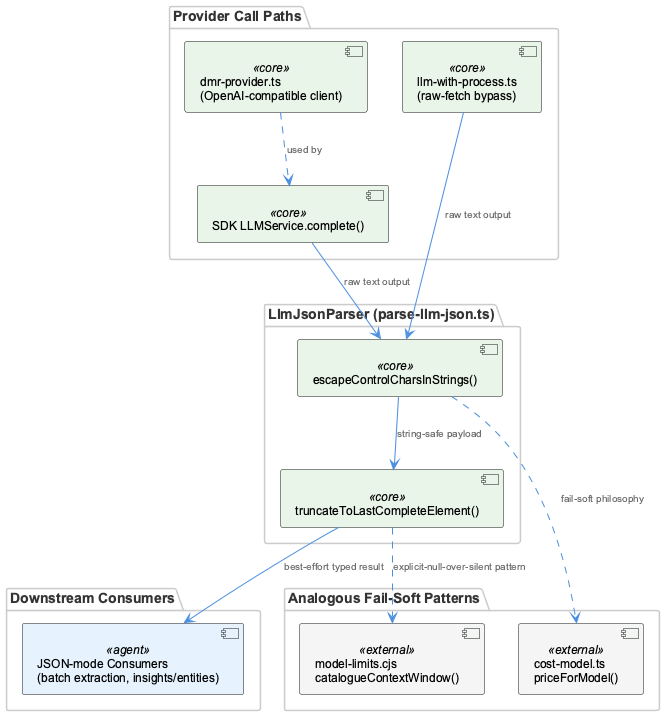
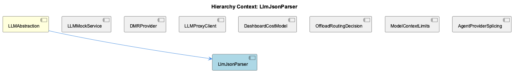

# LlmJsonParser

**Type:** SubComponent

[Architecture Notes] parse-llm-json.ts is a shared utility layer positioned between raw provider output (from both SDK-managed and raw-fetch call paths) and typed application data consumers; No direct code graph edges are available for this component in the current analysis (code_graph was empty), so dependency claims here are derived from the parent entity's observations rather than static graph evidence; The parser's guarantees are orthogonal to and reused by both call paths described upstream (llm-with-process.ts's proxy-bypass fetch wrapper and the SDK's LLMService.complete()), making it a convergence point in an otherwise bifurcated request architecture; Sequential, fixed-order pipeline execution (escape-then-truncate) is a coupling point: correctness of the second stage can depend on the first stage's handling of string-boundary state near a truncation point

# LlmJsonParser — Technical Insight Document

## What It Is

`LlmJsonParser` is implemented in `parse-llm-json.ts` and provides a two-stage repair pipeline for salvaging malformed JSON emitted by LLM providers operating in "JSON-mode." Rather than treating malformed output as a single generic failure to catch and discard, the component decomposes the problem into two independent, orthogonal failure modes: byte-level string corruption (raw control characters embedded in string literals) and structural truncation (output cut off mid-object or mid-array because the provider hit its token ceiling). Each failure mode is addressed by its own dedicated function — `escapeControlCharsInStrings()` and `truncateToLastCompleteElement()` — run in sequence as a fixed pipeline.

As a SubComponent of **LLMAbstraction**, `LlmJsonParser` sits alongside siblings like **LLMMockService**, **DMRProvider**, **LLMProxyClient**, **DashboardCostModel**, **OffloadRoutingDecision**, **ModelContextLimits**, and **AgentProviderSplicing**, but unlike most of those, it is described as depended on by *all* downstream JSON-mode consumers — making it a narrow, high-leverage chokepoint rather than a peer-level feature module.

## Architecture and Design

The defining architectural decision is running repair as a **fixed two-stage pipeline** instead of a monolithic heuristic: escape-corruption repair first, then structural truncation-recovery. This lets each stage be reasoned about, tested, and evolved independently, and it means a malformed-but-otherwise-complete response only pays the cost of the first stage, not both. This mirrors a broader philosophy already established elsewhere in the codebase — **DashboardCostModel**'s `cost-model.ts:priceForModel` fallback chain (exact → fast-suffix → family-representative → any-family-match) and `model-limits.cjs`'s `catalogueContextWindow()` returning `null` as an explicit "no opinion" rather than a coerced zero. `LlmJsonParser`'s pipeline applies the same "fail-soft, make degradation explicit" instinct to the parsing boundary specifically.

Architecturally, the parser is a **convergence point** in an otherwise bifurcated request architecture. Two structurally different call paths feed it: the SDK-managed `LLMService.complete()` path, and **LLMProxyClient**'s `llm-with-process.ts` raw-fetch bypass (which injects a "process" telemetry tag via a duck-typed `MetricsTrackerLike` interface to keep metrics unified across both paths). Regardless of which path produced the raw text, `LlmJsonParser` guarantees uniform parsing behavior — it is the seam where diverging request paths reconverge into a single contract.

## Implementation Details

`escapeControlCharsInStrings()` performs a string-state-tracking walk over the payload: it must track whether the cursor is currently inside a string literal, accounting for escape sequences and quote boundaries, so that it rewrites control characters *only* where they would break JSON grammar. Control characters outside string context (numeric literals, inter-token whitespace) are deliberately left untouched. This is meaningfully harder than a blanket regex replace, but it buys correctness on the "don't break what isn't broken" axis — a naive global replace risks corrupting legitimate formatting whitespace (e.g., a literal tab between a closing brace and comma).

`truncateToLastCompleteElement()` performs a backward walk to discard an incomplete trailing structure when a response was cut short mid-array or mid-object — a common outcome when `maxTokens` is undersized relative to the requested payload (the sibling `llm_output_cap_truncation` pattern). Rather than failing the entire parse, it returns the largest syntactically valid prefix, trading completeness for availability — appropriate for best-effort batch extraction consumers (e.g., lists of insights or entities) where losing trailing items is far less damaging than losing the whole response.

A documented risk arises from the fixed execution order: because the two stages run sequentially over the same mutable string, a payload that is *both* corrupted *and* truncated requires the escape stage to correctly track string boundaries even across the eventual truncation point. Any developer reordering the pipeline or adding a third repair stage must verify behavior on inputs exhibiting both failure modes simultaneously — the stages are independent in design but coupled in execution.

## Integration Points

`LlmJsonParser` has no static code-graph edges available (code_graph was empty for this component), so its dependency relationships are derived entirely from parent-entity observations rather than graph evidence. Structurally, it sits downstream of the provider abstraction layer under **LLMAbstraction** — reused identically by **DMRProvider**'s OpenAI-compatible client, the SDK's own `LLMService.complete()` path, and **LLMProxyClient**'s raw-fetch bypass in `llm-with-process.ts`. Because it is the shared utility layer between raw provider output and typed application data consumers, virtually every JSON-mode consumer in the system depends on it, making its correctness disproportionately important relative to its size.

It also shares a conceptual lineage with resilience patterns in sibling components outside strict call-graph dependency: **DashboardCostModel**'s `priceForModel` fallback chain and `model-limits.cjs`'s `catalogueContextWindow()` null-return convention are cited as analogous "tolerate degraded input, be explicit about degradation" designs, reinforcing that this is a house style rather than an isolated hack.

## Usage Guidelines

Developers should treat the two repair stages as independent in intent but sequentially coupled in practice — do not assume reordering or inserting a new stage is safe without testing against inputs exhibiting both corruption and truncation simultaneously. Consumers should expect a best-effort, possibly-partial result rather than a guarantee of full data, and should design downstream logic (e.g., batch insight/entity extraction) to tolerate a truncated tail gracefully, consistent with the fail-soft convention used by `priceForModel` and `catalogueContextWindow` elsewhere in the codebase. Because this parser is a shared chokepoint reused by both the SDK path and the raw-fetch path, any change here has system-wide blast radius — it should be modified conservatively and tested against representative malformed payloads from both call paths, not just one.

## Hierarchy Context

### Parent
- [LLMAbstraction](./LLMAbstraction.md) -- [LLM] The mock/local/public mode toggle system in llm-mock-service.ts is designed around a persisted state file (.data/workflow-progress.json) rather than environment variables, which allows runtime mode switching without process restarts. The LLMState structure with globalMode and perAgentOverrides fields enables fine-grained control where a specific agent can be forced into mock mode for testing while the rest of the system runs against real providers. This is critical for integration testing scenarios where a developer wants to validate one agent's prompt-handling logic without incurring API costs or non-determinism from the LLM calls of other agents in a multi-agent pipeline. The getLLMMode() read path checks perAgentOverrides first, then falls back to globalMode, and finally to the legacy progress.mockLLM boolean, establishing a three-tier precedence resolution that any new developer must understand before assuming a single toggle controls behavior.

### Siblings
- [LLMMockService](./LLMMockService.md) -- [LLM] The `use-classifier-judge.ts` hook (integrations/system-health-dashboard/src/components/llm-routing/use-classifier-judge.ts) implements the same config-vs-runtime split described for LLMMockService's `getLLMMode()` precedence chain, but for the offload judge rather than the mock toggle: `JudgeBackend.enabled` is what the YAML file says, while `JudgeBackend.reachable` is whether it actually answered on the last poll. The header comment documents a real incident (2026-09-02) where `enabled: true` masked a dead backend for about a day because nothing distinguished 'switched off' from 'not answering' — the exact class of ambiguity that `getLLMMode()`'s three-tier precedence (perAgentOverrides → globalMode → legacy progress.mockLLM) is designed to avoid by making precedence explicit rather than collapsing multiple signals into one boolean.
- [DMRProvider](./DMRProvider.md) -- [LLM] The DMR provider in dmr-provider.ts is deliberately built as a thin OpenAI-shape adapter rather than a bespoke client — it targets `http://${DMR_HOST}:${DMR_PORT}/engines/v1` but reuses the same request/response contract as the OpenAI SDK integration. This is a 'protocol reuse' strategy: instead of writing DMR-specific request builders, response parsers, and error mappers, the team accepts that Docker Model Runner exposes an OpenAI-compatible surface and piggybacks on existing code paths. The trade-off is that any DMR-specific quirks (different error codes, different streaming semantics, different rate-limit headers) would have to be shimmed into the OpenAI shape rather than handled natively, which could become a leaky abstraction if DMR's compatibility layer ever diverges meaningfully from the OpenAI spec it's mimicking.
- [LLMProxyClient](./LLMProxyClient.md) -- [LLM] The parent context establishes that llm-with-process.ts is a deliberate fetch-based bypass around the SDK's LLMService.complete(), built specifically to inject the 'process' telemetry tag the rapid-llm-proxy's /api/complete endpoint requires, with resolveProxyCompleteUrl() implementing a layered precedence (RAPID_LLM_PROXY_URL → LLM_CLI_PROXY_URL → LLM_PROXY_URL → localhost default). This is the LLMProxyClient's actual transport layer, and the dashboard code surveyed here (offload-decision.tsx, use-classifier-judge.ts) is the operator-facing control plane that sits ABOVE that transport: neither file makes an LLM completion call itself, they instead call GET/PATCH against the proxy's HTTP surface (/api/llm/routing/resolve, /api/llm/classifier) to inspect and edit the routing policy that governs how llm-with-process.ts's requests get dispatched. This is a clean separation between the data-plane client (proxy-bridge, llm-with-process.ts) and the control-plane client (this dashboard code), but it also means the two must agree on wire semantics independently — evidenced by the extensive commentary in offload-decision.tsx about the proxy's resolved answers being compared against the dashboard's own ladder logic rather than trusted.
- [DashboardCostModel](./DashboardCostModel.md) -- [LLM] cost-model.ts is deliberately framed as "pure cost/budget logic... No React here" — every exported function (budgetForMonth, priceForModel, cellCostUsd, monthlySeries) is a pure function of CostRow[]/CostConfig inputs with no hooks, fetch calls, or component state. This is a sharp architectural boundary against sibling files like use-classifier-judge.ts and offload-decision.tsx, which interleave data-fetching, polling, and dirty-state tracking directly inside hooks and components. The payoff is testability (pure functions can be unit-tested without a DOM or mock fetch) and the ability to reuse the same pricing math in both the live dashboard tab and, presumably, offline reporting scripts — at the cost of pushing all I/O (GET /api/token-usage/cost, GET /api/llm/settings) to callers this file doesn't show.
- [OffloadRoutingDecision](./OffloadRoutingDecision.md) -- [LLM] OffloadDecision (offload-decision.tsx) is architected around a dual-mode toggle — 'config' (routes, answering 'what will happen') versus 'recorded' (calls, answering 'what did happen') — that deliberately share the same GATES/rung geometry so an operator can flip between intent and behaviour without re-reading a layout. This is a single-component design choice explicitly justified in the header comment rather than splitting into two cards, trading some internal branching complexity (mode-dependent counts, detail strings) for a consistent mental model at the UI layer.
- [ModelContextLimits](./ModelContextLimits.md) -- [LLM] The module in lib/statusline/model-limits.cjs implements a two-tier caching strategy specifically because it runs in a fresh process every 5 seconds per status-line pane (documented in the file's header comment). The in-process memo (`_memo`, `_userMemo`) only helps within a single tick's multiple calls to catalogueContextWindow(); the real cross-tick optimization is the on-disk derived cache at catalogueCachePath() (.logs/model-context-limits.json), which avoids re-parsing opencode's 4.5MB/213-provider models.json (a documented 33ms cost) on every single tick across every open pane. This is a deliberate departure from typical in-memory caching because the process boundary itself defeats memoization.
- [AgentProviderSplicing](./AgentProviderSplicing.md) -- [LLM] The cost-model.ts module in the dashboard's cost tab implements a layered price-resolution strategy in priceForModel(): exact model key match, then fast-mode suffix stripping with a 2x multiplier via scalePrice(), then family-based fallback through FAMILY_REPRESENTATIVE. This mirrors the same 'tiered precedence resolution' philosophy seen elsewhere in the LLM subsystem (e.g. getLLMMode()'s three-tier fallback), suggesting a project-wide convention of building explicit precedence chains rather than single flat lookups whenever provider/model identity is ambiguous or evolving.

---

*Generated from 9 observations*
