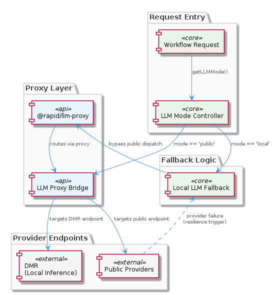
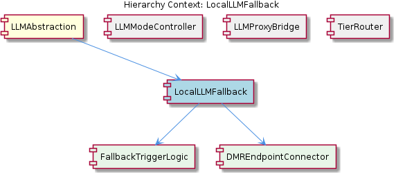

# LocalLLMFallback

**Type:** SubComponent

`docs/puml/local-llm-fallback.puml` diagrams the fallback flow, showing that local DMR inference is activated both by explicit `'local'` mode assignment and by public provider failure, making it serve dual roles as a mode target and a resilience mechanism

# LocalLLMFallback — Technical Insight Document

## What It Is

`LocalLLMFallback` is a SubComponent of the broader `LLMAbstraction` layer that governs how the system routes inference requests to a local Docker Model Runner (DMR) endpoint instead of public cloud providers. While no dedicated source file is enumerated for the SubComponent itself, its behavior is documented in `docs/puml/local-llm-fallback.puml` and its decision logic is anchored in `getLLMMode()` within `integrations/mcp-server-semantic-analysis/src/mock/llm-mock-service.ts`. The network-level execution is delegated to the `@rapid/llm-proxy` shared package, where DMR is registered as one of five provider targets.

The component plays a dual role in the architecture. First, it is the explicit destination when an operator (or runtime state) assigns an agent the `'local'` mode. Second, it serves as the resilience target when public providers become unavailable — meaning the same DMR endpoint absorbs both planned and emergency traffic. This dual-purpose design is what distinguishes `LocalLLMFallback` from a pure failover mechanism: it is simultaneously a first-class routing destination and a degradation safety net.

## Architecture and Design

The architectural pattern at work here is a **decoupled routing-and-execution split**, in which decision logic (which provider to use) is kept separate from execution logic (how to talk to that provider). `FallbackTriggerLogic`, the child SubComponent that owns the *decision* side, evaluates two independent entry conditions documented in `docs/puml/local-llm-fallback.puml`: an explicit `mode == 'local'` assignment, or a detected public-provider failure. Both pathways converge on the same downstream child, `DMREndpointConnector`, which lives inside `@rapid/llm-proxy` and handles the actual network connection to the local DMR inference server.

A key design decision is that `LocalLLMFallback` does **not** bypass the proxy layer when activated. Instead, it changes *which* provider endpoint `LLMProxyBridge` targets within its set of five providers. This preserves a uniform invocation pipeline regardless of whether a request is going to OpenAI, Anthropic, or DMR — only the terminal hop differs. The trade-off here is clear: the system gains consistent observability, retry semantics, and middleware behavior across all providers, at the cost of routing local-only calls through an additional abstraction layer that, in principle, could be elided for performance.

Another important architectural choice is the runtime-mutable nature of the routing decision. Because the parent `LLMAbstraction` resolves the effective mode via the four-level priority chain in `getLLMMode()` (per-agent override → `llmState.globalMode` → legacy `mockLLM` boolean → hardcoded `'public'`), the fallback can be activated mid-workflow by mutating `.data/workflow-progress.json`. There is no service restart required and no static configuration to redeploy. This makes `LocalLLMFallback` a *live* operational lever rather than a deployment-time switch.

## Implementation Details

The implementation is distributed across three planes. The **decision plane** is centered in `getLLMMode()` at `integrations/mcp-server-semantic-analysis/src/mock/llm-mock-service.ts`, where the priority resolution determines whether a given agent call should route to DMR. When that function resolves to `'local'`, the request path bypasses the public provider dispatch logic entirely and goes directly to DMR via `@rapid/llm-proxy`. The **trigger plane**, owned by `FallbackTriggerLogic`, layers additional logic atop this: even when `getLLMMode()` returns `'public'`, a detected failure in the public provider call can cause the proxy to retarget DMR. The two trigger paths are deliberately kept independent in the PUML diagram, signaling that they are evaluated through separate code branches rather than a single unified predicate.

The **execution plane** is `DMREndpointConnector`, which the SubComponent-level context places inside `@rapid/llm-proxy`. Because `@rapid/llm-proxy` is shared across the OKB and coding systems, the DMR connector is implemented once and reused — consumers of `LocalLLMFallback` do not embed network code for DMR themselves. This is consistent with the centralization principle visible in the sibling `LLMProxyBridge`, which is explicitly documented as the package that prevents per-integration duplication of provider-routing logic.

A subtle but important implementation detail concerns the relationship to tier routing. The sibling `TierRouter`, documented in `docs/puml/llm-tier-routing.puml`, performs tier-to-model mapping *before* provider selection. This means tier decisions are upstream of `LocalLLMFallback`: by the time `FallbackTriggerLogic` evaluates whether to dispatch to DMR, a tier has already been assigned. The fallback does not override tier semantics; it overrides only the provider endpoint. Developers extending the system should preserve this ordering — tier first, provider second — to remain consistent with the architecture shown in `docs/puml/llm-provider-architecture.puml`.

## Integration Points

`LocalLLMFallback` integrates upward with its parent `LLMAbstraction` through the resolved mode value emitted by `getLLMMode()`. Whenever that function returns `'local'`, the abstraction layer hands control to this SubComponent. The integration is value-based rather than callback-based: the SubComponent is activated by a string-equality check on the mode taxonomy `'mock' | 'local' | 'public'`, which makes the boundary easy to reason about and trivially testable.

Laterally, the SubComponent integrates with three siblings. `LLMModeController` is its direct upstream: it produces the mode value that activates the fallback path. `LLMProxyBridge` is its direct downstream: it accepts DMR as one of five registered providers and provides the actual dispatch machinery. `TierRouter` is a parallel concern that pre-shapes the request (selecting the model class) before the fallback decides on the endpoint. The fact that all three siblings, plus `LocalLLMFallback` itself, ultimately funnel through `@rapid/llm-proxy` is the integration backbone of the entire `LLMAbstraction` layer.

Downward, the component depends on its two children. `FallbackTriggerLogic` provides the decision-side semantics — the rules governing when DMR is invoked — and `DMREndpointConnector` provides the execution-side mechanics — the actual HTTP-level conversation with the local DMR server. The split between these two children mirrors the broader decision/execution decoupling in the parent architecture and means that changes to *when* the fallback fires (e.g., adding a new failure condition) can be made without touching the connector, and vice versa.

## Usage Guidelines

Developers should treat `LocalLLMFallback` as both a development convenience and a production resilience feature. For offline development or network-isolated environments, workflows can simply be authored against `'public'` mode and run locally: when public providers are unreachable, `FallbackTriggerLogic` will silently retarget DMR, and no code changes are required. This is the intended path for offline development and is one of the key value propositions of the dual-trigger design.

Because the effective mode for any agent call is never statically determinable from configuration alone — it depends on the runtime state in `.data/workflow-progress.json` and the four-level priority chain in `getLLMMode()` — observability is essential. Developers should log the resolved mode per call and, ideally, the trigger reason (explicit `'local'` assignment versus public-provider failure). Without this telemetry, "routing surprises" become very difficult to debug, particularly because a single workflow can have different agents on different providers concurrently.

When extending the fallback, preserve the architectural invariant that DMR is reached *through* `@rapid/llm-proxy` rather than around it. Direct DMR calls from outside the proxy would bypass the uniform observability, retry, and middleware behavior that the proxy provides and would also fragment the connector logic that `DMREndpointConnector` currently centralizes. Similarly, new failure conditions for the fallback should be added to `FallbackTriggerLogic` rather than embedded in calling code, so that the two-entry-path discipline shown in `docs/puml/local-llm-fallback.puml` remains intact.

Finally, note that `LocalLLMFallback` does not by itself address scalability of the local inference server — DMR is a single local endpoint and capacity is bounded by the host machine. The fallback's scalability story is therefore primarily about *graceful availability* (keeping workflows functional when public APIs are down or unreachable) rather than about absorbing public-provider load. Teams running large workflows against DMR should expect throughput limits that differ materially from cloud providers and should design tier assignments (via `TierRouter`) accordingly. Maintainability is favorable: the decoupled decision/execution split, the centralization of connector code in `@rapid/llm-proxy`, and the runtime-mutable mode state together mean that operational changes rarely require code changes, and code changes rarely span more than one of the three planes (decision, trigger, execution).

## Hierarchy Context

### Parent
- [LLMAbstraction](./LLMAbstraction.md) -- [LLM] The `getLLMMode()` function in `integrations/mcp-server-semantic-analysis/src/mock/llm-mock-service.ts` implements a four-level priority resolution chain that determines which LLM backend any given agent operation will use at runtime. The chain evaluates, in descending priority: (1) a per-agent override stored in `llmState` keyed by agent ID, (2) the global `llmState.globalMode` field, (3) the legacy `mockLLM` boolean flag, and finally (4) a hardcoded fallback of `'public'`. This design is architecturally significant because it allows fine-grained routing decisions to be made without restarting any service — a running workflow can have individual agents reassigned to different backends purely by mutating the state in `.data/workflow-progress.json`. The priority chain also reflects an evolutionary history: the `mockLLM` boolean is clearly an earlier, simpler mechanism that predates the full `'mock' | 'local' | 'public'` mode taxonomy, and its presence in the chain at level 3 shows that the system was designed to degrade gracefully rather than force a hard cutover. A new developer should note that the effective mode for any agent call is never statically determinable from configuration alone — it must be traced through the runtime state file, making observability tooling (e.g., logging the resolved mode per call) particularly important for debugging routing surprises.

### Children
- [FallbackTriggerLogic](./FallbackTriggerLogic.md) -- The `docs/puml/local-llm-fallback.puml` fallback flow diagram exposes two independent entry paths into DMR inference: one triggered by explicit `mode == 'local'` assignment, and one triggered by public provider unavailability — meaning the same local endpoint is reused for both planned and emergency routing.
- [DMREndpointConnector](./DMREndpointConnector.md) -- As noted in the SubComponent (L2) context, DMREndpointConnector lives within `@rapid/llm-proxy` and is responsible for the actual network-level connection to the local DMR inference server, making it the execution-side counterpart to FallbackTriggerLogic's decision-side role.

### Siblings
- [LLMModeController](./LLMModeController.md) -- `getLLMMode()` in `integrations/mcp-server-semantic-analysis/src/mock/llm-mock-service.ts` implements a four-level priority chain: per-agent override in `llmState` keyed by agent ID, then `llmState.globalMode`, then legacy `mockLLM` boolean, then hardcoded `'public'` fallback
- [LLMProxyBridge](./LLMProxyBridge.md) -- `@rapid/llm-proxy` is documented as a shared package across the OKB and coding systems, meaning provider-routing logic is centralised rather than duplicated per integration
- [TierRouter](./TierRouter.md) -- `docs/puml/llm-tier-routing.puml` diagrams the tier-to-model mapping, indicating that tier assignment happens before provider selection and feeds into the broader provider architecture shown in `docs/puml/llm-provider-architecture.puml`

---

*Generated from 4 observations*
